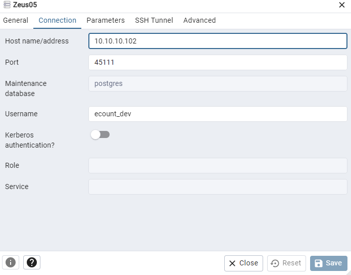
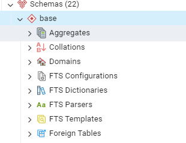
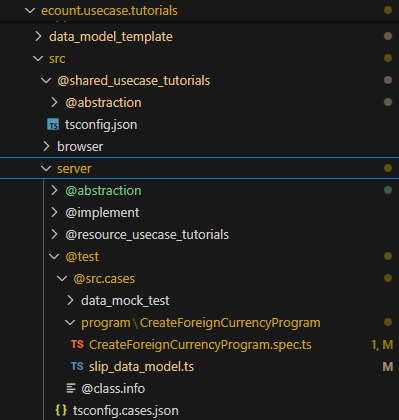

# Daily Retrospective  
**작성자**: [나강민]  
**작성일시**: [2025-01-10]  

## 1. 오늘 배운 내용 (필수)  

외화코드 저장 테스트 프로그램 구현

오늘 정말 많은 억까가 있었지만 정말 모든 동기들의 도움으로 Create를 완성할 수 있었습니다. 처음 definition부터 순서를 정리하면서 오늘 한 배움을 잊지 않도록 작성하고자 합니다.

### 기본준비 


어제 작업한 순서대로 준비가 다 되어 있다면 아래와 같은 순서로 진행이 가능합니다.

그리고 pg_admin을 들어가서 테이블 하나를 만들어 둡니다.



```sql
CREATE TABLE IF NOT EXISTS base.foreign_currency_20250109_xxx_ecback

(

    tenant_sid character varying(100) COLLATE pg_catalog."default" NOT NULL,

    foreign_currency_cd character varying(100) COLLATE pg_catalog."default" NOT NULL,

    foreign_currency_nm character varying(100) COLLATE pg_catalog."default",

    exchange_rate numeric(28,10),

    category character varying(100) COLLATE pg_catalog."default",

    write_dtm timestamp(3) without time zone NOT NULL,

    status_type character varying(3) COLLATE pg_catalog."default",

    CONSTRAINT foreign_currency_20250109_xxx_ecback_pkey PRIMARY KEY (tenant_sid, foreign_currency_cd)

)
```

## 코드 구현
### 1. CreateForeignCurrencyProgram.spec.ts구현


```ts
import { test, testBed } from 'ecmodule.testutil/ecsolution';
import { ProgramBuilder } from 'ecount.infra.common/program';
import { ApiRequestDto, ApiResultDto } from 'ecount.usecase.base/@abstraction';
import { ExecuteSetupMainRequestDto } from 'ecount.usecase.common/@abstraction';
import { SlipDataModelContainer } from 'ecount.usecase.common/@implement';
import { ICreateForeignCurrencyProgram } from 'ecount.usecase.tutorials/@abstraction';
import { slip_data_model } from './slip_data_model';
import { EN_ACTION_MODE, EN_MENU_TYPE } from 'ecount.fundamental.define/enum';

/* 세션 정보 세팅 */
const zone = 'BA';
const tenant_sid = '303101';
const user_id = 'test';

const sessionCreator = new $SessionImpersonator();
sessionCreator.identity(zone, tenant_sid, user_id).configure((id) => id.setLanguage('ko-KR'));
const sessionIdentity = sessionCreator.build();

test('CreateForeignCurrencyProgram case 1: create foreign_currency', () => {
	const execution_context = testBed.createExecutionContext({
		sessionIdentity,
	});
	execution_context.action.action_mode = EN_ACTION_MODE.Create;
	execution_context.action.menu_type = EN_MENU_TYPE.Input;
	execution_context.action.bizz_sid = 'TB_000000E040114';

	const slip_dto = {
		action_mode: execution_context.action.action_mode,
		menu_type: execution_context.action.menu_type,
		slip_data_model: slip_data_model,
		derive_info: {
			smc: {} as SlipDataModelContainer,
			derive_target: [],
		},
		additional_info: {},
		notification: {},
	} as ExecuteSetupMainRequestDto;

	const program = ProgramBuilder.create<ExecuteSetupMainRequestDto, ApiResultDto>(
		ICreateForeignCurrencyProgram,
		execution_context
	);
	const result = program.execute(slip_dto);

	Assert.equal(JSON.stringify(result), JSON.stringify({}));
});

```

### definition 중 objects/master -> [EN_ACTION_MODE.create] 부분만 구현 중
```ts
import { BizzUtil, IBizzObjectDefinition, IImportTargetPropInfo } from 'ecount.infra.base/abstraction';
import { bizz_definition } from '../foreign_currency_definition';
import {
	EN_ACTION_MODE,
	EN_ATTR_TYPE,
	EN_BIZZ_OBJECT_ALT_DATA_MODEL_ID,
	EN_INPUT_MENU_TYPE,
} from 'ecount.fundamental.define/enum';
import { foreign_currency_input } from './../../../data_model';
import { definition_attrs } from 'ecount.usecase.base/@abstraction';

BizzUtil.setObject(bizz_definition, {
	object_id: EN_INPUT_MENU_TYPE.Master,
	data_models: [
		{
			data_model_identifier: foreign_currency_input,
			alt_data_model_id: EN_BIZZ_OBJECT_ALT_DATA_MODEL_ID.foreign_currency,
			//target_props
			target_props_options: {
				prop_option: {
					tenant_sid: { is_key: true },
					foreign_currency_cd: { is_key: true },
				} as { [key: string]: IImportTargetPropInfo },
			},
		},
	],
	attributes: [
		{
			attr_id: definition_attrs.info.data_model_resolver,
			attr_type: EN_ATTR_TYPE.Information,
			data: {
				[EN_ACTION_MODE.Create]: 'ICreateForeignCurrencyMasterProgram',
				//				[EN_ACTION_MODE.Modify]: 'IModifyForeignCurrencyMasterProgram',
				//				[EN_ACTION_MODE.Delete]: 'IModifyStatusForeignCurrencyMasterProgram',
				//				[EN_ACTION_MODE.UnDelete]: 'IModifyStatusForeignCurrencyMasterProgram',
				//				[EN_ACTION_MODE.Remove]: 'IDeleteForeignCurrencyMasterProgram',
			} as definition_attrs.info.data_model_resolver,
			prop_id: '',
		},
	],
} as IBizzObjectDefinition);

```


### 1. CreateForeignCurrencyProgram.ts구현
-> 참고 : CreateInventoryProgram

```ts
import { ICommonException, ITimeoutException } from '@shared_infra_bridge/exception';
import { Exception, IException } from 'ecount.fundamental.define/exception';
import { IExecutionContext } from 'ecount.infra.bridge/base';
import { program_impl } from 'ecount.infra.common/decorator';
import { ExceptionBuilder } from 'ecount.infra.common/exception';
import { BaseProgram, ProgramBuilder } from 'ecount.infra.common/program';
import {
	ExecuteSetupMainRequestDto,
	ExecuteSetupMainResultDto,
	IExecuteSetupMainProgram,
	//ITempExecuteSetupMainProgram,
} from 'ecount.usecase.common/@abstraction';
import { SlipDataModelContainer } from 'ecount.usecase.common/@implement';
import { ICreateForeignCurrencyProgram } from 'ecount.usecase.tutorials/@abstraction';

/**
 * Create ForeignCurrency Program
 */
@program_impl(ICreateForeignCurrencyProgram)
export class CreateForeignCurrencyProgram
	extends BaseProgram<ExecuteSetupMainRequestDto, ExecuteSetupMainResultDto>
	implements ICreateForeignCurrencyProgram
{
	constructor(execution_context: IExecutionContext) {
		super(execution_context);
	}

	private result: ExecuteSetupMainResultDto;

	protected onExecute(request: ExecuteSetupMainRequestDto): ExecuteSetupMainResultDto {
		const errors: IException[] = [];
		try {
			this._runCreateInventoryProcess(request);
		} catch (e: any) {
			if (e.isSessionTimeout) {
				throw ExceptionBuilder.create<ITimeoutException>(ITimeoutException, { isSessionTimeout: true });
			}

			if (Exception.verify(e)) {
				errors.push(e as IException);
			} else {
				throw e;
			}
		} finally {
			if (!_.vIsEmpty(errors)) {
				this.result.error = ExceptionBuilder.create<ICommonException>(ICommonException, {
					error_info: errors,
				});
			}
		}

		return this.result;
	}
	@_transaction(TransactionOption.Required)
	private _runCreateInventoryProcess(request: ExecuteSetupMainRequestDto): void {
		this.result = {
			error: {},
		} as ExecuteSetupMainResultDto;
		// [1] 5.0 ForeignCurrency Main Program
		this.result = this._executeMainSetupProgram(request);
	}

	/** 5.0 ForeignCurrency Main Program  */
	private _executeMainSetupProgram(request: ExecuteSetupMainRequestDto): ExecuteSetupMainResultDto {
		const program = ProgramBuilder.create<ExecuteSetupMainRequestDto, ExecuteSetupMainResultDto>(
			IExecuteSetupMainProgram,
			this.execution_context
		);

		// Main 로직에서 SlipDataModelContainer 생성 시 에러, 임시 로직
		// 빈 객체일 경우 새로 생성하지 않고 그대로 사용하여 에러 발생
		// ===================================================
		request.derive_info.smc = new SlipDataModelContainer(this.execution_context, request.slip_data_model);
		// ===================================================

		return program.execute(request);
	}
}

```
### 2. ICreateForeignCurrencyDataModelProgramDto 구현
```ts
import { ProgramIdentifier } from 'ecount.infra.base/abstraction';
import { IBaseProgram } from 'ecount.infra.bridge/base';
import {
	IResolveForeignCurrencyDataModelProgramDto,
	IResolveForeignCurrencyDataModelProgramResult,
} from './IResolveForeignCurrencyDataModelProgram';

export interface ICreateForeignCurrencyDataModelProgramDto extends IResolveForeignCurrencyDataModelProgramDto {}

export interface ICreateForeignCurrencyDataModelProgramResult extends IResolveForeignCurrencyDataModelProgramResult {}

export const ICreateForeignCurrencyDataModelProgram = new ProgramIdentifier('ICreateForeignCurrencyDataModelProgram');

export interface ICreateForeignCurrencyDataModelProgram
	extends IBaseProgram<ICreateForeignCurrencyDataModelProgramDto, ICreateForeignCurrencyDataModelProgramResult> {}

```

### 3. ICreateForeignCurrencyMasterProgram 구현
```ts
import { ProgramIdentifier } from 'ecount.infra.base/abstraction';
import { IBaseProgram } from 'ecount.infra.bridge/base';
import {
	ICreateForeignCurrencyDataModelProgramDto,
	ICreateForeignCurrencyDataModelProgramResult,
} from './ICreateForeignCurrencyDataModelProgram';

export const ICreateForeignCurrencyMasterProgram = new ProgramIdentifier('ICreateForeignCurrencyMasterProgram');

export interface ICreateForeignCurrencyMasterProgram
	extends IBaseProgram<ICreateForeignCurrencyDataModelProgramDto, ICreateForeignCurrencyDataModelProgramResult> {}

```


### 4. IResolveForeignCurrencyDataModelProgram 구현
```ts
import { ProgramIdentifier } from 'ecount.infra.base/abstraction';
import { IBaseProgram } from 'ecount.infra.bridge/base';
import { IResolveDataModelProgramDto, IResolveDataModelProgramResult } from 'ecount.usecase.common/@abstraction';

export interface IResolveForeignCurrencyDataModelProgramDto extends IResolveDataModelProgramDto {}

export interface IResolveForeignCurrencyDataModelProgramResult extends IResolveDataModelProgramResult {}

export const IResolveForeignCurrencyDataModelProgram = new ProgramIdentifier('IResolveForeignCurrencyDataModelProgram');

export interface IResolveForeignCurrencyDataModelProgram
	extends IBaseProgram<IResolveForeignCurrencyDataModelProgramDto, IResolveForeignCurrencyDataModelProgramResult> {}

```

### 5. ResolveForeignCurrencyDataModelProgram 구현
```ts
import { ProgramIdentifier } from 'ecount.infra.base/abstraction';
import { program_impl } from 'ecount.infra.common/decorator';
import { BaseProgram, ProgramBuilder } from 'ecount.infra.common/program';
import { definition_attrs } from 'ecount.usecase.base/@abstraction';
import {
	IResolveForeignCurrencyDataModelProgramDto as ProgramDto,
	IResolveForeignCurrencyDataModelProgramResult as ProgramResult,
	IResolveForeignCurrencyDataModelProgram,
} from 'ecount.usecase.tutorials/@abstraction';

// 해당 dmc에 정의된 data_model_resolver 프로그램 실행만 한다
// resolver는 MenuDefinition에 data_model_id별로 등록한다.
@program_impl(IResolveForeignCurrencyDataModelProgram)
export class ResolveForeignCurrencyDataModelProgram
	extends BaseProgram<ProgramDto, ProgramResult>
	implements IResolveForeignCurrencyDataModelProgram
{
	onExecute(dto: ProgramDto): ProgramResult {
		const action_mode = dto.action_mode as unknown as string;
		const resolver = dto.dmc.getAttrByAttrId<definition_attrs.info.data_model_resolver>(
			definition_attrs.info.data_model_resolver,
			'' //defintion의 attribute는 prop_id가 빈값이다.
		);
		if (resolver?.data?.[action_mode]) {
			const create_program = ProgramBuilder.create<ProgramDto, ProgramResult>(
				resolver.data[action_mode] as unknown as ProgramIdentifier,
				this.execution_context
			);
			return create_program.execute(dto) as unknown as ProgramResult;
		}

		return {} as unknown as ProgramResult;
	}
}

```

### 6. foreign_currency_20250110_nkm_ecback
```css
/d/ecxsolution/ecount.nextv5/ecount.solution/src/02.ecount.infrastructure/ecount.infra.bridge/src/server/table_model/pg/base
```
```ts
export const foreign_currency_20250110_nkm_ecback = new $TableIdentifier(DbConnectionId.PG.BASE, 'foreign_currency_20250110_nkm_ecback');

export interface foreign_currency_20250110_nkm_ecback {
  tenant_sid: string; // tenant_sid: 테넌트 식별자
  foreign_currency_cd: string; // foreign_currency_cd: 외환 통화 코드
  foreign_currency_nm?: string; // foreign_currency_nm: 외환 통화 이름 (optional)
  exchange_rate?: unknown; // exchange_rate: 환율 (optional)
  category?: string; // category: 카테고리 (optional)
  write_dtm: Date; // write_dtm: 작성 일시
  status_type?: string; // status_type: 상태 타입 (optional)
}

```


### 7. CreateForeignCurrencyMasterProgram.ts 구현
-> 참고 : CreateIventoryMasterProgram

```ts
import { BaseProgram, ProgramBuilder } from 'ecount.infra.common/program';
import {
	IResolveForeignCurrencyDataModelProgramResult,
	IResolveForeignCurrencyDataModelProgramDto,
	ICreateForeignCurrencyMasterProgram,
} from 'ecount.usecase.tutorials/@abstraction';
import { program_impl } from 'ecount.infra.common/decorator';
import { DacCommandBuilder } from 'ecount.infra.common/dac';
import { pg } from 'ecount.infra.bridge/table_model';
import { IDataModelContainer } from 'ecount.fundamental.datamodel/definition';
import { InsertBulkForeignCurrencyDac } from 'ecount.usecase.tutorials/dac';
import { } from 'ecount.usecase.tutorials/@abstraction'
import { foreign_currency } from '@shared_usecase_tutorials/@abstraction';


@program_impl(ICreateForeignCurrencyMasterProgram)
export class CreateForeignCurrencyMasterProgram
	extends BaseProgram<IResolveForeignCurrencyDataModelProgramDto, IResolveForeignCurrencyDataModelProgramResult>
	implements ICreateForeignCurrencyMasterProgram {

	@_transaction(TransactionOption.Required)
	protected onExecute(dto: IResolveForeignCurrencyDataModelProgramDto): IResolveForeignCurrencyDataModelProgramResult {
		// checkJSJ 데이터 포멧 확인
		const refer_type_based_dmc = this._getReferTypeBasedDmc(dto);
		const req = this._getTableModel(refer_type_based_dmc);

		if (_.vIsEmpty(req)) {
			return true;
		}

		if (_.vIsEmpty(req[0].tenant_sid)) {
			const logEntryBuilder = new $LogEntryBuilder('Failed to update progress_status');
			logEntryBuilder.logLevel = LogLevel.Error;
			const hostname = this.execution_context.http?.request.url.hostname;

			logEntryBuilder.addProperties({
				MachineName: $App.machineName,
				ErrNm: 'InvalidData',
				ComCd: this.execution_context.session.tenant_sid,
				UserId: this.execution_context.session.user_sid,
				UserIp: hostname != null ? _.vToIPAddress(hostname) : '',
				Zone: this.execution_context.session.zone,
				RequestUrl: _.vSafe(this.execution_context.http?.request.url.toString()),
				Message: 'Failed to update progress_status: progress_status_sid is empty.\n' + JSON.stringify(dto),
			});

			$App.log.ptp(logEntryBuilder);
		}

		const dac = DacCommandBuilder.create(InsertBulkForeignCurrencyDac, this.execution_context, DbConnectionId.PG.BASE);
		dac.execute(_.vFirst(req) as pg.foreign_currency_20250110_nkm_ecback);

		// 첨부 데이터 저장 - hid를 필요로 하여 v3 전표 저장시 만드는 hid를 활용해야 함
		// const slip_link_feature = this.execution_context.getFeature<IV3SlipLinkFeature>(IV3SlipLinkFeature);
		// slip_link_feature.saveSlipLink({
		// 	slip_link: dto.dmc.getValueByReferType('slip_link'),
		// 	hid: dto.dmc.getValueByReferType('hid'),
		// 	data_dt: dto.dmc.getValueByReferType('data_dt'),
		// 	data_no: dto.dmc.getValueByReferType('data_no'),
		// } as SaveV3SlipLinkRequestDto);

		// const add_item_program = ProgramBuilder.create<IResolveForeignCurrencyDataModelProgramDto, void>(
		// 	ICreateModifyInventoryAddItemProgram,
		// 	this.execution_context
		// );

		// add_item_program.execute(dto);

		return true;
	}

	private _getReferTypeBasedDmc(dto: IResolveForeignCurrencyDataModelProgramDto): IDataModelContainer {
		if (!_.vIsEmpty(dto.refer_type_based_dmc)) {
			return dto.refer_type_based_dmc as IDataModelContainer;
		}

		const refer_type_based_dmc = dto.dmc.getReferTypeBasedDataModelContainer() as IDataModelContainer;
		dto.refer_type_based_dmc = refer_type_based_dmc;

		return refer_type_based_dmc;
	}

	private _getTableModel(dmc: IDataModelContainer): pg.foreign_currency_20250110_nkm_ecback[] {
		const data_model = dmc.getDataModel() ?? [];

		return _.vMappingTo(
			data_model,  // 원본 데이터 모델 (foreign_currency_input 타입이어야 함)
			pg.foreign_currency_20250110_nkm_ecback,  // 목표 테이블 모델 (foreign_currency_20250110_nkm_ecback 타입이어야 함)
			(org, tg) => {
				tg.tenant_sid = org.tenant_sid ?? '';  // 원본에서 목표로 매핑
				tg.foreign_currency_cd = org.foreign_currency_cd ?? '';  // 외환 코드
				tg.foreign_currency_nm = org.foreign_currency_nm ?? '';  // 외환 이름
				tg.exchange_rate = org.exchange_rate ?? 0;  // 환율
				tg.category = org.category ?? '';  // 카테고리
				tg.status_type = org.status_type ?? '';  // 상태 타입
				tg.write_dtm = new Date();  // 작성 시간 (새로 설정)
			}

		) as pg.foreign_currency_20250110_nkm_ecback[];
	}
}

```

### master 안찾아진다면? TempExecuteSetupMainProgram 실행
```ts
import { IDataModelContainer } from 'ecount.fundamental.datamodel/definition';
import { EN_ATTR_TYPE, EN_INPUT_MENU_TYPE } from 'ecount.fundamental.define/enum';
import { Exception } from 'ecount.fundamental.define/exception';
import { IConfigurationContext } from 'ecount.infra.base/abstraction';
import { IArrayDataModelMapper } from 'ecount.infra.base/setup';
import { IBizzStackInfo, IExecutionContext } from 'ecount.infra.bridge/base';
import { IDataModelValidationDetail, IDataModelValidationException } from 'ecount.infra.bridge/exception';
import { program_impl } from 'ecount.infra.common/decorator';
import { ExceptionBuilder } from 'ecount.infra.common/exception';
import { BizzProgram, ProgramBuilder } from 'ecount.infra.common/program';
import { ISlipDataModel, IValidateSlipDataModelException } from 'ecount.usecase.base/@abstraction';
import {
	ExecuteSetupMainRequestDto,
	ExecuteSetupMainResultDto,
	IDataModelInitializerProgram,
	IDataModelModifierProgram,
	IDataModelValidatorProgram,
	IDataModelValidatorProgramDto,
	IDataModelValidatorProgramResult,
	IInitializeSlipDataModelProgram,
	IInitializeSlipDataModelProgramDto,
	IInitializeSlipDataModelProgramResult,
	IPreExecuterProgram,
	IPreExecuterProgramDto,
	IPreExecuterProgramResult,
	ISlipDataModelContainer,
	IValidateSlipDataModelProgram,
	IValidateSlipDataModelProgramDto,
	IValidateSlipDataModelProgramResult,
	SlipBizzInfo,
	IBizzValueResolverFeature,
	ITempExecuteSetupMainProgram,
	IPostExecuterProgram,
	IPostExecuterProgramDto,
	IPostExecuterProgramResult,
} from 'ecount.usecase.common/@abstraction';
import { BizzValueResolverFeature, SlipDataModelContainer } from 'ecount.usecase.common/@implement';
import {
	IResolveInventoryDataModelProgram,
	IResolveInventoryDataModelProgramDto,
	IResolveInventoryDataModelProgramResult,
} from 'ecount.usecase.inventory/@abstraction';
import {
	ITemplateUtilFeature,
	IV3FormAttributeFeature,
	IV3TemplateUtilFactory,
} from 'ecount.usecase.setup/@abstraction';
import { InputFormAttrV3ToV5ConvertFeature } from 'ecount.usecase.setup/@implement';

/**
 * ExcuteSetup MainProgram
 */
@program_impl(ITempExecuteSetupMainProgram)
export class TempExecuteSetupMainProgram
	extends BizzProgram<ExecuteSetupMainRequestDto, ExecuteSetupMainResultDto, SlipBizzInfo, IExecutionContext>
	implements ITempExecuteSetupMainProgram
{
	smc: ISlipDataModelContainer;
	dmc: IDataModelContainer[];
	result: ExecuteSetupMainResultDto;
	master_data_model_id: string;
	detail_data_model_id: string;

	constructor(execution_context: IExecutionContext) {
		super(execution_context);
	}
	protected getBizzData(request: ExecuteSetupMainRequestDto): IBizzStackInfo<SlipBizzInfo> {
		const bizz_info: IBizzStackInfo<SlipBizzInfo> = {
			type: 'slip',
			data: {
				bizz_sid: request.slip_data_model.bizz_sid,
				data_dt: request.slip_data_model.data_dt ?? '',
				data_no: request.slip_data_model.data_no ?? 0,
			},
		};
		return bizz_info;
	}

	onConfigure(configuration_context: IConfigurationContext): void {
		configuration_context.setFeature<ITemplateUtilFeature>(
			ITemplateUtilFeature,
			this.execution_context
				.getFeature<IV3TemplateUtilFactory>(IV3TemplateUtilFactory)
				.createInstance(this.execution_context)
		);

		configuration_context.setFeature<IV3FormAttributeFeature>(
			IV3FormAttributeFeature,
			new InputFormAttrV3ToV5ConvertFeature(this.execution_context)
		);

		configuration_context.setFeature<IBizzValueResolverFeature>(
			IBizzValueResolverFeature,
			new BizzValueResolverFeature(this.execution_context)
		);
	}

	@_transaction(TransactionOption.Required)
	onExecute(request: ExecuteSetupMainRequestDto): ExecuteSetupMainResultDto {
		this._onInit(request);
		this._runExecuteSetupMainProgram(request);
		return this.result as ExecuteSetupMainResultDto;
	}

	@_transaction(TransactionOption.Required)
	private _runExecuteSetupMainProgram(request: ExecuteSetupMainRequestDto): void {
		//------------------------------------------------------------------------
		// [#0] create program
		//------------------------------------------------------------------------
		const {
			slip_validator_program,
			data_model_initializer_program,
			data_model_modifier_program,
			data_model_validator_program,
			data_model_resolver_program,
			pre_executer_resolver_program,
			post_executer_resolver_program,
		} = this._createProgram(this.execution_context);

		const { action_mode, menu_type, data_dt, data_no, data_sid } = request.slip_data_model;
		const slip = {
			action_mode,
			menu_type,
			data_dt,
			data_no,
			data_sid,
			bizz_sid: this.smc.getSlipDefinition().bizz_sid,
			data_model: this.smc.getSlipDataModel(),
		} as ISlipDataModel;

		const smc_definition = this.smc.getDataModelDefinitions();
		for (const dmc of this.smc.createDataModelContainer()) {
			this.dmc.push(dmc);
		}

		//------------------------------------------------------------------------
		// [#1] pre_executer resolver
		//------------------------------------------------------------------------
		pre_executer_resolver_program.execute({
			definitions: smc_definition,
			slip_attributes: this.smc.getAttrsByAttrType(EN_ATTR_TYPE.PreExecuter),
			slip_data_model: slip,
		});

		const validator_error_list: IDataModelValidationDetail[] = [];
		/* 기본값 세팅된 slip_data_model을 다시 dmc data_model에 매핑 */
		//=============================================================================
		/* ----------- Dmc별 prop initializer, modifier, validator 실행 ----------- */
		for (const dmc of this.dmc) {
			//------------------------------------------------------------------------
			// [#3] data_model initializer
			//------------------------------------------------------------------------
			data_model_initializer_program.execute(dmc);

			//------------------------------------------------------------------------
			// [#4] data_model modifier
			//------------------------------------------------------------------------
			data_model_modifier_program.execute(dmc);

			//------------------------------------------------------------------------
			// [#5] data_model validator
			//------------------------------------------------------------------------
			const validator_result = data_model_validator_program.execute({
				data_model_container: dmc,
				menu_type,
			});

			if (!_.vIsEmpty(validator_result.exception)) {
				validator_error_list.push(...validator_result.exception.details);
			}
		}

		if (!_.vIsEmpty(validator_error_list)) {
			Exception.throw(
				ExceptionBuilder.create<IDataModelValidationException>(IDataModelValidationException, {
					data_model_id: this.master_data_model_id,
					details: validator_error_list,
				})
			);
		}

		//------------------------------------------------------------------------
		// [#6] slip valiator
		//------------------------------------------------------------------------
		// 전표 기준 비즈니스 로직 처리(허용창고, 편집제한일자등..)
		const slip_validator_result = slip_validator_program.execute({
			dmc: this.dmc,
			slip_data_model: slip,
			slip_attributes: this.smc.getAttrsByAttrType(EN_ATTR_TYPE.Validator),
			additional_info: request.additional_info,
		});

		if (!_.vIsEmpty(slip_validator_result.exceptions)) {
			Exception.throw(
				ExceptionBuilder.create<IValidateSlipDataModelException>(IValidateSlipDataModelException, {
					exceptions: slip_validator_result.exceptions,
				})
			);
		}

		//------------------------------------------------------------------------
		// [#8] data_model resolver
		//------------------------------------------------------------------------
		// 상단 / 하단  단위로 처리
		const slip_created_result: { [key: string]: IResolveInventoryDataModelProgramResult } = {};
		const return_data_model: IArrayDataModelMapper = {};
		_.vForEach(this.dmc, (dmc) => {
			const data_model = dmc.getDataModel();

			slip_created_result[dmc.data_model_id] = data_model_resolver_program.execute({
				action_mode: slip.action_mode,
				dmc,
				data_sid: slip.data_sid,
			});

			return_data_model[dmc.data_model_id] = data_model as [{ [prop_id: string]: any }];
		});

		this.result.slip_created_result = slip_created_result;
		this.result.data_model = return_data_model;

		//------------------------------------------------------------------------
		// [#10] 개별 전표 저장후
		//------------------------------------------------------------------------
		post_executer_resolver_program.execute({
			definitions: smc_definition,
			slip_attributes: this.smc.getAttrsByAttrType(EN_ATTR_TYPE.PostExecuter),
			slip_data_model: slip,
			dmcs: this.dmc,
		});
	}

	/** init func */
	private _onInit(request: ExecuteSetupMainRequestDto) {
		if (_.vIsEmpty(request)) {
			throw new Exception('Exception Empty Request Info ');
		}

		if (_.vIsEmpty(request?.slip_data_model) || _.vIsEmpty(request?.derive_info)) {
			throw new Exception('Exception Empty Request Detail Info');
		}

		this.smc = _.vSafe(
			request.derive_info.smc,
			new SlipDataModelContainer(this.execution_context, request.slip_data_model)
		);

		this.dmc = [];

		if (_.vIsEmpty(this.smc)) {
			throw new Exception('Exception Empty smc Info');
		}

		this.master_data_model_id = this.execution_context.bizz_mgr.getBizzDataModelId(
			this.execution_context,
			this.execution_context.action.bizz_sid,
			EN_INPUT_MENU_TYPE.Master
		);

		this.detail_data_model_id = this.execution_context.bizz_mgr.getBizzDataModelId(
			this.execution_context,
			this.execution_context.action.bizz_sid,
			EN_INPUT_MENU_TYPE.Detail
		);

		this.result = {
			error: {},
		} as ExecuteSetupMainResultDto;
	}

	/**
	 *  Init - Create program
	 */
	private _createProgram(context: IExecutionContext) {
		return {
			slip_initializer_program: ProgramBuilder.create<
				IInitializeSlipDataModelProgramDto,
				IInitializeSlipDataModelProgramResult
			>(IInitializeSlipDataModelProgram, context),
			slip_validator_program: ProgramBuilder.create<
				IValidateSlipDataModelProgramDto,
				IValidateSlipDataModelProgramResult
			>(IValidateSlipDataModelProgram, context),
			data_model_validator_program: ProgramBuilder.create<
				IDataModelValidatorProgramDto,
				IDataModelValidatorProgramResult
			>(IDataModelValidatorProgram, context),
			data_model_modifier_program: ProgramBuilder.create<IDataModelContainer, IDataModelContainer>(
				IDataModelModifierProgram,
				context
			),
			data_model_initializer_program: ProgramBuilder.create<IDataModelContainer, IDataModelContainer>(
				IDataModelInitializerProgram,
				context
			),
			data_model_resolver_program: ProgramBuilder.create<
				IResolveInventoryDataModelProgramDto,
				IResolveInventoryDataModelProgramResult
			>(IResolveInventoryDataModelProgram, context),
			pre_executer_resolver_program: ProgramBuilder.create<IPreExecuterProgramDto, IPreExecuterProgramResult>(
				IPreExecuterProgram,
				context
			),
			post_executer_resolver_program: ProgramBuilder.create<IPostExecuterProgramDto, IPostExecuterProgramResult>(
				IPostExecuterProgram,
				context
			),
		};
	}
}
```


## 2. 동기에게 도움 받은 내용 (필수)
오늘 동기 전체에게 돌아다니면서 같은 오류들을 발견하고 공유하고 머리를 맞대며 모든 사람이 다같이 자신의 할 일이 있어도 내려놓고 같이 도움을 주셔서 정말 다들 감사합니다!


---

## 3. 개발 기술적으로 성장한 점 (선택)
아래의 3가지 주제 중 하나를 선택하여 작성합니다.

### 1. 교육 과정 상 배운 내용이 아닌 개인적 호기심을 해결하기 위해 추가 공부한 내용
### 2. 오늘 직면했던 문제 (개발 환경, 구현)와 해결 방법

오늘 직면했던 문제는 JavaScript에서 발생한 `TypeError` 오류로, `_.vMappingTo` 함수에서 인자 타입이 잘못 전달되어 발생한 예외였습니다. 오류 메시지에는 "Incorrect argument type or undefined"라는 메시지와 함께 `[1:IObjectIdentifier]`가 언급되었고, 이는 함수에 전달된 두 번째 인자 `pg.foreign_currency_20250110_nkm_ecback`가 예상한 타입과 일치하지 않아서 발생한 문제였습니다.

**문제 발생 상황**:
- `_.vMappingTo`는 원본 객체(`data_model`)와 목표 객체(`pg.foreign_currency_20250110_nkm_ecback`)를 매핑하는 함수입니다.
- 두 번째 인자로 전달된 `pg.foreign_currency_20250110_nkm_ecback`가 `IObjectIdentifier` 타입을 기대했지만, 해당 타입에 맞지 않는 값이 전달되었기 때문에 오류가 발생했습니다.
  
**해결 방법**:
1. **타입 확인**: `pg.foreign_currency_20250110_nkm_ecback`이 정확한 테이블 모델인지, `IObjectIdentifier` 타입을 구현하고 있는지 확인했습니다. 이 객체는 데이터베이스 테이블을 나타내는 모델이어야 하므로, 테이블 모델이 올바르게 정의되었는지 점검했습니다.
   
2. **매핑 함수 인자 점검**: `_.vMappingTo` 함수의 첫 번째 인자(`data_model`)와 두 번째 인자(`pg.foreign_currency_20250110_nkm_ecback`)가 올바른 타입인지 점검하였고, 이들이 서로 호환되는지 확인했습니다. 데이터 모델과 테이블 모델의 필드가 잘 매핑되도록 수정했습니다.

3. **디버깅**: 오류가 발생한 코드를 통해, 각 필드에 대한 매핑 작업을 다시 점검하고, 각 타입에 대한 명확한 정의를 확인하여 해결책을 적용했습니다.

---

### 3. 위 두 주제 중 미처 해결 못한 과제. 앞으로 공부해볼 내용.

**미처 해결 못한 과제**:
- 오늘의 문제에서 해결하지 못한 과제는 `IObjectIdentifier`와 같은 특정 타입의 정의와 그것이 JavaScript에서 어떻게 처리되는지에 대한 정확한 이해입니다. 이와 관련된 더 깊은 이해가 필요하며, 특히 TypeScript에서 `IObjectIdentifier`와 같은 타입을 제대로 활용하는 방법에 대해 학습할 필요가 있습니다.

**앞으로 공부해볼 내용**:
1. **TypeScript와 JavaScript의 타입 시스템**:
   - `IObjectIdentifier`와 같은 고유 타입이 어떻게 정의되고, 그것을 JavaScript와 TypeScript에서 어떻게 처리하는지에 대한 학습이 필요합니다. 특히, `IObjectIdentifier`와 같은 인터페이스가 어떻게 JavaScript 코드와 상호작용하는지, 타입 안정성을 어떻게 보장하는지에 대해 더 깊이 공부해야 할 필요성이 느껴졌습니다.

2. **매핑 함수의 활용**:
   - `_.vMappingTo`와 같은 데이터 매핑 함수가 어떻게 다양한 데이터 모델을 처리하고 변환하는지, 그리고 타입이 맞지 않을 경우 발생하는 문제들을 어떻게 예방할 수 있을지에 대해 연구할 필요가 있습니다. 특히, 매핑 작업에서 발생할 수 있는 예외 상황을 예방하는 방법을 공부해야겠습니다.

3. **디버깅 및 오류 처리**:
   - 개발 중 발생하는 다양한 오류에 대한 디버깅 방법과 그 해결책을 좀 더 체계적으로 학습하고, JavaScript 및 TypeScript에서 발생할 수 있는 오류 메시지를 잘 해석하여 문제를 해결할 수 있는 방법을 강화할 필요가 있습니다.


