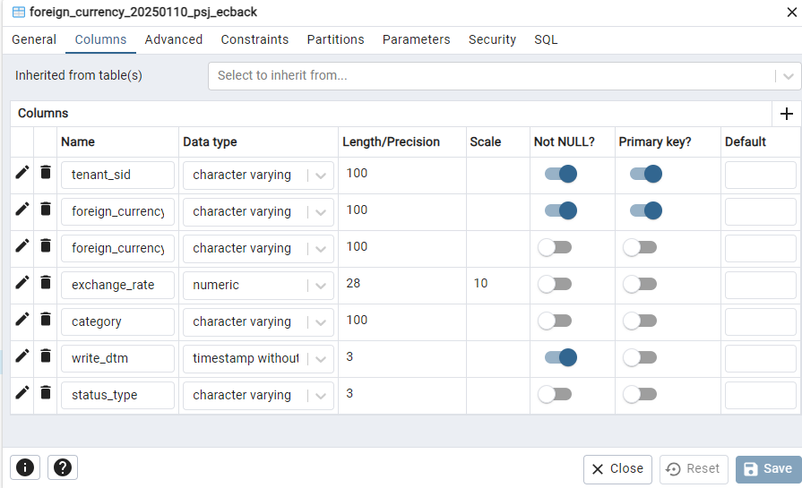
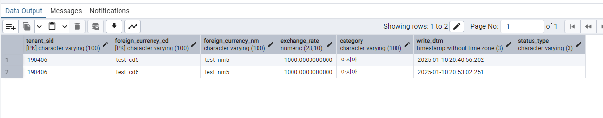

# Daily Retrospective  
**작성자**: [박성재]  
**작성일시**: [2025-01-10]  

## 1. 오늘 배운 내용 (필수)  
- 외화코드 저장 구현 실습

</br>

## 외화코드 저장 구현 실습
어제 실습으로 Definition까지 정의했었는데, 이어서 외화코드를 직접 DB에 삽입하는 과정까지 실습을 진행하였습니다. 편의상 인터페이스와 `Index`를 추가하는 과정은 생략하여, 진행한 과정을 한번 정리해보겠습니다.

### 1. 테스트 데이터 작성

```typescript
import { ISlipDataModel } from 'ecount.usecase.base/@abstraction';

export const slip_data_model = {
	action_mode: 'NEW',
	bizz_sid: 'TB_000000E040114',
	data_model: {
		foreign_currencyXmaster: [
			{
				// foreign_currency$tenant_sid: '303101',
				foreign_currency$tenant_sid: '303102',
				foreign_currency$foreign_currency: { sid: 'test_cd6', code: 'test_cd6', name: 'test_nm5' },
				foreign_currency$foreign_currency_cd: 'test_cd6',
				foreign_currency$foreign_currency_nm: 'test_nm5',
				foreign_currency$exchange_rate: 1000,
				foreign_currency$category: '아시아',
				foreign_currency$status_type: '',
			},
		],
	},
	menu_sid: 'TM_000000E040114',
	menu_type: 'input',
} as ISlipDataModel;
```
테스트를 위한 Mock 데이터를 모듈화하여 작성하였습니다.

### 2. 테스트코드 작성

```typescript
import { test, testBed } from 'ecmodule.testutil/ecsolution';
import { ProgramBuilder } from 'ecount.infra.common/program';
import { ApiRequestDto } from 'ecount.usecase.base/@abstraction';
import { ExecuteSetupMainRequestDto } from 'ecount.usecase.common/@abstraction';
import { SlipDataModelContainer } from 'ecount.usecase.common/@implement';
import { ICreateForeignCurrencyProgram } from 'ecount.usecase.tutorials/@abstraction';
import { slip_data_model } from './slip_data_model';
import { EN_ACTION_MODE, EN_MENU_TYPE } from 'ecount.fundamental.define/enum';

/* 세션 정보 세팅 */
const zone = 'BA';
const tenant_sid = '190406';
const user_id = 'test';

const sessionCreator = new $SessionImpersonator();
sessionCreator.identity(zone, tenant_sid, user_id).configure((id) => id.setLanguage('ko-KR'));
const sessionIdentity = sessionCreator.build();

test('CreateForeignCurrencyProgram case 1: create foreign_currency', () => {
	const execution_context = testBed.createExecutionContext({
		sessionIdentity,
	});
	execution_context.action.action_mode = EN_ACTION_MODE.Create;
	execution_context.action.menu_type = EN_MENU_TYPE.Input;

	const slip_dto = {
		action_mode: execution_context.action.action_mode,
		menu_type: execution_context.action.menu_type,
		slip_data_model: slip_data_model,
		derive_info: {
			smc: {} as SlipDataModelContainer,
			derive_target: [],
		},
		additional_info: {},
		notification: {},
	} as ExecuteSetupMainRequestDto;

	const program = ProgramBuilder.create<ExecuteSetupMainRequestDto, ApiRequestDto>(
		ICreateForeignCurrencyProgram,
		execution_context
	);
	const result = program.execute(slip_dto);

	Assert.equal(JSON.stringify(result), JSON.stringify({}));
});
```
- 일일이 UI를 통해 디버깅을 하는 작업이 번거롭기 때문에, 테스트코드를 통해 디버깅하는 환경을 구축하였습니다.
- 먼저 테스트코드를 작성하였으며, 이후에 로직에 필요한 `Program`들을 생성하고 호출해가며 기능 하나를 완성하였습니다.
- 테스트데이터인 `slip_data_model`을 request 데이터로 하위 `Program`에 보내어 로직을 실행시킨 뒤, 객체 비교를 통해 간단한 테스트를 수행합니다.

</br>

### 3. CreateForeignCurrencyProgram 작성

```typescript
import { ICommonException, ITimeoutException } from '@shared_infra_bridge/exception';
import { Exception, IException } from 'ecount.fundamental.define/exception';
import { IExecutionContext } from 'ecount.infra.bridge/base';
import { program_impl } from 'ecount.infra.common/decorator';
import { ExceptionBuilder } from 'ecount.infra.common/exception';
import { BaseProgram, ProgramBuilder } from 'ecount.infra.common/program';
import {
	ExecuteSetupMainRequestDto,
	ExecuteSetupMainResultDto,
	IExecuteSetupMainProgram,
	ITempExecuteSetupMainProgram,
} from 'ecount.usecase.common/@abstraction';
import { SlipDataModelContainer } from 'ecount.usecase.common/@implement';
import { ICreateForeignCurrencyProgram } from 'ecount.usecase.tutorials/@abstraction';

/**
 * Create ForeignCurrency Program
 */
@program_impl(ICreateForeignCurrencyProgram)
export class CreateForeignCurrencyProgram
	extends BaseProgram<ExecuteSetupMainRequestDto, ExecuteSetupMainResultDto>
	implements ICreateForeignCurrencyProgram
{
	constructor(execution_context: IExecutionContext) {
		super(execution_context);
	}

	private result: ExecuteSetupMainResultDto;

	protected onExecute(request: ExecuteSetupMainRequestDto): ExecuteSetupMainResultDto {
		const program = ProgramBuilder.create<ExecuteSetupMainRequestDto, ExecuteSetupMainResultDto>(
			ITempExecuteSetupMainProgram,
			this.execution_context
		);

		request.derive_info.smc = new SlipDataModelContainer(this.execution_context, request.slip_data_model);

		// program.execute(request);

		// return {} as unknown as ExecuteSetupMainResultDto;

		return program.execute(request);
	}
}
```
- 로직의 최초 진입 프로그램입니다. `Action` 클래스의 작성은 생략하고, 바로 `Program`을 통해 로직이 수행되도록 하였습니다.
- 로직의 수행을 하위의 메인 프로그램에 위임합니다.

</br>

### 4. TempExecuteSetupMainProgram 

```typescript
@program_impl(ITempExecuteSetupMainProgram)
export class TempExecuteSetupMainProgram
	extends BizzProgram<ExecuteSetupMainRequestDto, ExecuteSetupMainResultDto, SlipBizzInfo, IExecutionContext>
	implements ITempExecuteSetupMainProgram
{
	smc: ISlipDataModelContainer;
	dmc: IDataModelContainer[];
	result: ExecuteSetupMainResultDto;
	master_data_model_id: string;
	detail_data_model_id: string;

	constructor(execution_context: IExecutionContext) {
		super(execution_context);
	}

    // ...

    @_transaction(TransactionOption.Required)
	private _runExecuteSetupMainProgram(request: ExecuteSetupMainRequestDto): void {
        const {
                    slip_validator_program,
                    data_model_initializer_program,
                    data_model_modifier_program,
                    data_model_validator_program,
                    data_model_resolver_program,
                    pre_executer_resolver_program,
                    post_executer_resolver_program,
        } = this._createProgram(this.execution_context);

        const { action_mode, menu_type, data_dt, data_no, data_sid } = request.slip_data_model;

        const slip = {
			action_mode,
			menu_type,
			data_dt,
			data_no,
			data_sid,
			bizz_sid: this.smc.getSlipDefinition().bizz_sid,
			data_model: this.smc.getSlipDataModel(),
		} as ISlipDataModel;

        const smc_definition = this.smc.getDataModelDefinitions();
		for (const dmc of this.smc.createDataModelContainer()) {
			this.dmc.push(dmc);
		}

        // [#1] pre_executer resolver
		//------------------------------------------------------------------------
		pre_executer_resolver_program.execute({
			definitions: smc_definition,
			slip_attributes: this.smc.getAttrsByAttrType(EN_ATTR_TYPE.PreExecuter),
			slip_data_model: slip,
		});

        // ...

        // [#8] data_model resolver
		//------------------------------------------------------------------------
		// 상단 / 하단  단위로 처리
		const slip_created_result: { [key: string]: IResolveInventoryDataModelProgramResult } = {};
		const return_data_model: IArrayDataModelMapper = {};
		_.vForEach(this.dmc, (dmc) => {
			const data_model = dmc.getDataModel();

			slip_created_result[dmc.data_model_id] = data_model_resolver_program.execute({
				action_mode: slip.action_mode,
				dmc,
				data_sid: slip.data_sid,
			});

			return_data_model[dmc.data_model_id] = data_model as [{ [prop_id: string]: any }];
		});

		this.result.slip_created_result = slip_created_result;
		this.result.data_model = return_data_model;
    }

    // ...
```
- 로직의 메인 흐름을 담당하는 `Program`입니다. 기존의 `ExecuteSetupMainProgram`이 복잡하여 보다 간소화하여 팀장님이 제공해주신 소스입니다.
- 해당 클래스를 직접 수정할 일은 없었으며, 디버깅을 해보며 `SMC`와 `DMC`에 제대로 담기는지 등을 확인하며 로직의 흐름을 이해하고자 노력했습니다.

### 5. 테이블 생성


- DB에 저장할 테스트 테이블을 생성하였습니다.

### 6. Table Model 작성

```typescript
export const foreign_currency_20250110_psj_ecback = new $TableIdentifier(
	DbConnectionId.PG.BASE,
	'foreign_currency_20250110_psj_ecback'
);

export interface foreign_currency_20250110_psj_ecback extends $TableESqlExpression {
	tenant_sid?: string;
	foreign_currency_cd?: string;
	foreign_currency_nm?: string;
	exchange_rate?: unknown;
	category?: string;
	write_dtm?: Date;
	status_type?: string;
}
```
- DB와 매핑되어 서버에서 활용할 수 있는 그릇인 `Table Model`입니다.
- DB에 있는 각 `Column`들을 작성해야하며, 값이 들어오지 않을수도 있기 때문에 모두 선택값으로 지정합니다.
- 문자열 타입은 `string`, 숫자타입은 `number` 등으로 지정하며 숫자형 타입 중 `Decimal` 타입은 `unknown`으로 지정해야 정상적으로 작동합니다.
- 여기서 주의할 점은 여기서 명세되어 외부에 공개되는 `인터페이스 이름`과 `TableIdentifier`의 `식별자`는 실제 테이블 이름과 동일해야합니다.
- 또한 인터페이스의 각 필드들도 DB의 실제 컬럼명과 정확히 일치해야합니다.

### 7. Object Definition 명세의 attributes값 수정

```typescript
import { BizzUtil, IBizzObjectDefinition, IImportTargetPropInfo } from 'ecount.infra.base/abstraction';
import { bizz_definition } from '../foreign_currency_definition';
import {
	EN_ACTION_MODE,
	EN_ATTR_TYPE,
	EN_BIZZ_OBJECT_ALT_DATA_MODEL_ID,
	EN_INPUT_MENU_TYPE,
} from 'ecount.fundamental.define/enum';
import { foreign_currency_input } from './../../../data_model';
import { definition_attrs } from 'ecount.usecase.base/@abstraction';

BizzUtil.setObject(bizz_definition, {
	object_id: EN_INPUT_MENU_TYPE.Master,
	data_models: [
		{
			data_model_identifier: foreign_currency_input,
			alt_data_model_id: EN_BIZZ_OBJECT_ALT_DATA_MODEL_ID.foreign_currency,
			//target_props
			target_props_options: {
				prop_option: {
					tenant_sid: { is_key: true },
					foreign_currency_cd: { is_key: true },
				} as { [key: string]: IImportTargetPropInfo },
			},
		},
	],
	attributes: [
		{
			attr_id: definition_attrs.info.data_model_resolver,
			attr_type: EN_ATTR_TYPE.Information,
			data: {
				[EN_ACTION_MODE.Create]: 'ICreateForeignCurrencyMasterProgram', // 주석 해제
				//				[EN_ACTION_MODE.Modify]: 'IModifyForeignCurrencyMasterProgram',
				//				[EN_ACTION_MODE.Delete]: 'IModifyStatusForeignCurrencyMasterProgram',
				//				[EN_ACTION_MODE.UnDelete]: 'IModifyStatusForeignCurrencyMasterProgram',
				//				[EN_ACTION_MODE.Remove]: 'IDeleteForeignCurrencyMasterProgram',
			} as definition_attrs.info.data_model_resolver,
			prop_id: '',
		},
	],
} as IBizzObjectDefinition);
```
- 어제 `Data Model Template` 빌드 시 생성된 `Object Definition` 파일입니다.
- 이 파일의 `attributes`에 `Data Model Resolver` 역할을 하는 속성이 존재하며, `DB`에 액세스하는 흐름을 다루는 역할을 하는 `Master` 프로그램을 무엇으로 할 지 지정해주는 역할을 합니다.

### 8. CreateForeignCurrencyMasterProgram

```typescript
import { IDataModelContainer } from 'ecount.fundamental.datamodel/definition';
import { IExecutionContext } from 'ecount.infra.bridge/base';
import { pg } from 'ecount.infra.bridge/table_model';
import { program_impl } from 'ecount.infra.common/decorator';
import { BaseProgram } from 'ecount.infra.common/program';
import {
	ICreateInventoryDataModelProgramDto,
	ICreateInventoryDataModelProgramResult,
	IResolveInventoryDataModelProgramDto,
} from 'ecount.usecase.inventory/@abstraction';
import {
	CreateForeignCurrencyRequestDto,
	ICreateForeignCurrencyMasterProgram,
} from 'ecount.usecase.tutorials/@abstraction';
import { CreateForeignCurrencyResultDto } from 'ecount.usecase.tutorials/@abstraction';
import { InsertForeignCurrencyDac } from 'ecount.usecase.tutorials/dac';
import { DacCommandBuilder } from 'ecount.infra.common/dac';
import { foreign_currency_single } from '@shared_usecase_tutorials/@abstraction';

@program_impl(ICreateForeignCurrencyMasterProgram)
export class CreateForeignCurrencyMasterProgram
	extends BaseProgram<ICreateInventoryDataModelProgramDto, ICreateInventoryDataModelProgramResult>
	implements ICreateForeignCurrencyMasterProgram
{
	constructor(execution_context: IExecutionContext) {
		super(execution_context);
	}

	protected onExecute(dto: ICreateInventoryDataModelProgramDto): ICreateInventoryDataModelProgramResult {
		console.log('master Program 도착');

		const refer_type_based_dmc = this._getReferTypeBasedDmc(dto);
		const req = this._getTableModel(refer_type_based_dmc);

		const dac = DacCommandBuilder.create(InsertForeignCurrencyDac, this.execution_context, DbConnectionId.PG.BASE);
		dac.execute(_.vFirst(req) as pg.foreign_currency_20250110_psj_ecback);

		return true;
	}

	private _getTableModel(dmc: IDataModelContainer): pg.foreign_currency_20250110_psj_ecback[] {
		const data_model = dmc.getDataModel() ?? [];

		return _.vMappingTo<foreign_currency_single.foreign_currency_input, pg.foreign_currency_20250110_psj_ecback>(
			data_model,
			pg.foreign_currency_20250110_psj_ecback,
			(org, tg) => {
				tg.foreign_currency_cd = org.foreign_currency_cd;
				tg.foreign_currency_nm = org.foreign_currency_nm;
				tg.exchange_rate = org.exchange_rate;
				tg.category = org.category;
				tg.write_dtm = new Date();
				tg.status_type = org.status_type;
			}
		) as pg.foreign_currency_20250110_psj_ecback[];
	}

	private _getReferTypeBasedDmc(dto: IResolveInventoryDataModelProgramDto): IDataModelContainer {
		if (!_.vIsEmpty(dto.refer_type_based_dmc)) {
			return dto.refer_type_based_dmc as IDataModelContainer;
		}

		const refer_type_based_dmc = dto.dmc.getReferTypeBasedDataModelContainer() as IDataModelContainer;
		dto.refer_type_based_dmc = refer_type_based_dmc;

		return refer_type_based_dmc;
	}
}
```
- DB에 액세스하는 흐름을 제어하는 `Program`입니다.
- `Dac`을 생성하여 DB에 액세스하도록 수행시킵니다.
- `_getReferTypeBasedDmc` : `RequestDto`에 존재하던 `DMC`를 `Table Model`과 대응시킬 수 있도록 변환하는 역할을 합니다.
- `_getTableModel` : 전달받은 데이터모델을 DB에 직접 액세스할 수 있도록 기존에 정의해둔 `Table Model`을 활용해 형식을 변환해주는 역할을 합니다.

</br>

### 9. InsertForeignCurrencyDac

```typescript
import { ESqlDacCommand } from 'ecount.infra.common/dac';
import { pg } from 'ecount.infra.bridge/table_model';
import { IExecutionContext } from 'ecount.infra.bridge/base';

export class InsertForeignCurrencyDac extends ESqlDacCommand<pg.foreign_currency_20250110_psj_ecback, void> {
	constructor(execution_context: IExecutionContext) {
		super(execution_context, DbConnectionId.PG.BASE);
	}

	protected generateESql(data: pg.foreign_currency_20250110_psj_ecback): $Statement {
		const esql = $ESql
			.insert<pg.foreign_currency_20250110_psj_ecback>(pg.foreign_currency_20250110_psj_ecback, data, (opt) => {
				// ToDo: 컬럼들 작성
				// opt.excludeColumns((t) => [
				// 	// t.tenant_sid,
				// 	// t.foreign_currency_cd,
				// 	// t.foreign_currency_nm,
				// 	// t.exchange_rate,
				// 	// t.category,
				// 	// t.write_dtm,
				// 	// t.status_type,
				// ]);
			})
			.value((t) => t.tenant_sid, this.execution_context.session.tenant_sid);

		return esql;
	}

	protected onExecute(db: $Database, esql: $Statement): void {
		db.expressionSql(InsertForeignCurrencyDac, esql).execute();
	}
}
```
- `Master` 프로그램에 의해 호출되어 DB에 실제로 액세스 하는 수행을 처리합니다.
- 5.0 프레임워크의 `ESql` 문법을 사용하며 쿼리문을 직접 작성하지 않아도되는 장점이 있습니다.
- `insert` 함수의 두번째 인자로 전달되는 콜백함수에서 `excludeColumns` 함수는 DB에 삽입할 때 제외하고싶은 컬럼들을 추가할 때 사용합니다.

</br>

### 결과



성공적으로 DB에 삽입된 것을 알 수 있습니다.


### 후기
오늘은 무언가 깊이 파고들어 공부하기보다는 주어진 실습을 구현하는데 급급했던 하루였습니다. 기능 하나의 사이클을 간단하게나마 돌아봄으로써 로직의 흐름을 보다 더 세밀하게 느낄 수 있었습니다.

로직을 구현하게될 때, 어떤 순서로 구현해야하는지 알았으며 `index`의 사용법과 빌드를 하는등의 연습도 되었습니다.

또한 이론 교육 등으로 추상적이었던 개념들을 직접 코딩해보면서 보다 구체화할 수 있었던 시간이기도 합니다.

하지만, 아직 이 로직들이 왜 이렇게 돌아가는지 등 의문점들이 많이 존재하며 앞으로 이 부족함을 점점 채워나가야할 것 같습니다.

## 2. 동기에게 도움 받은 내용 (필수)

#### 김승준 선임, 나강민 선임
실습 구현중에 table_model과 dac에서 막히는 부분들이 있었는데 알고있는대로 정보를 알려주셔서 실습을 진행하는데 도움이 되었습니다.

---

## 4. 소프트 스킬면에서 성장한 점  (선택)  
에러가 계속 발생하더라도 포기하지 않고, 기능을 끝까지 구현하는데 성공했습니다. 앞으로도 이러한 태도를 꾸준히 이어나간다면 분면 매일 얻을 것이 있을 것이라 생각되며, 꾸준히 노력해보겠습니다.

