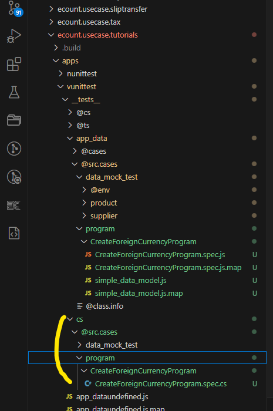
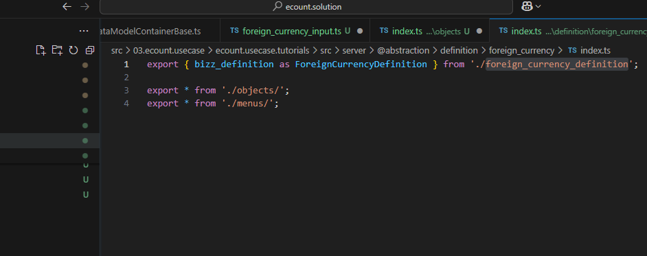

# Daily Retrospective

**작성자**: [박주현]  
**작성일시**: [2025-01-10]

# 1. 오늘 배운 내용

## 1️⃣ VSCODE 디버깅

소스를 흐름파악과 오류 검출을 위해 디버깅을 해야합니다. 인텔리제이 IDE 에서도 했지만, 익숙하지 않은 VSCODE IDE 디버깅 실력을 높였습니다. 4가지 동작이 있는데, `1. continue`, `2. step over`, `3. step into`, `4. step out` 있습니다.

1. continue
   디버깅을 큰 범위로 넘어갑니다. F5가 단축키 입니다.
2. step over
   한줄 한줄씩 넘어갑니다. F10이 단축키입니다.
3. step into
   호출 함수 내부로 들어갈 수 있습니다. F11이 단축키 입니다.
4. step out
   들어갔던 호출 함수에서 밖으로 나올 수 있습니다.

# 2. 동기에게 도움 받은 내용

### "한 아이를 키우기 위해선 온 마을이 필요하다"

저번 실습부터 뼈저리게 느꼈지만, 외화코드 개발을 5.0으로 하니 더 크게 느껴졌습니다. 전우애를 가지면 모든 사람들이 서로서로 도와주었습니다. 저도 많은 분들께 도움을 주고 도움을 받은 거 같습니다. 모든 동기들에게 도움을 받았습니다. 특히나 성범 책임님의 존재가 가장 컸습니다. 전향자 선배님들에 책임님까지 계신 복받은 기수라고 생각하고 있습니다. 생기는 이슈나 에러를 넓은 경험을 통하여 고쳐주시고, 막힌 동기들에게 먼저 다가가 같이 해결해주셨습니다.

---

# 3. 개발 기술적으로 성장한 점

## 3-2. 오늘 직면했던 문제 (개발 환경, 구현)와 해결 방법

### 원인

테스트 코드를 작성하고, 실행을 시키는데 런타임이 되지 않고, 아예 작동하지 않았습니다.

### 작업

모든 파일을 검토하고, index.ts 설정과 빌드를 여러번 반복했습니다. 다른 동기들과 비교하면 문제점을 찾았습니다. 하지만 진전이 없었고, 해결하지 못하여 성준 팀장님께서 관련 부서의 팀장님께 여쭤봐 EFS 팀 책임님께서 내려와 해결해주셨습니다.

### 해결방안

책임님께서 C# 코드 관련 디렉토리를 지우고 다시 빌드하셔서 환경을 바꾸셨습니다. C#에서 파일을 읽어 테스트 런타임을 구동하는데, C#에서 읽지 못하였습니다. 지우고 빌드를 하니 파일이 새롭게 생기고 다시 테스트를 실행하여 성공했습니다.



제가 EFS 팀이라면 이런 문제를 잘 해결할텐데,,, 참으로 원인이 궁금했지만, 지금 5.0 개발이 급급하니 관심을 옮겼습니다.

### 원인

디버깅 도중에 계속 data_model 이 undefined 로 나타나 테스트가 정상 진행되지 않았습니다.

### 작업

되신 분들의 파일과 비교하고 원인을 찾았습니다.

### 해결방안

폴더의 경로도 index.ts 에 넣어서 설정해줘야 했습니다.


소스 파일만을 index.ts 에 설정해줘야하는 줄 알았지만, 경로 또한 설정(3번,4번 줄)해두어야 인식을 했습니다. 하지만 몇몇 폴더는 분명 index.ts 설정을 하지 않은 걸 봐서 팀장님께 관련하여 여쭤봤습니다.

```
Q
팀장님 안녕하십니까? 질문이 하나 있습니다. 어떨땐 디렉토리를 index에 넣어줘야하고, 어떨땐 디렉토리를 안 넣어줘도 된 거 같은데, 이 기준점이 궁금합니다!

A
모든 폴더마다 index 파일을 만들어야 된다.

다만최초  개발시,
아래와 같이 처리한 내역들이 있었는데 그게 이어져오는것 같아요.

export * from '@shared_usecase_tutorials/@abstraction';
export * from './program';
export * as foreign_currency from './definition/foreign_currency';
```

설정을 안해도 되는 디렉토리는 아마 기본 설정으로 명시된 디렉토리 같습니다.

## 3-3. 위 미처 해결 못한 과제. 앞으로 공부해볼 내용

5.0의 상위 인터페이스에 대해 공부해 봐야할 것 같습니다. 최상위 인터페이스에서 점점 확장을 한 DTO 와 Result 를 사용합니다. 하지만 이런 작업이 여러번 있습니다. 분명 이렇게 추상화를 세부적인 단계를 나뉘 이유가 있다고 생각은 드는데, 어떤 차이가 있는지 명백히 알지 못하였습니다. 많은 단계의 추상화를 소스 파일을 많이 만들게 하기 때문에 과한 추상화는 비효울적일 수 있습니다. 이렇게 설계한 이유를 찾고 싶었습니다.

---

# 4. 소프트 스킬면에서 성장한 점

제가 자주 겪던 이슈를 이젠 다른 사람에게 알려줄 수 있을 정도가 됐습니다. 가끔 빌드 익스텐션이 사라지는 이슈가 있었는데, 원인을 파악하고 고치는 법도 건호님께 배워서 이젠 타인을 알려줄 정도가 됐습니다.

---
