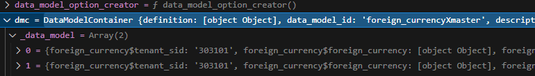
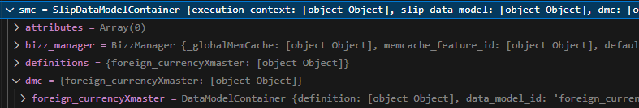

# Daily Retrospective

**작성자**: [이지은]  
**작성일시**: [2025-01-10]

## 1. 오늘 배운 내용 (필수)

### CreateForeignCurrencyProgram 실습

#### CreateForeignCurrencyProgram

```ts
@program_impl(ICreateForeignCurrencyProgram)
export class CreateForeignCurrencyProgram extends BaseProgram<ExecuteSetupMainRequestDto, ExecuteSetupMainResultDto> implements ICreateForeignCurrencyProgram {
	constructor(execution_context: IExecutionContext) {
		super(execution_context);
	}

	private result: ExecuteSetupMainResultDto;

	protected onExecute(request: ExecuteSetupMainRequestDto): ExecuteSetupMainResultDto {
		const program = ProgramBuilder.create<ExecuteSetupMainRequestDto, ExecuteSetupMainResultDto>(IExecuteSetupMainProgram, this.execution_context);

		request.derive_info.smc = new SlipDataModelContainer(this.execution_context, request.slip_data_model);

		this.result = program.execute(request);
		return this.result;
	}
}
```

-   SMC / DMC 생성을 위해 추가한 코드이다.
-   CreateInventoryProgram의 onExecute()를 봤을 때 this.\_runCreateInventoryProcess() > this.\_executeMainSetupProgram(request) 순으로 함수를 실행하고 있다. 그 코드를 참고하여 onExecute에 추가했다.

#### ExecuteSetupMainProgram

```ts
this.smc = _.vSafe(request.derive_info.smc, new SlipDataModelContainer(this.execution_context, request.slip_data_model));
```

-   이전 생성 객체를 this.smc로 할당한다.

```ts
for (const dmc of this.smc.createDataModelContainer((def) => {
    ...
)}
```

-   smc를 통해 dmc를 생성한다. def로 전달한 콜백 함수는 추가 정보를 전달하기 위한 정보를 추가한다.

#### SlipDataModelContainterBase

```ts
*createDataModelContainer(
        data_model_option_creator?: <TDataModel = any>(
            data_model_definition?: IDataModelDefinition,
            data_model?: TDataModel
        ) => IDataModelOptions | undefined,
        sub_array_db_info_list?: SelectAffiliationListResultDto[]
    ): IterableIterator<IDataModelContainer> {
        let sub_arrays: SUB_ARRAY_INFO[] = [];
        for (const [data_model_id, data_model] of Object.entries(this.slip_data_model.data_model || {})) {
            const dmc = this._createDataModelContainer(data_model_id, data_model, data_model_option_creator);

            // 부속 prop_id 있으면 부속 정보 담아둔다 (추후 삭제 필요: 모든 Definition에서 sub_array_info 삭제시)
            //  (부속관련된 로직은 신경안쓰셔도 됩니다.)
            sub_arrays = sub_arrays.concat(this.findSubArrayInfo(dmc));


            this.dmc[dmc.data_model_id] = dmc;
            yield dmc;
        }


        // 부속 처리 (추후 삭제 필요: 모든 Definition에서 sub_array_info 삭제시)
        //  (부속관련된 로직은 신경안쓰셔도 됩니다.)
        if (sub_arrays.length) {
            for (const sub_array of sub_arrays) {
                for (const data of sub_array.attr.data) {
                    const dmc = this._createDataModelContainer(
                        data.data_model_id, // 부속 업무의 data_model_id
                        this.createSubArrayDataModel(sub_array.owner_data_model_id, sub_array.owner_prop_id, data),
                        data_model_option_creator
                    );
                    this.sub_arrary_dmc[data.data_model_id] = dmc;
                    yield dmc;
                }
            }
        }

```

-   smc에서 해당 함수를 호출했을 때 dmc를 만들어준다.
-   dmc를 실제 사용할 때 yield return으로 인해 객체가 생성된다.

#### 디버깅 결과

CreateForeignCurrencyProgram.spec.ts를 디버깅한 결과를 보여준다.



-   dmc 생성됨



-   smc에 dmc가 담겨있음

### CreateForeignCurrencyMasterProgram 실습

#### CreateForeignCurrencyMasterProgram

```ts
import { IDataModelContainer } from "ecount.fundamental.datamodel/definition";
import { pg } from "ecount.infra.bridge/table_model";
import { DacCommandBuilder } from "ecount.infra.common/dac";
import { program_impl } from "ecount.infra.common/decorator";
import { BaseProgram, ProgramBuilder } from "ecount.infra.common/program";
import {
	foreign_currency_input,
	ICreateForeignCurrencyMasterProgram,
	ICreateForeignCurrencyProgram,
	IResolveForeignCurrencyDataModelProgramDto,
	IResolveForeignCurrencyDataModelProgramResult,
} from "ecount.usecase.tutorials/@abstraction";
import { InsertForeignCurrencyDac } from "ecount.usecase.tutorials/dac";

@program_impl(ICreateForeignCurrencyMasterProgram)
export class CreateForeignCurrencyMasterProgram
	extends BaseProgram<IResolveForeignCurrencyDataModelProgramDto, IResolveForeignCurrencyDataModelProgramResult>
	implements ICreateForeignCurrencyMasterProgram
{
	@_transaction(TransactionOption.Required)
	protected onExecute(dto: IResolveForeignCurrencyDataModelProgramDto): IResolveForeignCurrencyDataModelProgramResult {
		const refer_type_based_dmc = this._getReferTypeBasedDmc(dto);
		const req = this._getTableModel(refer_type_based_dmc);

		if (_.vIsEmpty(req)) {
			return true;
		}

		if (_.vIsEmpty(req[0].progress_status_sid)) {
			const logEntryBuilder = new $LogEntryBuilder("Failed to update progress_status");
			logEntryBuilder.logLevel = LogLevel.Error;
			const hostname = this.execution_context.http?.request.url.hostname;

			logEntryBuilder.addProperties({
				MachineName: $App.machineName,
				ErrNm: "InvalidData",
				ComCd: this.execution_context.session.tenant_sid,
				UserId: this.execution_context.session.user_sid,
				UserIp: hostname != null ? _.vToIPAddress(hostname) : "",
				Zone: this.execution_context.session.zone,
				RequestUrl: _.vSafe(this.execution_context.http?.request.url.toString()),
				Message: "Failed to update progress_status: progress_status_sid is empty.\n" + JSON.stringify(dto),
			});

			$App.log.ptp(logEntryBuilder);
		}

		const dac = DacCommandBuilder.create(InsertForeignCurrencyDac, this.execution_context, DbConnectionId.PG.BASE);
		dac.execute(_.vFirst(req) as pg.foreign_currency_20250110_lje_ecback);

		// 첨부 데이터 저장 - hid를 필요로 하여 v3 전표 저장시 만드는 hid를 활용해야 함
		// const slip_link_feature = this.execution_context.getFeature<IV3SlipLinkFeature>(IV3SlipLinkFeature);
		// slip_link_feature.saveSlipLink({
		// 	slip_link: dto.dmc.getValueByReferType('slip_link'),
		// 	hid: dto.dmc.getValueByReferType('hid'),
		// 	data_dt: dto.dmc.getValueByReferType('data_dt'),
		// 	data_no: dto.dmc.getValueByReferType('data_no'),
		// } as SaveV3SlipLinkRequestDto);

		const add_item_program = ProgramBuilder.create<IResolveForeignCurrencyDataModelProgramDto, void>(ICreateForeignCurrencyProgram, this.execution_context);

		add_item_program.execute(dto);

		return true;
	}

	private _getReferTypeBasedDmc(dto: IResolveForeignCurrencyDataModelProgramDto): IDataModelContainer {
		if (!_.vIsEmpty(dto.refer_type_based_dmc)) {
			return dto.refer_type_based_dmc as IDataModelContainer;
		}

		const refer_type_based_dmc = dto.dmc.getReferTypeBasedDataModelContainer() as IDataModelContainer;
		dto.refer_type_based_dmc = refer_type_based_dmc;

		return refer_type_based_dmc;
	}

	private _getTableModel(dmc: IDataModelContainer): pg.foreign_currency_20250110_lje_ecback[] {
		const data_model = dmc.getDataModel() ?? [];

		return _.vMappingTo<foreign_currency_input, pg.foreign_currency_20250110_lje_ecback>(data_model, pg.foreign_currency_20250110_lje_ecback, (org, tg) => {
			tg.tenant_sid = org.tenant_sid;
			tg.foreign_currency = org.foreign_currency;
			tg.foreign_currency_cd = org.foreign_currency_cd;
			tg.foreign_currency_nm = org.foreign_currency_nm;
			tg.exchange_rate = org.exchange_rate;
			tg.category = org.category;
			tg.write_dtm = new Date();
			tg.status_type = org.status_type;
		}) as pg.foreign_currency_20250110_lje_ecback[];
	}
}
```

-   CreateInventoryMasterProgram 코드를 참고하여 작성하였다. (작동 여부 확인은 못해봄)

## 2. 동기에게 도움 받은 내용 (필수)

**승준님**: 실습할 때 중간중간 헷갈리는 부분을 물어봤는데 답변해주셨습니다.
**주원님**: 지금 하고 있는게 맞는건지 물어봤을 때 답변해주셨습니다.

---

## 3. 개발 기술적으로 성장한 점 (선택)

### 1. 교육 과정 상 배운 내용이 아닌 개인적 호기심을 해결하기 위해 추가 공부한 내용

```ts
import { ISlipDataModel } from "ecount.usecase.base/@abstraction";

export const slip_data_model = {
	action_mode: "NEW",
	bizz_sid: "TB_000000E040114",
	data_model: {
		foreign_currencyXmaster: [
			{
				foreign_currency$tenant_sid: "303101",
				foreign_currency$foreign_currency: { sid: "test_cd5", code: "test_cd5", name: "test_nm5" },
				foreign_currency$foreign_currency_cd: "test_cd5",
				foreign_currency$foreign_currency_nm: "test_nm5",
				foreign_currency$exchange_rate: 1000,
				foreign_currency$category: "아시아",
				foreign_currency$status_type: "",
			},

			{
				foreign_currency$tenant_sid: "303101",
				foreign_currency$foreign_currency: { sid: "test_cd6", code: "test_cd6", name: "test_nm6" },
				foreign_currency$foreign_currency_cd: "test_cd6",
				foreign_currency$foreign_currency_nm: "test_nm6",
				foreign_currency$exchange_rate: 2000,
				foreign_currency$category: "유럽",
				foreign_currency$status_type: "",
			},
		],
	},
	menu_sid: "TM_000000E040114",
	menu_type: "input",
} as unknown as ISlipDataModel;
```

-   slip_data_model에는 foreign_currencyXmaster 안에 하나의 데이터만 있어서 for문을 도는 것을 볼 수 없었다. 그래서 slip_data_model을 수정하여 두 개를 넣어봤다. 그랬더니 for문을 도는 것을 디버깅 결과 확인할 수 있었다.
-   그런데 foreign_currencyXmaster에 그냥 추가하면 에러가 발생해서 `as unknown`으로 형 변환했다.

### 2. 오늘 직면했던 문제 (개발 환경, 구현)와 해결 방법

-   index.ts를 폴더마다 추가해야 했는데 그게 빠져서 에러 메시지도 없이 에러를 맞이했다. depth가 2인 것까지는 허용되긴 하지만 그 이후에 언제든 문제가 생길 수 있는 것 같다. 최대한 index.ts를 꼼꼼히 써야겠다.

### 3. 위 두 주제 중 미처 해결 못한 과제. 앞으로 공부해볼 내용.

-   일단 CreateForeignCurrencyMasterProgram을 작성하긴 했는데 디버깅할 때 MasterProgram에 들어가지 못하고 있다. 성범 책임님이나 성준 팀장님 채팅을 보니까 TempExecuteSetupMainProgramd으로 작업하면 해결된단거 같아서 한 번 시도 해봐야겠다.

---

## 4. 소프트 스킬면에서 성장한 점 (선택)

-   강민님의 회고록이 매우 상당하다는 소문을 듣고 읽어보며 많은 반성을 하게 되었다. 단순히 무엇을 했는지를 기록하는 데 그치지 않고, 문제에 대해 깊이 고민하고 그 과정에서 도달한 결론을 명확히 적어야겠다는 생각이 들었다.
