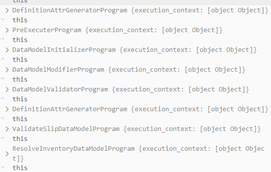
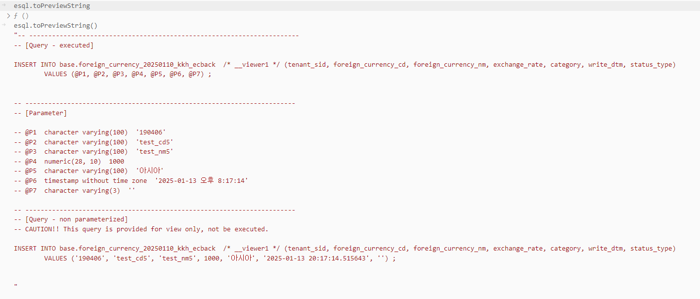
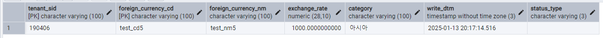
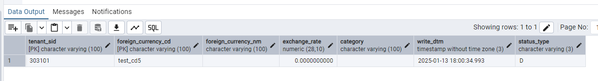

# Daily Retrospective

**작성자**: 고건호
**작성일시**: 2025-01-13

## 1. 오늘 배운 내용 (필수)

- 외화 코드(Foreign Currency) CUD
  - CreateForeignCurrency - `C`
  - ModifyForeignCurrency - `U`
  - ModifyStatusForeignCurrency - `U`
  - DeleteForeignCurrency - `D`

### CreateForeignCurrencyProgram.spec.ts

```typescript
// CreateForeignCurrencyProgram.spec.ts

import { test, testBed } from "ecmodule.testutil/ecsolution";
import { ProgramBuilder } from "ecount.infra.common/program";
import { ApiRequestDto } from "ecount.usecase.base/@abstraction";
import { ExecuteSetupMainRequestDto } from "ecount.usecase.common/@abstraction";
import { SlipDataModelContainer } from "ecount.usecase.common/@implement";
import { ICreateForeignCurrencyProgram } from "ecount.usecase.tutorials/@abstraction";
import { slip_data_model } from "./slip_data_model";
import { EN_ACTION_MODE, EN_MENU_TYPE } from "ecount.fundamental.define/enum";

/* 세션 정보 세팅 */
const zone = "BA";
const tenant_sid = "190406";
const user_id = "test";

const sessionCreator = new $SessionImpersonator();
sessionCreator
  .identity(zone, tenant_sid, user_id)
  .configure((id) => id.setLanguage("ko-KR"));
const sessionIdentity = sessionCreator.build();

test("CreateForeignCurrencyProgram case 1: create foreign_currency", () => {
  const execution_context = testBed.createExecutionContext({
    sessionIdentity,
  });
  execution_context.action.action_mode = EN_ACTION_MODE.Create;
  execution_context.action.menu_type = EN_MENU_TYPE.Input;

  const slip_dto = {
    action_mode: execution_context.action.action_mode,
    menu_type: execution_context.action.menu_type,
    slip_data_model: slip_data_model,
    derive_info: {
      smc: {} as SlipDataModelContainer,
      derive_target: [],
    },
    additional_info: {},
    notification: {},
  } as ExecuteSetupMainRequestDto;

  const program = ProgramBuilder.create<
    ExecuteSetupMainRequestDto,
    ApiRequestDto
  >(ICreateForeignCurrencyProgram, execution_context);
  const result = program.execute(slip_dto);

  Assert.equal(JSON.stringify(result), JSON.stringify({}));
});
```

지난 주 금요일부터 외화 코드(Foreign Currency)의 CRUD 샘플 코드를 작성하며, `slip_dto`로 들어온 요청부터 DB에 저장되는 과정을 흐름을 통해 익혀볼 수 있었습니다.
테스트로 작성한 `CreateForeignCurrencyProgram.spec.ts`를 디버깅하며 알게된 흐름을 정리해보겠습니다.

위 코드에서 `program` 변수에 `ProgramBuilder.create()` 함수로 값을 할당 받는 부분부터 살펴보겠습니다.

```typescript
// CreateForeignCurrencyProgram.spec.ts
...

const program = ProgramBuilder.create<
  ExecuteSetupMainRequestDto,
  ApiRequestDto
>(ICreateForeignCurrencyProgram, execution_context);

...
```

해당 함수에서는 `program` 변수에 로직 상 필요한 프로그램인 `CreateForeignCurrencyProgram`을 할당해주기 위해 `ProgramBuilder`의 `create()` 함수의 파라미터로 `ICreateForeignCurrencyProgram`을 할당해줬습니다.

```typescript
// BaseProgram.ts
...

create<TProgramDto, TResult>(
		id: ProgramIdentifier,
		execution_context: TContext,
		configure?: IProgramConfigure
	): IBaseProgram<TProgramDto, TResult, TContext> {
		const instanceTarget = this.getCtor(id, execution_context);
		const program = new instanceTarget(execution_context);

		// program 내부에 정의된 configure 먼저 실행후 builder configure 적용, 실행 위치는 execute
		if (configure) {
			program[CommandConfigureFunctionName] = configure;
		}

		return program as unknown as IBaseProgram<TProgramDto, TResult, TContext>;
	}

...
```

위 코드에서 볼 수 있듯이, 받은 파라미터를 통해 `create()` 함수에서는 `CreateForeignCurrencyProgram`의 생성자를 가져오고, 가져온 생성자로 `program`에 `CreateForeignCurrencyProgram`을 할당해줍니다.

이어지는 return문에서 해당 `program`을 반환합니다.


`CreateForeignCurrencyProgram.spec.ts`에 설정한 중단점으로 돌아왔을 때 `program`에 할당된 변수를 확인하면 위 사진과 같습니다.

```typescript
// CreateForeignCurrencyProgram.spec.ts
...

const result = program.execute(slip_dto);

...
```

뒤이은 `execute()` 함수에 설정한 중단점을 타고 해당 함수 내부로 들어가보면, 받아온 `CreateForeignCurrencyProgram`이 상속 받고 있는 `BaseProgram`의 `execute()` 함수로 흐름이 이어지는 것을 확인할 수 있습니다.

```typescript
// BaseProgram.ts
...

execute(dto: TProgramDto): TResult {
		using($App.trace(`${this.getTraceId(dto)}.execute`));
		return decorateTransaction<TResult>(this, () => {
			if ((this.execution_context as any).enterScope) {
				return using((this.execution_context as any).enterScope(), (context) => this.executeCore(dto));
			}
			return this.executeCore(dto);
		});
	}

...
```

위 코드에서는 `enterScope()` 함수를 통해 `this.#_scopeDepth`를 증가시켜주고, 화살표 함수로 호출된 `executeCore()` 함수로 계속 흐름을 이어나갑니다.

이후, `CreateForeignCurrencyProgram`의 `onExecute()` 함수가 호출되고, 해당 클래스 내부에서 계속 함수가 호출되어 최종적으로 `_executeMainSetupProgram()` 함수가 호출됩니다.

```typescript
// CreateForeignCurrencyProgram.ts
...

private _executeMainSetupProgram(request: ExecuteSetupMainRequestDto): ExecuteSetupMainResultDto {
		const program = ProgramBuilder.create<ExecuteSetupMainRequestDto, ExecuteSetupMainResultDto>(
			ITempExecuteSetupMainProgram,
			this.execution_context
		);

		request.derive_info.smc = new SlipDataModelContainer(this.execution_context, request.slip_data_model);

		return program.execute(request);
	}

...
```

위 코드에서 `program` 변수에는 `TempExecuteSetupMainProgram`의 인스턴스가 담기게 되고, 이후 `program.execute(request)` 부분에서 다시 `execute()` 함수가 호출됩니다.

하지만 위에서 살펴봤던 흐름과 달리, `BizzProgram` 내부 `executeCore()` 함수가 호출되어 기존의 흐름과는 살짝 다릅니다.

(이 부분은 추가 학습 및 디버깅이 필요해 보이기에 추가적인 `step into`는 진행하지 않았습니다.)

이후 다시

- `TempExecuteSetupMainProgram`
- `DefinitionAttrGeneratorProgram`
- `PreExecuterProgram`
- `DataModelInitializerProgram`
- `DataModelModifierProgram`
- `DataModelValidatorProgram`
- `ValidateSlipDataModelProgram`
- `ResolveInventoryDataModelProgram`

등의 흐름을 거칩니다.

(해당 흐름은 추후 추가 학습 및 디버깅을 통한 흐름 숙지 예정입니다.)



이후 `CreateForeignCurrencyMasterProgram`이 호출되고, 일반적인 프로그램들의 흐름을 통해 내부의 함수들이 호출됩니다.

```typescript
// CreateForeignCurrencyMasterProgram.ts
...

		const dac = DacCommandBuilder.create(InsertForeignCurrencyDac, this.execution_context, DbConnectionId.PG.BASE);
		dac.execute(_.vFirst(req) as pg.foreign_currency_20250110_kkh_ecback);

...

```

집중해서 살펴봐야 할 부분은 위의 코드인데, 해당 코드에서는 DB에 저장하기 위해 사전에 작성한 `InsertForeignCurrencyDac`을 찾아 `dac` 변수에 할당해줍니다.

```typescript
// InsertForeignCurrencyDac.ts

import { IExecutionContext } from "ecount.infra.bridge/base";
import { pg } from "ecount.infra.bridge/table_model";
import { ESqlDacCommand } from "ecount.infra.common/dac";

/**
 * InsertForeignCurrencyDac
 * foreign_currency_20250110_kkh_ecback 저장
 */
export class InsertForeignCurrencyDac extends ESqlDacCommand<
  pg.foreign_currency_20250110_kkh_ecback,
  void
> {
  constructor(execution_context: IExecutionContext) {
    super(execution_context, DbConnectionId.PG.BASE);
  }
  protected generateESql(
    data: pg.foreign_currency_20250110_kkh_ecback
  ): $Statement {
    const esql = $ESql
      .insert<pg.foreign_currency_20250110_kkh_ecback>(
        pg.foreign_currency_20250110_kkh_ecback,
        data
      )
      .value((t) => t.tenant_sid, this.execution_context.session.tenant_sid);
    return esql;
  }
  protected onExecute(db: $Database, esql: $Statement): void {
    db.expressionSql(InsertForeignCurrencyDac, esql).execute();
  }
}
```

생성한 `esql`을 반환하는 부분에서 디버그 콘솔을 통해 `esql.toPreviewString()`을 해보면 아래와 같은 결과를 통해 `esql`이 올바르게 잘 생성됐음을 확인할 수 있습니다.



(이후의 흐름은 추가 학습이 필요합니다.)

디버깅을 통해 확인한 이 흐름을 통해 DB에 정상적으로 데이터가 저장되는 것도 확인할 수 있었습니다.



## 2. 동기에게 도움 받은 내용 (필수)

주현 님과 머리를 맞대고 외화 코드 CUD를 논의하며 시간 내에 모든 테스트를 구현할 수 있었습니다.
승준 님께서 제가 코드를 작성하며 궁금했던 부분에 명쾌한 해답을 제시해주셔서 깔끔하게 해결할 수 있었습니다.

---

## 3. 개발 기술적으로 성장한 점 (선택)

아래의 3가지 주제 중 하나를 선택하여 작성합니다.

### 1. 교육 과정 상 배운 내용이 아닌 개인적 호기심을 해결하기 위해 추가 공부한 내용

### 2. 오늘 직면했던 문제 (개발 환경, 구현)와 해결 방법

오늘 `ModifyForeignCurrencyProgram.spec.ts`를 구현하면서 맞닥뜨린 내용입니다.

최초에 `UpdateForeignCurrencyDac`은 아래와 같이 작성했습니다.

```typescript
// UpdateForeignCurrencyDac.ts

import { IExecutionContext } from "ecount.infra.bridge/base";
import { pg } from "ecount.infra.bridge/table_model";
import { ESqlDacCommand } from "ecount.infra.common/dac";

/**
 * UpdateForeignCurrencyDac
 * foreign_currency_20250110_kkh_ecback 수정
 */
export class UpdateForeignCurrencyDac extends ESqlDacCommand<
  pg.foreign_currency_20250110_kkh_ecback,
  void
> {
  constructor(execution_context: IExecutionContext) {
    super(execution_context, DbConnectionId.PG.BASE);
  }
  protected generateESql(
    data: pg.foreign_currency_20250110_kkh_ecback
  ): $Statement {
    const esql = $ESql
      .update<pg.foreign_currency_20250110_kkh_ecback>(
        pg.foreign_currency_20250110_kkh_ecback,
        data,
        (opt) => {
          opt.alterCheckColumnRule(ENUM_CONDITION_LEVEL.HIGH, (t) => [
            t.tenant_sid,
          ]);
        }
      )
      .where((ef, t) =>
        ef._equal(t.tenant_sid, this.execution_context.session.tenant_sid)
      )
      .where((ef, t) =>
        ef._equal(t.foreign_currency_cd, data.foreign_currency_cd)
      );

    return esql;
  }

  protected onExecute(db: $Database, esql: $Statement): void {
    db.expressionSql(UpdateForeignCurrencyDac, esql).execute();
  }
}
```

위와 같이 작성한 `UpdateForeignCurrencyDac`으로 `ModifyForeignCurrencyProgram.spec.ts`를 구현하니, 지정하지 않은 컬럼의 데이터들은 `null` 값으로 바뀌는 상황이 계속 발생했습니다.



그러던 중, 승준 님께서 참고하신 코드를 보고 아래와 같이 `UpdateForeignCurrencyDac`의 코드를 수정하니, 지정하지 않은 다른 컬럼들의 값은 그대로 유지가 되었습니다.

```typescript
// UpdateForeignCurrencyDac.ts

import { IExecutionContext } from "ecount.infra.bridge/base";
import { pg } from "ecount.infra.bridge/table_model";
import { ESqlDacCommand } from "ecount.infra.common/dac";

/**
 * UpdateForeignCurrencyDac
 * foreign_currency_20250110_kkh_ecback 수정
 */
export class UpdateForeignCurrencyDac extends ESqlDacCommand<
  pg.foreign_currency_20250110_kkh_ecback,
  void
> {
  constructor(execution_context: IExecutionContext) {
    super(execution_context, DbConnectionId.PG.BASE);
  }
  protected generateESql(
    data: pg.foreign_currency_20250110_kkh_ecback
  ): $Statement {
    const viewerP = $ESql.viewer<pg.foreign_currency_20250110_kkh_ecback>(
      pg.foreign_currency_20250110_kkh_ecback,
      "P"
    );

    const esql = $ESql
      .update(viewerP, (opt) => {
        opt.alterCheckColumnRule(ENUM_CONDITION_LEVEL.HIGH, (t) => [
          t.tenant_sid,
        ]);
      })
      .set(viewerP["foreign_currency_nm"], data.foreign_currency_nm)
      .where((ef, t) =>
        ef._equal(t.tenant_sid, this.execution_context.session.tenant_sid)
      )
      .where((ef, t) =>
        ef._equal(t.foreign_currency_cd, data.foreign_currency_cd)
      );

    return esql;
  }

  protected onExecute(db: $Database, esql: $Statement): void {
    db.expressionSql(UpdateForeignCurrencyDac, esql).execute();
  }
}
```

`viewerP`에 대해서는 추가 학습이 필요해보이지만, 뷰 렌더링 관련 함수라는 짐작만 하고 있습니다.

### 3. 위 두 주제 중 미처 해결 못한 과제. 앞으로 공부해볼 내용.
