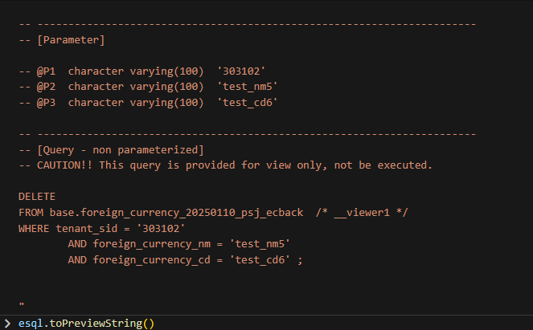

# Daily Retrospective  
**작성자**: [박성재]  
**작성일시**: [2025-01-13]  

## 1. 오늘 배운 내용 (필수)  
- Generator의 개념 
- 외화코드 Modifier, ModifierStatus, Delete 로직 구현 실습

## Generator의 개념
```typescript

class ReferTypeAttrGeneratorProgram

    // ...
onExecute(setupOrDto: ISetup | IReferTypeAttrGeneratorProgramDto): ISetup {
		const { setup, options: dto_options } = this._getDto(setupOrDto);

		const default_options = this._getDefaultOptions(dto_options);

		for (const [data_model_id, definition] of _.vEntries(setup.data_model_definitions)) {
			const selector = new DefaultSelector(definition.attributes);
			const { use: definition_use, options: definition_options } = this._getDefinitionOptions(
				setup,
				data_model_id,
				default_options,
				selector
			);
			if (!definition_use) continue;

			for (const prop of definition.props) {
				const { use: prop_use, options: prop_options } = this._getPropOptions(
					data_model_id,
					prop,
					definition_options
				);
				if (!prop_use) continue;

				this._generate(prop, definition, setup, prop_options, selector);
			}
		}

		return setup;
	}

    protected _generate(
        // ...
    ) {
        // ...
        if (generator) {
				definition.attributes ??= [];
				prop_attributes ??= selector.getAttrsByPropId(prop.prop_id);
				const attr = generator(this.execution_context, setup, {
					prop,
					attributes: prop_attributes,
					bizz_sid: options.bizz_sid,
					menu_type: options.menu_type,
					menu_sid: options.menu_sid,
					data_model_id: options.data_model_id,
				}) as IAttribute;

				if (attr && attr.data !== null) {
					attr.prop_id = prop.prop_id;
					definition.attributes.push(attr);
				}
		    }
    }
```
- `Generator`의 종류 중 하나인 `ReferTypeAttrGeneratorProgram`입니다.
- `data model`의 `definition`의 `prop`을 돌며 `generate` 해주고 있습니다.
-  `_generate` 함수 로직을 보면 미리 설정된 `attribute`를 생성해서 `definition`의 `attributes`에 추가를 해주고 있습니다.

여기서 궁금한 것은 이미 존재하는 `attribute`에 대해서는 중복 처리를 해주고있지 않는건가? 라는 의문이 생겼습니다. 해당 의문은 질문 또는 테스트를 통해 해소할 예정입니다.

### 정리
`data_model`의 `definition`을 정의할 때, `attribute`를 일일이 추가해줘야 하는데, 대부분의 업무에서 공통된 속성이 존재할 경우 이를 그때마다 일일이 추가해주는 것이 불편할 것입니다.

이 때 `Generator`를 사용하여, 미리 공통되게 사용가능한 속성들을 미리 세팅해주고 필요에 따라 `attribute`를 추가해줌으로써 개발자의 생산성을 높일 수 있는 효과가 생기게됩니다.

사용 방법의 경우는 내일 실습 구현을 해보며 이해한 바대로 이어서 정리해보도록 하겠습니다.

## 외화코드 Modifier, ModifierStatus, Delete 로직 구현 실습
`Create`의 경우와 대부분 로직의 흐름이 비슷하였는데, 다른 부분에 주목하여 정리해보겠습니다.

### Modifier 구현

```typescript
import { ISlipDataModel } from 'ecount.usecase.base/@abstraction';

export const slip_data_model = {
	action_mode: 'UPDATE',
	bizz_sid: 'TB_000000E040114',
	data_model: {
		foreign_currencyXmaster: [
			{
				// foreign_currency$tenant_sid: '303101',
				foreign_currency$tenant_sid: '303102',
				foreign_currency$foreign_currency: { sid: 'test_cd6', code: 'test_cd6', name: 'test_nm5' },
				foreign_currency$foreign_currency_cd: 'test_cd6',
				foreign_currency$foreign_currency_nm: 'test_nm5',
				foreign_currency$exchange_rate: 1500,
				foreign_currency$category: '유럽',
				foreign_currency$status_type: '',
			},
		],
	},
	menu_sid: 'TM_000000E040114',
	menu_type: 'input',
} as ISlipDataModel;
```
- 수정 기능의 Test 데이터를 별도로 추가하였습니다.
- `pk`값을 제외하고, 저장되고싶은 값으로 채워주었습니다.   

</br>

```typescript
// ...definition/foreign_currency/objects/master.ts

// ...
attributes: [
		{
			attr_id: definition_attrs.info.data_model_resolver,
			attr_type: EN_ATTR_TYPE.Information,
			data: {
				[EN_ACTION_MODE.Create]: 'ICreateForeignCurrencyMasterProgram',
				[EN_ACTION_MODE.Modify]: 'IModifyForeignCurrencyMasterProgram',
				// [EN_ACTION_MODE.Delete]: 'IModifyStatusForeignCurrencyMasterProgram',
				// [EN_ACTION_MODE.UnDelete]: 'IModifyStatusForeignCurrencyMasterProgram',
				// [EN_ACTION_MODE.Remove]: 'IRemoveForeignCurrencyMasterProgram',
			} as definition_attrs.info.data_model_resolver,
			prop_id: '',
		},
	],

```
- `EN_ACTION_MODE.Modify`의 주석처리를 해제했습니다. 이로써, `data model Resolver`에게 DB 액세스를 위한 `Master` 프로그램으로 `ModifyForeignCurrencyMasterProgram`을 사용한다고 알릴 수 있습니다.

### ModifierStatus 구현
```typescript
export const delete_slip_data_model = {
	action_mode: EN_ACTION_MODE.Delete,
	bizz_sid: 'TB_000000E040114',
	data_model: {
		foreign_currencyXmaster: [
			{
				foreign_currency$tenant_sid: '190406',
				foreign_currency$foreign_currency: { sid: 'test_cd5', code: 'test_cd5', name: 'test_nm5' },
				foreign_currency$foreign_currency_cd: 'test_cd5',
				foreign_currency$status_type: EN_STATUS_TYPE.Delete,
			},
		],
	},
	menu_sid: 'TM_000000E040114',
	menu_type: EN_MENU_TYPE.Input,
} as ISlipDataModel;

export const undelete_slip_data_model = {
	action_mode: EN_ACTION_MODE.UnDelete,
	bizz_sid: 'TB_000000E040114',
	data_model: {
		foreign_currencyXmaster: [
			{
				foreign_currency$tenant_sid: '190406',
				foreign_currency$foreign_currency: { sid: 'test_cd5', code: 'test_cd5', name: 'test_nm5' },
				foreign_currency$foreign_currency_cd: 'test_cd5',
				foreign_currency$status_type: '',
			},
		],
	},
	menu_sid: 'TM_000000E040114',
	menu_type: EN_MENU_TYPE.Input,
} as ISlipDataModel;
```
- `ModifierStatus`의 경우 프로그램은 하나씩만 만들지만, `delete`할 경우와 `undelete`할 경우 두가지를 처리할 수 있어야 했습니다.
- 이를 테스트하기 위해 테스트 데이터도 두 종류 모두 하나의 파일에서 만들어줬습니다.
- `action_mode`가 두 종류가 서로 다른 것을 알 수 있습니다.
- 또한 상태만 수정할 것이므로 다른 필드의 정보는 담지 않았으며, `pk` 값들과 변경할 `stats_type`의 정보만 담도록 하였습니다.

</br>

```typescript
// ...definition/foreign_currency/objects/master.ts

// ...
attributes: [
		{
			attr_id: definition_attrs.info.data_model_resolver,
			attr_type: EN_ATTR_TYPE.Information,
			data: {
				[EN_ACTION_MODE.Create]: 'ICreateForeignCurrencyMasterProgram',
				[EN_ACTION_MODE.Modify]: 'IModifyForeignCurrencyMasterProgram',
				[EN_ACTION_MODE.Delete]: 'IModifyStatusForeignCurrencyMasterProgram',
				[EN_ACTION_MODE.UnDelete]: 'IModifyStatusForeignCurrencyMasterProgram',
				// [EN_ACTION_MODE.Remove]: 'IRemoveForeignCurrencyMasterProgram',
			} as definition_attrs.info.data_model_resolver,
			prop_id: '',
		},
	],
```
- 이번에도 역시 `resolver`가 데이터 액세스를 실행해줄 `master`를 결정할 수 있도록 `object`의 `attribute`를 수정해줬습니다.
- `Delete`와 `UnDelete` 모두 하나의 프로그램에서 작동될 수 있으므로 동일한 프로그램을 가리키고 있습니다.

</br>

```typescript
export class ModifyStatusForeignCurrencyDac extends ESqlDacCommand<pg.foreign_currency_20250110_psj_ecback, void> {
	constructor(execution_context: IExecutionContext) {
		super(execution_context, DbConnectionId.PG.BASE);
	}

	protected generateESql(data: pg.foreign_currency_20250110_psj_ecback): $Statement {
		const viewerP = $ESql.viewer<pg.foreign_currency_20250110_psj_ecback>(
			pg.foreign_currency_20250110_psj_ecback,
			'P'
		);

		const esql = $ESql
			.update(viewerP, (opt) => {})
			.set(viewerP['status_type'], data.status_type)
			.where((ef, t) => ef._equal(t.tenant_sid, this.execution_context.session.tenant_sid))
			.where((ef, t) => ef._equal(t.foreign_currency_cd, data.foreign_currency_cd));

		return esql;
	}
}
```
- DB에 액세스하게되는 `DAC`의 구현 로직입니다.
- `ESQL`의 `viewer`를 사용해서 필요한 항목만 변경하는데 사용하고 있습니다. 구체적인 사용방법에 대한 궁금증이 들었으며, 추후 교육 때 해소할 예정입니다.

### Delete 구현

```typescript
import { ISlipDataModel } from 'ecount.usecase.base/@abstraction';

export const remove_slip_data_model = {
	action_mode: 'REMOVE',
	bizz_sid: 'TB_000000E040114',
	data_model: {
		foreign_currencyXmaster: [
			{
				foreign_currency$tenant_sid: '303102',
				foreign_currency$foreign_currency: { sid: 'test_cd6', code: 'test_cd6', name: 'test_nm5' },
				foreign_currency$foreign_currency_cd: 'test_cd6',
			},
		],
	},
	menu_sid: 'TM_000000E040114',
	menu_type: 'input',
} as ISlipDataModel;
```
- 이번에도 꼭 필요한 `pk` 값들의 정보만 담도록 하였습니다.

```typescript
// ...definition/foreign_currency/objects/master.ts

// ...
attributes: [
		{
			attr_id: definition_attrs.info.data_model_resolver,
			attr_type: EN_ATTR_TYPE.Information,
			data: {
				[EN_ACTION_MODE.Create]: 'ICreateForeignCurrencyMasterProgram',
				[EN_ACTION_MODE.Modify]: 'IModifyForeignCurrencyMasterProgram',
				[EN_ACTION_MODE.Delete]: 'IModifyStatusForeignCurrencyMasterProgram',
				[EN_ACTION_MODE.UnDelete]: 'IModifyStatusForeignCurrencyMasterProgram',
				[EN_ACTION_MODE.Remove]: 'IDeleteForeignCurrencyMasterProgram',
			} as definition_attrs.info.data_model_resolver,
			prop_id: '',
		},
	],
```
- 마지막 `Dete`인 완전삭제 주석까지 `resolver`에게 알리기 위해 해제한 모습입니다.

</br>

## 2. 동기에게 도움 받은 내용 (필수)

#### 김승준 선임
실습 때 진도가 빠르셨던 편이라, 여러가지로 여쭤봤었는데 친절하게 잘 알려주셔서 도움이 많이 되었습니다.

---

## 3. 개발 기술적으로 성장한 점 (선택)
아래의 3가지 주제 중 하나를 선택하여 작성합니다.

### 2. DB에서 삭제가 안되던 문제
오늘 `Delete` 로직 구현 중, 로직은 다 구현해놓고 테스트할 차례였습니다. `Dac` 단계까지 로직이 오류없이 동작됨을 확인하였지만, 최종 DB를 확인해보니 삭제가 제대로 되고 있지 않았습니다.

DB에 날려지는 쿼리문에 문제가 있다는 짐작이 되었지만, `ESQL`에서 실제 쿼리문을 확인하는 방법을 몰라 많이 답답한 상황이었습니다.

```typescript
// DeleteForeignCurrencyDac

protected generateESql(data: pg.foreign_currency_20250110_psj_ecback): $Statement {
		const esql = $ESql
			.remove<pg.foreign_currency_20250110_psj_ecback>(pg.foreign_currency_20250110_psj_ecback, (opt) => {})
			.where((ef, t) => ef._equal(t.tenant_sid, data.tenant_sid))
			.where((ef, t) => ef._equal(t.foreign_currency_nm, data.foreign_currency_nm))
			.where((ef, t) => ef._equal(t.foreign_currency_cd, data.foreign_currency_cd));

		return esql;
	}
```
- 어떤 부분이 문제인지 몰라 `Esql`의 `where` 절도 바꿔보고 이리 저리 시도해봐도 되지를 않았습니다.
- SQL문을 확인할 방법을 찾은 끝에 디버거를 찍어보다가 발견했습니다.

</br>


생성된 `$Statement`에 `toPreviewString`이라는 함수가 존재했습니다. 해당 함수를 디버그 상태에서 호출해보니 위처럼 DB에 날려지는 쿼리문이 확인되었습니다.

확인해보니 `tenant_id`가 문제였습니다. 

```typescript
// RemoveForeignCurrencyProgram.spec

/* 세션 정보 세팅 */
const zone = 'BA';
const tenant_sid = '190406';
const user_id = 'test';

// ...
```
- 테스트 환경에서 이미 회사코드인 `tenant_sid`를 고정해서 정해주고 있었습니다.
- 하지만 저는 테스트로 여러가지 데이터를 생성할 때 `tenant_sid`를 DB에 여러 값으로 저장해둔 상태였습니다.
- 그리고 삭제하고 싶은 데이터의 `tenant_sid`는 세션에 저장된 `tenant_id`와 달랐기 때문에 `where`절이 통과되지 않아 당연히 삭제되지 않고 있던 것이었습니다.

해당 정보를 동일하게 바꿔주니 잘 동작되는 것을 확인할 수 있었습니다.

### 후기
아직 `ESQL`에 대해 배우지 않은 상태로 실습을 해보는 작업이 다소 어려운 점이 있었으나, CRUD 로직을 직접 구현해보면서 `Index` 설정과 빌드 등 개발 환경 측면에서 많이 익숙해질 수 있었습니다.

또한 로직의 흐름을 구현하는 것에도 어떤 요소들이 필요한지 보다 피부로 느낄 수 있는 시간이었습니다.

부가적으로 DB나 세션 상에 존재하지 않는 회사코드 `tenant_id`를 `Request`로 요청하면 `TempMainSetUpProgram` 등의 메인 프로그램이 제대로 동작되지 않는다는 것도 알 수 있었습니다.
