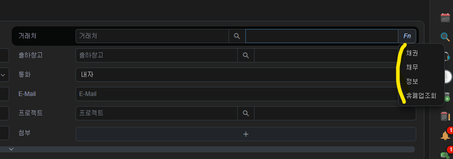
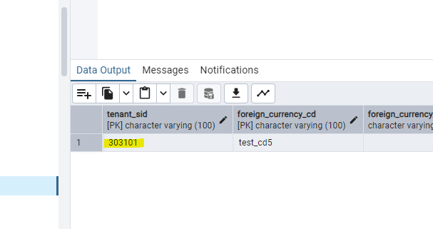

# Daily Retrospective

**작성자**: [박주현]  
**작성일시**: [2025-01-13]

# 1. 오늘 배운 내용

## 1️⃣ Refer Type Attr Generator Program 학습했습니다.

1. 역할

- 항목의 의미(refer_type/refer_group)에 따라 필요한 attribute를 생성합니다.

- AttrList.ts 에 refer_group/refer_type 별 필요한 attribute 정의

- generator_selector.ts 에 attribute generator selector 규칙 정의

- attr_generator/refer_type, attr_generator/refer_group에 각 attribute 생성 함수 정의

`Refer Type`이 있는 이유는 소스를 재활용하기 위함입니다.

예시를 들겠습니다. "재고" 업무성격에는 "견적", "판매" 등의 업무가 있습니다. 그리고 둘 모두 입력 페이지에서 보면 거래처의 Fn으로 해서 속성별로 검색할 수 있는 기능이 있습니다.



이런 속성 값들을 "견적 입력" - "거래처 검색" 그리고 "판매 입력"- "거래처 검색" 에 각각 기술해 놓으면 코드의 중복이 발생하므로 `Refer Type`을 하나 설정해두고, `Generator`로 생성해서 사용할 수 있습니다. 이런 기술을 사용하면 코드의 재사용성이 늘어나고, 코드 중복을 막을 수 있습니다.
이는 5.0의 개발 철학인 '개발 효율성 증가와 코드 재사용성증가' 로 이어집니다.

## 2️⃣ 5.0 외화코드 구현을 하며 궁금증이 있던 부분을 해결했습니다.

### (1) 구현 데이터에는 record_sid 없는 이유

단순히 record_sid 를 사용하지 않고 실습하기 위함이었습니다. 실제 API를 개발한다면, `sid_generator` 를 사용하며 sid 를 생성하여 DB 에 넣어 줄 것이라 추측해보았습니다.

### (2) ExecuteSetupMainProgram 에서 data_model_resolver의 제네릭이 IResolveInventoryDataModelProgramDto 인 이유.

첨에 소스를 봤을 때 IResolveInventoryDataModelProgramDto 로 되어 있길래, 이것은 재고(Inventory) 에 특화된 리졸버인줄 알고 `IResolveForeignCurrencyDataModelProgramDto, IResolveForeignCurrencyDataModelProgramResult` 로 제네릭을 바꿔서 구현했습니다. 하지만 이건 재고에 특화된 리졸버 생성이 아니었습니다. 위 방식대로 하니 계속 에러가 생겨 다른 동기와 비교해보니 동기들은 ExecuteSetupMainProgram 의 소스 코드를 아예 수정하지 않았습니다.

IResolveInventoryDataModelProgramDto 인 이유를 팀장님께 여쭤보니 초기 재고만을 구현했을 때 네이밍을 저렇게 해서 그대로 쓰인것이라는 답변을 받았습니다. 이번주에 수정될 것이라 하셨습니다. 제네릭을 바꾸고 동작하지 않아, 계속 디버깅한 시간이 생각나 조금 슬펐습니다....

### (3) 메뉴와 오브젝트의 차이

메뉴에 input.ts 이 있고, object에도 master.ts 있습니다. 각 개념에 대해 좀더 구체적인 이해를 돕기 위해 질문을 하였습니다. menus 에 input.ts 는 해당 업무의 입력 화면이 있고, 각 행동해야할 action이 명시 되어 있습니다.
objects 는 조금 더 하위 개념으로 입력 화면의 구성 중에 상단, 하단, 등을 명시할 수 있습니다. 결국엔 data_model 과 objects의 파일들이 비교 되므로 궁극적으로 나아가면 menus가 필요 없어질 수도 있다고 팀장님께서 말씀하셨습니다.

---

# 2. 동기에게 도움 받은 내용

오늘도 저번주처럼 많은 동기들에게 도움을 받았습니다. 도움을 안 받은 분들을 꼽기 어렵습니다. 짝궁인 건호님부터 현철님, 강민님, 수경님, 승준님, 주원님 등등 많은 분께 도움을 받았습니다.

집단 지성의 힘에 놀라고 있으며, 다른 프로젝트를 동기들과 함께 해 같이 문제를 해결해 나가며 5.0 개발 실력을 키우고 싶습니다.

---

# 3. 개발 기술적으로 성장한 점

## 3-1. 교육 과정 상 배운 내용이 아닌 개인적 호기심을 해결하기 위해 추가 공부한 내용

ESQL를 작성 중 UPDATE 기능을 활용할 때 TENANT_SID 가 변경되었습니다.



이는 전부를 갈아 끼우는 형식의(REST API 경우 PUT METHOD 처럼) UPDATE 기능 때문이었습니다. 그렇다면 TENANT_SID 또는 RECORD_SID 같은 경우는 수정이 되면 안되어야하는데, 휴먼에러로 실수로 잘못 기입해, 변경되는 불상사가 일어나면 어떡하지? 라는 생각이 떠올랐습니다.

DB 단에서 이걸 막아줄 수 있는 기능이 있는지 생각해 보았습니다. DB 컬럼중 수정 불가를 설정할 수 있는 제약조건이 있나? 마치 READ ONLY 처럼... 저 혼자 생각 했을 땐 그런 제약 조건은 보지 못했습니다.

생성형 AI 의 힘을 빌려 검색해본 결과 그런 제약조건은 없었습니다.
아래는 생성형 AI의 결과 내용입니다.
테이블 선언 시 특정 컬럼의 값이 변경되지 않도록 설정할 수 있는 제약 조건은 없습니다. 하지만 이를 간접적으로 구현할 수 있는 몇 가지 방법이 있습니다.

### 1. 테이블 컬럼을 READ ONLY로 설정하는 제약 조건은 없지만, 대안이 있습니다.

(1) DEFAULT와 NOT NULL을 조합 (기본값 설정)
컬럼의 기본값을 지정하고, 값이 입력되지 않을 경우 변경하지 못하도록 합니다.
하지만, 이미 입력된 값에 대한 변경을 막을 수는 없습니다.

```
CREATE TABLE example (
    id INT PRIMARY KEY,
    immutable_column VARCHAR(255) NOT NULL DEFAULT 'default_value'
);
```

(2) 트리거(Trigger) 활용
데이터가 INSERT는 가능하되, UPDATE 시도를 막고 싶다면 트리거를 활용할 수 있습니다.
트리거를 통해 컬럼이 변경되지 않도록 강제할 수 있습니다.

```
DELIMITER $$

CREATE TRIGGER prevent_update
BEFORE UPDATE ON example
FOR EACH ROW
BEGIN
    IF OLD.immutable_column <> NEW.immutable_column THEN
        SIGNAL SQLSTATE '45000'
        SET MESSAGE_TEXT = 'Immutable column cannot be updated';
    END IF;
END$$

DELIMITER ;
```

이 트리거는 immutable_column 값을 변경하려는 시도 시 예외를 발생시켜 막습니다.

### 2. 애플리케이션 단에서 제어

RDBMS 자체에서 컬럼 값을 변경하지 못하도록 강제하는 기능이 없을 때, 애플리케이션에서 이를 제어하는 방식도 사용됩니다.

JPA 사용 시 @Column과 @Immutable 활용:
Hibernate에서는 엔티티의 특정 필드를 읽기 전용으로 설정할 수 있습니다.

```
@Entity
@Immutable
public class Example {
    @Id
    @GeneratedValue
    private Long id;

    @Column(updatable = false)  // 변경 불가
    private String immutableColumn;

    // Getters and Setters
}
```

여기서 @Column(updatable = false)를 사용하면, INSERT는 가능하지만, UPDATE는 불가능합니다.

### 3. MySQL에서 특정 계정 또는 권한으로 제어

MySQL에서는 특정 사용자 계정에 대해 INSERT만 허용하고 UPDATE 권한을 제거하여 간접적으로 값을 변경하지 못하도록 설정할 수 있습니다.

```
GRANT INSERT, SELECT ON example TO 'user'@'localhost';
REVOKE UPDATE ON example FROM 'user'@'localhost';
```

이렇게 하면 특정 사용자는 데이터를 삽입하거나 읽을 수는 있지만, 수정할 수는 없습니다.

### 4. CHECK 제약 조건

특정 조건을 만족하지 않으면 값을 업데이트할 수 없도록 제약 조건을 설정할 수 있습니다.
하지만 CHECK는 데이터가 "변경되지 않게"라는 로직을 지원하지 않습니다.

```
CREATE TABLE example (
    id INT PRIMARY KEY,
    immutable_column VARCHAR(255) NOT NULL CHECK (immutable_column = 'fixed_value')
);
```

위 방식처럼 ESQL 또한 부분적 ORM 기술이라 생각합니다.JPA 의 @Immutable 처럼 작동할 수 있는 설정들이 있는지 궁금했습니다. 이와 관련해서는 아직 공부가 더 필요하다고 생각했습니다.

---

# 4. 소프트 스킬면에서 성장한 점

새로운 모니터를 하사받아, 책상 청결이 향상되었습니다. 깨끗한 마음이 깨끗한 결과를 만들길 기원합니다.

---

# 5. 제안하고 싶은 내용

혹시 목요일에 16명이니 4명씩 택시를 탈 수 있는지 궁금합니다. 걷는 것도 매우 좋지만, 오늘 같이 눈이와서 빙상길이 위험한 것 같고, 한강변 도로폭이 좁아서 단체 이동에 애로사항이 생길 것 같습니다. 도보 45분 정도 걸리는 위치라 단체로 4명씩 움직이면 어떨지 생각해 보았습니다.
