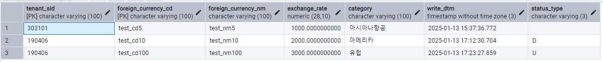

# Daily Retrospective

**작성자**: 허수경

**작성일시**: 2025-01-13(월)

## 1. 오늘 배운 내용 (필수)

- 행위 네이밍 가이드
- Serverlayer TestCase(`Modify`, `ModifyStatus`, `Remove`)

### 행위 네이밍 가이드

- `ACTION_MODE`에 따라 `ACTION`, `MENU`, `object`, `Dac`의 네이밍 명칭이 다르다.
- 특히, `REMOVE`는 object, Dac에서는 `Delete`로 명명한다.
- `DELETE`, `UNDELETE`, `CONFIRM`, `UNCOMFIRM`도 `Dac`에서는 `Update`로 명명한다.
  

### Serverlayer TestCase(`Modify`)

#### 파일 순서

| **파일명**                                | **주요 기능 및 역할**                                                                                                                                                                                                                           |
| :---------------------------------------- | :---------------------------------------------------------------------------------------------------------------------------------------------------------------------------------------------------------------------------------------------- |
| **ModifyForeignCurrencyProgram.spec.ts**  | - 세션 정보를 생성하고 `ModifyForeignCurrencyProgram`를 호출합니다.                                                                                                                                                                             |
| **ModifyForeignCurrencyProgram.ts**       | - `TempExecuteSetupMainProgram` 객체를 만들고<br /> `SlipDataModelContainer`를 통해 **SMC 모델**을 생성한 뒤,<br /> 이를 `TempExecuteSetupMainProgram` 객체에 전달합니다.                                                                       |
| **TempExecuteSetupMainProgram.ts**        | - `pre`, `initializer`, `validator`, `modifier`, `resolver`를 순차적으로 실행합니다.<br />- `data_model_resolver_program`를 통해 `EN_ACTION_MODE`에 따라 **MasterProgram**을 실행합니다.<br />- **MasterProgram** 실행 후, `post`를 실행합니다. |
| **ModifyForeignCurrencyMasterProgram.ts** | - `data_model`의 데이터를 `table_model`로 변환합니다.<br />- 이후 `UpdateForeignCurrencyDac`를 실행합니다.                                                                                                                                      |
| **UpdateForeignCurrencyDac.ts**           | - `$ESql`을 사용해 테이블(`pg.foreign_currency`)에<br /> `table_model`을 통해 `update` 작업을 수행합니다.                                                                                                                                       |

#### 1. `ModifyForeignCurrencyProgram.spec.ts`

- 세션 정보를 생성하고 `ModifyForeignCurrencyProgram`를 호출합니다.

```ts
const program = ProgramBuilder.create<
  ExecuteSetupMainRequestDto,
  ApiRequestDto
>(IModifyForeignCurrencyProgram, execution_context);
program.execute(slip_dto);
```

#### 2. `ModifyForeignCurrencyProgram.ts`

- `TempExecuteSetupMainProgram` 객체를 만들고 `SlipDataModelContainer`를 통해 **SMC 모델**을 생성한 뒤, 이를 `TempExecuteSetupMainProgram` 객체에 전달합니다.

```ts
protected onExecute(request: ExecuteSetupMainRequestDto): ExecuteSetupMainResultDto {
		const program = ProgramBuilder.create<ExecuteSetupMainRequestDto, ExecuteSetupMainResultDto>(
			ITempExecuteSetupMainProgram,
			this.execution_context
		);

		request.derive_info.smc = new SlipDataModelContainer(this.execution_context, request.slip_data_model);
		console.log(request.derive_info.smc);
		return program.execute(request);
	}
```

#### 4. `TempExecuteSetupMainProgram.ts`

- `pre`, `initializer`, `validator`, `modifier`, `resolver`를 순차적으로 실행합니다.
- `data_model_resolver_program`를 통해 `EN_ACTION_MODE`에 따라 **MasterProgram**을 실행합니다.
- **MasterProgram** 실행 후, `post`를 실행합니다.

```ts
const slip_created_result: {
  [key: string]: IResolveInventoryDataModelProgramResult;
} = {};
const return_data_model: IArrayDataModelMapper = {};
_.vForEach(this.dmc, (dmc) => {
  const data_model = dmc.getDataModel();

  slip_created_result[dmc.data_model_id] = data_model_resolver_program.execute({
    action_mode: slip.action_mode,
    dmc,
    data_sid: slip.data_sid,
  });

  return_data_model[dmc.data_model_id] = data_model as [
    { [prop_id: string]: any }
  ];
});
```

#### 5. `ModifyForeignCurrencyMasterProgram.ts`

- `data_model`의 데이터를 `table_model`로 변환합니다.
- 이후 `UpdateForeignCurrencyDac`를 실행합니다.

```ts
private _getTableModel(dmc: IDataModelContainer): pg.foreign_currency_20250110_hsg_ecback[] {
  const data_model = dmc.getDataModel() ?? [];

  return _.vMappingTo<foreign_currency.foreign_currency_input, pg.foreign_currency_20250110_hsg_ecback>(
    data_model,
    pg.foreign_currency_20250110_hsg_ecback,
    (org, tg) => {
      tg.tenant_sid = org.tenant_sid;
      tg.foreign_currency_cd = org.foreign_currency_cd;
      tg.foreign_currency_nm = org.foreign_currency_nm;
      tg.exchange_rate = org.exchange_rate;
      tg.category = org.category;
      tg.write_dtm = new Date();
      tg.status_type = org.status_type;
    }
  ) as pg.foreign_currency_20250110_hsg_ecback[];
}
```

```ts
// Dac 실행
const dac = DacCommandBuilder.create(
  UpdateForeignCurrencyDac,
  this.execution_context
);
dac.execute(_.vFirst(req_list) as pg.foreign_currency_20250110_hsg_ecback);
return true;
```

#### 6. `UpdateForeignCurrencyDac.ts`

- `$ESql`을 사용해 테이블(`pg.foreign_currency`)에 `table_model`을 통해 `update` 작업을 수행합니다.

```ts
protected generateESql(data: pg.foreign_currency_20250110_hsg_ecback): $Statement {
  const esql = $ESql
    .update<pg.foreign_currency_20250110_hsg_ecback>(pg.foreign_currency_20250110_hsg_ecback, data, (opt) => {
      opt.disAllowNullIf((c) => c.isPrimaryKey == false && c.isNullable == false);
      opt.alterCheckColumnRule(ENUM_CONDITION_LEVEL.HIGH, (t) => [t.tenant_sid]);
    })
    .where((ef, t) => ef._equal(t.tenant_sid, this.execution_context.session.tenant_sid));

  return esql;
}
```

### Serverlayer TestCase(`ModifyStatus`)

- `ModifyStatus`는 다른 Action과 달리 두 가지 Action으로 동작합니다.
- `DELETE` 는 status를 'D'로 바꾸고 `DELETE_CANCEL`은 status를 'U'로 바꿉니다.
- 알아둬야할 점은 **`Delete`는 완전 삭제가 아닌 상태 변경으로 보지않게 설정하는 것입니다.**

```ts
export const enum EN_STATUS_TYPE {
  /** 사용중 */
  Use = "U",
  /** 삭제 */
  Delete = "D",
  /** 사용중지 */
  NoUse = "S",
}
```

#### 파일 순서

- `DELETE`와 `DELETE_CANCEL`의 두가지 경우를 테스트하기 위해 테스트 코드를 2가지 작성합니다.

| No  | 파일명                                               |
| --- | ---------------------------------------------------- |
| 0   | `ModifyStatusDeleteForeignCurrencyProgram.spec.ts`   |
| 0   | `ModifyStatusUnDeleteForeignCurrencyProgram.spec.ts` |
| 1   | `ModifyStatusForeignCurrencyProgram.ts`              |
| 2   | `TempExecuteSetupMainProgram.ts`                     |
| 3   | `ModifyStatusForeignCurrencyMasterProgram.ts`        |
| 4   | `UpdateStateForeignCurrencyDac.ts`                   |

#### `UpdateStateForeignCurrencyDac.ts`

- Program에서는 별 다른 점이 없지만 Dac에서는 `set`을 통해 `status`만 변경합니다.

```ts
protected generateESql(data: pg.foreign_currency_20250110_hsg_ecback): $Statement {
  const viewerP = $ESql.viewer<pg.foreign_currency_20250110_hsg_ecback>(
    pg.foreign_currency_20250110_hsg_ecback,
    'P'
  );

  const esql = $ESql
    .update(viewerP, (opt) => {
      opt.disAllowNullIf((c) => c.isPrimaryKey == false);
      opt.alterCheckColumnRule(ENUM_CONDITION_LEVEL.HIGH, [viewerP.tenant_sid]);
    })
    .set(viewerP['status_type'], data.status_type)
    .where((ef, t) => ef._equal(t.tenant_sid, this.execution_context.session.tenant_sid))
    .where((ef, t) => ef._equal(t.foreign_currency_cd, data.foreign_currency_cd));

  return esql;
}
```

- 실행 후 `status_type`이 변경된 화면
  <br>
  

---

## 2. 동기에게 도움 받은 내용 (필수)

- 민준님, 아연님, 지은님, 주현님, 주원님께 CRUD를 구현할 때 도움을 받았습니다.
- 성철님, 현철님께서 저녁식사 픽업을 해주셨습니다.
- 건호님께서 기장으로서 진도체크를 전담해주십니다.
- 오후 휴식 시간에는 주원님, 연아님, 성철님과 함께 케이크를 즐기며 재충전할 수 있어, 오후 일정에 더욱 집중할 수 있었습니다.

---

## 3. 개발 기술적으로 성장한 점 (선택)

### 1. 교육 과정 상 배운 내용이 아닌 개인적 호기심을 해결하기 위해 추가 공부한 내용

#### `menu`와 `object`의 차이점

- 실습을 진행하던 중, `menu`와 `object`의 역할 차이에 대해 혼란스러웠습니다.
- 특히 `object`의 `attributes`에 있는 `resolver`와 `menu`의 `attributes`에 있는 API는 모두 `EN_ACTION_MODE`를 받아 각 모드에 따른 `identifier`를 반환하는 구조로 되어 있었습니다. 하지만 `menu`의 `attributes`를 작성하지 않아도 비즈니스 로직을 구현하는 데 문제가 없다는 점이 이해되지 않았습니다.

- 이에 대해 성준 팀장님께 여쭤본 결과, `menu`와 `object`는 각각 다음과 같은 역할을 담당한다고 설명해주셨습니다.

- **`menu`의 역할**
  - 견적서 입력, 견적서 조회와 같은 특정 행위에 대한 로직을 담당합니다.
  - Action과 Program을 매핑하여 사용자의 요청에 맞는 동작을 수행합니다.
- **`object`의 역할**

  - 상단/하단/오더 관리 등 각 object에 맞는 데이터를 저장하고 관리합니다.

- 즉, `menu`는 사용자의 행동에 따른 동작을 처리하는 반면, `object`는 데이터를 저장하고 관리하는 역할을 한다는 점에서 차이가 있습니다.

  | 구분   | 역할                             |
  | ------ | -------------------------------- |
  | menu   | 사용자의 행동에 따른 동작을 처리 |
  | object | 데이터를 저장하고 관리하는 역할  |

```ts
// object - master.ts
attributes: [
  {
    attr_id: definition_attrs.info.data_model_resolver,
    attr_type: EN_ATTR_TYPE.Information,
    data: {
      [EN_ACTION_MODE.Create]: 'ICreateForeignCurrencyMasterProgram',
      [EN_ACTION_MODE.Modify]: 'IModifyForeignCurrencyMasterProgram',
      [EN_ACTION_MODE.Delete]: 'IModifyStatusForeignCurrencyMasterProgram',
      [EN_ACTION_MODE.UnDelete]: 'IModifyStatusForeignCurrencyMasterProgram',
      [EN_ACTION_MODE.Remove]: 'IDeleteForeignCurrencyMasterProgram',
    } as definition_attrs.info.data_model_resolver,
    prop_id: '',
  },
],
```

```ts
// menus - input.ts
attributes: [
  {
    prop_id: '',
    attr_id: 'api',
    attr_type: EN_ATTR_TYPE.Api,
    data: {
      [EN_ACTION_MODE.Create]: 'ICreateForeignCurrencyAction',
      [EN_ACTION_MODE.Modify]: 'IModifyForeignCurrencyAction',
      [EN_ACTION_MODE.Delete]: 'IModifyStatusForeignCurrencyAction',
      [EN_ACTION_MODE.ReUse]: 'IModifyStatusForeignCurrencyAction',
      [EN_ACTION_MODE.UnUse]: 'IModifyStatusForeignCurrencyAction',
      [EN_ACTION_MODE.UnDelete]: 'IRemoveForeignCurrencyAction',
    },
  },
],
```

- CRUD 실습을 구현하면서 menu의

### 3. 위 두 주제 중 미처 해결 못한 과제. 앞으로 공부해볼 내용.

#### generator

- 오늘 generator에 대한 이론 교육을 받았지만, “속성을 만들어주는 것”이라는 핵심 키워드 정도만 이해했습니다.
  이해가 어려운 이유를 생각해보니, “속성을 만들어준다”는 개념 자체에서 **‘속성(attribute)’**에 대한 이해가 부족하다는 결론을 내렸습니다.
  따라서 앞으로 attribute에 대한 기초를 먼저 다져야 generator 개념을 더욱 명확히 이해할 수 있을 것 같습니다.

---

## 4. 소프트 스킬면에서 성장한 점 (선택)

### 1) 디버깅 과정에서의 이해도 향상

- 여러 파일과 폴더 구조를 살펴보며, 프로젝트 전체 구조에 대한 이해가 높아졌습니다.
- 특히 오류가 발생한 위치를 빠르게 파악하고, 문제 해결에 필요한 정보를 효율적으로 찾는 방법을 익혔습니다.

### 2) Dac에서 ESQL 쿼리 확인 방법 학습

- Dac 파일에서 `return esql;` 부분에 디버깅이 걸렸을 때, 디버그 콘솔에서 아래 명령을 입력하면 실제 쿼리 내용을 미리 볼 수 있음을 배웠습니다.
  ```
  esql.toPreviewString()
  ```
