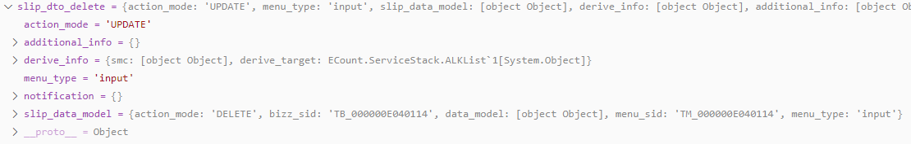
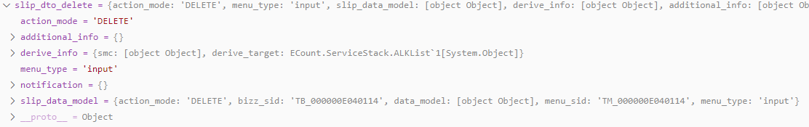

# Daily Retrospective

**작성자**: 고건호
**작성일시**: 2025-01-14

## 1. 오늘 배운 내용

- `CreateForeignCurrencyProgram.spec.ts` 내부 추가 디버깅

### `CreateForeignCurrencyProgram.spec.ts` 내부 추가 디버깅

어제 회고록을 작성하며 `CreateForeignCurrencyProgram.spec.ts`를 디버깅 하는데, 중간 중간에 생략하고 넘어간 부분들이 있어 오전에 여유가 있을 때 다시 해당 부분들을 짚어보려 합니다.

#### `CreateForeignCurrencyProgram.spec.ts` 흐름도

아래는 제가 디버깅 해보며 직접 그린 `CreateForeignCurrencyProgram.spec.ts`의 흐름도입니다.


흐름을 디버깅하며 아래와 같은 사항들을 정리할 수 있었습니다.

##### `BizzProgram`의 존재

`BizzProgram`은 `BaseProgram`을 상속 받고 있는 추상 클래스입니다.

```typescript
// `BizzProgram.ts`

/* eslint-disable @typescript-eslint/no-unused-vars,@typescript-eslint/no-empty-function */
import { IContextBase } from "ecount.infra.base/abstraction";
import { IBizzStackInfo, IExecutionContext } from "ecount.infra.bridge/base";
import { BaseProgram } from "./BaseProgram";
import {
  BizzStackFeature,
  IBizzStackFeature,
} from "ecount.infra.common/feature";

export abstract class BizzProgram<
  TProgramDto,
  TResult,
  TBizzData,
  TContext extends IContextBase = IExecutionContext
> extends BaseProgram<TProgramDto, TResult, TContext> {
  constructor(public execution_context: TContext) {
    super(execution_context);
  }

  protected abstract getBizzData(dto: TProgramDto): IBizzStackInfo<TBizzData>;

  protected override executeCore(dto: TProgramDto): TResult {
    const context = this.execution_context as unknown as any;

    context.setFeatureG(
      IBizzStackFeature,
      new BizzStackFeature(
        this.getBizzData(dto),
        context.getBizzStack(IBizzStackFeature) as IBizzStackFeature
      )
    );

    return super.executeCore(dto);
  }
}
```

디버깅을 하며 흐름을 따라가다 보면, 위 코드 내부에서 `context.setFeatureG()` 함수가 실행되면서 다시 `TempExecuteSetupMainProgram` 내부의 `getBizzData()` 함수가 실행됩니다.

이를 통해 `bizz_info`에 데이터의 타입(`slip`)과 `bizz_sid`, `data_dt`, `data_no`와 같은 프로퍼티를 가진 `data` 객체를 `BizzProgram`에서 알게되고, `BizzStackFeature`의 생성자의 파라미터로 넘겨주게 됩니다.

`context.setFeatureG()` 함수가 호출되어 실행되기 전, `context`에서 `getBizzStack()` 함수를 디버그 콘솔에서 호출하면 `undefined`가 출력되지만,


`context.setFeatureG()` 함수 호출 이후 `context.getBizzStack()` 함수를 호출하면 제대로 된 값이 출력되는 것을 확인할 수 있었습니다.


제가 생각하기에 해당 로직(feature)은 여러 업무(Bizz)가 순차적으로 실행될 때, 순차적으로 진행되어야하는 업무들이 연속적으로 호출될 때, 처리해야하는 전표(slip)들의 순서를 보장하며 저장하는 것으로 판단하고 이해했습니다.

> 성준 책임님께 여쭤본 결과, 상세히 코드를 살펴보시진 않았지만 업무(Bizz)에 대한 순서 정보를 처리해야하는 로직에서 사용되는 것으로 보인다는 답변을 받을 수 있었습니다.

##### `CreateForeignCurrencyMasterProgram`이 호출되는 과정

저는 흐름도를 그리며 전체적인 흐름은 머릿 속에 넣을 수 있었지만, `TempExecuteSetupMainProgram`에서 `ResolveInventoryDataModelProgram`을 거쳐 `CreateForeignCurrencyMasterProgram`이 호출되는 과정을 좀 더 세세하게 이해하고 싶어졌습니다.

`TempExecuteSetupMainProgram`는 최초에 `onExecute()` 함수 내부에서 `this._onInit()` 함수를 통해 초기화가 이루어지고, 뒤이어 `this._runExecuteSetupMainProgram()`이 호출되는 줄기로 이어집니다.

초기화 과정 중에는 파라미터로 들어온 `request`가 비어있는지 여부를 판단해주는 작업도 있고 `smc`를 설정해주는 작업 등이 있었습니다.

이후 `this._runExecuteSetupMainProgram()` 함수가 호출되면서 아래와 같은 구조 분해 할당을 통해 객체의 프로퍼티를 개별 변수로 분리해줍니다.

```typescript
// `TempExecuteSetupMainProgram.ts` 내부 구조 분해 할당 코드
...

const {
			slip_validator_program,
			data_model_initializer_program,
			data_model_modifier_program,
			data_model_validator_program,
			data_model_resolver_program,
			pre_executer_resolver_program,
			post_executer_resolver_program,
		} = this._createProgram(this.execution_context);

...
```

여기에서 중요하게 봐야 할 부분은 `data_model_resolver_program`입니다.

`this._createProgram()` 함수에서 해당 `data_model_resolver_program` 변수에 아래와 같이 `ResolveInventoryDataModelProgram`의 객체가 할당됩니다.

```typescript
// `TempExecuteSetupMainProgram.ts` 내부 `_createProgram()` 함수
...

data_model_resolver_program: ProgramBuilder.create<
				IResolveInventoryDataModelProgramDto,
				IResolveInventoryDataModelProgramResult
			>(IResolveInventoryDataModelProgram, context)

...
```

이 과정을 거쳤기 때문에, 아래의 코드에서서

```typescript
// `TempExecuteSetupMainProgram.ts` 내부 `_runExecuteSetupMainProgram()` 함수
...

_.vForEach(this.dmc, (dmc) => {
			const data_model = dmc.getDataModel();

			slip_created_result[dmc.data_model_id] = data_model_resolver_program.execute({
				action_mode: slip.action_mode,
				dmc,
				data_sid: slip.data_sid,
			});

			return_data_model[dmc.data_model_id] = data_model as [{ [prop_id: string]: any }];
		});

...
```

`data_model_resolver_program`에 `ResolveInventoryDataModelProgram` 객체가 담길 수 있었던 것이었습니다.


디버깅을 통해 흐름을 계속 따라가다보면, `ResolveInventoryDataModelProgram` 내부에서 다음과 같은 코드가 실행되는 것을 확인할 수 있었습니다.

```typescript
// `ResolveInventoryDataModelProgram.ts`

import { ProgramIdentifier } from "ecount.infra.base/abstraction";
import { program_impl } from "ecount.infra.common/decorator";
import { BaseProgram, ProgramBuilder } from "ecount.infra.common/program";
import { definition_attrs } from "ecount.usecase.base/@abstraction";
import {
  IResolveInventoryDataModelProgramDto as ProgramDto,
  IResolveInventoryDataModelProgramResult as ProgramResult,
  IResolveInventoryDataModelProgram,
} from "ecount.usecase.inventory/@abstraction";

// 해당 dmc에 정의된 data_model_resolver 프로그램 실행만 한다
// resolver는 MenuDefinition에 data_model_id별로 등록한다.
@program_impl(IResolveInventoryDataModelProgram)
export class ResolveInventoryDataModelProgram
  extends BaseProgram<ProgramDto, ProgramResult>
  implements IResolveInventoryDataModelProgram
{
  onExecute(dto: ProgramDto): ProgramResult {
    const action_mode = dto.action_mode as unknown as string;
    const resolver =
      dto.dmc.getAttrByAttrId<definition_attrs.info.data_model_resolver>(
        definition_attrs.info.data_model_resolver,
        "" //defintion의 attribute는 prop_id가 빈값이다.
      );
    if (resolver?.data?.[action_mode]) {
      const create_program = ProgramBuilder.create<ProgramDto, ProgramResult>(
        resolver.data[action_mode] as unknown as ProgramIdentifier,
        this.execution_context
      );
      return create_program.execute(dto) as unknown as ProgramResult;
    }

    return {} as unknown as ProgramResult;
  }
}
```

`onExecute()` 함수 내부에서 `create_program`에 값을 할당하기 위해 `ProgramBuilder.create()` 함수는 `resolver.data[action_mode] as unknown as ProgramIdentifier`를 파라미터로 받아줍니다.

디버그 콘솔로 `resolver.data[action_mode] as unknown as ProgramIdentifier`에 담긴 데이터를 확인해보면 아래의 값을 확인할 수 있었습니다.

![디버그_콘솔로_확인한_`resolver.data[action_mode]`](./ref/고건호_이미지/2025-01-14_고건호_이미지_7.png)

`resolver.data[action_mode]`를 통해 `ICreateForeignCurrencyMasterProgram`을 가져올 수 있는 이유는, `master.ts`에 각 `EN_ACTION_MODE` 별로 이미 매핑을 해줬기 때문입니다.

```typescript
// master.ts

import {
  BizzUtil,
  IBizzObjectDefinition,
  IImportTargetPropInfo,
} from "ecount.infra.base/abstraction";
import { bizz_definition } from "../foreign_currency_bizz_definition";
import {
  EN_ACTION_MODE,
  EN_ATTR_TYPE,
  EN_BIZZ_OBJECT_ALT_DATA_MODEL_ID,
  EN_INPUT_MENU_TYPE,
} from "ecount.fundamental.define/enum";
import { foreign_currency_input } from "../../../data_model";
import { definition_attrs } from "ecount.usecase.base/@abstraction";

BizzUtil.setObject(bizz_definition, {
  object_id: EN_INPUT_MENU_TYPE.Master,
  data_models: [
    {
      data_model_identifier: foreign_currency_input,
      alt_data_model_id: EN_BIZZ_OBJECT_ALT_DATA_MODEL_ID.foreign_currency,
      target_props: [
        "foreign_currency_cd",
        "foreign_currency_nm",
        "exchange_rate",
        "category",
      ],
      target_props_options: {
        prop_option: {
          tenant_sid: { is_key: true },
          foreign_currency_cd: { is_key: true },
        } as { [key: string]: IImportTargetPropInfo },
      },
    },
  ],
  attributes: [
    {
      attr_id: definition_attrs.info.data_model_resolver,
      attr_type: EN_ATTR_TYPE.Information,
      data: {
        [EN_ACTION_MODE.Create]: "ICreateForeignCurrencyMasterProgram",
        [EN_ACTION_MODE.Modify]: "IModifyForeignCurrencyMasterProgram",
        [EN_ACTION_MODE.Delete]: "IModifyStatusForeignCurrencyMasterProgram",
        [EN_ACTION_MODE.UnDelete]: "IModifyStatusForeignCurrencyMasterProgram",
        [EN_ACTION_MODE.Remove]: "IDeleteForeignCurrencyMasterProgram",
      } as definition_attrs.info.data_model_resolver,
      prop_id: "",
    },
  ],
} as IBizzObjectDefinition);
```

코드 시작 부분을 보면, `BizzUtil.setObject()` 함수가 실행되며 `data_models`와 `attributes`를 추가해주는 것을 확인할 수 있었습니다.

이를 통해 `ResolveInventoryDataProgram`에서 `CreateForeignCurrencyMasterProgram`을 호출할 수 있었던 것으로 이해했습니다.

## 2. 동기에게 도움 받은 내용 (필수)

주현 님과 여러가지 이야기를 나누며 흐름도를 그렸습니다.

---

## 3. 개발 기술적으로 성장한 점 (선택)

아래의 3가지 주제 중 하나를 선택하여 작성합니다.

### 1. 교육 과정 상 배운 내용이 아닌 개인적 호기심을 해결하기 위해 추가 공부한 내용

어제 처음 `ModifyStatusForeignCurrencyProgram.spec.ts`를 구현할 때, 내부에서 `action_mode`를 `Modify`로 설정하고 코드를 작성했습니다.

하지만 다른 동기들은 `action_mode`를 `Delete`(`UnDelete`)로 설정한 것을 확인했고, 정상 동작하긴 했지만 샘플 코드 작성의 취지에도 어긋나고 이카운트 내에서 사용하는 컨벤션에도 맞지 않는 것 같아 코드를 `Delete`(`UnDelete`)를 사용하는 방향으로 수정해봤습니다.

```typescript
// 기존 `ModifyStatusForeignCurrencyProgram.spec.ts

import { test, testBed } from "ecmodule.testutil/ecsolution";
import { ProgramBuilder } from "ecount.infra.common/program";
import { ApiRequestDto } from "ecount.usecase.base/@abstraction";
import { ExecuteSetupMainRequestDto } from "ecount.usecase.common/@abstraction";
import { SlipDataModelContainer } from "ecount.usecase.common/@implement";
import { IModifyStatusForeignCurrencyProgram } from "ecount.usecase.tutorials/@abstraction";
import {
  slip_data_model_delete,
  slip_data_model_undelete,
} from "./slip_data_model";
import { EN_ACTION_MODE, EN_MENU_TYPE } from "ecount.fundamental.define/enum";

/* 세션 정보 세팅 */
const zone = "BA";
const tenant_sid = "190406";
const user_id = "test";

const sessionCreator = new $SessionImpersonator();
sessionCreator
  .identity(zone, tenant_sid, user_id)
  .configure((id) => id.setLanguage("ko-KR"));
const sessionIdentity = sessionCreator.build();

test("ModifyStatusForeignCurrencyProgram case 1: modify status", () => {
  const execution_context = testBed.createExecutionContext({
    sessionIdentity,
  });
  execution_context.action.action_mode = EN_ACTION_MODE.Modify;
  execution_context.action.menu_type = EN_MENU_TYPE.Input;

  const slip_dto_delete = {
    action_mode: execution_context.action.action_mode,
    menu_type: execution_context.action.menu_type,
    slip_data_model: slip_data_model_delete,
    derive_info: {
      smc: {} as SlipDataModelContainer,
      derive_target: [],
    },
    additional_info: {},
    notification: {},
  } as ExecuteSetupMainRequestDto;

  const program = ProgramBuilder.create<
    ExecuteSetupMainRequestDto,
    ApiRequestDto
  >(IModifyStatusForeignCurrencyProgram, execution_context);
  const result = program.execute(slip_dto_delete);

  console.log(result);

  const slip_dto_undelete = {
    action_mode: execution_context.action.action_mode,
    menu_type: execution_context.action.menu_type,
    slip_data_model: slip_data_model_undelete,
    derive_info: {
      smc: {} as SlipDataModelContainer,
      derive_target: [],
    },
    additional_info: {},
    notification: {},
  } as ExecuteSetupMainRequestDto;

  const program2 = ProgramBuilder.create<
    ExecuteSetupMainRequestDto,
    ApiRequestDto
  >(IModifyStatusForeignCurrencyProgram, execution_context);
  const result2 = program2.execute(slip_dto_undelete);

  console.log(result2);
});
```

위의 기존 코드를 아래와 같이 수정했습니다.

```typescript
// 수정한 `ModifyStatusForeignCurrencyProgram.spec.ts

import { test, testBed } from "ecmodule.testutil/ecsolution";
import { ProgramBuilder } from "ecount.infra.common/program";
import { ApiRequestDto } from "ecount.usecase.base/@abstraction";
import { ExecuteSetupMainRequestDto } from "ecount.usecase.common/@abstraction";
import { SlipDataModelContainer } from "ecount.usecase.common/@implement";
import { IModifyStatusForeignCurrencyProgram } from "ecount.usecase.tutorials/@abstraction";
import {
  slip_data_model_delete,
  slip_data_model_undelete,
} from "./slip_data_model";
import { EN_ACTION_MODE, EN_MENU_TYPE } from "ecount.fundamental.define/enum";

/* 세션 정보 세팅 */
const zone = "BA";
const tenant_sid = "190406";
const user_id = "test";

const sessionCreator = new $SessionImpersonator();
sessionCreator
  .identity(zone, tenant_sid, user_id)
  .configure((id) => id.setLanguage("ko-KR"));
const sessionIdentity = sessionCreator.build();

test("ModifyStatusForeignCurrencyProgram case 1: modify status", () => {
  const execution_context = testBed.createExecutionContext({
    sessionIdentity,
  });
  execution_context.action.action_mode = EN_ACTION_MODE.Delete;
  execution_context.action.menu_type = EN_MENU_TYPE.Input;

  const slip_dto_delete = {
    action_mode: execution_context.action.action_mode,
    menu_type: execution_context.action.menu_type,
    slip_data_model: slip_data_model_delete,
    derive_info: {
      smc: {} as SlipDataModelContainer,
      derive_target: [],
    },
    additional_info: {},
    notification: {},
  } as ExecuteSetupMainRequestDto;

  const program = ProgramBuilder.create<
    ExecuteSetupMainRequestDto,
    ApiRequestDto
  >(IModifyStatusForeignCurrencyProgram, execution_context);
  const result = program.execute(slip_dto_delete);

  console.log(result);

  const execution_context_2 = testBed.createExecutionContext({
    sessionIdentity,
  });
  execution_context_2.action.action_mode = EN_ACTION_MODE.UnDelete;
  execution_context_2.action.menu_type = EN_MENU_TYPE.Input;

  const slip_dto_undelete = {
    action_mode: execution_context_2.action.action_mode,
    menu_type: execution_context_2.action.menu_type,
    slip_data_model: slip_data_model_undelete,
    derive_info: {
      smc: {} as SlipDataModelContainer,
      derive_target: [],
    },
    additional_info: {},
    notification: {},
  } as ExecuteSetupMainRequestDto;

  const program2 = ProgramBuilder.create<
    ExecuteSetupMainRequestDto,
    ApiRequestDto
  >(IModifyStatusForeignCurrencyProgram, execution_context_2);
  const result2 = program2.execute(slip_dto_undelete);

  console.log(result2);
});
```

`execution_context.action.action_mode`를 `Delete`와 `UnDelete`로 지정해줘야했기 때문에 하단에 `execution_context_2`를 새로 만들어주는 코드를 추가했습니다.

위와 같이 코드를 수정하고 테스트 해본 결과,

#### `Modify`로 설정한 경우



#### `Delete`(`UnDelete`)로 설정한 경우



`slip_data_delete.action_mode`의 값이 다르지만, 이후 흐름은 동일한 것을 확인할 수 있었습니다.

### 2. 오늘 직면했던 문제 (개발 환경, 구현)와 해결 방법

### 3. 위 두 주제 중 미처 해결 못한 과제. 앞으로 공부해볼 내용.

아직 `Validaotr`와 `Generator` 관련 흐름을 완벽히 이해하지 못했습니다. 내일 오전에 와서 나머지 추가 학습을 하는 시간을 가져보려 합니다.
