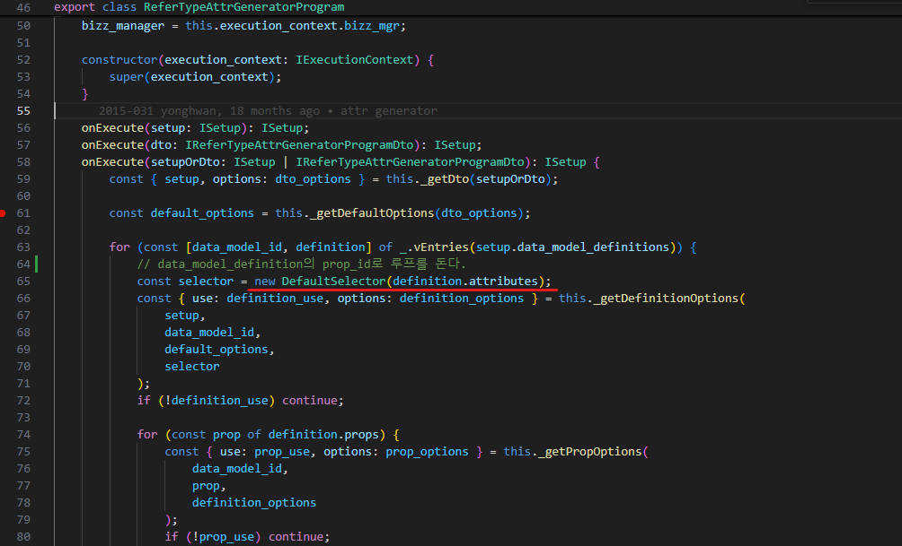
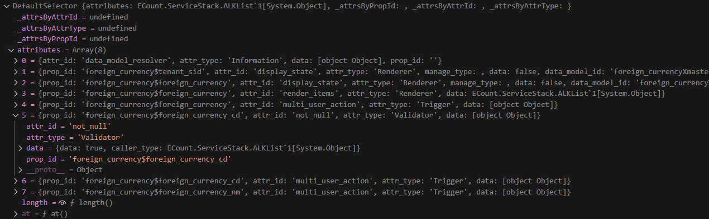

# Daily Retrospective

**작성자**: [김도형]  
**작성일시**: [2015-01-14]

## 1. 오늘 배운 내용 (필수)

- refer type generator 디버깅 및 구현

디버깅을 통해 generator가 실행되는 과정을 알아보는 시간을 가졌습니다. ReferTypeAttrGeneratorProgram 내부에 디버깅 포인트를 찍어 놓고, 콜 스택을 확인하며 내부 흐름을 확인해보았습니다.

## TempExecuteSetupMain 내부에 DMC 추가하기

예시 로직은 generator를 구현해 보기 위해서 db 사용자 설정 정보에서 속성 정보를 가져 오는 것이 아닌, refer_type generator를 직접 돌려서 DMC에 generator를 통해 생성된 속성 정보를 추가해주기 위한 임시 코딩이라고 하셨습니다.

아래 코드 로직을 살펴보면, 데이터 모델 컨테이너를 생성하고 각각을 this.dmc배열에 추가하는 루프로 보입니다. 각종 Prop 들을 빈 객체로 초기화된 설정 객체를 생성합니다. ProgramBuilder를 통해 Refer Type Attribute Generator Program을 실행시킵니다. 프로그램 실행으로 생성된 Atrribute들을 사용하여 새로운 Selector를 생성합니다. 주요 목적은 generator에 생성된 attribute들을 selector에 저장하는 것으로 보입니다.

[file] TempExecuteSetupMainProgram.ts

```ts
const smc_definition = this.smc.getDataModelDefinitions();
for (const dmc of this.smc.createDataModelContainer((def) => {
  const data_model_id = def?.data_model_id as string;
  const setup: ISetup = {
    tenant: {} as ITenant,
    user: {} as IUser,
    bizz: {} as IBizz,
    menu: {} as IMenu,
    function: [] as IFunction[],
    view_container: [] as IViewContainer[],
    data_model: {} as IDataModelMapper,
    data_model_definitions: {} as IDataModelDefinitionMapper,
  };

  const refer_type_attr_program = ProgramBuilder.create<ISetup, ISetup>(
    IReferTypeAttrGeneratorProgram,
    this.execution_context
  );

  setup.data_model_definitions[data_model_id] = def as IDataModelDefinition;
  refer_type_attr_program.execute(setup);

  const selector = new DefaultSelector(
    setup.data_model_definitions[data_model_id]?.attributes
  );

  return { selector };
})) {
  this.dmc.push(dmc);
}
```

<br>

selector는 attribute를 다루기 위한 모듈을 지정할 수 있으며, 전달하지 않는 경우 default selector로 지정됩니다. default selector는 dmc를 생성할 때 전달 받은 data model definition에 정의된 attributes만을 다루며, CSS의 선택자(selector)와 비슷한 개념이라고 생각합니다.

[file] ReferTypeAttrGeneratorProgram.ts



<br>

## Validator 속성을 Generator로 추가하기

아래 코드는 foreign currency 관련 필드에 해단 not null 유효성 검사기를 생성하는 generator입니다. foreign_currency_cd 필드가 null이 아님을 검증하는 역할을 합니다. IReferTypeAttrGenerator 인터페이스를 구현, 제네릭 타입으로 validator_attrs.ip_single_condition_not_null을 사용하며
Validator 타입의 속성을 생성합니다.

[file] validator_attrs.ip_single_condition_not_null.ts

```ts
export const foreign_currency_foreign_currency_cd_not_null_input: IReferTypeAttrGenerator<
  validator_attrs.ip_single_condition_not_null
> = (execution_context, setup, target) => {
  return {
    prop_id: target.prop.prop_id,
    attr_id: validator_attrs.not_null,
    attr_type: EN_ATTR_TYPE.Validator,
    data: { data: true, caller_type: [EN_EXECUTE_CALLER_TYPE.apply] },
  };
};
```

[file] Enums.ts

```ts
export const enum EN_EXECUTE_CALLER_TYPE {
  /**
   * 적용, 저장시 등에 발생
   */
  apply = "apply",
}
```

```ts

  const selector = new DefaultSelector(
    setup.data_model_definitions[data_model_id]?.attributes
  );

  return { selector };
})) {
  this.dmc.push(dmc);
}
```

<br>

DefaultSelector의 attributes에는 Validator 속성을 Generator로 추가한 내용에 따라 `attr_id`와 `attr_type`이 설정된 모습을 확인할 수 있습니다. 이렇게 함으로써 외화 코드가 반드시 입력되어야 하며, 비어있거나 null이 될 수 없도록 보장합니다.



<br>

generator에 의해 Attribute가 Dmc에 들어갈 수 있도록 만들어졌고, 최종적으로 dmc.push를 통해 데이터 모델이 저장된 모습을 확인할 수 있습니다.


근본적으로 Generator를 사용하는 이유는 무엇일까에 대해 고민해보았습니다. ecount 내부에서 다루는 속성은 크게 두 가지 유형으로 나뉩니다. 첫 번째는 DB 속성으로, 사용자가 직접 설정할 수 있는 속성입니다. 이는 양식 정보를 5.0 속성으로 변환하는 컨버팅 과정을 거치게 됩니다. 두 번째는 고정 속성으로, 사용자가 설정할 수 없는 불변의 속성입니다. 이 고정 속성은 Generator를 통해 파일로부터 자동으로 생성됩니다. 흥미로운 점은 이 두 가지 속성이 서로 다른 방식으로 생성되지만, 최종적인 결과물의 형태는 동일하다는 것입니다. 시스템 내에서 모두 동일한 속성으로 취급되어 처리됩니다.

속성들은 Generator에 의해 DMC에 들어갈 수 있는 데이터로 만들어지고, selector로 데이터 모델의 특정 속성이나 값을 선택하여 필터링을 수행합니다. 이후에, DMC 내부의 특정한 위치에 저장되고, 구체적으로는 data_model_definition의 attribute에 위치하게 되며, 각 DMC의 attribute로 추가되어 관리됩니다. 이러한 구조를 통해 시스템은 효율적으로 속성을 관리하고 활용할 수 있고, 속성 시스템은 5.0에서 데이터 모델을 더욱 유연하고 체계적으로 관리할 수 있게 해주는 핵심 요소라고 할 수 있습니다. 하지만, 많은 속성이 추가될수록 DMC의 크기가 커지며 컨버팅 과정에서 추가적인 리소스가 필요할 수 있을 것입니다. 현재는 DB 속성과 고정 속성을 동시에 관리하고 있어서 배우는 입장에서는 복잡하게 느껴지는 것 같습니다.

## ReferTypeAttrGeneratorProgram

ReferTypeAttrGeneratorProgram은 데이터 모델의 속성을 생성하는 역할을 하는데, 이를 위해 BaseProgram을 상속받아 구현되어 있었습니다. 이러한 상속 구조를 통해 공통 기능을 재사용하면서도, 특화된 기능을 추가할 수 있는 것 같습니다.

특히 인상 깊었던 것은 타입 시스템의 활용이었습니다. 프로그램은 여러 단계의 옵션 타입을 정의하여 사용하고 있었는데, 이를 통해 타입스크립트의 타입 시스템이 실제로 어떻게 활용되는지 배울 수 있었습니다. 기본 옵션부터 시작해서 정의 옵션, 속성 옵션으로 계층적으로 확장되는 구조였습니다.

```ts
typescriptCopytype TDefaultOptions = {
    bizz_sid: string;
    menu_type: EN_MENU_TYPE;
    menu_sid: string;
    attr_list_set?: Set<string>;
};

type TDefinitionOptions = TDefaultOptions & {
    data_model_id: string;
    bizz_sid: string;
};
```

속성 생성 프로세스에서는 refer_type과 refer_group이라는 두 가지 기준으로 속성을 생성하는 것을 보았습니다. 이 과정에서 Set 자료구조를 활용하여 중복을 제거하고, 여러 속성을 효율적으로 관리하는 방법을 배웠습니다. 특히 generator_selector를 통한 동적인 생성기 선택 방식은 확장성 있는 코드 작성의 좋은 예시였습니다.

```ts
typescriptCopyprotected _generate(
    prop: IPropDefinition,
    definition: IDataModelDefinition,
    setup: ISetup,
    options: TPropOptions,
    selector: DefaultSelector
) {
    const refer_type_attrs = new Set(/* ... */);
    const refer_group_attrs = new Set(/* ... */);
    const all_attrs = new Set(_.vConcat([], ...refer_type_attrs, ...refer_group_attrs));
    // ...
}
```

또한, protected 메서드를 적절히 활용하여 내부 구현을 캡슐화하는 방식도 존재했고, DefaultSelector 클래스를 통한 속성 관리 방식도 볼 수 있었습니다. 이 클래스는 속성들을 효율적으로 조회하고 관리하는 기능을 제공하며, 이를 통해 코드의 재사용성과 유지보수성이 크게 향상되는 것을 볼 수 있었습니다.

ReferTypeAttrGeneratorProgram을 분석하면서 특히 인상 깊었던 점은 타입스크립트의 고급 기능들이 실제 업무에서 어떻게 활용되는지를 볼 수 있었다는 것입니다. 제네릭, 데코레이터, 타입 가드 등의 기능들이 단순히 문법적인 요소가 아니라, 실제로 코드의 안정성과 유지보수성을 높이는 데 큰 역할을 한다는 것을 깨달았습니다. 타입스크립트 문법을 완벽하게 구현하는 수준은 아니지만 1,2주차에 배웠던 개념들을 실제 구현 코드를 통해 보고 이해할 수 있었습니다.

## 2. 동기에게 도움 받은 내용 (필수)

연아님, 주원님, 승준님과 함께 디버깅을 하면서 내부 코드를 살펴보았습니다.

수경님, 지은님과 함께 GetInventoryInputSetupProgram에 접근을 하는데, 그 이후로는 접근이 되지 않는 이유에 대해 고민하였습니다.

현철님에게 ERP 기능에 대해 설명을 듣었습니다.

강민님과 slip data model이 입력되고 저장되기까지의 모든 과정을 브레이크 포인트를 찍어보면서 동작을 확인하였습니다. bizz manager의 역할, foreign_currencyXmaster가 생성되는 시점, selector/descriptor가 하는 역할 등 분석해보았지만, 해결하지 못한 부분들이 더 많은 것 같습니다. 외화 코드를 어떤 식으로 설계해야 할 지, 현재 inventory 항목에서 foreign_currency에 필요한 부분과 필요하지 않은 부분은 어떤 것들이 있는지.. 긴 시간동안 토론을 하였습니다.

성범 책임님에게 오늘도 많이 배웠습니다.

---

## 3. 개발 기술적으로 성장한 점 (선택)

아래의 3가지 주제 중 하나를 선택하여 작성합니다.

### 2. 오늘 직면했던 문제 (개발 환경, 구현)와 해결 방법

### CreateForeignCurrencyProgram.spec.ts에서 설정한 세션 정보의 tenant_sid = '303101'로 고정된 이유

**문제 상황**

CreateForeignCurrencyProgram.spec.ts에 있는 tenant_sid를 다른 값으로 수정한 후 (ex : 100000 또는 3333) 빌드 및 디버깅을 하게 되면 에러가 발생합니다. 하지만 data model -> table model로 변환하는 과정 (master.ts) 에서 수동으로 tenant_sid의 값을 변경해주는 방식은 문제가 되지 않습니다. 왜 이런 문제가 발생하는 지 tenant_sid와 slip_data_model의 값들을 수정하면서 테스트해보았지만, 문제의 원인을 파악하지 못하였고, 성준 팀장님께 질문을 드렸습니다.

**팀장님의 답변**

권한 체크등의 경우에, 존재하지 않는 회사코드를 입력하면 정보가 없기에 에러가 발생할수 있습니다. 303101은 303101 회사코드로 로그인했을때의 세션을 임시로 만든 케이스입니다. 존재하는 테스트코드의 회사코드를 사용하면 정상처리되고, 임의의 숫자(없는 회사코드)를 입력하면 오류가 발생합니다. 어느 로직에서 임의의 숫자를 입력하면 오류가 발생하는 지 확인해보고 싶어서 디버깅을 시도해보았습니다.

**DEBUG CONSOLE**

```ts
===========================================================================================
## ThrowException Details: ECount.ServiceStack.Velox.JavaScriptException
============================================================================================
Message: TypeError: Object.entries called on convert non-object to object: undefined
Source:  D:\ecountv5\Runtime\vshared\modules\ecount.usecase.setup\program\index.js at ECount.Framework.VeloxJS [(15984, 8) [717154..717266]]

==============================================
Script Text
==============================================
Line (15984, 8) at D:\ecountv5\Runtime\vshared\modules\ecount.usecase.setup\program\index.js
Object.entries(prev_result).forEach(([key, value])=>{
            result[key.toUpperCase()] = value;
        });


==============================================
JavaScript Call Stacks
==============================================
-> at D:\ecountv5\Runtime\vshared\modules\ecount.usecase.setup\program\index.js (15984, 8)
	: Object.entries(prev_result).forEach(([key, value])=>{
            result[key.toUpperCase()] = value;
        });
-> at D:\ecountv5\Runtime\vshared\modules\ecount.usecase.setup\program\index.js (15951, 18)
	: this.getDbMyPage(requiredDto, "{0}:mysql:MYHB_ACCT")
-> at D:\ecountv5\Runtime\vshared\modules\ecount.usecase.setup\program\index.js (15935, 36)
	: this.getMyPage(dto)
-> at D:\ecountv5\Runtime\vshared\modules\ecount.infra.common\program\index.js (33, 15)
	: this.onExecute(dto)


==============================================
Exception Datas
==============================================
SummaryMessage: TypeError: a value is not the expected type.


```

getDbMyPage함수에서 문제가 발생했거나, 아래 코드에서 ket 값이 넘어오지 않는 문제가 발생했을 것으로 예상됩니다. 그리고 추가로 질문을 드렸습니다.

```ts
Object.entries(prev_result).forEach(([key, value]) => {
  result[key.toUpperCase()] = value;
});
```

**추가 질문**
혹시 존재하는 테스트코드의 회사코드에 대한 정보를 어디서 조회할 수 있을까요? 혹시 그렇다면, Zone도 존재하는 값만 입력이 가능한 상태인가요?

**추가 답변**
password 테이블이 있는데, 테스트 코드 이관 정보에 따라 DB마다 다를수 있습니다. 이부분은 300000 / 303101 이정도로 알고 계시면 될것 같아요~

Object.entries(prev_result)에서 발생한 에러는 단순히 코드 레벨의 문제가 아닌, 데이터 접근 권한이나 회사 코드의 유효성과 같은 비즈니스 로직과 연관되어 있었습니다. 표면적인 에러 메시지만 보고 판단하기보다는, 전체적인 맥을 이해하는 것이 중요하다는 것을 느꼈습니다. 또한, 문제가 발생했을 때 단순히 값을 변경해보는 것이 아니라, 콜 스택을 따라가며 근본적인 원인을 파악하는 것이 중요한 것 같습니다. 에러 메시지가 JavaScript 레벨에서 발생하더라도, 실제 원인은 데이터베이스나 권한 체크와 같은 다른 레이어에 있을 수 있을 것으로 보입니다. 이러한 경험을 통해 테스트 코드 작성과 디버깅 과정에서 더 체계적이고 깊이 있는 접근이 필요하다는 것을 알게 되었습니다.

### 3. 위 두 주제 중 미처 해결 못한 과제. 앞으로 공부해볼 내용.

- 외화 코드 Action은 몇 개를 만들어야할까? Data/Setup action을 포함한 CRUD Action들도 모두 만들어야 하는 걸까?

- foreign_currencyXmaster 라는 정보는 어느 곳에서 생성되어 데이터가 저장되는걸까? baseProgram? decorateTransaction?

- 디버깅을 통해 endpoint.ts 에서 부터 DAC을 통해 pg에 저장되기까지의 과정들이 많고 복잡합니다. 여기서 bizz manager가 하는 역할이 많은 것 같습니다. 주어진 과제를 모두 수행하게 된다면, bizz Manager가 하는 역할에 대해 알아보려고 합니다.

---

## 4. 소프트 스킬면에서 성장한 점 (선택)

### 문제 해결에 대한 끈기와 자세의 변화

먼저, 복잡한 코드를 이해하기 위한 저만의 접근 방식을 발전시켜왔습니다. 디버깅을 통한 코드 흐름 파악에 중점을 두었습니다. 코드의 핵심 지점마다 브레이크포인트를 설정하여 데이터가 어떻게 흘러가는지 추적했습니다. 각 단계에서 변수들이 어떻게 변화하는지 주의 깊게 관찰하면서 코드의 동작을 이해하려 노력했습니다. 특히, 예상과 다른 결과가 나타날 때면 그 원인을 찾아 깊이 있게 파고들었습니다.

코드의 구조를 시각화하는 것도 큰 도움이 되었습니다. 복잡한 로직들을 공책에 그려가면서 도식화하여 전체적인 흐름을 한눈에 파악할 수 있게 했습니다.

무엇보다 능동적인 학습 태도를 유지하려 노력했습니다. 이해가 되지 않는 부분을 마주치면 그냥 넘기지 않고 성준 팀장님께 지속해서 질문을 드리고, 동기들과 함께 토론을 하면서 이해하려고 노력했습니다.

이러한 노력들이 쌓이면서, 처음에는 복잡하게만 보였던 코드들이 점차 이해되기 시작했고, 각 부분들이 어떤 목적을 가지고 설계되었는지도 파악할 수 있게 되었습니다. 특히 디버깅 과정에서 발견한 문제들을 해결하면서 코드에 대한 이해도가 더욱 깊어졌습니다. 아직 부족한 점이 많지만, 앞으로 남은 과제를 수행하고, 일정 관리 프로그램을 개발하면서 보다 더 성장하겠습니다.
