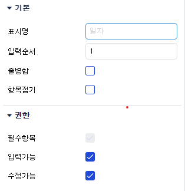

# Daily Retrospective  
**작성자**: [김민준]  
**작성일시**: [2025-01-14]  

## 1. 오늘 배운 내용 (필수)  

**속성 정보를 추가해주는 로직**
1. 재고 입력 페이지에 대한 속성 정보를 내려주는 Program
- `GetInventorySetupProgram` $\to$ attr_program.execute({ setup: setup, generator_type_list: [EN_GENERATOR_TYPE.REFER_TYPE] });
- 파일 고정 속성 설정 정보를 내려주는 로직
2. 재고 입력 페이지에 대한 정보를 내려주는 Program
- `GetInventoryInputDataProgram` $\to$ 	GetExecuteSetupMainProgram -> this.smc.createDataModelContainer 함수 내의 콜백함수
- 사용자 속성 설정 정보를 내려주는 로직
3. 재고전표 저장 시점
- `executeSetupMainProgram`
- 내부적으로 양식정보(3.0 설정 정보) $\to$ 5.0 속성 정보로 컨버팅한 정보를 추가한다.

**ReferTypeAttrGenerator 디버깅해보기**
코드 흐름
1. `GetInventoryInputDataProgram`에서 attribute generator가 처리해야할 `target attribute`를 정의합니다. 
2. `GetInventoryInputDataProgram`에서 `AttrGeneratorProgram`을 실행합니다.
3. `AttrGeneratorProgram`은 `generator_type`을 통해 `ReferTypeAttrGeneratorProgram`을 실행시킵니다.
4. `ReferTypeAttrGeneratorProgram`은 `AttrList`의 `refer_type_attr_map`을 통해서 처리할 수 있는 전체 `attr`를 가져옵니다.
	- 각 `data_model`마다 각 `prop`을 처리하기 위해 순회합니다. 여기서 중요한 것은 `prop`의 `refer_type`과 `menu_type`입니다.
	- 또한 `GetInventoryInputDataProgram`에서 넘겨준 `target attribute`를 attribute로 생성해줍니다.

```typescript
private _executeReferTypeGenerator(setup: ISetup): void {
		// ~~~~

		const refer_type_attr_program = ProgramBuilder.create<IAttrGeneratorProgramRequestDto, ISetup>(
			IAttrGeneratorProgram,
			this.execution_context
		);

		// ==============target attribute===========
		const target_attrs = [renderer_attrs.render_items, validator_attrs.limit_date, renderer_attrs.value_format];
		// =========================================

		// ~~~~

		refer_type_attr_program.execute({
			setup: setup,
			generator_type_list: [EN_GENERATOR_TYPE.REFER_TYPE],
			attr_map: new Map([[EN_GENERATOR_TYPE.REFER_TYPE, target_attrs]]),
		});
```

- `AttrList`의 `refer_type_attr_map`을 통해 `refer_type_attr_map[refer_type][menu_type]`을 가져옵니다.
	- `D:\ecxsolution\ecount.nextv5\ecount.solution\src\03.ecount.usecase\ecount.usecase.common\src\server\program\attr_generator\AttrList.ts`

```typescript
const refer_type_attr_map = {
	data_dt_no: {
		[EN_MENU_TYPE.Input]: [
			renderer_attrs.blank,
			renderer_attrs.fn,
			renderer_attrs.writable,
			renderer_attrs.combine_props,
			renderer_attrs.value_formatter,
			validator_attrs.limit_date,
			validator_attrs.limit_year,
			datamodel_trigger_attrs.subscribe_data_model,
		],
}
```

5. `generator_selector`를 통해 사용해야할 `generator`를 선택합니다.
- 제너레이터의 선택기준은 `D:\ecxsolution\ecount.nextv5\ecount.solution\src\03.ecount.usecase\ecount.usecase.common\src\server\attr_generator\refer_type\`에 존재하는 `generator` 파일의 이름을 바탕으로 결정됩니다.
- 아래의 우선순위를 통해 사용될 `generator`가 결정됩니다.
	- `${bizz_id}_${refer_type}_${attr_id}_${menu_type}` 없으면
	- `${bizz_id}_${refer_type}_${attr_id}`이 선택되는 방식으로 우선순위가 결정됨.
```typescript
export function refer_type(
	execution_context: IExecutionContext,
	refer_type: $$refer_type,
	attr_id: string,
	options?: {
		bizz_sid: string;
		menu_type?: EN_MENU_TYPE;
	}
): IReferTypeAttrGenerator<any> | undefined {
	const bizz_sid = options?.bizz_sid ?? execution_context.action.bizz_sid;
	const menu_type = options?.menu_type ?? execution_context.action.menu_type;

	const { bizz_id, bizz_type } = getBizzInfo(execution_context, bizz_sid);

	// generator가 선택되는 기준 (우선순위의 파일을 import를 통해 map 형태로 가져옴)
	return (refer_type_gens[`${bizz_id}_${refer_type}_${attr_id}_${menu_type}` as keyof typeof refer_type_gens] ||
		refer_type_gens[`${bizz_id}_${refer_type}_${attr_id}` as keyof typeof refer_type_gens] ||
		refer_type_gens[
			`${bizz_type}_${refer_type}_${attr_id}_${execution_context.session.site}` as keyof typeof refer_type_gens
		] ||
		refer_type_gens[`${bizz_type}_${refer_type}_${attr_id}_${menu_type}` as keyof typeof refer_type_gens] ||
		refer_type_gens[`${bizz_type}_${refer_type}_${attr_id}` as keyof typeof refer_type_gens] ||
		refer_type_gens[`${refer_type}_${attr_id}_${menu_type}` as keyof typeof refer_type_gens] ||
		refer_type_gens[`${refer_type}_${attr_id}` as keyof typeof refer_type_gens] ||
		refer_type_gens[`${attr_id}_${menu_type}` as keyof typeof refer_type_gens] ||
		refer_type_gens[attr_id as keyof typeof refer_type_gens]) as IReferTypeAttrGenerator<any>;
}
```


```typescript
		const { setup, options: dto_options } = this._getDto(setupOrDto);
        // 그냥 dto인지만 확인하고 타입만 맞춰주 setupOrDto에 따라 타입을 맞추기 위해 사용되는 메서드인거 같다.
        // dto_options.attr_list = ['render_items', 'limit_date', 'value_format']
        // setup -> bizz, data_model, data_model_definition, function, menu, tenant, user, view_container 등이 있다..

		const default_options = this._getDefaultOptions(dto_options);
        // execution_context 안에 있는 기본 옵션들을 넣어주는 역할을 한다.
        // bizz_sid ='B_000000E040201'
        // menu_sid ='M_000000E040201'
        // menu_type ='input'

		for (const [data_model_id, definition] of _.vEntries(setup.data_model_definitions)) {
            // data_model_definition 순회
			const selector = new DefaultSelector(definition.attributes);
            // selector를 찾는 역할 
			const { use: definition_use, options: definition_options } = this._getDefinitionOptions(
				setup,
				data_model_id,
				default_options,
				selector
			);
			if (!definition_use) continue;

			for (const prop of definition.props) { // props의 목록으로  data_model_defintion
				// 너의 refer_type에 부합하는 값을 매핑할거야.
                // 예를 들면, date_dt_no prop을 확인해보자.
                /**
                    data_type ='$$date_no'
                    is_key =undefined
                    is_mandatory =true
                    prop_id ='inv_s$data_dt_no'
                    prop_name ='String'
                    prop_name_code ='rex01951'
                    refer_group =undefined
                    refer_type ='data_dt_no'
                **/
				const { use: prop_use, options: prop_options } = this._getPropOptions(
					data_model_id, // quotationXmaster
					prop, // 위 예시 prop 객체
					definition_options // bizz, data_model, menu id
				);
				if (!prop_use) continue;

				this._generate(prop, definition, setup, prop_options, selector); // attribute를 생성하는 로직
			}
		}

		return setup;

protected _generate(
		prop: IPropDefinition,
		definition: IDataModelDefinition,
		setup: ISetup,
		options: TPropOptions,
		selector: DefaultSelector
	) {
		const [refer_type, refer_group] = [_.vSafe(prop.refer_type), _.vSafe(prop.refer_group)];

		const refer_type_attrs = new Set(
			_.vConcat(
				[],
				...(refer_type_attr_map[refer_type]?.[options.menu_type] ?? []), // AttrList.ts에서 가져온 정보를 매핑
				...(refer_type_attr_map[refer_type]?.[EN_MENU_TYPE.All] ?? [])
			)
		);
        /* refer_type_attrs
        data_dt_no: {
            [EN_MENU_TYPE.Input]: [
                renderer_attrs.blank,
                renderer_attrs.fn,
                renderer_attrs.writable,
                renderer_attrs.combine_props,
                renderer_attrs.value_formatter,
                validator_attrs.limit_date,
                validator_attrs.limit_year,
                datamodel_trigger_attrs.subscribe_data_model,
            ]
        }
        */
		const refer_group_attrs = new Set(
			_.vConcat(
				[],
				...(refer_group_attr_map[refer_group]?.[options.menu_type] ?? []), // AttrList.ts에서 가져온 정보를 매핑
				...(refer_group_attr_map[refer_group]?.[EN_MENU_TYPE.All] ?? [])
			)
		);

		const all_attrs = new Set(_.vConcat([], ...refer_type_attrs, ...refer_group_attrs));

		if (all_attrs.size == 0) {
			return;
		}

		let prop_attributes: IAttribute<any>[];

		for (const attr of all_attrs) {
			if (options.attr_list_set && options.attr_list_set.has(attr) === false) {
				continue;
			}
			// options.attr_list_set은 GetInventoryInputDataProgram에서 넘겨준 target attribute 대상입니다.

			let generator: IReferTypeAttrGenerator<any> | undefined = undefined;

			if (refer_type_attrs.has(attr))
				// generator_selector가 설정한 generator 선택 방식으로 generator를 가져옵니다.
				// 선택방식은 generator_selector에 정의되어 있습니다.
				generator = generator_selector.refer_type(this.execution_context, refer_type, attr, {
					bizz_sid: options.bizz_sid,
					menu_type: options.menu_type,
				});

			// if (!generator && refer_group_attrs.has(attr))
			// 	generator = generator_selector.refer_group(this.execution_context, refer_group, attr, {
			// 		bizz_sid: options.bizz_sid,
			// 		menu_type: options.menu_type,
			// 	});

			if (generator) {
				definition.attributes ??= [];
				prop_attributes ??= selector.getAttrsByPropId(prop.prop_id);
				const attr = generator(this.execution_context, setup, {
					prop,
					attributes: prop_attributes,
					bizz_sid: options.bizz_sid,
					menu_type: options.menu_type,
					menu_sid: options.menu_sid,
					data_model_id: options.data_model_id,
				}) as IAttribute; // generator를 호출하여 attribute를 생성합니다.

				if (attr && attr.data !== null) {
					attr.prop_id = prop.prop_id;
					definition.attributes.push(attr); // 생성된 attribute를 data_model_definition에 추가합니다.
				}
			}
		}
	}
```


## 2. 동기에게 도움 받은 내용 (필수)

- **성철님**이 실제 ERP 사용을 보여주시며 attribute generator가 왜 사용되는지 더 직관적으로 이해할 수 있도록 도와주셨어요.
- **수경님, 건호님**과 같이 `ReferTypeAttrGenerator`를 디버깅하면서 `AttrGenerator`가 어떻게 동작하는지 이해하는데 도움을 많이 주셨어요.
- **강민님**이 디버깅을 편하게 할 수 있는 단축어와 `Action`의 공통로직화에 대한 의견을 주고 받을 수 있는 기회를 만들어주셨어요.
- **연아님, 성재님**이 제가 이해한 `AttrGenerator`의 로직이 정확한지 서로 의견을 나누며 확인해주셨어요.
- **현철님**이 db에 저장되는 attribute와 아닌 attribute가 있다는 것을 알려주셨어요.
- **주현님**이 prop과 attr의 차이를 실제 ERP의 ui를 통해 알려주셨어요.
- **다은님**이 생선구이를 먹으러 갔을 때 비싼걸 먹고 싶었는데 차액을 내주셨어요. 감사합니다!!
- **동기분들**과 같이 생선구이를 먹을 수 있어서 행복했습니다. 
- **승준님**이 `GetInventorySetupProgram`에 디버깅이 되지 않았는데 이에 대해 캐시 때문에 api가 호출되지 않아 디버깅되지 않는다고 추론하시고 양식변경을 하여 캐시를 사용하지 않도록 하면 된다고 말씀해주셨어요.

## 3. 개발 기술적으로 성장한 점 (선택)
아래의 3가지 주제 중 하나를 선택하여 작성합니다.

### 1. 교육 과정 상 배운 내용이 아닌 개인적 호기심을 해결하기 위해 추가 공부한 내용

**ICreateForeignCurrencyMasterProgram, IDeleteforeignCurrencyMasterProgram 등 모든 MasterProgram이 dac를 제외하고 같은 로직을 가지고 있습니다.**
- 저는 dac를 제외하고 
- `성준 팀장님`: 현재 ecount 개발에서는 MasterProgram들을 따로 구현하는 것이 맞다. 하지만 추후에는 이 모든 MasterProgram을 공통된 로직으로 바꿀예정에 있다.

**prop과 attr의 차이가 뭘까**
- `주현님`: ui를 보면 쉽게 알 수 있다.



- 기본에 해당하는 항목이 prop이고 사용자가 설정할 수 있는 항목이 attr이다.

**bizz_manager는 언제 설정되는 걸까?**
- `Action` 로직이 궁금해서 디버깅하던 중에 제가 `setFeature`를 통해 구현체를 주입하지 않았음에도 불구하고 bizz_manager는 `getFeature`를 통해서 구현체를 가져오는 것을 확인했습니다.
- 이에 초기 설정에서 bizz_manager를 Feature에 넣어주는 걸까 추론하고 실제로 디버깅을 시도해보았습니다.
- 디버그의 call stack 기능을 통해 콜 스택 아래로 내려가보니 `ExecutionContextFactory` 파일의 `onInitContextFeatures`가 bizzManager 구현체를 주입하는 것을 알 수 있었고
- `ContextFactoryBase`가 이를 호출해준다는 사실을 알 수 있었습니다.

```typescript
// D:\ecxsolution\ecount.nextv5\ecount.solution\src\04.ecount.application\ecount.application.entry\src\server\context\execution_context\ExecutionContextFactory.ts
onInitContextFeatures(context: ExecutionContext) {
	$FeatureCollection.set( // bizz_manager가 feature에 설정되는 로직
		manager.IBizzManager.feature_id,
		new BizzManager(bizz_all, undefined, globalMemcacheManager, dm_mgr, { bizz_manager_enable_cache: true })
	);
}

// D:\ecxsolution\ecount.nextv5\ecount.misc\ts.solution\src\01.ecount.modules\ecmodule.testutil\src\browser\ecsolution\testApp\context\ContextFactory.ts
export abstract class ContextFactoryBase<TContext = IContextBase, TContextInstance extends TContext = TContext>
	implements IContextFactory<TContext, TContextInstance>
{
	constructor() {
		this.onInitStaticFeatures(); // onInitStaticFeatures 실행 되는 곳
	}
}

// D:\ecxsolution\ecount.nextv5\ecount.misc\ts.solution\src\01.ecount.modules\ecmodule.testutil\src\browser\ecsolution\testApp\context\execution_context\ExecutionContextFactory.ts
export const factory = new (class ExecutionContextFactory extends ContextFactoryBase<
	IExecutionContext,
	ExecutionContext
> {
	// constructor를 통해 this.onInitStaticFeatures()가 실행될 것이다.
	async createInstanceAsync(
		context: ApplicationContextBase,
		createOptions: ICreateExecutionContextOptions
	): Promise<ExecutionContext> {
		const execution_context = new ExecutionContext(context, createOptions);

		//onInitContextFeatures로 변경
		await execution_context.initializeFeaturesAsync();

		return context.registerContext(execution_context);
	}
	onInitContextFeatures(context: ExecutionContext): void {}
	onInitStaticFeatures(): void {}
})();

// D:\ecxsolution\ecount.nextv5\ecount.misc\ts.solution\src\01.ecount.modules\ecmodule.testutil\src\browser\ecsolution\testApp\Application.ts
export class TestApp extends ECountApplication {
	async createGlobalExecutionContext(): Promise<void> {}
	createGlobalVmc(): void {}
	dispatchApplicationAction<TPayload, TResult>(
		action_id: any,
		payload?: TPayload | undefined
	): Promise<TResult | undefined> {
		throw new Error('Method not implemented.');
	}

	startUp(applicationContext: IApplicationContext, configurations: IApplicationConfigurations): void {
		configurations.setContextFactory(factory); // 설정 정보에 factory 설정?
	}
}
```


### 2. 오늘 직면했던 문제 (개발 환경, 구현)와 해결 방법
### 3. 위 두 주제 중 미처 해결 못한 과제. 앞으로 공부해볼 내용.

**"prop과 attr의 차이가 뭘까?" 에 대한 질문에 대한 궁금증**
- 그렇다면 저런 attr들은 db에 저장되어야할텐데 직접 `AttrGenerator`나 파일 기반 attribute 정의를 확인했을 때는 그런 정보가 없었다.
- attr가 db에 직접 저장되어 있는 로직은 어디에 있을까?

## 4. 소프트 스킬면에서 성장한 점  (선택)  

- 오늘은 동기분들에게 `AttrGenerator`의 동작 방식을 설명해주었습니다. 
- 제가 디버그로 알아낸 정보를 동기분들에게 공유하고 의견을 주고 받으며 제가 가진 생각을 더욱 보완할 수 있었습니다.
- 앞으로도 제가 알고 있는 지식이 있다면 다른 동기분들에게 공유하고 싶습니다.
