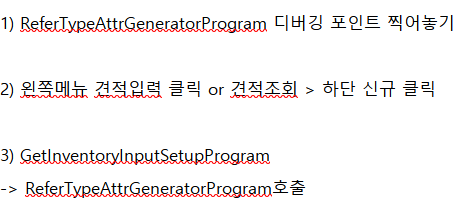
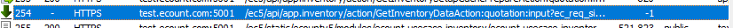
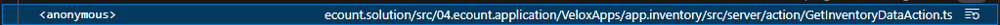
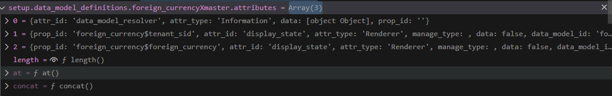
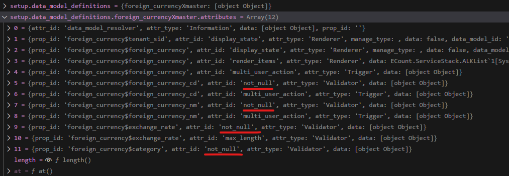
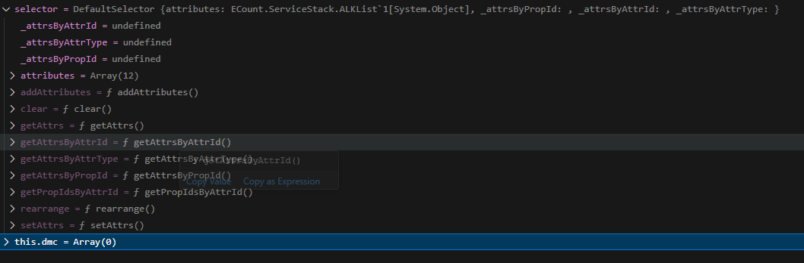
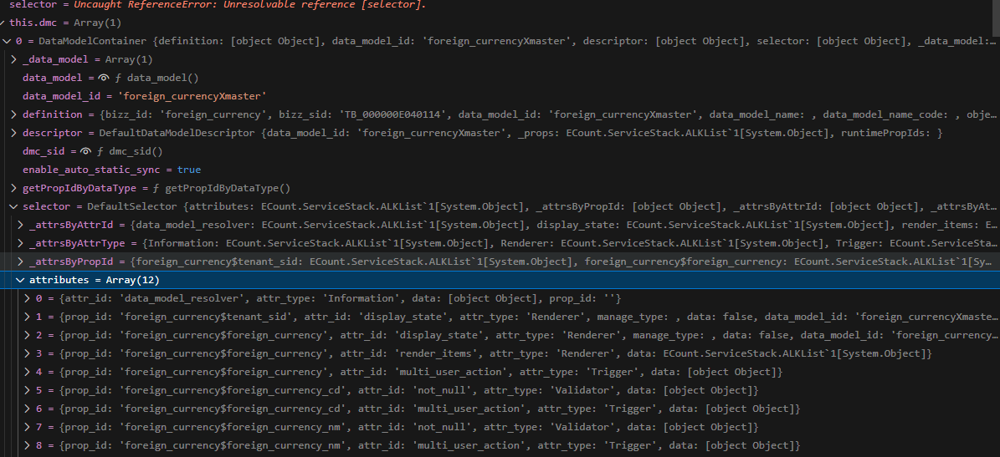
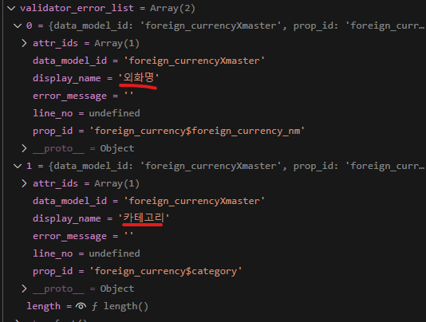

# Daily Retrospective

**작성자**: [김승준]  
**작성일시**: [2025-01-14]

## 1. 오늘 배운 내용 (필수)

-   generator 디버깅,
-   generator 구현 후 실습

## 2. 동기에게 도움 받은 내용 (필수)

-   **성범 책임님**께서 피들러 보는 것과 디버깅에서 콜스택을 확인하는 것을 알려주셨습니다.<br> 디버깅을 할 때 더 자세하게 확인할 수 있게 되었습니다.
-   동기분들과 디버깅을 같이 진행하기도 하고, 오류가 나는 부분, 비즈니스 로직 등 많은 토론을 하며 실습을 진행했습니다.<br> 제가 잘 모르는 부분에 대한 설명을 듣는 것과, 제가 알더라도 정리가 안된 부분을 설명을 하면서 다시 정리하게 되었습니다.<br> 동기분들이 많은 도움이 됩니다.
-   **현철님**께서 점심식사 이후 커피를 사주셨습니다. 점심을 배부르게 먹어 식곤증이 올 뻔했는데 커피덕에 무사히 넘겼습니다.
-   **다은님, 수경님, 주현님, 도형님, 민준님, 주원님, 연아님**과 저녁으로 생선구이를 먹었습니다. 오랜만에 먹는 생선 정말 맛있었습니다.

---

## 3. 개발 기술적으로 성장한 점 (선택)

아래의 3가지 주제 중 하나를 선택하여 작성합니다.

### 1. 교육 과정 상 배운 내용이 아닌 개인적 호기심을 해결하기 위해 추가 공부한 내용

### 2. 오늘 직면했던 문제 (개발 환경, 구현)와 해결 방법



위의 방식대로 디버깅을 진행하였습니다. `ReferTypeAttrGeneratorProgram`에는 들어갔으나, 호출 시점인 `GetInventoryInputSetupProgram`은 들어가지 않는 문제가 있었습니다. <br>
`GetInventoryInputSetupProgram`은 `GetInventorySetupAction`의

```ts
switch (data.menu_type) {
    case EN_MENU_TYPE.Input: {
        const program = ProgramBuilder.create<GetInventorySetupRequestDto, GetInventorySetupResultDto>(
            IGetInventoryInputSetupProgram,
            execution_context
        );
        result = program.execute(data);
        break;
    }
    ...
```

에서 호출된다는 것을 알았고, 해당 코드의 상단 executeSync 첫 라인에 break point를 찍었습니다. 하지만 디버그 상황에서는 action을 거치지 않고 `ReferTypeAttrGeneratorProgram`으로 진입했습니다. 그래서 fiddler를 통해 어떠한 api가 호출되는지 확인하고, 디버그 콘솔의 콜스택을 통해 어디서 호출되는지 확인했습니다.<br>


`GetInventoryDataAction`에서 머물러 있는 것을 확인했고, `ReferTypeAttrGeneratorProgram`에 진입한 것을 확인했습니다.<br>
그리고 피들러를 통해 `GetInventorySetupAction`은 이미 응답이 온 것을 확인했습니다.


`GetInventorySetupAction`의 코드에서

```ts
@_authorize({ authority_type: EN_AUTHORITY_TYPE.Access } as AuthorityDataDto)
@action_response_cache(get_inventory_setup_action)
export default class GetInventorySetupAction
	extends ApiActionBase<GetInventorySetupRequestDto, GetInventorySetupResultDto>
	implements IGetInventorySetupAction
{
```

`@_action_response_cache(get_inventory_setup_action)` 부분 때문에 action 내부로 들어가지 않는다고 추측했습니다.<br>
setup 정보가 이미 캐시돼서 action으로 진입하지 못한다면, setup을 바꾸면 될것이라 판단했습니다. 입력 양식을 변경하자 setupAction으로 진입하였습니다.

### 3. 위 두 주제 중 미처 해결 못한 과제. 앞으로 공부해볼 내용.

해결방법으로 `@_action_response_cache(get_inventory_setup_action)` 부분을 주석처리하여 빌드 후 시도했습니다.<br>
견적서 입력으로 들어가자 로그인이 풀리며, 튕겨져 나가는 것을 확인했습니다. 해당 데코레이터가 어떤 기능을 하고, 어떤 상황에 들어가는지 궁금증이 남아 조성준 팀장님에게 질문을 하였습니다.<br>해당 부분을 알아보시고 답변주신다고 하였으며, 지금 진행하는 부분과는 거리가 멀기 때문에 샘플소스로 구현 후 진행하라고 해주셨습니다.<br> 샘플 소스를 통해 generator를 이해하는 것이 우선이기 때문에 차후 해당 내용을 공부해보고 싶습니다.

-   `03.ecount.usecase\ecount.usecase.common\src\server\attr_generator\refer_type\not_null\foreign_currency_foreign_currency_cd_not_null_input.ts` 의 코드를 보면

    ```ts
    export const foreign_currency_foreign_currency_cd_not_null_input: IReferTypeAttrGenerator<validator_attrs.ip_single_condition_not_null> = (execution_context, setup, target) => {
        return {
            prop_id: target.prop.prop_id,
            attr_id: validator_attrs.not_null,
            attr_type: EN_ATTR_TYPE.Validator,
            data: { data: true, caller_type: [EN_EXECUTE_CALLER_TYPE.apply] },
        };
    };
    ```

    -   `ip_single_condition_not_null` : 왜 해당 타입을 사용했을까?,
        `01.ecount.fundamental\ecount.fundamental.define\src\attribute\validator\not_null.ts` 에서 아래 내용을 확인 할 수 있습니다.

    ```ts
    ...
    export type txt_condition_not_null = validator_base<boolean>;
    export const txt_condition_not_null = 'txt_condition_not_null';

    export type ip_single_condition_not_null = validator_base<boolean>;
    export const ip_single_condition_not_null = 'ip_single_condition_not_null';
    ...
    ```

    ip_single_condition이 무슨 의미인지는 모르지만 이름으로 볼때는 ip 관련 validator로 추측할 수 있는데, txt_condition을 사용하는게 더 알맞지 않나? 라는 의구심이 있습니다.

---

## 4. 소프트 스킬면에서 성장한 점 (선택)

개발적인 지식이 아닌, 한 명의 공동체 구성원으로서 성장한 내용을 작성합니다.
인내심, 협업, 질문 방식, 소통 태도, 적극성, 도메인 지식 등

---

## 5. 제안하고 싶은 내용

교육 운영, 방식, 생활 등 주제는 제한 없습니다.
EDT 팀원으로서 하루를 보내는 동안, "이 부분이 달랐다면 더 좋았겠는데?" 싶은 내용을 기록합니다.
"우리 이런 것도 있으면 좋겠어요." 라는 내용도 좋습니다.

이번 기수의 교육 과정을 더 풍성하게 만들 수 있거나, 다음 기수에 적용되면 좋을 내용을 자유롭게 작성해주시면 됩니다.

```

```

# 학습내용

## generator

### 소스코드 추가

`\03.ecount.usecase\ecount.usecase.common\src\server\program\TempExecuteSetupMainProgram.ts`

1. refer_type geneartor를 직접 돌려서 dmc에 generator를 통해 생성된 속성 정보를 추가해주는 임시 코딩

```ts
const smc_definition = this.smc.getDataModelDefinitions();
for (const dmc of this.smc.createDataModelContainer((def) => {
    const data_model_id = def?.data_model_id as string;
    const setup: ISetup = {
        tenant: {} as ITenant,
        user: {} as IUser,
        bizz: {} as IBizz,
        menu: {} as IMenu,
        function: [] as IFunction[],
        view_container: [] as IViewContainer[],
        data_model: {} as IDataModelMapper,
        data_model_definitions: {} as IDataModelDefinitionMapper,
    };

    const refer_type_attr_program = ProgramBuilder.create<ISetup, ISetup>(IReferTypeAttrGeneratorProgram, this.execution_context);

    setup.data_model_definitions[data_model_id] = def as IDataModelDefinition;
    refer_type_attr_program.execute(setup);

    const selector = new DefaultSelector(setup.data_model_definitions[data_model_id]?.attributes);

    return { selector };
})) {
    this.dmc.push(dmc);
}
```

2.  Validator 속성을 Generator로 추가

-   `03.ecount.usecase\ecount.usecase.common\src\server\attr_generator\refer_type\not_null\foreign_currency_foreign_currency_cd_not_null_input.ts`

    ```ts
    export const foreign_currency_foreign_currency_cd_not_null_input: IReferTypeAttrGenerator<validator_attrs.ip_single_condition_not_null> = (execution_context, setup, target) => {
        return {
            prop_id: target.prop.prop_id,
            attr_id: validator_attrs.not_null,
            attr_type: EN_ATTR_TYPE.Validator,
            data: { data: true, caller_type: [EN_EXECUTE_CALLER_TYPE.apply] },
        };
    };
    ```

    -   `ip_single_condition_not_null` : 왜 해당 타입을 사용했을까?,
        `01.ecount.fundamental\ecount.fundamental.define\src\attribute\validator\not_null.ts` 에서 아래 내용을 확인 할 수 있다.

    ```ts
    ...
    export type txt_condition_not_null = validator_base<boolean>;
    export const txt_condition_not_null = 'txt_condition_not_null';

    export type ip_single_condition_not_null = validator_base<boolean>;
    export const ip_single_condition_not_null = 'ip_single_condition_not_null';
    ...
    ```

    ip_single_condition이 무슨 의미인지는 모르지만 txt_condition을 사용하는게 더 알맞지 않나? 라는 궁금증이 있습니다.

-   `foreign_currency_exchange_rate_not_null_input.ts`

-   `foreign_currency_category_not_null_input.ts`

-   `foreign_currency_foreign_currency_nm_not_null_input.ts`

3. AttrList에 관련 prop과 속성 정보를 추가
   `\03.ecount.usecase\ecount.usecase.common\src\server\program\attr_generator\AttrList.ts`

    ```ts
    ...
    export const refer_type_attr_map: { [refer_type: string]: { [menu_type in EN_MENU_TYPE]?: string[] } } = {
        // ------관련 prop과 속성 정보-------
        foreign_currency_nm: {
            [EN_MENU_TYPE.Input]: [validator_attrs.not_null],
        },

        category: {
            [EN_MENU_TYPE.Input]: [renderer_attrs.view_type, renderer_attrs.render_items, validator_attrs.not_null],
        },
        foreign_currency_cd: {
            [EN_MENU_TYPE.List]: [trigger_attrs.user_action, renderer_attrs.view_type],
            [EN_MENU_TYPE.Input]: [validator_attrs.not_null],
        },
        exchange_rate: {
            [EN_MENU_TYPE.Input]: [validator_attrs.not_null, renderer_attrs.value_format, validator_attrs.max_length],
            [EN_MENU_TYPE.Upload]: [validator_attrs.max_length],
        },
        // -----------------------------
    ...
    ```

### 디버깅

```ts
for (const dmc of this.smc.createDataModelContainer((def) => {
    const data_model_id = def?.data_model_id as string;
    const setup: ISetup = {
        tenant: {} as ITenant,
        user: {} as IUser,
        bizz: {} as IBizz,
        menu: {} as IMenu,
        function: [] as IFunction[],
        view_container: [] as IViewContainer[],
        data_model: {} as IDataModelMapper,
        data_model_definitions: {} as IDataModelDefinitionMapper,
    };

    const refer_type_attr_program = ProgramBuilder.create<ISetup, ISetup>(IReferTypeAttrGeneratorProgram, this.execution_context);

    setup.data_model_definitions[data_model_id] = def as IDataModelDefinition;
    refer_type_attr_program.execute(setup); // *1.

    const selector = new DefaultSelector(setup.data_model_definitions[data_model_id]?.attributes); // *2.

    return { selector }; // *3.
})) {
    this.dmc.push(dmc);
    const debugingCheck = ""; // *4.
}
```

\*1. 

\*2. 

\*3. 

\*4. 

값이 잘 들어가는 것을 확인할 수 있습니다.

## validator

-   아래의 slipData(`nm:''`,`category:null`)로 create를 실행

```ts
import { ISlipDataModel } from "ecount.usecase.base/@abstraction";

export const slip_data_model = {
    action_mode: "NEW",
    bizz_sid: "TB_000000E040114",
    data_model: {
        foreign_currencyXmaster: [
            {
                foreign_currency$tenant_sid: "303101",
                foreign_currency$foreign_currency: { sid: "test_cd1", code: "test_cd1", name: "test_nm1" },
                foreign_currency$foreign_currency_cd: "test_cd1",
                foreign_currency$foreign_currency_nm: "",
                foreign_currency$exchange_rate: 1000,
                foreign_currency$category: null,
                foreign_currency$status_type: "",
            },
        ],
    },
    menu_sid: "TM_000000E040114",
    menu_type: "input",
} as ISlipDataModel;
```

에러 리스트에 외화명과 카테고리가 들어간 것을 볼 수 있다.


