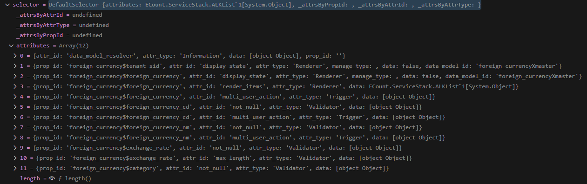

# Daily Retrospective

**작성자**: 나아연

**작성일시**: 2025-01-14

## 1. 오늘 배운 내용 (필수)

### refer_type에 맞는 attribute 만들기

attribute를 여러 곳에 공통으로 사용하고자 refer_type에 따라 attribute를 만들어주는 **generator** 라는 개념이 있다.

1. definition.prop의 refer_type/refer_group과 menu_type을 가지고 refer_type_attr_map/refer_group_attr_map에 정의된 attribute를 가져온다. attrs는 renderer_attrs, initializer_attrs, validator_attrs 등이 있다.

   ```ts
   // ecount.solution\src\03.ecount.usecase\ecount.usecase.common\src\server\program\attr_generator\ReferTypeAttrGeneratorProgram.ts

   const [refer_type, refer_group] = [_.vSafe(prop.refer_type), _.vSafe(prop.refer_group)];

   // map 형식으로 정의된 attribute 조회
   const refer_type_attrs = new Set(
     _.vConcat(
       [],
       ...(refer_type_attr_map[refer_type]?.[options.menu_type] ?? []),
       ...(refer_type_attr_map[refer_type]?.[EN_MENU_TYPE.All] ?? [])
     )
   );

   const refer_group_attrs = new Set(
     _.vConcat(
       [],
       ...(refer_group_attr_map[refer_group]?.[options.menu_type] ?? []),
       ...(refer_group_attr_map[refer_group]?.[EN_MENU_TYPE.All] ?? [])
     )
   );
   ```

   ```ts
   // ecount.solution\src\03.ecount.usecase\ecount.usecase.common\src\server\program\attr_generator\AttrList.ts

   foreign_currency: {
     [EN_MENU_TYPE.Input]: [
       renderer_attrs.display_name,
       renderer_attrs.writable,
       datamodel_trigger_attrs.subscribe_data_model,
       information_attrs.after_value_resolver,
       validator_attrs.max_length,
       renderer_attrs.value_format_in,
       renderer_attrs.value_format,
       renderer_attrs.render_items,
     ],
     [EN_MENU_TYPE.Upload]: [validator_attrs.max_length],
   },
   foreign_currency_cd: {
     [EN_MENU_TYPE.List]: [trigger_attrs.user_action, renderer_attrs.view_type],
     [EN_MENU_TYPE.Input]: [validator_attrs.not_null],
   },
   ```

2. refer_type/refer_group으로 찾은 attributes 목록을 순회하면서 generator가 존재하는지 확인하고, genenrator로 만든 attribute를 definition.attributes에 추가한다.

   ```ts
   // ecount.solution\src\03.ecount.usecase\ecount.usecase.common\src\server\program\attr_generator\ReferTypeAttrGeneratorProgram.ts

   for (const attr of all_attrs) {
    ...

    if (refer_type_attrs.has(attr)) // generator 찾기
      generator = generator_selector.refer_type(this.execution_context, refer_type, attr, {
        bizz_sid: options.bizz_sid,
        menu_type: options.menu_type,
      });

    if (!generator && refer_group_attrs.has(attr)) // generator 찾기
      generator = generator_selector.refer_group(this.execution_context, refer_group, attr, {
        bizz_sid: options.bizz_sid,
        menu_type: options.menu_type,
      });

    if (generator) { // generator 있다면
      definition.attributes ??= [];
      prop_attributes ??= selector.getAttrsByPropId(prop.prop_id);
      const attr = generator(this.execution_context, setup, { // generator 호출해 attribute 생성
        prop,
        attributes: prop_attributes,
        bizz_sid: options.bizz_sid,
        menu_type: options.menu_type,
        menu_sid: options.menu_sid,
        data_model_id: options.data_model_id,
      }) as IAttribute;

      if (attr && attr.data !== null) {
        attr.prop_id = prop.prop_id;
        definition.attributes.push(attr); // 유효한 attribute 추가
      }
    }
   }
   ```

   2-1. 넘겨받은 정보들을 조합하여 generator를 찾는다. 이때는 bizz_type, refer_type, attr_id, menu_type등을 사용해 **파일명**으로 generator를 탐색한다.

   ```ts
   // ecount.solution\src\03.ecount.usecase\ecount.usecase.common\src\server\util\generator_selector.ts

   export function refer_type(
     execution_context: IExecutionContext,
     refer_type: $$refer_type,
     attr_id: string,
     options?: {
       bizz_sid: string;
       menu_type?: EN_MENU_TYPE;
     }
   ): IReferTypeAttrGenerator<any> | undefined {
     const bizz_sid = options?.bizz_sid ?? execution_context.action.bizz_sid;
     const menu_type = options?.menu_type ?? execution_context.action.menu_type;

     const { bizz_id, bizz_type } = getBizzInfo(execution_context, bizz_sid);

     return (refer_type_gens[`${bizz_id}_${refer_type}_${attr_id}_${menu_type}` as keyof typeof refer_type_gens] ||
       refer_type_gens[`${bizz_id}_${refer_type}_${attr_id}` as keyof typeof refer_type_gens] ||
       refer_type_gens[
         `${bizz_type}_${refer_type}_${attr_id}_${execution_context.session.site}` as keyof typeof refer_type_gens
       ] ||
       refer_type_gens[`${bizz_type}_${refer_type}_${attr_id}_${menu_type}` as keyof typeof refer_type_gens] ||
       refer_type_gens[`${bizz_type}_${refer_type}_${attr_id}` as keyof typeof refer_type_gens] ||
       refer_type_gens[`${refer_type}_${attr_id}_${menu_type}` as keyof typeof refer_type_gens] ||
       refer_type_gens[`${refer_type}_${attr_id}` as keyof typeof refer_type_gens] ||
       refer_type_gens[`${attr_id}_${menu_type}` as keyof typeof refer_type_gens] ||
       refer_type_gens[attr_id as keyof typeof refer_type_gens]) as IReferTypeAttrGenerator<any>;
   }
   ```

   2-2. generator를 호출한다.

   ```ts
   // ecount.solution\src\03.ecount.usecase\ecount.usecase.common\src\server\attr_generator\refer_type\not_null\foreign_currency_foreign_currency_cd_not_null_input.ts (예시)

   export const foreign_currency_foreign_currency_cd_not_null_input: IReferTypeAttrGenerator<
     validator_attrs.ip_single_condition_not_null
   > = (execution_context, setup, target) => {
     return {
       prop_id: target.prop.prop_id,
       attr_id: validator_attrs.not_null,
       attr_type: EN_ATTR_TYPE.Validator,
       data: { data: true, caller_type: [EN_EXECUTE_CALLER_TYPE.apply] },
     };
   };
   ```

3. attributes로 selector를 생성한다.
   3-1. selector를 확인해보면 추가했던 attributes가 잘 들어가 있다.

   

### DataModelValidatorSvc.ts

data_model_valiator는 executeSetupMainProgram의 5번째 단계로, 유효성 검사를 진행한다.
검사할 유효성은 위에서 찾은 attribute를 사용한다.


1. validator를 찾는다.

   ```ts
   const validate = this._getCacheObject({
     data_model_id: dmc.data_model_id,
     cache_key: `${bizz_type}_${descriptor?.data_type}_${attr.attr_id}_${descriptor.refer_type}_${data.menu_type}_validator`,
     callback: () =>
       validators.getValidator(
         descriptor.data_type || "",
         attr.attr_id,
         descriptor.refer_type,
         this.execution_context.action.menu_type,
         bizz_type
       ),
   });
   ```

2. validate를 수행한다.

   ```ts
   const vResult = validate(data.data_model_container.getValueByPropId<string>(attr.prop_id, i) ?? "", validate_data);
   ```

3. 유효성 검사에 문제가 있다면 에러를 발생시킨다.

   ```ts
   const isNoProblem = typeof vResult === "boolean" ? vResult : vResult.status;
   error_message = typeof vResult === "boolean" ? undefined : vResult.error_message;
   if (is_continue && !isNoProblem) {
     exception_map.set(attr.prop_id, {
       data_model_id: dmc.data_model_id,
       prop_id: attr.prop_id,
       attr_ids: [...(exception_map.get(attr.prop_id)?.attr_ids ?? []), attr.attr_id],
       error_message: [...(exception_map.get(attr.prop_id)?.error_message ?? []), error_message ?? ""],
       line_no,
       display_name: descriptor.prop_name,
     });
   }
   ```

## 2. 동기에게 도움 받은 내용 (필수)

- 민준님께서 generator에 대한 강의를 진행해주셨습니다.
- 강민님께서 프로그램 탭을 분리하는 윈도우 설정을 알려주셨습니다.
- 연아님, 주원님께서 라면을 나눠주셨습니다.

## 3. 개발 기술적으로 성장한 점 (선택)

### 2. 오늘 직면했던 문제 (개발 환경, 구현)와 해결 방법

- generator 과제를 구현했지만, selector attributes에 일부 attributes가 누락된 것을 확인했습니다. 모두 누락된 것이 아니라 일부였기에 generator에 대한 이해가 틀린 것은 아니라고 예측하며 다시 확인했습니다. 원인은 generator_selector.refer_type에 추가해야 하는 값을 generator_selector.refer_group에 추가한 것이었습니다. 하나의 파일에서 관리하고 값들이 많다보니 발생한 실수라고 생각합니다. 그리고 오류가 발생하지 않기에 디버깅이 더욱 어려웠던 것을 기억해 다음에는 꼼꼼하게 체크하는 습관을 들여야겠다고 생각했습니다.

### 3. 위 두 주제 중 미처 해결 못한 과제. 앞으로 공부해볼 내용.

- refer_type과 menu_type에 따라 속성을 정의해놓은 AttrList.ts과 파일명으로 generator를 찾는 generator_selector.ts를 학습했습니다.
- generator를 찾기 위해 두 단계를 거치고 있다는 생각이 들었습니다. 그리고 파일명으로 generator를 관리했을 때 오타를 유의해야하고 디버깅에 어려움이 있지 않을까 생각했습니다. 해당 방식의 장점과 단점에 대해 내일 더 학습하고자 합니다.
