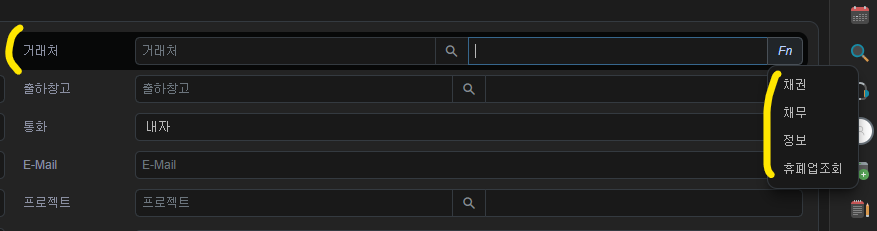
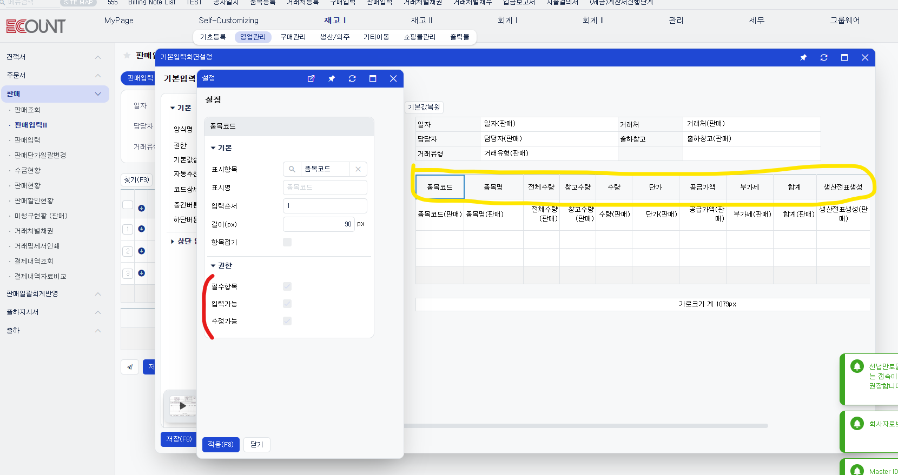
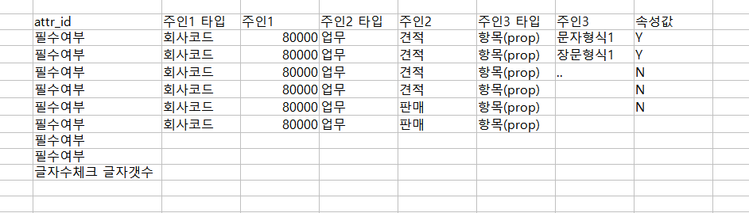
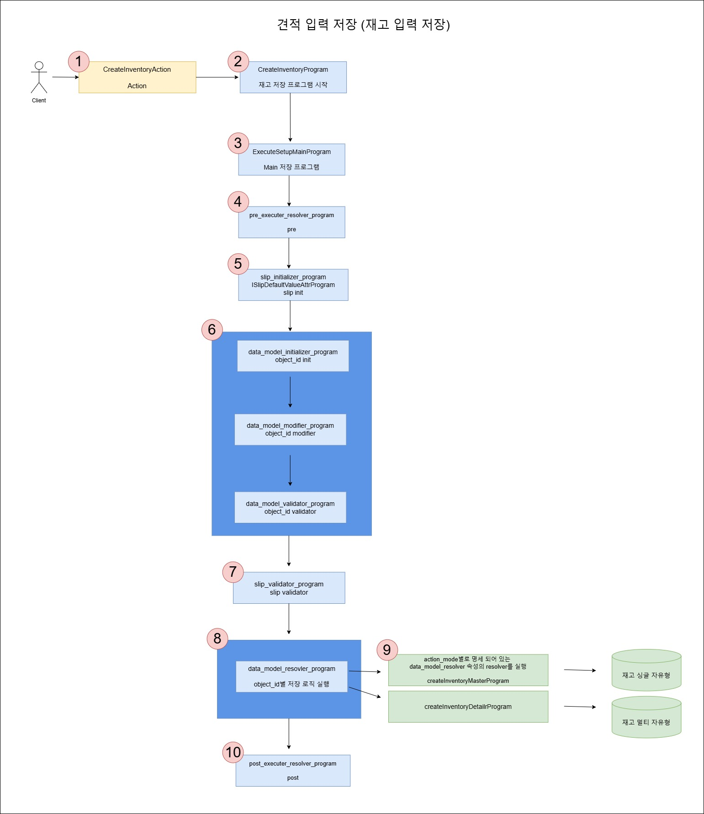
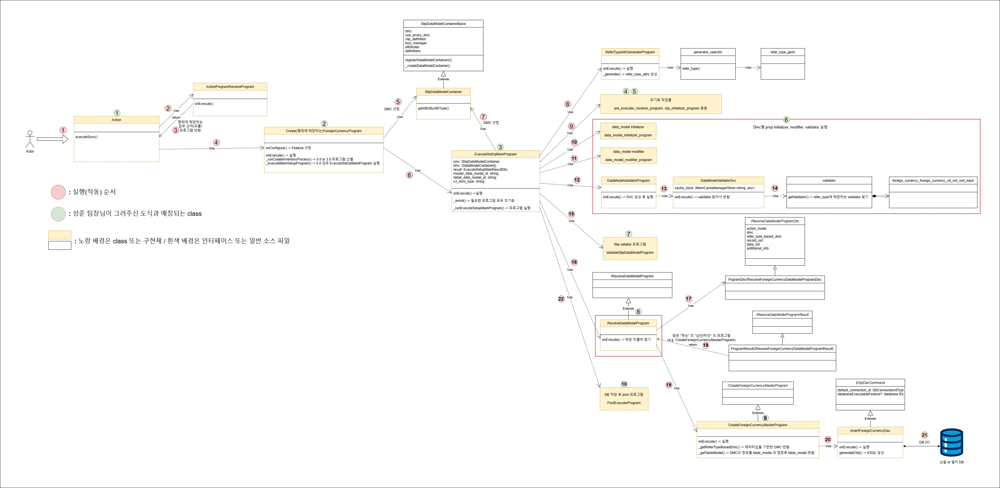

# Daily Retrospective

**작성자**: [박주현]  
**작성일시**: [2025-01-14]

# 1. 오늘 배운 내용

## 1️⃣ Refer Type Attr Generator Program 을 이용하며 Refer Type 의 속성을 설정하는 걸 구현해 보았습니다.

여러 곳에서 재사용되는 속성이 있습니다. 이를 Refer Type 으로 묶어 재사용할 수 있습니다. 정확한 예시가 아닐 수 있지만, 비슷한 느낌의 예시를 들겠습니다. 재고의 "견적"과 "판매" 업무의 상단엔 거래처 코드가 있고, fn으로 기능이 있습니다.



이를 각각의 업무의 상단의 속성으로 명세해두면 코드가 중복되며, 재사용을 하지 못합니다. 이를 위해서 refer type 으로 묶고 refer type 만 들고 있는다면 그리고 나중에 이 refer type 을 풀어 속성값을 넣어주는 기능만 있다면 refer type 설정을 재활용할 수 있습니다.

```ts
const smc_definition = this.smc.getDataModelDefinitions();
for (const dmc of this.smc.createDataModelContainer((def) => {
  //3.0 양식 정보를 조회 -> 5.0 속성 컨버팅 -> dmc 속성으로 추가
  // 파일에서 가정왔다는 가정으로 로직 작성
  const data_model_id = def?.data_model_id as string;
  const setup: ISetup = {
    tenant: {} as ITenant,
    user: {} as IUser,
    bizz: {} as IBizz,
    menu: {} as IMenu,
    function: [] as IFunction[],
    view_container: [] as IViewContainer[],
    data_model: {} as IDataModelMapper,
    data_model_definitions: {} as IDataModelDefinitionMapper,
  };

  const refer_type_attr_program = ProgramBuilder.create<ISetup, ISetup>(
    IReferTypeAttrGeneratorProgram,
    this.execution_context
  );

  setup.data_model_definitions[data_model_id] = def as IDataModelDefinition;
  refer_type_attr_program.execute(setup);

  const selector = new DefaultSelector(
    setup.data_model_definitions[data_model_id]?.attributes
  );

  return { selector };
})) {
  this.dmc.push(dmc);
}
```

위 로직을 통해 refer_type_attr_program을 생성하고 execute 합니다. refer_type_attr_program은 generator_selector 을 통해 refer_type 에 따른 속성 값을 찾을 수 있게 됩니다. 반환된 속성들은 dmc 의 기존의 data_model의 속성에 push되어 속성 초기화 셋팅이 완료 되게 됩니다. 위 소스 코드에서 가장 마지막 줄의 작업입니다.

이렇게 속성들을 data_model을 셋팅해두면 어디서 확인하게 될까요? 바로 data_model_validator_program 입니다.

```ts
//-------------------------------------------------------
// [#5] data_model validator
//----------------------------------------
const validator_result = data_model_validator_program.execute({
  data_model_container: dmc,
  menu_type,
});
```

이 프로그램에서 각각 data_model에 셋팅해둔 속성들을 밸리데이션 하게 됩니다.
data_model_validator_program 은 svc만 생성하여 호출하는 역할을 합니다.

```ts
const svc = SvcCommandBuilder.create(
  DataModelValidatorSvc,
  this.execution_context
);
const result = svc.execute(dto);
```

DataModelValidatorSvc 에서 가장 유심히 봐야할 곳은 validators.getValidator() 부분입니다. 만약 캐싱이 되어 있다면 캐싱되어 있는 값을 들고오고 그렇지 않다면 validators.getValidator() 로직을 타게 됩니다. validators.getValidator() 은 validators 을 통해서 validator 를 가져오게 됩니다.

validators 모든 설정들을 맵 형식으로 다 갖게 되고, 우리가 만든 파일을 경로를 통해 찾아 일치하는 validator 를 반환하게 됩니다.
`${bizz_type}_${data_type}_${attr_id}_${refer_type}` 파일에 대한 경로는 상위 개념부터 하위 개념을 언더바를 통해 구분하게 됩니다.

```ts
import { validator_attrs } from "ecount.fundamental.define/attribute";
import {
  EN_ATTR_TYPE,
  EN_EXECUTE_CALLER_TYPE,
} from "ecount.fundamental.define/enum";
import { IReferTypeAttrGenerator } from "ecount.usecase.common/@abstraction";

export const foreign_currency_foreign_currency_cd_not_null_input: IReferTypeAttrGenerator<
  validator_attrs.ip_single_condition_not_null
> = (execution_context, setup, target) => {
  return {
    prop_id: target.prop.prop_id,
    attr_id: validator_attrs.not_null,
    attr_type: EN_ATTR_TYPE.Validator,
    data: { data: true, caller_type: [EN_EXECUTE_CALLER_TYPE.apply] },
  };
};
```

위는 우리가 설정해둔 foreign_currency_foreign_currency_cd_not_null_input.ts 파일 입니다. 여기서 foreign_currency를 비즈 타입으로 가정했기 때문에 `foreign_currency` 이 bizz_type 이고, `foreign_currency_cd`이 data_type 이고, `not_null` 이 attr_id 이고, `input`이 refer_type에 해당하게 됩니다.

이를 통해 얻은 validator 를 통해 밸리데이션을 할 수 있게 됩니다.

---

# 2. 동기에게 도움 받은 내용

오늘도 동기들과 단체로 문제를 해결하였습니다. 특히나 수경님, 주원님, 민준님께 도움을 받았습니다. 민준님께서 여러 사람에게 refer_type 의 흐름에 대해 설명해 주셨습니다. 서로 상부상조하는 분위기 속에서 성장하고 있다는 걸 느낍니다. 강민님도 기술적인 도움 뿐 아니라 윈도우 설정같은 부가적인 도움도 주셨습니다. 짝궁인 건호님도 도표를 그리는데에 서로 서로 디버깅 결과를 공유하며 도움을 얻었습니다. 현철님껜 ui 상에서 prop 과 attr 의 차이를 여쭤봐 공부했습니다.

---

# 3. 개발 기술적으로 성장한 점

## 3-1. 교육 과정 상 배운 내용이 아닌 개인적 호기심을 해결하기 위해 추가 공부한 내용

### (1) prop 과 attr 의 차이

5.0 소스코드를 개발공부하다보니 다시 개념적인 부분을 잊게 됐습니다. 흐릿한 기억을 또렷하게 하기 위해 현철님께 ui 상에서 둘의 차이점을 여쭤보고 학습했습니다.



우리 둘에 보이는 항목들은 모두 항목입니다. 즉 prop 입니다. 이 prop을 설정할 수 있는데, 이 하나하나 설정할 수 있는 속성값이 "속성" 즉 "attribute"입니다. 위 그림에선 `필수여부` 가 attr 이고 체크됨과 안됨을 통해 true or false 가 값 즉 value 입니다. 제우스 서버에 run 된 애플리케이션의 설정에 따르면 재고의 판매의 입력의 품목코드 항목은 3가지 속성이 있고, 지금 모두 false 를 갖고 있습니다.

이 때 궁금증이 생겼습니다. 이런 속성 들은 그럼 컬럼으로 관리되나? 현철님이 ERD를 간략하게 보여주셨는데, 그렇지 않았습니다. 하나의 속성이 테이블로 구성되어 있습니다. 그리고 컬럼으로 그의 주인들이 설정돼 있습니다.



그렇다면 궁극적으로 5.0이 개발된다면, 사용자가 이런 항목과 속성들을 추가 하게 될텐데, 이렇게 속성을 추가 하면 테이블이 더 만들어지는 것인가? 의문을 가졌습니다.
현철님은 그렇지 않고, 그런 추가 속성들은 양식 테이블에 개별 ROW 로 들어가게 된다고 하셨습니다. 말로는 이해가 됐지만, 직관적인 이해는 부족한 거 같습니다. ERD를 보며 조금 더 이해를 높여야겠다는 생각을 했습니다.

### (2) 5.0 개발 과정 도식화

오늘 CRUD 구현을 빨리 끝내 배운 내용을 한번 정리 해보는 시간을 가질 수 있었습니다. Action 부터 DB 저장까지 CREATE 기능만을 특정지어 작업을 해봤습니다. UPDATE, DELETE 또한 기능 이름만 다를 뿐 똑같이 동작하게 됩니다.

먼저 만든 도표를 보기 전에 지난 번 성준 팀장님께서 그려주신 도식을 이해해야합니다.



<br>

`재고 입력` 기능을 예시로 그림을 그려주셨고, 이것이 하나의 API 의 전체 흐름입니다. 그리고 저희가 외화 코드를 만들면서 직접 구현한 도식은 아래와 같습니다.
<br>



```
화질구지는 이미지를 클릭하여 확대해주세요.
```

<br>

초록 숫자는 성준 팀장님이 주신 도식과 매칭되는 class 들이고, 빨간 숫자는 하나의 기능이 실행되는 호출되는 순서입니다.

오늘은 8번 기능과 12번 기능에 대해서 구현해보며 이해를 높였습니다.
도표는 클래스다이어그램을 기반으로 그려 어떤 인터페이스를 상속받는지 알 수 있게 하였고, 실행되는 중요 메소드들은 명시해줬습니다.

앞으로는 Action 부분만을 구현하면 될 것 같습니다. ESQL 까지 모두 구현이 끝나 UI 에서 오는 요청을 DB까지 끝까지 반영하는 하나의 큰 로직을 만들 수 있을 것 같습니다.

---

# 4. 소프트 스킬면에서 성장한 점

오늘은 김밥이 아닌 외부 밥집에서 점심을 먹었습니다. 고덕에 맛있는 한식집이 많이 생겼으면 좋겠습니다. 회사에서 한식 뷔페와 MOU를 체결하여 한달 정기 식권으로 한식뷔페에서 식사했으면 좋겠다는 생각을 해보았습니다.

---

# 5. 제안하고 싶은 내용

한팀을 이뤄 하나의 JOB 을 해보는 방식이 너무 좋다고 생각합니다. 특히나 수습기간이 끝나더라도 가시적인 결과가 있다면 일정관리 JOB 을 하나의 팀으로 끝까지 구현한다는 점이 매우 만족스러운 것 같습니다. 실무와 연관된 프로젝트이기도 하면서 신입 수준에서 시작부터 하나의 성취 및 성과를 쌓고 팀에 배정될 수 있다는 점이 너무 좋게 생각됐습니다.
