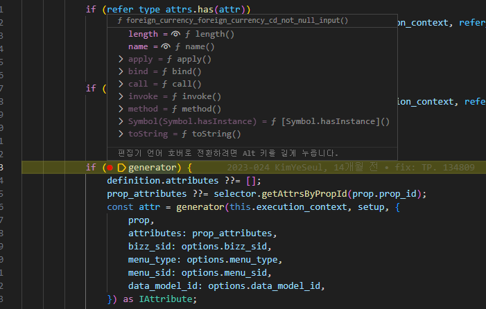
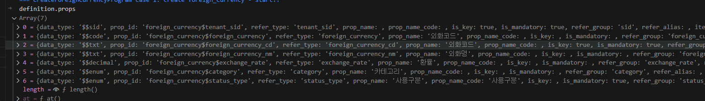

# Daily Retrospective

**작성자**: [설다은]  
**작성일시**: [2025-01-14]

## 1. 오늘 배운 내용 (필수)

**[전체적인 흐름의 이해]**<br>
이전에는 큰 틀만 이해하고 넘어갔었는데, 오늘은 실제로 어디에서 어떤 파일을 호출하는건지 + 어디서 값이 어떻게 들어오는건지를 파악했다.

※ foreign_currency의 create기준

_1. CreateForeignCurrencyProgram.Spec.ts_<br>
역할 : UI를 사용하지 않아도 서버에서 데이터의 CUD를 실행시킬 수 있도록 하는 테스트 파일

```ts
// 03.ecount.usecase\ecount.usecase.tutorials\src\server\@test\@src.cases\program\CreateForeignCurrencyProgram\CreateForeignCurrencyProgram.spec.ts
const program = ProgramBuilder.create<ExecuteSetupMainRequestDto, ApiRequestDto>(ICreateForeignCurrencyProgram, execution_context);
const result = program.execute(slip_dto); // CreateForeignCurrencyProgram프로그램을 실행시킴
```

_2. CreateForeignCurrencyProgram.ts (≒ CreateInventoryProgram.ts)_<br>
역할 : Action이 들어오면 bizz_type(foreign_currency), bizz_id(foreign_currency), action_mode(Create)를 파악하여 돌아야하는 프로그램 진입점을 찾아감.

```ts
protected onExecute(request: ExecuteSetupMainRequestDto): ExecuteSetupMainResultDto {
this.result = this._executeMainSetupProgram(request);
return this.result;

}

private _executeMainSetupProgram(request: ExecuteSetupMainRequestDto): ExecuteSetupMainResultDto {
const program = ProgramBuilder.create<ExecuteSetupMainRequestDto, ExecuteSetupMainResultDto>(
ITempExecuteSetupMainProgram,
this.execution_context
);

// SlipDataModelContainer를 통해 ★smc을 생성★하여 request.derive_info.smc에 할당함.
request.derive_info.smc = new SlipDataModelContainer(this.execution_context, request.slip_data_model);
return program.execute(request); // TempExecuteSetupMainProgram프로그램을 실행시킴
}
```

_3. TempExecuteSetupMainProgram.ts (≒ ExecuteSetupMainProgram.ts)_<br>
역할 : setup하는데 돌아야하는 프로그램을 순차적으로 실행하고와~라고 할 일을 배분함 (ex. Create Program -> Pre_executor resolver -> data_model initializer -> ...)

```ts
private _runExecuteSetupMainProgram(request: ExecuteSetupMainRequestDto): void {
    //------------------------------------------------------------------------
    // [#0] create program
    //------------------------------------------------------------------------
    const {
        slip_validator_program,
        data_model_initializer_program,
        data_model_modifier_program,
        data_model_validator_program,
        data_model_resolver_program,
        pre_executer_resolver_program,
        post_executer_resolver_program,
    } = this._createProgram(this.execution_context);

    const { action_mode, menu_type, data_dt, data_no, data_sid } = request.slip_data_model;
    const slip = {
        action_mode,
        menu_type,
        data_dt,
        data_no,
        data_sid,
        bizz_sid: this.smc.getSlipDefinition().bizz_sid,
        data_model: this.smc.getSlipDataModel(),
    } as ISlipDataModel;

    const smc_definition = this.smc.getDataModelDefinitions();
    // smc를 순회하면서 dmc값을 dmc배열에 push함
    for (const dmc of this.smc.createDataModelContainer((def) => {
        const data_model_id = def?.data_model_id as string;
        const setup: ISetup = {
            tenant: {} as ITenant,
            user: {} as IUser,
            bizz: {} as IBizz,
            menu: {} as IMenu,
            function: [] as IFunction[],
            view_container: [] as IViewContainer[],
            data_model: {} as IDataModelMapper,
            data_model_definitions: {} as IDataModelDefinitionMapper,
        };

        const refer_type_attr_program = ProgramBuilder.create<ISetup, ISetup>(
            IReferTypeAttrGeneratorProgram,
            this.execution_context
        );

        setup.data_model_definitions[data_model_id] = def as IDataModelDefinition;
        refer_type_attr_program.execute(setup);

        const selector = new DefaultSelector(setup.data_model_definitions[data_model_id]?.attributes);

        return { selector };
    })) {
        this.dmc.push(dmc);
    }
    ...
//------------------------------------------------------------------------
// [#8] data_model resolver
//------------------------------------------------------------------------
// 상단 / 하단 단위로 처리
const slip_created_result: { [key: string]: IResolveInventoryDataModelProgramResult } = {};
const return_data_model: IArrayDataModelMapper = {};
_.vForEach(this.dmc, (dmc) => {
// DataModel을 생성함.
const data_model = dmc.getDataModel();
        /*
        어떻게 해당하는 data_model_resolver가 실행되는지?
        1. data_model_resolver_program.execute가 실행되면 ResolveInventoryDataModelProgram으로 간다.
            onExecute(dto: ProgramDto): ProgramResult {
            const action_mode = dto.action_mode as unknown as string;
            const resolver = dto.dmc.getAttrByAttrId<definition_attrs.info.data_model_resolver>(
            definition_attrs.info.data_model_resolver,
            '' //defintion의 attribute는 prop_id가 빈값이다.

        2. reslover는 data_model_definition의 attributes에 data_model_resolver인 것을 보면 알 수 있다.
            이거는 현재의 data_model_definition인 Obejects > Master를 들어가보면 안다.
            attributes: [
                {
                    attr_id: definition_attrs.info.data_model_resolver,
                    attr_type: EN_ATTR_TYPE.Information,
                    data: {
                        [EN_ACTION_MODE.Create]: 'ICreateForeignCurrencyMasterProgram',
                        [EN_ACTION_MODE.Modify]: 'IModifyForeignCurrencyMasterProgram',
                        [EN_ACTION_MODE.Delete]: 'IModifyStatusForeignCurrencyMasterProgram',
                        [EN_ACTION_MODE.Remove]: 'IDeleteForeignCurrencyMasterProgram',
                    } as definition_attrs.info.data_model_resolver,
                    prop_id: '',
                },
            ],

        3. 그럼 저 reslover중에 현재의 action_mode('NEW')와 일치하는 CreateForeignCurrencyMasterProgram이 실행된다.
        */
    });
        slip_created_result[dmc.data_model_id] = data_model_resolver_program.execute({
            action_mode: slip.action_mode,
            dmc,
            data_sid: slip.data_sid,
        });

        return_data_model[dmc.data_model_id] = data_model as [{ [prop_id: string]: any }];
    };

    this.result.slip_created_result = slip_created_result;
    this.result.data_model = return_data_model;

    //------------------------------------------------------------------------
    // [#10] 개별 전표 저장후
    //------------------------------------------------------------------------
    post_executer_resolver_program.execute({
        definitions: smc_definition,
        slip_attributes: this.smc.getAttrsByAttrType(EN_ATTR_TYPE.PostExecuter),
        slip_data_model: slip,
        dmcs: this.dmc,
    });

```

_4. CreateForeignCUrrencyMasterProgram.ts (≒ CreateInventoryMasterProgram.ts)_<br>
역할 : 입력화면 상단에 필요한 로직들을 실행시켜주는 대빵 /

```ts
@_transaction(TransactionOption.Required) // 만약 insert에 실패하면 해당 트렌젝션을 롤백할 수 있도록 하는 것
protected onExecute(
dto: IResolveForeignCurrencyDataModelProgramDto
): IResolveForeignCurrencyDataModelProgramResult {
const refer_type_based_dmc = this._getReferTypeBasedDmc(dto);
// dmc.data_model을 table_model로 만드는 작업
const req = this._getTableModel(refer_type_based_dmc);
// InsertForeignCurrencyDac을 실행해서 dac에 넣는다.
const dac = DacCommandBuilder.create(InsertForeignCurrencyDac, this.execution_context, DbConnectionId.PG.BASE);
dac.execute(*.vFirst(req) as pg.foreign_currency_20250110_sde_ecback);
return true;
}
```

_5. InsertForeignCurrencyDac.ts_<br>
역할 : esql을 실행시켜 데이터를 DB에 담음

```ts
export class InsertForeignCurrencyDac extends ESqlDacCommand<pg.foreign_currency_20250110_sde_ecback, void> {
  constructor(execution_context: IExecutionContext) {
    super(execution_context, DbConnectionId.PG.BASE);
  }
  protected generateESql(data: pg.foreign_currency_20250110_sde_ecback): $Statement {
    const esql = $ESql
      .insert<pg.foreign_currency_20250110_sde_ecback>(pg.foreign_currency_20250110_sde_ecback, data)
      .value((t) => t.tenant_sid, this.execution_context.session.tenant_sid);
    return esql;
  }
  protected onExecute(db: $Database, esql: $Statement): void {
    db.expressionSql(InsertForeignCurrencyDac, esql).execute();
  }
}
```

**[generator 이해]**<br>

실습상황 : 발주요청 입력을 클릭하여 GetInventoryDataAction이 실행되고 화면을 그려주기 위해 필요한 속성을 generator를 통해 만들어서 렌더링 해준다.

_1. GetInventoryInputDataProgram.ts_<br>

```ts
/** refer type generator program 호출  */
private _executeReferTypeGenerator(setup: ISetup): void {
    const start = Date.now();
    const refer_type_attr_program = ProgramBuilder.create<IAttrGeneratorProgramRequestDto, ISetup>(
        IAttrGeneratorProgram,
        this.execution_context
    );
    // target_attrs, target_refer_types는 개발자가 직접 세팅하는 것
    const target_attrs = [renderer_attrs.render_items, validator_attrs.limit_date, renderer_attrs.value_format];
    const target_refer_types: Set<string> = new Set([
        'foreign_currency', // render_itemsP
        'trx_type', // render_items
        'data_dt', // limit_date
        'data_dt_no', // limit_date
        'supply_amt', // value_format
    ]);
    const target_refer_groups: Set<string> = new Set([]);

    const target_data_model = [this.data_model_ids.master, this.data_model_ids.detail];
    // target_data_moodel에 있는 data_model_id를 돌면서 해당 data_model에 있는 props를 뽑고, filter를 거져 target_refer_types가 있는지 거른다.
    // why? -> target_refer_types가 아니면 refer_type_attr_program.execute이 돌 필요가 없으므로 데이터를 작게 만듦
    _.vForEach(target_data_model, (data_model_id) => {
        const props = setup.data_model_definitions[data_model_id]?.props;
        const refer_type = props.filter((prop) => target_refer_types.has(prop.refer_type as string));
        const refer_group = props.filter((prop) => target_refer_groups.has(prop.refer_group as string));
        // 해당하는 refer_type들만으로 props를 만듦
        setup.data_model_definitions[data_model_id].props = _.vConcat(refer_type, refer_group);
    });

    refer_type_attr_program.execute({
        setup: setup,
        generator_type_list: [EN_GENERATOR_TYPE.REFER_TYPE],
        attr_map: new Map([[EN_GENERATOR_TYPE.REFER_TYPE, target_attrs]]),
    });
    const end = Date.now();
    const res = end - start;
    console.log(res);
```

_2. AttrGeneratorProgram.ts_<br>

```ts
...
private _executeGeneratorReferType(setup: ISetup, attr_list: any[], generator_type: EN_GENERATOR_TYPE): ISetup {
if (!this._program_map.has(generator_type)) {
    throw new Exception('there is no such generator type');
}

const program_identifier = this._program_map.get(generator_type) as ProgramIdentifier;

const program = ProgramBuilder.create<IReferTypeAttrGeneratorProgramDto, ISetup>(
    program_identifier,
    this.execution_context
);
// ReferTypeAttrGeneratorProgram을 실행한다.
const result = program.execute({ setup, options: { attr_list } });
return result;
}
```

_3. ReferTypeAttrGeneratorProgram.ts_<br>

```ts
onExecute(setup: ISetup): ISetup;
onExecute(dto: IReferTypeAttrGeneratorProgramDto): ISetup;
onExecute(setupOrDto: ISetup | IReferTypeAttrGeneratorProgramDto): ISetup {
    const { setup, options: dto_options } = this._getDto(setupOrDto);

    const default_options = this._getDefaultOptions(dto_options);

    for (const [data_model_id, definition] of _.vEntries(setup.data_model_definitions)) {
        const selector = new DefaultSelector(definition.attributes);
        const { use: definition_use, options: definition_options } = this._getDefinitionOptions(
            setup,
            data_model_id,
            default_options,
            selector
        );
        if (!definition_use) continue;
        // definition.props는 target_refer_types 순회하면서 generator생성해야하는 것들 뽑기.
        for (const prop of definition.props) {
            const { use: prop_use, options: prop_options } = this._getPropOptions(
                data_model_id,
                prop,
                definition_options
            );
            if (!prop_use) continue;

            this._generate(prop, definition, setup, prop_options, selector);
        }
    }

    return setup;
}

/* -------------------------------------------------------------------------- */
/*                                  GENERATE                                  */
/* -------------------------------------------------------------------------- */
protected _generate(
    prop: IPropDefinition,
    definition: IDataModelDefinition,
    setup: ISetup,
    options: TPropOptions,
    selector: DefaultSelector
) {
    const [refer_type, refer_group] = [_.vSafe(prop.refer_type), _.vSafe(prop.refer_group)];
    // refer_type의 attrs목록 뽑아서 합치기
    const refer_type_attrs = new Set(
        _.vConcat(
            [],
            ...(refer_type_attr_map[refer_type]?.[options.menu_type] ?? []),
            ...(refer_type_attr_map[refer_type]?.[EN_MENU_TYPE.All] ?? [])
        )
    );

    const refer_group_attrs = new Set(
        _.vConcat(
            [],
            ...(refer_group_attr_map[refer_group]?.[options.menu_type] ?? []),
            ...(refer_group_attr_map[refer_group]?.[EN_MENU_TYPE.All] ?? [])
        )
    );

    const all_attrs = new Set(_.vConcat([], ...refer_type_attrs, ...refer_group_attrs));

    if (all_attrs.size == 0) {
        return;
    }

    let prop_attributes: IAttribute<any>[];
    // all_attrs 순회하면서 target_attrs가 있는지 확인
    for (const attr of all_attrs) {
        if (options.attr_list_set && options.attr_list_set.has(attr) === false) {
            continue;
        }

        let generator: IReferTypeAttrGenerator<any> | undefined = undefined;
        /*
        // generator_selector.ts에서 return부분 우선순위대로 파일이 있는지 확인
            export function refer_type(
            execution_context: IExecutionContext,
            refer_type: $$refer_type,
            attr_id: string,
            options?: {
                bizz_sid: string;
                menu_type?: EN_MENU_TYPE;
            }
            ): IReferTypeAttrGenerator<any> | undefined {
            const bizz_sid = options?.bizz_sid ?? execution_context.action.bizz_sid;
            const menu_type = options?.menu_type ?? execution_context.action.menu_type;

            const { bizz_id, bizz_type } = getBizzInfo(execution_context, bizz_sid);

            // 해당 우선순위대로 파일을 찾는다.
            // refer_type_gens는 03.ecount.usecase\ecount.usecase.common\src\server\attr_generator\refer_type\index.ts 파일 여기서 또 타고 들어갈 수 있음.
                return (refer_type_gens[`${bizz_id}_${refer_type}_${attr_id}_${menu_type}` as keyof typeof refer_type_gens] ||
                refer_type_gens[`${bizz_id}_${refer_type}_${attr_id}` as keyof typeof refer_type_gens] ||
                refer_type_gens[`${bizz_type}_${refer_type}_${attr_id}_${execution_context.session.site}` as keyof typeof refer_type_gens] ||
                refer_type_gens[`${bizz_type}_${refer_type}_${attr_id}_${menu_type}` as keyof typeof refer_type_gens] ||
                refer_type_gens[`${bizz_type}_${refer_type}_${attr_id}` as keyof typeof refer_type_gens] ||
                refer_type_gens[`${refer_type}_${attr_id}_${menu_type}` as keyof typeof refer_type_gens] ||
                refer_type_gens[`${refer_type}_${attr_id}` as keyof typeof refer_type_gens] ||
                refer_type_gens[`${attr_id}_${menu_type}` as keyof typeof refer_type_gens] ||
                refer_type_gens[attr_id as keyof typeof refer_type_gens]) as IReferTypeAttrGenerator<any>;
                }
        */
        if (refer_type_attrs.has(attr))
            generator = generator_selector.refer_type(this.execution_context, refer_type, attr, {
                bizz_sid: options.bizz_sid,
                menu_type: options.menu_type,
            });

        if (!generator && refer_group_attrs.has(attr))
            generator = generator_selector.refer_group(this.execution_context, refer_group, attr, {
                bizz_sid: options.bizz_sid,
                menu_type: options.menu_type,
            });

        if (generator) {
            definition.attributes ??= [];
            prop_attributes ??= selector.getAttrsByPropId(prop.prop_id);
            const attr = generator(this.execution_context, setup, {
                prop,
                attributes: prop_attributes,
                bizz_sid: options.bizz_sid,
                menu_type: options.menu_type,
                menu_sid: options.menu_sid,
                data_model_id: options.data_model_id,
            }) as IAttribute;

            if (attr && attr.data !== null) {
                attr.prop_id = prop.prop_id;
                // data_model_definition > attributes > attr목록에 해당 generator로 생성한 것을 push함
                definition.attributes.push(attr);
            }
        }
    }
}
```

## 2. 동기에게 도움 받은 내용 (필수)

**민준님**
Generator 디버깅을 통해서 어떻게 실행되는지 흐름을 설명해주셨습니다. 덕분에 큰 틀과 그 안에 타고타고 들어가는 상세한 로직을 이해할 수 있었습니다.<br>
이걸 토대로 스스로 디버깅하면서 더 이해해봐야겠습니다.

**지은님**
먼저 각자 학습한 내용을 토대로 머리를 맞대어 Generator 동작 흐름에 대해서 알아갔습니다. 든든한 짝꿍이 있어서 항상 감사합니다.

**수경님**
점심시간에 커피를 사주셨습니다. 혈당스파이크가 치는 것을 막기위해 저를 끌고 밖으로 나가줘서 감사합니다.

## 3. 개발 기술적으로 성장한 점 (선택)

### 1. 교육 과정 상 배운 내용이 아닌 개인적 호기심을 해결하기 위해 추가 공부한 내용

### 2. 오늘 직면했던 문제 (개발 환경, 구현)와 해결 방법

generator 구현하는 방법에 대해서 흐름을 잘 이해하지 못하였는데, 민준님의 도움으로 디버깅 포인트를 찍고 하나하나씩 찾아가니까 흐름을 깨닫게 되었다.
마지막에 민준님이랑 같이 validator를 generator로 구현하는걸 시도해봤다.

(1) 해당 경로에 generator 파일 추가<br>
// 03.ecount.usecase\ecount.usecase.common\src\server\attr_generator\refer_type\not_null 해당 경로에 아래 4개의 파일을 추가했다.<br>

- foreign_currency_foreign_currency_cd_not_null_input.ts
- foreign_currency_exchange_rate_not_null_input.ts
- foreign_currency_category_not_null_input.ts
- foreign_currency_foreign_currency_nm_not_null_input.ts
  <br>

(2) spec.ts 파일에 bizz_sid 추가<br>
execution_context.action.bizz_sid = 'TB_000000E040114';<br>
이렇게 하고 디버깅을 할 때 아래와 같이 제대로된 경로의 generator가 생성되는 것을 확인할 수 있다.<br>



다른 refer_type은 확인하지 않았지만 디버그콘솔에 `definition.props로 나머지 추가한 파일의 refer_type이 들어있기 때문에 제대로 generator가 만들어 질 것으로 예상한다.<br>
<br>



### 3. 위 두 주제 중 미처 해결 못한 과제. 앞으로 공부해볼 내용.

generator_selector에서 return으로 우선순위를 돌 때 갑자기 서버가 꺼지는 경우가 있는데 왜 그런지 모르겠다....<br>아무런 동작도 하지 않았는데 꺼진다...ㅠㅠㅠ (민준님도 지은님도 같은 현상 발생)<br>
그냥 환경 문제 같은데 이게 되게 불편하다!!!<br>
내일은 foreign_currency_cd말고 다른 refer_type의 validator가 generator로 잘 만들어지는지 확인해봐야겠다.

## 4. 소프트 스킬면에서 성장한 점 (선택)

디버깅하는 스킬이 성장했습니다. 이제는 어디를 찍어야 내가 원하는 정보를 볼 수 있는지 감을 잡았습니다.<br>
VS Code 프로그램 사용 시 다양한 단축키나 명령어를 이용하여 다룰 수 있게 되었습니다.
