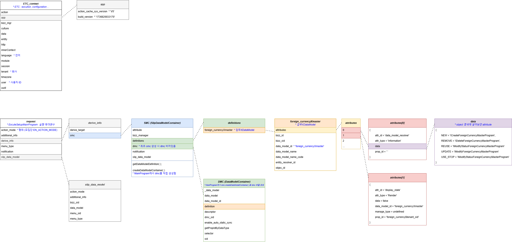

# Daily Retrospective

**작성자**: [최현철]  
**작성일시**: [2025-01-14]

## 1. 오늘 배운 내용 (필수)

1. 외화 CRUD 구현 마무리
2. generator 구현

## 2. 동기에게 도움 받은 내용 (필수)

레퍼그룹에 대해서 기획적으로 항목의미그룹일거라고 생각하고있었는데, 주현님이 질문해주셔서 제가 잘못알고있는 부분을 바로잡을 수 있었습니다.

민준님께서 제너레이터 보충수업을 해주셨습니다.

DMC, SMC에 대해 이해안되는 부분에 대해서 강민님께서 보충설명을 해주셔서 이해할 수 있었습니다.

---

## 3. 개발 기술적으로 성장한 점 (선택)

### 1. 교육 과정 상 배운 내용이 아닌 개인적 호기심을 해결하기 위해 추가 공부한 내용

Context, DMC, SMC 구성요소

### 3. 위 두 주제 중 미처 해결 못한 과제. 앞으로 공부해볼 내용.

제너레이터, 속성, 벨리데이터 등의 흐름

로직의 흐름상으로만 공부하다가, 로직들간의 주고받는 변수들에 대해 공부하니 흐름 이해가 더 쉽고, 제가 이해하지 못해 불안했던 부분이 많이 해소되었습니다.

추후 더 많은 자습시간을 통해서 제너레이터, 속성, 밸리데이터들도 공부해볼 예정입니다.

---

## 5. 제안하고 싶은 내용

힘내세요!
