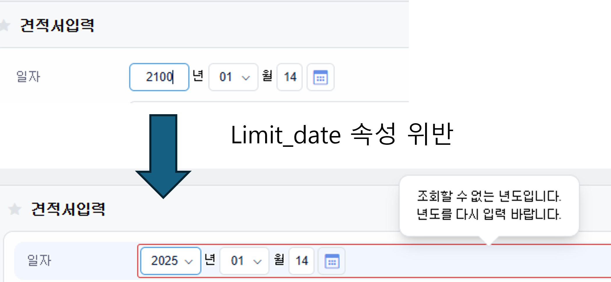
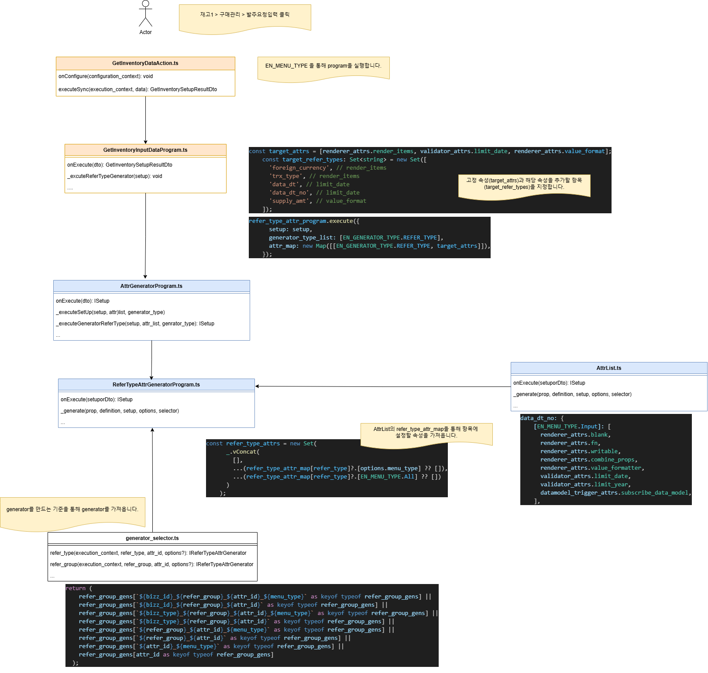

# Daily Retrospective

**작성자**: 허수경

**작성일시**: 2025-01-14(화)

## 1. 오늘 배운 내용 (필수)

- ReferTypeAttrGenerator
- ReferTypeAttrGeneratorProgram 디버깅

### ReferTypeAttrGenerator

---

- 항목의 의미(`refer_type`/`refer_group`)에 따라 필요한 attribute를 생성합니다.
- 예를들어, `date` 항목은 `limit_date` attribute가 필요하다면 ReferTypeAttrGenerator를 통해 생성할 수 있도록합니다.
- 이와 같은 속성은 여러 곳에서 사용할 수 있으므로 `ReferTypeAttrGenerator`를 통해 재사용성을 높일 수 있습니다.
  

### ReferTypeAttrGeneratorProgram 디버깅

### 1. 속성 정보 추가 로직

- 속성정보를 추가해주는 로직은 3가지가 있습니다. 아래 파일들을 통해 속성정보를 추가해줍니다.

1. GetInventoryInputSetupProgram.ts

- 재고 입력 페이지에 대한 속성 정보를 내려주는 Program 입니다.
- 파일 고정 속성 설정 정보를 추가합니다.

2. GetInventoryInputDataProgram.ts

- 재고 입력 페이지에 대한 데이터 정보를 내려주는 Program 입니다.
- ReferTypeAttrGeneratorProgram을 호출하여 파일 고정 속성 설정 정보를 추가합니다.

3. ExecuteSetupMainProgram

- `this.smc.createDataModelContainer` 함수 내의 콜백함수 통해 사용자 속성 설정 정보를 추가합니다.
  - 여기서 **사용자 속성 설정 정보**는 사용자가 설정 가능한 속성을 말하며 DB에 저장된 속성(3.0 설정정보)을 5.0 속성정보로 컨버팅해준 정보를 추가해줍니다.

### 2. 디버깅 실행 순서



#### 1. `GetInventoryDataAction.ts`

- 재고입력조회시 진입점으로 들어오며 `EN_MENU_TYPE`를 통해 program을 실행합니다.

#### 2. `GetInventoryInputDataProgram.ts`

- 고정 속성(`target_attrs`)과 해당 속성을 추가할 항목(`target_refer_types`)을 지정합니다.

```ts
const target_attrs = [
  renderer_attrs.render_items,
  validator_attrs.limit_date,
  renderer_attrs.value_format,
];
const target_refer_types: Set<string> = new Set([
  "foreign_currency", // render_items
  "trx_type", // render_items
  "data_dt", // limit_date
  "data_dt_no", // limit_date
  "supply_amt", // value_format
]);
```

- `target_attrs` 으로 추가할 속성을 정의하고 이 속성을 추가할 항목들을 지정합니다.
- 추후 `AttrList.ts`를 통해 각 항목들이 가질 수 있는 속성인지 확인하는 과정을 거칩니다.

#### 3. `AttrGeneratorProgram.ts`

- `attr_generator_map`을 통해 `ReferTypeAttrGeneratorProgram.ts`을 실행합니다.

```ts
export const attr_generator_map = new Map<EN_GENERATOR_TYPE, ProgramIdentifier>(
  [
    [EN_GENERATOR_TYPE.BIZZ, IBizzAttrGeneratorProgram],
    [EN_GENERATOR_TYPE.FUNCTION, IFunctionAttrGeneratorProgram],
    [EN_GENERATOR_TYPE.MENU, IMenuAttrGeneratorProgram],
    [EN_GENERATOR_TYPE.REFER_TYPE, IReferTypeAttrGeneratorProgram],
    [EN_GENERATOR_TYPE.TENANT, ITenantAttrGeneratorProgram],
    [EN_GENERATOR_TYPE.USER, IUserAttrGeneratorProgram],
    [EN_GENERATOR_TYPE.DEFINITION, IDefinitionAttrGeneratorProgram],
  ]
);
```

- `ReferType` 뿐만 아니라 `Bizz`, `Fucntion`등 여러 타입들을 생성할 수 있는 것을 볼 수 있습니다.

#### 4. `ReferTypeAttrGeneratorProgram.ts`

- AttrList의 refer_type_attr_map을 통해 항목에 설정할 속성을 가져옵니다.

```ts
// ReferTypeAttrGeneratorProgram.ts
const refer_type_attrs = new Set(
  _.vConcat(
    [],
    ...(refer_type_attr_map[refer_type]?.[options.menu_type] ?? []),
    ...(refer_type_attr_map[refer_type]?.[EN_MENU_TYPE.All] ?? [])
  )
);
```

- `refer_type_attr_map[data_dt_no].[위에서 정의한 속성]` 를 찾는다.

```TS
// AttrList.ts
data_dt_no: {
  [EN_MENU_TYPE.Input]: [
    renderer_attrs.blank,
    renderer_attrs.fn,
    renderer_attrs.writable,
    renderer_attrs.combine_props,
    renderer_attrs.value_formatter,
    validator_attrs.limit_date,
    validator_attrs.limit_year,
    datamodel_trigger_attrs.subscribe_data_model,
  ],
```

- 이후 `generator_selector.ts`를 통해 `generator` 파일의 `attributes`를 찾아 항목의 속성에 추가합니다.

```ts
export function refer_type(
  execution_context: IExecutionContext,
  refer_type: $$refer_type,
  attr_id: string,
  options?: {
    bizz_sid: string;
    menu_type?: EN_MENU_TYPE;
  }
): IReferTypeAttrGenerator<any> | undefined {
  const bizz_sid = options?.bizz_sid ?? execution_context.action.bizz_sid;
  const menu_type = options?.menu_type ?? execution_context.action.menu_type;

  const { bizz_id, bizz_type } = getBizzInfo(execution_context, bizz_sid);

  return (refer_type_gens[
    `${bizz_id}_${refer_type}_${attr_id}_${menu_type}` as keyof typeof refer_type_gens
  ] ||
    refer_type_gens[
      `${bizz_id}_${refer_type}_${attr_id}` as keyof typeof refer_type_gens
    ] ||
    refer_type_gens[
      `${bizz_type}_${refer_type}_${attr_id}_${execution_context.session.site}` as keyof typeof refer_type_gens
    ] ||
    refer_type_gens[
      `${bizz_type}_${refer_type}_${attr_id}_${menu_type}` as keyof typeof refer_type_gens
    ] ||
    refer_type_gens[
      `${bizz_type}_${refer_type}_${attr_id}` as keyof typeof refer_type_gens
    ] ||
    refer_type_gens[
      `${refer_type}_${attr_id}_${menu_type}` as keyof typeof refer_type_gens
    ] ||
    refer_type_gens[
      `${refer_type}_${attr_id}` as keyof typeof refer_type_gens
    ] ||
    refer_type_gens[
      `${attr_id}_${menu_type}` as keyof typeof refer_type_gens
    ] ||
    refer_type_gens[
      attr_id as keyof typeof refer_type_gens
    ]) as IReferTypeAttrGenerator<any>;
}
```

---

## 2. 동기에게 도움 받은 내용 (필수)

- 민준님께서 generator의 전체적인 흐름과 작동 방식을 상세히 설명해주셔서, 해당 개념을 명확히 이해할 수 있었습니다.
- 주현님, 주원님, 연아님, 승준님께 5.0 프레임워크의 실행 방식에 대해 모르는 것을 여쭤보고 이해 할 수 있었습니다.
- 다은님께서 저녁 식사 시 발생한 초과 비용을 대신 부담해주셔서 팀원들의 부담을 덜어주셨습니다.

---

## 3. 개발 기술적으로 성장한 점 (선택)

### 2. 오늘 직면했던 문제 (개발 환경, 구현)와 해결 방법

#### `validator`와 `generator`의 차이점

**문제**

- 금일 교육 중 `validator`에서도 `generator`와 같이 `{bizz_type}_{refer_type}_{attr_id}`의 형식으로 파일을 찾고 해당 속성이 제대로 지켜졌는지 유효성 검사를 한다고 배웠습니다. 이에 `generator`도 파일을 찾아 속성을 생성하는 역할을 하는데 이를 왜 다시 `validator`에서도 파일을 찾아 검사하는지 이해가 가지 않았습니다.

**문제 인식 및 해결 과정**

- 이 문제를 해결하기 위해 직접 디버깅을 진행해 보았습니다. 그 결과, generator와 validator의 역할에는 명확한 차이가 있음을 확인할 수 있었습니다.
  - `generator`: 속성을 생성하는 역할을 담당합니다. 필요한 속성을 명시적으로 정의하고, 해당 속성을 지정한 항목에 추가합니다.
  - `validator`: 생성된 속성의 유효성 검사를 수행하는 로직을 담당하며, 검사 결과를 `true` 또는 `false로` 반환합니다.

```ts
// generator
export const foreign_currency_foreign_currency_cd_not_null_input: IReferTypeAttrGenerator<
  validator_attrs.ip_single_condition_not_null
> = (execution_context, setup, target) => {
  return {
    prop_id: target.prop.prop_id,
    attr_id: validator_attrs.not_null,
    attr_type: EN_ATTR_TYPE.Validator,
    data: { data: true, caller_type: [EN_EXECUTE_CALLER_TYPE.apply] },
  };
};
```

- 위의 `generator` 코드는 특정 속성을 생성하는 역할을 합니다. 여기서는 `foreign_currency_cd` 속성이 null이 아니어야 한다는 조건을 명시하고 있습니다. 이를 통해 해당 속성이 필요한 시점에 올바르게 생성되도록 보장합니다.

```ts
// validator
export const txt_not_null: IValidator<
  $$txt,
  ExtractedOptionType<validator_attrs.txt_not_null>
> = (value, options, caller_type) => {
  if (options) {
    if (_.vIsEmpty(value)) {
      return false;
    }

    if (_.vIsEmpty(value.trim())) {
      return false;
    }
  }

  return true;
};
```

- 반면, 위의 `validator` 코드는 생성된 속성의 유효성 검사를 담당합니다. 여기서는 입력된 value가 비어있지 않은지를 확인하여, 조건을 만족하지 않을 경우 false를 반환합니다. 이를 통해 데이터의 무결성을 유지할 수 있습니다.

### 3. 위 두 주제 중 미처 해결 못한 과제. 앞으로 공부해볼 내용.

#### `ActionProgramResolveProgram`의 역할

- 어제와 오늘 여러 테스트 케이스를 디버깅하면서 CURD Action에서의 차이점을 발견했습니다. `Create{bizz}Action`과 `Modify{bizz}Action`에서는 `ActionProgramResolveProgram`을 통해 해당하는 프로그램을 실행하는 반면, `Get{bizz}DataAction`에서는 `Get{bizz}InputDataProgram`을 직접 호출하는 것을 확인했습니다. `ActionProgramResolveProgram`의 역할이 조회시에는 별 필요가 없어 생략하고 진행한 것인지 이 차이점이 왜 발생하는지에 대한 명확한 이해가 부족하여, 이에 대해 더 깊이 공부할 필요가 있다고 느꼈습니다.

---

## 4. 소프트 스킬면에서 성장한 점 (선택)

CRUD 기능을 서서히 구현하고 전체적인 프로젝트 구조를 익혀가는 과정이 매우 재미있게 느껴졌습니다.

오늘은 특히 디버깅을 하면서 console에 변수를 출력하는 방법을 배우고, call stack을 활용해 프로그램의 실행 흐름을 파악하는 연습을 할 수 있었습니다.

아직 모르는 용어나 과정이 많지만, 교육과 동료들과의 대화를 통해 차근차근 배워가며 지식을 쌓는 과정에서 많이 성장하고 있고 앞으로도 함께 교육을 들으며 성장할 것을 기대하게 됩니다.
