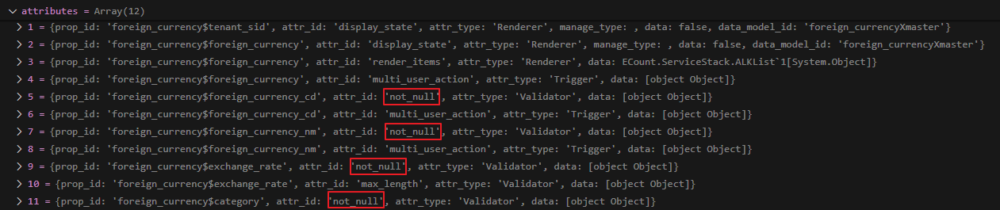

# Daily Retrospective  
**작성자**: [황주원]  
**작성일시**: [2025-01-14]  

## 1. 오늘 배운 내용 (필수)  
### Generator
제너레이터는 refer_type과 refer_group에 따라 필요한 속성을 정의합니다.

속성은 ``AttrList.ts`` 파일에 정의 되어 있고, <br />
메뉴 타입 | 업무 등에 따라 다르게 정의되어 있습니다.

또한, 정의된 속성 중 적합한 것을 선택한 후 definition에 넣어줍니다. <br />
아래 코드처럼 선택된 속성을 넣어주는 역할을 합니다.
```typescript
if (generator) {
	definition.attributes ??= [];
	prop_attributes ??= selector.getAttrsByPropId(prop.prop_id);
	const attr = generator(this.execution_context, setup, {
		prop,
		attributes: prop_attributes,
		bizz_sid: options.bizz_sid,
		menu_type: options.menu_type,
		menu_sid: options.menu_sid,
		data_model_id: options.data_model_id,
	}) as IAttribute;

	if (attr && attr.data !== null) {
		attr.prop_id = prop.prop_id;
		definition.attributes.push(attr); // 속성에 넣어준다.
	}
}
```

### Generator 디버깅
'견적서 입력' 부분을 디버깅 테스트를 진행해 봤습니다.
1. GetInventorySetupAction
	- 메뉴 타입별로(조회, 입력 .. etc) 프로그램을 실행시킵니다. 
2. GetInventoryInputSetupProgram
	- feature 를 가져옵니다.
	- attribute (속성) 가져옵니다. > AttrGeneratorProgram 실행시킵니다.
3. AttrGeneratorProgram
	- ReferTypeAttrGeneratorProgram 호출
4. ReferTypeAttrGeneratorProgram
	- AttrList.ts 에 있는 refer_type 속성 SET 
	- 해당 속성이 있다면, generator_selector 를 통해 해당 파일이 있는지 확인 
	- 우선순위에 따라 확인 
	```typescript
	(refer_type_gens[`${bizz_id}_${refer_type}_${attr_id}_${menu_type}` as keyof typeof refer_type_gens] ||
		refer_type_gens[`${bizz_id}_${refer_type}_${attr_id}` as keyof typeof refer_type_gens] ||
		refer_type_gens[
			`${bizz_type}_${refer_type}_${attr_id}_${execution_context.session.site}` as keyof typeof refer_type_gens
		] ||
		refer_type_gens[`${bizz_type}_${refer_type}_${attr_id}_${menu_type}` as keyof typeof refer_type_gens] ||
		refer_type_gens[`${bizz_type}_${refer_type}_${attr_id}` as keyof typeof refer_type_gens] ||
		refer_type_gens[`${refer_type}_${attr_id}_${menu_type}` as keyof typeof refer_type_gens] ||
		refer_type_gens[`${refer_type}_${attr_id}` as keyof typeof refer_type_gens] ||
		refer_type_gens[`${attr_id}_${menu_type}` as keyof typeof refer_type_gens] ||
		refer_type_gens[attr_id as keyof typeof refer_type_gens])	
	```
	- generate 실행 (refer_type에 맞는 속성 값 정의)

### validator 디버깅
- TempExecuteSetupMain
	- ReferTypeAttrGeneratorProgram 호출 (로직은 윗 부분 generator 디버깅 부분에 해당)
	- 위 프로그램을 실행시키면 아래와 같이 속성에 not null 추가
	
	- 데이터 모델에 null 값이 설정되어 있으면 validator를 통해 error list에 추가
	```typescript
	const validator_result = data_model_validator_program.execute({
		data_model_container: dmc,
		menu_type,
	});

	if (!_.vIsEmpty(validator_result.exception)) {
		validator_error_list.push(...validator_result.exception.details);
	}
	```	
	- null 이라면, error 던지기
	```typescript
	if (!_.vIsEmpty(validator_error_list)) {
		Exception.throw(
			ExceptionBuilder.create<IDataModelValidationException>(IDataModelValidationException, {
				data_model_id: this.master_data_model_id,
				details: validator_error_list,
			})
		);
	}
	```
	이런 식으로 에러가 console에 찍히게 됩니다.
	```typescript
	{"error":{"name":"ICommonException","error_info":[{"name":"IDataModelValidationException","data_model_id":"foreign_currencyXmaster","details":[{"data_model_id":"foreign_currencyXmaster","prop_id":"foreign_currency$foreign_currency_nm","attr_ids":["not_null"],"error_message":"","display_name":"외화명"},{"data_model_id":"foreign_currencyXmaster","prop_id":"foreign_currency$exchange_rate","attr_ids":["not_null"],"error_message":"","display_name":"환율"}],"message":""}],"message":""}}
	```
## 2. 동기에게 도움 받은 내용 (필수)
- 승준님, 주현님, 강민님, 수경님에게 코드에 대한 의문점을 물어보고 이해할 수 있었습니다. 감사합니다. 

---

## 3. 개발 기술적으로 성장한 점 (선택)
### 1. 교육 과정 상 배운 내용이 아닌 개인적 호기심을 해결하기 위해 추가 공부한 내용
#### 1.1 데이터베이스 접근 시점

Dac 를 호출할 때 데이터베이스에 접근하니깐 해당 시점에서 데이터 상태의 변화가 있을 줄 알았는데, <br />
디버깅 해보니 해당 시점에 데이터의 변화가 없었다.

```typescript
const dac = DacCommandBuilder.create(InsertForeignCurrencyDac, this.execution_context, DbConnectionId.MS.ACCT);
dac.execute(_.vFirst(req) as pg.foreign_currency_20250110_hjw_ecback);
```

구현 부분을 자세히 디버깅 해보니 트랜잭션으로 처리되는 부분이 완전히 종료가 되어야 DB에 반영되는 것을 확인했다. 

```typescript
@_transaction(TransactionOption.Required)
private _runCreateInventoryProcess(request: ExecuteSetupMainRequestDto): void {
	this.result = {
		error: {},
	} as ExecuteSetupMainResultDto;
	this.result = this._executeMainSetupProgram(request); // _executeMainSetupProgram을 리턴받을 때 데이터 상태 변화 
}
```

트랜잭션의 개념은 알았지만 한 흐름을 이렇게 자세히 본 적이 없어 실습할 때 개념이 바로 나오지 못했던 것 같다. 실제로 해봐야 더 개념이 와닿는 것 같다.

#### 1.2 DTO 전달 방식
`D:\ecxsolution\ecount.nextv5\ecount.solution\src\03.ecount.usecase\ecount.usecase.tutorials\src\server\@abstraction\program\data_model` 

폴더 내의 Master Program 을 구현할 때, data model을 만든 후 해당 데이터 모델의 DTO, Result 부분을 Master Program에서 사용하도록 구현했습니다. (`ICreateInventoryMasterProgram` 참고)

Inventory를 참고하며 일단 구현한 뒤, 해당 코드의 동작 과정이 궁금해 찾아보니 `IResolveForeignCurrencyDataModelProgramDto`를 결국 사용하는 건데 왜 또 데이터 모델을 만든 후 사용하도록 구현한걸까 ? 라는 의문점이 들었습니다. 

성준 팀장님께 여쭤보니 IResolveDataModelProgramDto 를 MasterProgram에서 상속 받는게 맞다는 답변을 듣고 의문점이 시원하게 풀렸습니다. Inventory에서는 왜 그렇게 쓴진 모르겠지만, depth를 더 안 들어가는 resolvedto를 바로 사용하는 방식이 더 간결해 보이고 선호하는 방법이라고 이해할 수 있었습니다. 

### 2. 오늘 직면했던 문제 (개발 환경, 구현)와 해결 방법

#### 2.1 캐싱 
공유해 주신 재고 입력 페이지 디버깅 방식에 GetInventoryInputSetupProgram -> ReferTypeAttrGeneratorProgram 호출이라 되어 있는데 ``GetInventoryInputSetupProgram``을 탈 때가 있고, 안 탈 때가 있었습니다. 

디버깅해 보니 GetInventorySetupAction 에서 GetInventoryInputSetupProgram을 호출하는데   ``@action_response_cache(get_inventory_setup_action)`` 이라는 내부 로직으로 인해 막히는 건가 라는 생각을 했습니다. 

그래서 action_response_cache 디버깅해 DefaultCacheManager를 확인해 보니 ``tenant: context.session.tenant_sid,`` 이런 식으로 session 의 값을 가져오는 것을 확인했습니다. 

그럼 브라우저에서 F12 > disable cache 했을 때 되어야 하는건 아닌가? 라는 생각에 팀장님께 질문했습니다. 현 교육과정에 포함되지 않은 내용이라 정확한 원인 파악은 어려웠지만, 캐싱 정책이 복잡할 것이라는 것은 예측할 수 있었습니다.

### 3. 위 두 주제 중 미처 해결 못한 과제. 앞으로 공부해볼 내용.
- not_null.ts 
	- foreign_currency_foreign_currency_cd_not_null_input.ts 에 타입으로 validator_attrs.ip_single_condition_not_null 이걸 가져오고 있습니다.
	- ip_single_condition을 타고 들어가보니 데이터 타입인 것 같은데, cd, nm, exchange_rate, category는 데이터 타입이 다른데 not null 적용됩니다. 
	- ip_single_condition이 무엇인지 궁금한데 짝꿍에게 물어보니 잘 모르겠다고 해서 시간이 된다면 공부해 보고자 합니다. 
- generator, validation 디버깅을 하고 어떠한 결과가 나오는 지는 확인했는데 과정에 대한 깊은 이해가 부족한 것 같습니다. 
	- ex) Temp 에서 selector 왜 호출하는지 등 
		- 해당 부분은 궁금해 동기들에게 물어봤지만 다른 의견이 있어 더 공부해 볼 것입니다.

## 4. 소프트 스킬면에서 성장한 점 
이전까지는 회고록은 사이드이고 이해하는 것이 우선이라고 생각했습니다. <br />
오늘 평가 방식에 대한 이야기를 듣고 평가자 입장에서는 회고록이 중요한 평가 항목이겠구나 라는 생각이 들었고 제가 공부한 모든 부분을 보여드리자 ! 로 마음가짐을 바꿨습니다. 

다들 평가가 다음주에 있다는 소식을 듣고 많이 분위기가 다운된 것 같은데 혹시라도 이 글을 동기 분이 본다면 2주간 더 열심히 하자 ! 힘내자라는 전하고 싶습니다. 저 포함 .. 여러분 모두 화이팅.