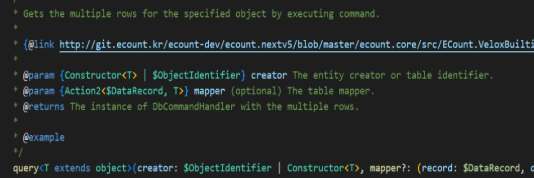
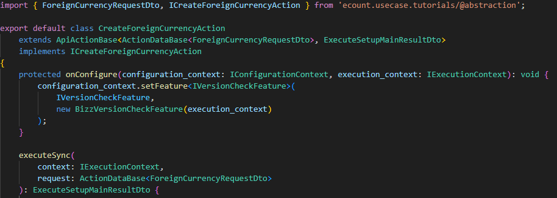
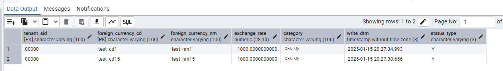
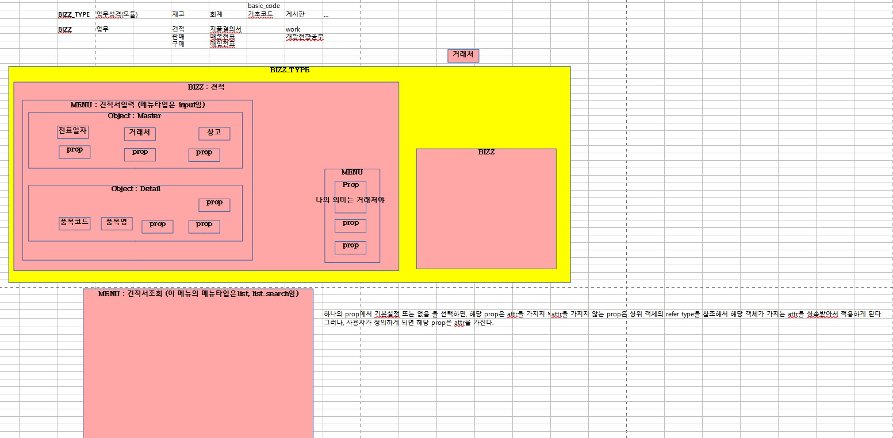

# Daily Retrospective

**작성자**: [김도형]  
**작성일시**: [2025-01-15]

## 1. 오늘 배운 내용 (필수)

- 폴더 추가 관련 추가 설명
- Create/Modify/ModifyStatus/Delete Action 구현 및 CreateForeignCurrencyAction으로 알아보는 전체적인 동작 흐름
- ESQL

오늘은 Action을 구현하고, 데이터가 pg에서 CRUD 되는 과정과 ESQL을 공부하였습니다. 그리고 Action을 구현하면서 inventory와 관련된 파일들을 많이 참고하였는데, 그 과정에서 마주했던 폴더 관련 내용도 살펴보았습니다.

## $idf.{명칭}.ts 파일

아래와 같이 코딩을 하는 경우, 파일명에 $idf 명칭을 추가해야 합니다. velox 환경에서 실행해야 되는 type 정보를 알고 있어야 합니다. 그 이유는 해당 type의 interface를 생성하기 위함입니다. 이런 방법으로 `$idf` 명칭을 추가하는 이유는 빌드 속도를 개선하기 위한 처리로, 해당 type 정보를 찾기 위해서 입니다. 전체 내용에서 찾지 않고, 파일에서 찾기 위한 목적으로 예상됩니다.

```ts
new InterfaceIdentifier("XXX");
```

현재 5.0의 경우, 다음과 같은 과정을 거쳐 실행되고 있습니다.

`typescript` -> `빌드` -> `js` -> `velox 실행` -> `C#`

<br>

interface 선언의 경우, ts 파일이 js 파일로 변환되면 사라지게 됩니다. 해당 type을 velox 환경에서 확인할 필요가 있기에 선언 시 두 개의 선언이 필요합니다.

- Interface의 경우, ts 코딩상에서 type을 확인하기 위한 용도로 사용되고 있습니다.

- Const 변수의 경우, js 파일을 velow 환경에서 실행할 때 해당 type을 확인하는 용도로 사용하고 있습니다.

```ts
// (A) const 변수 선언
export const MemoReserved = new $InterfaceIdentifier("MemoReserved");

// (B) Interface 선언
export interface MemoReserved {
  receiver_com_code?: string;
  receiver_ids?: string;
  memo_id?: string;
  sender_name?: string;
  time_send?: string;
  content?: string;
}
```

<br>

**그렇다면, 언제 $idf 파일을 생성하고, new $interfaceIdentifier를 사용해야 될까요?**

결국, 아래와 같이 velox환경에서 실행시 사용되는 경우 const 변수까지 선언해 줘야됩니다. 다른 표현으로 해보면, 5.0환경에서 사용할수있게 C#에서 제공하고 있는 함수를 stub라고 표현하는데 해당 stub 함수에서 Type을 사용해야되는 경우입니다. 복잡한 구조인 듯 합니다. 이런 식으로 되어 있구나 정도만 보고 넘어가달라고 하셨지만, Inventory를 참고하면서 마주했던 개념이였기에 추후 실무에서 사용할 수도 있을 것이라고 생각하였습니다. **_그래서, ForeignCurrencyAction을 만들면서 직접 사용해보았습니다._**



<br>

## new $interfaceIdentifier 직접 사용해보기

**경로**

`D:\ecxsolution\ecount.nextv5\ecount.solution\src\03.ecount.usecase\ecount.usecase.tutorials\src\@shared_usecase_tutorials\@abstraction\dto`

<br>

아래 코드는 `InventoryRequestDto.ts` 파일에 존재하는 코드를 옮겨서 사용한 것입니다. 우리는 slip_data_model을 활용해서 CRUD하는 작업을 제외하면 다른 작업들은 필요하지 않습니다. 그래서 실질적으로 필요한 코드는 `slip_data_model` 라고 생각합니다.

Create를 비롯한 ForeignCurrencyAction에서 Dto를 필요로 합니다. CreateForeignCurrencyAction 클래스에서 요청 데이터를 ActionDataBase<ForeignCurrencyRequestDto> 형태로 받아서 이를 slip_dto로 변환하여 프로그램을 실행하는 구조에서 사용됩니다. 즉, ForeignCurrencyRequestDto는 외화 관련 데이터 생성 시 필요한 모든 정보를 담아 전달하는 데이터 컨테이너 역할을 하며, 실제 비즈니스 로직 실행을 위한 중간 데이터 구조로 사용됩니다.

[file] $idf.ForeignCurrencyRequestDto.ts

```ts
import {
  ISlipDataModel,
  NotificationRequestDto,
} from "ecount.usecase.base/@abstraction";

export const ForeignCurrencyRequestDto = new $InterfaceIdentifier(
  "ForeignCurrencyRequestDto"
);

export interface ForeignCurrencyRequestDto {
  // 필요한 부분
  slip_data_model: ISlipDataModel;

  // 필요없는 부분
  additional_info?: {
    [additional_info_id: string]: any;
  };
  notification?: NotificationRequestDto;
  current_template?: number;
  is_za_from_only?: boolean;
}
```

<br>

아래 코드는 V3버전에서 왔는지 여부를 체크하고, foreign_currency_input 타입으로 foreign_currency를 정의해주었습니다.

[file] ForeignCurrencyRequestDto.ts

```ts
import { $$tf } from "ecount.fundamental.define/type";
import { ActionDtoBase } from "ecount.infra.base/abstraction";
import { NotificationRequestDto } from "ecount.usecase.base/@abstraction";
import { foreign_currency_input } from "../data_model";

/**
 * foreign_currency request interface
 */
// checkJSJ ActionDto 사용여부 확인
export interface ForeignCurrencyRequestDto extends ActionDtoBase {
  is_from_v3?: $$tf;
  foreign_currency: foreign_currency_input;

  // notification 생략.
}
```

<br>

제가 생성한 파일은 $idf.ForeignCurrencyRequestDto.ts와 ForeignCurrencyRequestDto.ts지만, 실제로 export 해주는 파일은 $idf.ForeignCurrencyRequestDto 뿐입니다. 왜그럴까요??? $idf 파일만 export되는 이유는 velox 환경에서 필요한 $InterfaceIdentifier를 포함하고 있기 때문입니다. ForeignCurrencyRequestDto.ts는 TypeScript 컴파일 시점에만 필요한 타입 정보이므로, 런타임에서는 필요하지 않는 것 같습니다. 다시 말해서, 이는 velox가 JavaScript 런타임에서 타입 정보를 필요로 하기 때문에, $InterfaceIdentifier를 포함한 파일만 export하는 것이라고 생각합니다.

[file] ecount.usecase.tutorials/src/@shared_usecase_tutorials/@abstraction/dto/index.ts

```ts
export * from "./IForeignCurrencyList";
export * from "./$idf.ForeignCurrencyRequestDto";
```

<br>

아래에서 실제로 적용된 모습을 볼 수 있습니다.

[file] CreateForeignCurrencyAction.ts



<br>

## CreateForeignCurrencyAction으로 알아보는 전체적인 동작 흐름

피들러의 Composer에서 POST 방식으로 직접 URL을 호출하여 Action부터 pg에 저장되기까지의 동작 흐름을 살펴보았습니다.

```bash
# HTTP METHOD : POST
https://test.ecount.com:5001/ec5/api/app.tutorials/action/CreateForeignCurrencyAction:foreign_currency:input?ec_req_sid=BA-ERywIhPnb7QxF

# Request Body
{
  "bizz_sid": "TB_000000E040114",
  "action_mode": "NEW",
  "menu_sid": "TM_000000E040114",
  "menu_type": "input",
  "data": {
    "bizz_sid": "TB_000000E040114",
    "additional_info": {
      "confirm_type": ""
    },
    "slip_data_model": {
      "action_mode": "NEW",
      "bizz_sid": "TB_000000E040114",
      "data_model": {
        "foreign_currencyXmaster": [
          {
            "foreign_currency$tenant_sid": "303101",
            "foreign_currency$foreign_currency": {
              "sid": "test_cd1",
              "code": "test_cd1",
              "name": "test_nm1"
            },
            "foreign_currency$foreign_currency_cd": "test_cd1",
            "foreign_currency$foreign_currency_nm": "test_nm1",
            "foreign_currency$exchange_rate": 1000,
            "foreign_currency$category": "\uc544\uc2dc\uc544",
            "foreign_currency$status_type": "Y"
          }
        ]
      },
      "menu_sid": "TM_000000E040114",
      "menu_type": "input"
    }
  }
}
```

<br>

[file] CreateForeignCurrencyAction.ts

- onConfigure에서 version 체크
- executeSync에서 다음과 같은 일을 수행
  - bizz manager를 실행 컨텍스트에서 가져옴
  - bizz definition을 가져옴
  - derive_target을 bizz definition의 속성에서 찾아옴
  - 전표 dto 객체 생성
  - 프로그램 빌러도 새로운 프로그램 인스턴스 생성
  - 프로그램 실행 후 반환

```ts
// 기본 API 액션 관련 기능을 가져오는 import
import { ApiActionBase } from "ecount.application.common/action";

// 실행 컨텍스트 인터페이스를 가져오는 import
import { IExecutionContext } from "ecount.infra.bridge/base";

// 프로그램 빌더 클래스를 가져오는 import
import { ProgramBuilder } from "ecount.infra.common/program";

// 정의 속성들을 가져오는 import
import { definition_attrs } from "ecount.usecase.base/@abstraction";

// 액션 데이터 기본 클래스와 설정 컨텍스트 인터페이스를 가져오는 import
import {
  ActionDataBase,
  IConfigurationContext,
} from "ecount.infra.base/abstraction";

// 액션 모드와 메뉴 타입을 가져오는 import
import { EN_ACTION_MODE, EN_MENU_TYPE } from "ecount.fundamental.define/enum";

// bizz 버전 체크 Feature와 전표 데이터 모델 컨테이너를 가져오는 import
import {
  BizzVersionCheckFeature,
  SlipDataModelContainer,
} from "ecount.usecase.common/@implement";

import {
  DeriveBizzInfoTargetDto,
  ExecuteSetupMainResultDto,
  IActionProgramResolveProgram,
  IActionProgramResolveProgramRequestDto,
  IActionProgramResolveProgramResult,
  IVersionCheckFeature,
} from "ecount.usecase.common/@abstraction";

import { manager } from "ecount.infra.bridge/feature";

// 외화 관련 DTO와 인터페이스를 가져오는 import
import {
  ForeignCurrencyRequestDto,
  ICreateForeignCurrencyAction,
} from "ecount.usecase.tutorials/@abstraction";

export default class CreateForeignCurrencyAction
  // ApiActionBase를 상속받고, ActionDataBase<ForeignCurrencyRequestDto>를 요청으로, ExecuteSetupMainResultDto를 응답으로
  extends ApiActionBase<
    ActionDataBase<ForeignCurrencyRequestDto>,
    ExecuteSetupMainResultDto
  >
  // ICreateForeignCurrencyAction 인터페이스를 구현
  implements ICreateForeignCurrencyAction
{
  protected onConfigure(
    configuration_context: IConfigurationContext,
    execution_context: IExecutionContext
  ): void {
    // 버전 체크 기능을 설정 컨텍스트에 추가
    configuration_context.setFeature<IVersionCheckFeature>(
      IVersionCheckFeature,
      new BizzVersionCheckFeature(execution_context)
    );
  }

  executeSync(
    context: IExecutionContext,
    request: ActionDataBase<ForeignCurrencyRequestDto>
  ): ExecuteSetupMainResultDto {
    // bizz_manager를 컨텍스트에서 가져옴
    const bizz_manager = context.getFeature<manager.IBizzManager>(
      manager.IBizzManager
    );

    // bizz_definition를 가져옴
    const bizz_definition = bizz_manager.getBizzDefinition(
      context,
      context.action.bizz_sid
    );

    // derive_target를 bizz_definition의 속성에서 찾아서 가져옴
    const derive_target = bizz_definition?.attributes?.find((attr) =>
      _.vIsEquals(attr.attr_id, definition_attrs.info.derive_use_info)
    )?.data?.list as DeriveBizzInfoTargetDto[];

    // 전표 DTO 객체 생성
    const slip_dto = {
      bizz_sid: context.action.action_mode,
      action_mode: EN_ACTION_MODE.Create,
      menu_type: EN_MENU_TYPE.Input,
      slip_data_model: request.data.slip_data_model,
      derive_info: {
        smc: {} as SlipDataModelContainer,
        derive_target: derive_target,
      },
      current_template: request.data.current_template,
      is_za_from_only: request.data.is_za_from_only,
      additional_info: request.data.additional_info,
      notification: request.data.notification,
    } as IActionProgramResolveProgramRequestDto;

    // 프로그램 빌더를 사용하여 새로운 프로그램 인스턴스 생성 -> ActionProgramResolveProgram
    const program = ProgramBuilder.create<
      IActionProgramResolveProgramRequestDto,
      IActionProgramResolveProgramResult
    >(IActionProgramResolveProgram, context);

    // 프로그램 실행하고 결과 반환
    const result = program.execute(slip_dto);

    return result;
  }
}
```

<br>

[file] ActionProgramResolveProgram.ts

- @program_impl decorator를 사용하여 IActionProgramResolveProgram 구현을 명시
- dto에서 필요한 속성들을 추출, action_mode를 가져옴 (dto의 값이 없으면 컨텍스트의 값을 사용)
- execution_context.bizz_mgr.getMenuDefinition()을 통해 Menu Definition을 가져오고, action_program_resolver 속성을 찾아서 해당 action_mode의 resolver를 가져옴
- resolver가 존재하는 경우, 프로그램 빌더로 새로운 프로그램 인스턴스 생성

```ts
import { EN_ACTION_MODE } from "ecount.fundamental.define/enum";
import { program_impl } from "ecount.infra.common/decorator";
import { BaseProgram, ProgramBuilder } from "ecount.infra.common/program";
import { definition_attrs } from "ecount.usecase.base/@abstraction";
import {
  ExecuteSetupMainRequestDto,
  ExecuteSetupMainResultDto,
  IActionProgramResolveProgram,
  IActionProgramResolveProgramRequestDto as ProgramDto, // ProgramDto로 별칭 지정
  IActionProgramResolveProgramResult as ProgramResult, // ProgramResult로 별칭 지정
} from "ecount.usecase.common/@abstraction";

// @program_impl 데코레이터를 사용하여 IActionProgramResolveProgram 구현을 명시
@program_impl(IActionProgramResolveProgram)
export class ActionProgramResolveProgram
  extends BaseProgram<ProgramDto, ProgramResult>
  implements IActionProgramResolveProgram
{
  protected onExecute(dto: ProgramDto): ProgramResult {
    // dto에서 필요한 속성들을 구조 분해 할당으로 추출
    const {
      slip_data_model,
      additional_info,
      derive_info,
      current_template,
      is_za_from_only,
    } = dto;

    // action_mode를 안전하게 가져옴 (dto의 값이 없으면 컨텍스트의 값을 사용)
    const action_mode = _.vSafe(
      dto.action_mode,
      this.execution_context.action.action_mode
    );

    // MenuDefinition에서 resolver를 찾음
    const resolver = this.execution_context.bizz_mgr
      .getMenuDefinition(
        this.execution_context,
        this.execution_context.action.bizz_sid,
        this.execution_context.action.menu_sid || ""
      )
      // action_program_resolver 속성을 찾아서 해당 액션 모드의 리졸버를 가져옴
      ?.attributes?.find(
        (x) => x.attr_id == definition_attrs.info.action_program_resolver
      )?.data[action_mode];

    // 리졸버가 존재하는 경우
    if (resolver) {
      // 프로그램 빌더를 사용하여 새로운 프로그램 인스턴스 생성
      const program = ProgramBuilder.create<
        ExecuteSetupMainRequestDto,
        ExecuteSetupMainResultDto
      >(resolver, this.execution_context);
      // 프로그램을 실행하고 결과를 반환
      return program.execute({
        slip_data_model: slip_data_model,
        additional_info: additional_info,
        derive_info: derive_info,
        current_template: current_template,
        is_from_za_only: is_za_from_only,
      }) as unknown as ProgramResult;
    }

    // 리졸버가 없는 경우 빈 객체를 ProgramResult 타입으로 반환
    return {} as unknown as ProgramResult;
  }
}
```

<br>

[file] CreateForeignCurrencyProgram.ts

- onExecute() 내부에서 재고 생성 프로세스 실행
- \_executeMainSetupProgram에서 TempExecuteSetupMainProgram 인스턴스 생성
- SlipDataModelContainer 생성
- 프로그램 실행 후 결과 반환

```ts
import {
  ICommonException,
  ITimeoutException,
} from "@shared_infra_bridge/exception";

import { Exception, IException } from "ecount.fundamental.define/exception";
import { IExecutionContext } from "ecount.infra.bridge/base";
import { program_impl } from "ecount.infra.common/decorator";
import { ExceptionBuilder } from "ecount.infra.common/exception";
import { BaseProgram, ProgramBuilder } from "ecount.infra.common/program";
import {
  ExecuteSetupMainRequestDto,
  ExecuteSetupMainResultDto,
  ITempExecuteSetupMainProgram,
} from "ecount.usecase.common/@abstraction";
import { SlipDataModelContainer } from "ecount.usecase.common/@implement";
import { ICreateForeignCurrencyProgram } from "ecount.usecase.tutorials/@abstraction";

/**
 * 외화 생성 프로그램 클래스
 */
@program_impl(ICreateForeignCurrencyProgram)
export class CreateForeignCurrencyProgram
  extends BaseProgram<ExecuteSetupMainRequestDto, ExecuteSetupMainResultDto>
  implements ICreateForeignCurrencyProgram
{
  // 실행 컨텍스트를 받아서 부모 클래스에 전달
  constructor(execution_context: IExecutionContext) {
    super(execution_context);
  }

  private result: ExecuteSetupMainResultDto;

  protected onExecute(
    request: ExecuteSetupMainRequestDto
  ): ExecuteSetupMainResultDto {
    const errors: IException[] = [];
    try {
      // 재고 생성 프로세스 실행
      this._runCreateInventoryProcess(request);
    } catch (e: any) {
      if (e.isSessionTimeout) {
        throw ExceptionBuilder.create<ITimeoutException>(ITimeoutException, {
          isSessionTimeout: true,
        });
      }

      if (Exception.verify(e)) {
        errors.push(e as IException);
      } else {
        throw e;
      }
    } finally {
      if (!_.vIsEmpty(errors)) {
        this.result.error = ExceptionBuilder.create<ICommonException>(
          ICommonException,
          {
            error_info: errors,
          }
        );
      }
    }

    return this.result;
  }

  // 트랜잭션이 필요한 재고 생성 프로세스
  @_transaction(TransactionOption.Required)
  private _runCreateInventoryProcess(
    request: ExecuteSetupMainRequestDto
  ): void {
    this.result = {
      error: {},
    } as ExecuteSetupMainResultDto;

    // 메인 설정 프로그램 실행
    this.result = this._executeMainSetupProgram(request);
  }

  /** 5.0 외화 메인 프로그램 실행 */
  private _executeMainSetupProgram(
    request: ExecuteSetupMainRequestDto
  ): ExecuteSetupMainResultDto {
    // 프로그램 빌더를 사용하여 새로운 프로그램 인스턴스 생성
    const program = ProgramBuilder.create<
      ExecuteSetupMainRequestDto,
      ExecuteSetupMainResultDto
    >(ITempExecuteSetupMainProgram, this.execution_context);

    // SlipDataModelContainer 생성
    // 임시 로직: 빈 객체일 경우 에러 방지를 위해 새로 생성
    request.derive_info.smc = new SlipDataModelContainer(
      this.execution_context,
      request.slip_data_model
    );

    // 프로그램 실행하고 결과 반환
    return program.execute(request);
  }
}
```

<br>

[file] TempExecuteSetupMainProgram.ts

SMC, DMC 생성 및 필요한 Program 들을 생성하고, data model init/modify/validation 등을 수행합니다. 그리고, data model resolver program에 action_mode, dmc, data_sid를 넘겨주고, ResolveInventoryDataModelProgram이 실행됩니다. 자주 봤던 코드이므로 넘어가겠습니다.

<br>

[file] ResolveInventoryDataModelProgram.ts

- 데이터 모델 컨테이너(DMC)에서 data_model_resolver 속성을 찾음
- 해당 action_mode에 맞는 처리기가 있는지 확인
- 처리기가 있으면 해당 프로그램을 생성하고 실행
- 결과 반환

특히 이 프로그램은 메뉴 정의에 등록된 data_model_id별 리졸버를 실행하는 역할을 합니다. action_mode에 따라 다른 처리가 가능하도록 설계되어 있습니다.

```ts
import { ProgramIdentifier } from "ecount.infra.base/abstraction";
import { program_impl } from "ecount.infra.common/decorator";
import { BaseProgram, ProgramBuilder } from "ecount.infra.common/program";
import { definition_attrs } from "ecount.usecase.base/@abstraction";

// 재고 데이터 모델 관련 타입들을 가져오는 import
import {
  IResolveInventoryDataModelProgramDto as ProgramDto,
  IResolveInventoryDataModelProgramResult as ProgramResult,
  IResolveInventoryDataModelProgram,
} from "ecount.usecase.inventory/@abstraction";

@program_impl(IResolveInventoryDataModelProgram)
export class ResolveInventoryDataModelProgram
  extends BaseProgram<ProgramDto, ProgramResult>
  implements IResolveInventoryDataModelProgram
{
  onExecute(dto: ProgramDto): ProgramResult {
    const action_mode = dto.action_mode as unknown as string;

    const resolver =
      dto.dmc.getAttrByAttrId<definition_attrs.info.data_model_resolver>(
        definition_attrs.info.data_model_resolver,
        ""
      );

    if (resolver?.data?.[action_mode]) {
      const create_program = ProgramBuilder.create<ProgramDto, ProgramResult>(
        resolver.data[action_mode] as unknown as ProgramIdentifier,
        this.execution_context
      );
      return create_program.execute(dto) as unknown as ProgramResult;
    }

    return {} as unknown as ProgramResult;
  }
}
```

<br>

MasterProgram 등 추가적인 과정들을 거치고, Dac에서 esql 문법이 실행됩니다. 지금 request body에 tenant_sid를 입력해주지 않았으므로, pg에 저장할 때에는 session 정보에 있는 tenant_sid로 table model의 tenant_sid 값을 넣어줍니다.

[file] InsertForeignCurrencyDac.ts

```ts
import { IExecutionContext } from "ecount.infra.bridge/base";
import { pg } from "ecount.infra.bridge/table_model";
import { ESqlDacCommand } from "ecount.infra.common/dac";

/**
 * InsertForeignCurrencyDac
 */
export class InsertForeignCurrencyDac extends ESqlDacCommand<
  pg.foreign_currency_20250110_kdh_ecback,
  void
> {
  constructor(execution_context: IExecutionContext) {
    super(execution_context, DbConnectionId.PG.BASE);
  }
  protected generateESql(
    data: pg.foreign_currency_20250110_kdh_ecback
  ): $Statement {
    const esql = $ESql
      .insert<pg.foreign_currency_20250110_kdh_ecback>(
        pg.foreign_currency_20250110_kdh_ecback,
        data
      )
      .value((t) => t.tenant_sid, this.execution_context.session.tenant_sid);
    return esql;
  }
  protected onExecute(db: $Database, esql: $Statement): void {
    db.expressionSql(InsertForeignCurrencyDac, esql).execute();
  }
}
```

<br>

2번 row에 slip data가 제대로 저장된 것을 확인할 수 있었습니다.



<br>

## Esql

### 1. 기본 개념

| 구분 | 설명                                                                                                                                           |
| ---- | ---------------------------------------------------------------------------------------------------------------------------------------------- |
| 정의 | 개발자가 직접 SQL을 작성하지 않고 Structure(Expression Tree)를 통해 쿼리를 자동 생성하는 시스템                                                |
| 특징 | - DB Provider(ms, my, pg) 독립적</br>- 쿼리 생성은 DB 호출 시점에 이루어짐</br>- N개의 쿼리 조합 가능</br>- TableModel을 통한 타입 안전성 보장 |

<br>

### 2. 구성요소

| 구성요소   | 설명                      | 역할                                            |
| ---------- | ------------------------- | ----------------------------------------------- |
| Query      | Statement들의 집합        | - 전체 쿼리 관리</br>- before/after로 쿼리 연결 |
| Statement  | DB 실행의 최소 단위       | SELECT, INSERT, UPDATE, DELETE 등 기본 SQL 명령 |
| Clause     | Statement를 구성하는 단위 | WHERE, ORDER BY 등 SQL 구문                     |
| Expression | SQL 구문의 최소 단위      | 값, 연산자, 컬럼 등 기본 요소                   |

<br>

### 3. 주요 기능 예시

#### 3.1 기본 CRUD 작업

```ts
// SELECT
const eSql = $ESql
  .from<product>(product)
  .select((ef, x) => x.id)
  .select((ef, x) => x.name)
  .where((ef, x) => ef._equal(x.test_sid, ef.param(testSID)))
  .orderBy((ef, x) => x.reg_dtm)
  .limit(10);

// INSERT
const eSql = $ESql.insert<product>(product, valueSet).value(
  (x) => x.supplier_id,
  (ef) => ef.literal("1111")
);

// UPDATE
const eSql = $ESql
  .update<product>(product, valueSet)
  .set(
    (x) => x.name,
    (ef) => ef.literal("newName")
  )
  .where((ef, x) => ef._equal(x.id, "001"));

// DELETE
const eSql = $ESql
  .remove<product>(product)
  .where((ef, x) => ef._equal(x.test_sid, "1234567890"));
```

#### 3.2 고급 기능

```ts
// SubQuery
const viewer = $ESql
  .from<product>(product)
  .select((ef) => ef._all())
  .where((ef, x) => ef._equal(x.test_sid, ef.param(testSID)))
  .toViewer("t");

// Join
const eSql = $ESql.from(viewer1).join(
  (type) => type.innerJoin,
  viewer2,
  (on) => {
    on((ef) => ef._equal(viewer1.test_sid, viewer2.test_sid));
  }
);

// 우선순위 지정
const eSql = $ESql
  .from<product>(product)
  .where((ef, x) => ef._equal(x.test_sid, testSID), 1)
  .where((ef, x) => ef._equal(x.id, id), 2);
```

<br>

### 4. Preview 기능

#### 4.1 Preview 종류

| 종류             | 설명                                      |
| ---------------- | ----------------------------------------- |
| Executed         | 실제 실행되는 쿼리와 파라미터 정보        |
| NonParameterized | 파라미터가 실제 값으로 대체된 참고용 쿼리 |
| Error            | 에러 발생 시 관련 정보 표시               |

#### 4.2 Preview 사용법

```ts
// 파일로 출력
eSql.toPreviewFile();

// 콘솔에 문자열로 출력
eSql.toPreviewString();

// 상세 설정
eSql.preview.activateEscapeSelector().setProvider("ms").toFile();
```

<br>

### 5. 실행 프로세스

| 단계               | 설명                                                                             |
| ------------------ | -------------------------------------------------------------------------------- |
| 1. Structure 생성  | 코드를 통해 Expression Tree 구조 생성                                            |
| 2. SqlCommand 생성 | - Validator: Expression 검증 및 변환</br>- Interpreter: 트리를 SQL 문자열로 변환 |
| 3. DB 실행         | 생성된 SqlCommand로 실제 DB 호출                                                 |

<br>

### 6. 주의사항

- valueSet과 value() 동시 사용 시 value()가 우선됨
- 순환 참조 시 오류 발생
- TableModel은 실제 DB 테이블 기준으로 정의
- 파라미터 이름 직접 지정 불가
- Preview는 디버깅 중에만 사용 가능 (Esql 변수에 브레이크 포인트가 정확히 위치해야 함함)

<br>

### 7. Preview 파일 관리

- 저장 경로: D:\ecountv5\Runtime\temp\ESqlPreview
- 2일 이상 된 Preview 파일 자동 삭제
- DB Provider 자동 감지 (수동 설정도 가능)

<br>

## 2. 동기에게 도움 받은 내용 (필수)

현철님께 ECOUNT ERP 기능에 대해 설명을 들었습니다.

강민님과 현철님과 밖에서 점심을 함께 했습니다. 2번 연속으로 강민님이 내기에서 졌습니다 (내기는 강민님이 하자고 했습니다 ㅎㅎ!)

성범 책임님께서 피들러에서 직접 POST를 통해 request body를 전달하는 방법을 알려주셔서 Action Test에 적극적으로 사용하였습니다.

강민님, 현철님, 주원님, 승준님과 action의 흐름에 대해 함께 파악하고 토론하였습니다.

성철님, 현철님이 오늘도 저녁 식사를 세팅해주셨습니다. 항상 감사하지만, 다음번엔 저도 불러주세요.. 같이 돕겠습니다.

---

## 3. 개발 기술적으로 성장한 점 (선택)

아래의 3가지 주제 중 하나를 선택하여 작성합니다.

### 1. 교육 과정 상 배운 내용이 아닌 개인적 호기심을 해결하기 위해 추가 공부한 내용

우리가 구현하고 있는 코드들에서 언급되고 있는 개념(용어)들을 실제 ERP 화면과 비교하여 구조화해보았습니다.



### 3. 위 두 주제 중 미처 해결 못한 과제. 앞으로 공부해볼 내용.

- 오늘 다 보지 못한 Esql docs

- 지금까지 배운 내용을 종합적으로 정리해보기

- ERP 시스템의 배포 및 운영 흐름

---

## 4. 소프트 스킬면에서 성장한 점 (선택)

회고록을 쓰면서 공부한 내용을 정리하고, 생각을 정리하게 되어서 좋은 것 같습니다. 공부하는 것이 다가 아니라, 그것을 정리하고 내 것으로 만드는 시간도 필요하다고 느꼈습니다. 회고록을 작성하는 시간이 오래 걸리지만, 보다 더 성장할 수 있게 도와주는 과정이라고 생각합니다. 단순히 문서를 읽고 이해하는 것에서 그치는 것이 아니라, 제가 이해한 내용을 글로 풀어내면서 더 깊이 있는 학습이 가능했습니다. 또한 나중에 다시 찾아볼 때도 큰 도움이 될 것 같습니다. 앞으로도 꾸준히 회고록을 작성하면서 자기 발전의 시간으로 만들어가고 싶습니다.

---

## 5. 제안하고 싶은 내용

- 오늘 현우 팀장님과의 개인 면담은 좋은 시간이었습니다. 어제 공지 사항으로 인해 혼란스러웠고, 집중이 잘 되지 않았는데 면담을 통해서 의문점이 해결되었습니다. 가끔 이런 개인 면담 시간을 가지는 것은 좋은 것 같습니다.
