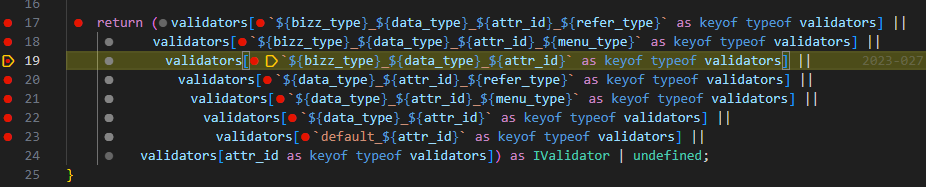

# Daily Retrospective

**작성자**: [김승준]  
**작성일시**: [2025-01-15]

## 1. 오늘 배운 내용 (필수)

-   generator 추가 구현

-   validator 디버깅 및 추가 구현

-   Action 구현

## 2. 동기에게 도움 받은 내용 (필수)

-   막히는 부분이 있을 때 마다 **주원님** 께서 같이 디버깅을 진행하며 알려주셨습니다. 또한 **주원님**께서도 막히는 부분이 있을 때 질문해주셔서 같이 고민해보는 시간을 가졌습니다.
-   **강민님**께서 action의 url과 데이터에 대해 고민한 부분에 대해서 설명해주셨습니다. 설명하신 부분을 들으며 이해가 잘 되지 않는 부분도 있었지만 강민님이 고민했던 과정과 어떤 부분까지 생각해봤는지 들으며 많은 생각을 하게 되었습니다.

---

## 3. 개발 기술적으로 성장한 점 (선택)

### 1. 교육 과정 상 배운 내용이 아닌 개인적 호기심을 해결하기 위해 추가 공부한 내용

-   `ActionIdentifier`의 PATH 옵션이 어떤것을 의미하는지 몰라 값을 변경하며 테스트 했습니다.<br>
    [git-doc](http://git2.ecount.kr/ecount-doc/ecount-docs/-/blob/master/5.0-manual/000.renewal/002.framework/405.Action.md?ref_type=heads)에는 `ActionIdentifier에는 특별히 해당 Identifier로 등록할 URL 정보를 정의합니다.`라고 나와있었습니다.<br>

    ```ts
    import { ActionDataBase, ActionIdentifier, IActionImpl } from "ecount.infra.base/abstraction";
    import { IForeignCurrencyRequestDto } from "../dto";
    import { ApiResultDto } from "ecount.usecase.base/@abstraction";

    export const ICreateForeignCurrencyAction = new ActionIdentifier("ICreateForeignCurrencyAction", "/api/app.tutorials/action/CreateForeignCurrencyAction"); // *1.

    export interface ICreateForeignCurrencyAction extends IActionImpl<ActionDataBase<IForeignCurrencyRequestDto>, ApiResultDto> {}
    ```

    \*1. git-doc에 나와 있듯 `/api/app.tutorials/action/CreateForeignCurrencyAction` 부분이 api의 url을 의미한다고 생각해 `/api/app.tutorials/action/reignCurrencyAction`로 변경하였습니다.<br> 그리고 피들러로 `https://test.ecount.com:5001/ec5/api/app.tutorials/action/reignCurrencyAction::input` url로 api를 보내본 결과 `File Not Found Exception`이 발생했습니다.<br>
    `https://test.ecount.com:5001/ec5/api/app.tutorials/action/CreateForeignCurrencyAction::input`으로 보내자 `ActionIdentifier`에 작성한 값과는 상관없이 정상적으로 동작하였습니다.

### 3. 위 두 주제 중 미처 해결 못한 과제. 앞으로 공부해볼 내용.

ActionIdentifier의 값이 url을 의미하지는 않는다는 것을 알았습니다.<br> 하지만 정확히 무엇을 의미하고 어떻게 사용되는지 확인하지 못했습니다.<br> 해당부분을 학습해 구조를 더 정확하게 알고 싶습니다.

---

# 학습내용

## generator

### 추가 구현사항

-   `{bizz_type}_{refer_type}_{attr_id}_{menu_type}.ts`의 generator가 아닌 다른 기준의 selector도 생성이 되는지 확인한다

-   `{refer_type}\_{attr_id}\_{menu_type}.ts`형식의 generator 생성

-   `foreign_currency_foreign_currency_cd_not_null_input`->`foreign_currency_cd_not_null_input`
    
    `${refer_type}_${attr_id}_${menu_type}` 까지 가서 넣어준다.

-   `foreign_currency_category_not_null_input`
    
    `${bizz_id}_${refer_type}_${attr_id}_${menu_type}`에서 넣어준다.

-   `this.dmc.selector`의 attr에 `not_null`이 잘 들어감.
    

## validator

### 프로그램 흐름

`03.ecount.usecase\ecount.usecase.common\src\server\program\TempExecuteSetupMainProgram.ts`

```ts
@_transaction(TransactionOption.Required)
onExecute(request: ExecuteSetupMainRequestDto): ExecuteSetupMainResultDto {
    this._onInit(request);
    this._runExecuteSetupMainProgram(request);
    return this.result as ExecuteSetupMainResultDto;
}
@_transaction(TransactionOption.Required)
private _runExecuteSetupMainProgram(request: ExecuteSetupMainRequestDto): void {
    //------------------------------------------------------------------------
    // [#0] create program
    //------------------------------------------------------------------------
    const {
        slip_validator_program,
        data_model_initializer_program,
        data_model_modifier_program,
        data_model_validator_program,
        data_model_resolver_program,
        pre_executer_resolver_program,
        post_executer_resolver_program,
    } = this._createProgram(this.execution_context);
...
    //------------------------------------------------------------------------
    // [#5] data_model validator
    //------------------------------------------------------------------------
    const validator_result = data_model_validator_program.execute({
        data_model_container: dmc,
        menu_type,
    });
    ...
private _createProgram(context: IExecutionContext) {
    return {
        ...
        data_model_validator_program: ProgramBuilder.create<
            IDataModelValidatorProgramDto,
            IDataModelValidatorProgramResult
        >(IDataModelValidatorProgram, context),
        ...
    };
}
...
```

`03.ecount.usecase\ecount.usecase.common\src\server\program\data_model\DataModelValidatorProgram.ts`

```ts
...
onExecute(dto: IDataModelValidatorRequestDto<IDataModelContainer>): IDataModelValidatorResultDto {
		// ===================================================
		const svc = SvcCommandBuilder.create(DataModelValidatorSvc, this.execution_context);
		const result = svc.execute(dto);
...
```

`03.ecount.usecase\ecount.usecase.common\src\server\svc\data_model_validator\DataModelValidatorSvc.ts`

```ts

```


```ts
private _getCacheObject(options: { data_model_id: string; cache_key: string; callback: () => any }) {
		if (this.cache_store.store.has(options.cache_key)) {
			return this.cache_store.store.get(options.cache_key);
		}

		const object = options.callback();
		this.cache_store.store.set(options.cache_key, object);

		return object;
	}
```

```ts
const option_creator = this._getCacheObject({
    data_model_id: dmc.data_model_id,
    cache_key: `${bizz_type}_${descriptor.data_type}_${attr.attr_id}_${descriptor.refer_type}_${data.menu_type}_option_creator`,
    callback: () => validators.getValidateOptionCreator(descriptor.data_type || "", attr.attr_id, descriptor.refer_type, descriptor.refer_group, data.menu_type, bizz_type),
});
```


`02.ecount.infrastructure\ecount.infra.attribute\src\server\provider\validator.ts`

|  |  |
| --------------------------------------------------------- | -------------------------------------------------------- |

`02.ecount.infrastructure\ecount.infra.attribute\src\@shared_infra_attribute\validator\not_null\txt_not_null.ts`
`{&data_type}_{&attr_id}` = `{txt}_{not_null}`로 들어감.


```ts
const vResult = validate(data.data_model_container.getValueByPropId<string>(attr.prop_id, i) ?? "", validate_data);
```

```ts
export const txt_not_null: IValidator<$$txt, ExtractedOptionType<validator_attrs.txt_not_null>> = (value, options, caller_type) => {
    if (options) {
        if (_.vIsEmpty(value)) {
            return false;
        }

        if (_.vIsEmpty(value.trim())) {
            return false;
        }
    }

    return true;
};
```


false를 리턴받아

```ts
error_message = typeof vResult === "boolean" ? undefined : vResult.error_message;
if (is_continue && !isNoProblem) {
    exception_map.set(attr.prop_id, {
        data_model_id: dmc.data_model_id,
        prop_id: attr.prop_id,
        attr_ids: [...(exception_map.get(attr.prop_id)?.attr_ids ?? []), attr.attr_id],
        error_message: [...(exception_map.get(attr.prop_id)?.error_message ?? []), error_message ?? ""],
        line_no,
        display_name: descriptor.prop_name,
    });
}
```

```ts
    if (exception_map.keys().next().value) {
        exception_map.forEach((exception: details) => {
            // attr_ids가 여러 개 있으면 그 개수만큼 message 내보내고 있긴함, 제대로 작동은 안 하는 것 같지만
            // 그래서 리펙토링 전과 동일한 result로 내보내기 위해 아래와 같은 if 추가
            if (exception.attr_ids.length > 1) {
                exception.attr_ids.forEach((attr_id: string, index: number) => {
                    exception_details.push({
                        data_model_id: exception.data_model_id,
                        prop_id: exception.prop_id,
                        attr_ids: exception.attr_ids,
                        error_message: exception.error_message[index],
                        line_no,
                        display_name: exception.display_name,
                    });
                });
            } else {
                exception_details.push({
                    data_model_id: exception.data_model_id,
                    prop_id: exception.prop_id,
                    attr_ids: exception.attr_ids,
                    error_message: exception.error_message[0],
                    line_no,
                    display_name: exception.display_name,
                });
            }
        });
    }
}
if (exception_details.length > 0) {
    result.exception = { data_model_id: dmc.data_model_id, details: exception_details, name: '', message: '' };
}
return result;
```

-   주석부분이 이해가 잘 가지 않았다. 1개일때랑 여러개 일때 같은 로직으로 동작할거 같은데?


exception_details에 validator에서 걸린 내용이 들어감.

### validator 추가

-   `${bizz_type}_${data_type}_${attr_id}`에 해당하는 validator를 만들어보기
-   `foreign_currency_txt_not_null`
    
    `${bizz_type}_${data_type}_${attr_id}`에서 validator를 가져오는 것을 확인.
-   `\02.ecount.infrastructure\ecount.infra.attribute\src\@shared_infra_attribute\validator\not_null\foreign_currency_txt_not_null.ts`
    파일 추가
    |  |  |
    | ------------------------- | ------------------------- |
    validate에 원하는 validator가 들어간 것을 확인.

## action 만들어보기

### CreateForeignCurrencyAction

1.  `CreateForeignCurrencyAction.ts` 생성
    `04.ecount.application\VeloxApps\app.tutorials\src\server\action\CreateForeignCurrencyAction.ts`

    ```ts
    import { ApiActionBase } from "ecount.application.common/action";
    import { ActionDataBase } from "ecount.infra.base/abstraction";
    import {
        DeriveBizzInfoTargetDto,
        ExecuteSetupMainResultDto,
        IActionProgramResolveProgram,
        IActionProgramResolveProgramRequestDto,
        IActionProgramResolveProgramResult,
    } from "ecount.usecase.common/@abstraction";
    import { ICreateForeignCurrencyAction, IForeignCurrencyRequestDto } from "ecount.usecase.tutorials/@abstraction";
    import { IExecutionContext } from "ecount.infra.bridge/base";
    import { ProgramBuilder } from "ecount.infra.common/program";
    import { SlipDataModelContainer } from "ecount.usecase.common/@implement";
    import { manager } from "ecount.infra.bridge/feature";
    import { definition_attrs } from "ecount.usecase.base/@abstraction";
    import { EN_ACTION_MODE, EN_MENU_TYPE } from "ecount.fundamental.define/enum";

    export default class CreateForeignCurrencyAction extends ApiActionBase<ActionDataBase<IForeignCurrencyRequestDto>, ExecuteSetupMainResultDto> implements ICreateForeignCurrencyAction {
        executeSync(context: IExecutionContext, request: ActionDataBase<IForeignCurrencyRequestDto>): ExecuteSetupMainResultDto {
            const bizz_manager = context.getFeature<manager.IBizzManager>(manager.IBizzManager);

            const bizz_definition = bizz_manager.getBizzDefinition(context, context.action.bizz_sid);
            const derive_target = bizz_definition?.attributes?.find((attr) => _.vIsEquals(attr.attr_id, definition_attrs.info.derive_use_info))?.data?.list as DeriveBizzInfoTargetDto[];

            const slip_dto = {
                biz_sid: context.action.action_mode,
                action_mode: EN_ACTION_MODE.Create,
                menu_type: EN_MENU_TYPE.Input, // menu_type,
                slip_data_model: request.data.slip_data_model,
                derive_info: {
                    smc: {} as SlipDataModelContainer,
                    derive_target: derive_target,
                },
            } as IActionProgramResolveProgramRequestDto;

            const program = ProgramBuilder.create<IActionProgramResolveProgramRequestDto, IActionProgramResolveProgramResult>(IActionProgramResolveProgram, context);

            const result = program.execute(slip_dto);
            return result;
        }
    }
    ```

2.  `ICreateForeignCurrencyAction.ts` 생성
    `03.ecount.usecase\ecount.usecase.tutorials\src\@shared_usecase_tutorials\@abstraction\action\ICreateForeignCurrencyAction.ts`

    ```ts
    import { ActionDataBase, ActionIdentifier, IActionImpl } from "ecount.infra.base/abstraction";
    import { IForeignCurrencyRequestDto } from "../dto";
    import { ApiResultDto } from "ecount.usecase.base/@abstraction";

    export const ICreateForeignCurrencyAction = new ActionIdentifier("ICreateForeignCurrencyAction", "/api/app.tutorials/action/CreateForeignCurrencyAction");

    export interface ICreateForeignCurrencyAction extends IActionImpl<ActionDataBase<IForeignCurrencyRequestDto>, ApiResultDto> {}
    ```

3.  `IForeignCurrencyRequestDto` 생성
    `D:\ecxsolution\ecount.nextv5\ecount.solution\src\03.ecount.usecase\ecount.usecase.tutorials\src\@shared_usecase_tutorials\@abstraction\dto\$idf.IForeignCurrencyRequestDto.ts`

    -   $idf 파일을 생성하고, `new $InterfaceIdentifier()`를 하는 경우 : 5.0환경에서 사용할수있게 C#에서 제공하고 있는 함수를 stub라고 표현하는데 해당 stub 함수에서 Type을 사용해야되는 경우

    ```ts
    import { ActionDtoBase } from "ecount.infra.base/abstraction";
    import { ISlipDataModel, NotificationRequestDto } from "ecount.usecase.base/@abstraction";

    // const 변수의 경우, javascript 파일을 velox환경에서 실행할때 해당 type을 확인하는 용도
    export const IForeignCurrencyRequestDto = new $InterfaceIdentifier("IForeignCurrencyRequestDto");

    // Interface의 경우, ts 코딩상에서 type을 확인하기 위한 용도
    export interface IForeignCurrencyRequestDto extends ActionDtoBase {
        slip_data_model: ISlipDataModel;
        additional_info?: {
            [additional_info_id: string]: any;
        };
        notification?: NotificationRequestDto;
    }
    ```

    -
    -   `ActionDtoBase`는 `ActionBase`를 상속받음.

    ```ts
    export interface ActionBase {
        bizz_id?: string;
        bizz_sid?: string;
        action_mode?: EN_ACTION_MODE;
        menu_sid?: string;
        menu_type?: EN_MENU_TYPE;
        menu_nm?: string;
        authority_type?: EN_AUTHORITY_TYPE;
        object_id?: string;
    }
    export interface ActionDtoBase extends ActionBase {
        readonly bizz_id?: string;
        bizz_sid: string;
        referer?: ActionReferer;
    }
    ```

4.  `RemoveForeignCurrencyAction.ts`, `ModifyForeignCurrencyAction.ts`,`DeleteForeignCurrencyAction.ts`, `UnDeleteForeignCurrencyAction.ts` 생성

-   코드는 `CreateForeignCurrencyAction`과 동일

```ts
...
const slip_dto = {
                biz_sid: context.action.action_mode,
                action_mode: EN_ACTION_MODE.Create,// 이 부분만 해당 파일에 맞게 수정
...
```

5. `IRemoveForeignCurrencyAction.ts`, `IModifyForeignCurrencyAction.ts`,`IDeleteForeignCurrencyAction.ts`, `IUnDeleteForeignCurrencyAction.ts` 생성

-   코드는 `ICreateForeignCurrencyAction`과 동일

### 테스트

1.  `https://test.ecount.com:5001/ec5/api/app.tutorials/action/CreateForeignCurrencyAction`
    
2.  `https://test.ecount.com:5001/ec5/api/app.tutorials/action/CreateForeignCurrencyAction?ec_req_sid=BA-ERyzc8IOtvn4N`
    

    <details>
    <summary> request body </summary>

    ```json
    {
        "bizz_sid": "TB_000000E040114",
        "action_mode": "NEW",
        "menu_sid": "TM_000000E040114",
        "menu_type": "input",
        "data": {
            "bizz_sid": "TB_000000E040114",
            "additional_info": {
                "confirm_type": ""
            },
            "slip_data_model": {
                "action_mode": "NEW",
                "bizz_sid": "TB_000000E040114",
                "data_model": {
                    "foreign_currencyXmaster": [
                        {
                            "foreign_currency$tenant_sid": "300000",
                            "foreign_currency$foreign_currency": {
                                "sid": "test_cd53",
                                "code": "test_cd53",
                                "name": "test_nm53"
                            },
                            "foreign_currency$foreign_currency_cd": "test_cd53",
                            "foreign_currency$foreign_currency_nm": "test_nm53",
                            "foreign_currency$exchange_rate": 1000,
                            "foreign_currency$category": "국",
                            "foreign_currency$status_type": ""
                        }
                    ]
                },
                "menu_sid": "TM_000000E040114",
                "menu_type": "input"
            }
        }
    }
    ```

    </details>

    -   `ec_req_sid=BA-ERyzc8IOtvn4N` 부분이 session.tenant_sid에 영향을 주는 것으로 보입니다.
