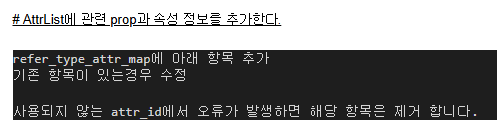

# Daily Retrospective

**작성자**: 나아연

**작성일시**: 2025-01-15

## 1. 오늘 배운 내용 (필수)

### Action 구현하기

```ts
export default class CreateForeignCurrencyAction
  extends ApiActionBase<ActionDataBase<ForeignCurrencyCreateRequestDto>, ApiResultDto>
  implements ICreateForeignCurrencyAction
{
  executeSync(context: IExecutionContext, request: ActionDataBase<ForeignCurrencyCreateRequestDto>): ApiResultDto {
    const slip_dto = {
      bizz_sid: context.action.action_mode,
      action_mode: EN_ACTION_MODE.Create,
      menu_type: EN_MENU_TYPE.Input,
      slip_data_model: request.data.slip_data_model,
      derive_info: {
        smc: {} as SlipDataModelContainer,
        derive_target: [],
      },
      additional_info: {},
      notification: {},
    } as IActionProgramResolveProgramRequestDto;

    const program = ProgramBuilder.create<IActionProgramResolveProgramRequestDto, IActionProgramResolveProgramResult>(
      IActionProgramResolveProgram,
      context
    );

    const result = program.execute(slip_dto);

    return result;
  }
}
```

- CreateInventoryAction.ts를 참고했다.
  ```
      // menu_type을 내려주지 못해 하드코딩
  	// ===================================================
  	// context.action.menu_type = EN_MENU_TYPE.Input;
  	// ===================================================
  ```
- CreateInventoryAction.ts에는 위와 같은 내용이 있었는데, menu_type을 하드코딩하는 것은 5.0의 방향성에 맞지 않다고 느꼈다. 해당 주석을 작성한 사람도 상황에 의해 하드코딩을 한 것으로 보여 나는 request에서 menu_type과 action_mode를 가져오도록 작성했다.

  ```ts
  const slip_dto = {
    bizz_sid: context.action.action_mode,
    action_mode: request.action_mode,
    menu_type: request.menu_type,
    slip_data_model: request.data.slip_data_model,
    derive_info: {
      smc: {} as SlipDataModelContainer,
      derive_target: [],
    },
    additional_info: {},
    notification: {},
  } as IActionProgramResolveProgramRequestDto;
  ```

- 그와 동시에, 이미 클래스명이 CreateForeignCurrencyAction인데 다른 action_mode와 menu_type이 들어올 수 있는지에 대한 의문도 있다.
- 외부의 값을 사용한다는 것은 오히려 잘못된 동작을 초래하지 않을까 라는 우려도 있다.

- IActionProgramResolveProgram에서 적절한 Resolver를 찾기 위해 아래 코드를 추가했다.
- 해당 부분이 없으면 IActionProgramResolveProgram에서 무엇을 사용할지 알수 없다.

  ```ts
  // D:\ecxsolution\ecount.nextv5\ecount.solution\src\03.ecount.usecase\ecount.usecase.tutorials\src\server\@abstraction\definition\foreign_currency\menus\input.ts
  BizzUtil.setMenu(bizz_definition, {
    menu_sid: "TM_000000E040114",
    menu_name: "외화 입력",
    menu_type: EN_MENU_TYPE.Input,
    data_model: [...],
    attributes: [
      ...,
      { // 추가한 부분
        prop_id: "",
        attr_id: definition_attrs.info.action_program_resolver,
        attr_type: EN_ATTR_TYPE.Information,
        data: {
          [EN_ACTION_MODE.Create]: "ICreateForeignCurrencyProgram",
        } as definition_attrs.info.action_program_resolver,
      },
    ],
  });
  ```

## 2. 동기에게 도움 받은 내용 (필수)

- 강민님께서 오류에 빠진 저를 구해주셨습니다. 저때문에 밥시간 퇴근시간도 늦어졌지만 끝까지 오류를 같이 봐주시고 고쳐주셨습니다. 정말 감사합니다.
- 민준님께서 Validator 추가 구현하고 해당 Validator를 사용하는 과정까지를 설명해주셨습니다.
- 민준님께서 IActionProgramResolveProgram를 사용했을 때 resolver를 찾지 못하는 문제를 해결해주셨습니다.

## 3. 개발 기술적으로 성장한 점 (선택)

### 2. 오늘 직면했던 문제 (개발 환경, 구현)와 해결 방법

- Action 테스트 시 많은 문제가 있었습니다.
- 잘못된 요청으로 인한 문제
- `https://test.ecount.com:5001/ec5/api/app.tutorials/action/CreateForeignCurrencyAction:foreign_currency:input?ec_req_sid=...`

  - `?ec_req_sid=...`가 없으면 `tenant_id`가 00000으로 저장된다. 요청 클라이언트의 sid를 나타내는 게 아닐까 추측한다.
  - Action에서 사용하는 DTO에 올바르지 않은 값이 들어있으면 제대로 동작하지 않는다.
  - InventoryRequestDto를 참고하다 끔찍한 혼종 DTO를 만들었다.

    ```ts
    // D:\ecxsolution\ecount.nextv5\ecount.solution\src\03.ecount.usecase\ecount.usecase.inventory\src\@shared_usecase_inventory\@abstraction\dto\InventoryRequestDto.ts
    export interface InventoryRequestDto extends ActionDtoBase {
      is_from_v3?: $$tf;
      inventory_single: inventory_single_input;
      inventory_multi: inventory_multi_input[];
      notification?: NotificationRequestDto;
    }
    ```

    ```js
    export interface ForeignCurrencyCreateRequestDto extends ActionDtoBase {
      is_from_v3?: $$tf;
      slip_data_model: ISlipDataModel;
      foreign_currency_single?: foreign_currency_input;
    }
    ```

  - 그럼에도 아래처럼 RequestBody를 보내고 있었기에 prop_id를 찾을 수 없다면서 오류가 발생했다.

    ```json
    {
      "bizz_sid": "TB_000000E040114",
      "action_mode": "NEW",
      "menu_sid": "TM_000000E040114",
      "menu_type": "input",
      "data": {
        "slip_data_model": {
          "action_mode": "NEW",
          "bizz_sid": "TB_000000E040114",
          "data_model": {
            "foreign_currencyXmaster": [
              {
                "foreign_currency$tenant_sid": "300000",
                "foreign_currency$foreign_currency": {
                  "sid": "test_cd5",
                  "code": "test_cd5",
                  "name": "test_nm5"
                },
                "foreign_currency$foreign_currency_cd": "test_cd5",
                "foreign_currency$foreign_currency_nm": "test_nm5",
                "foreign_currency$exchange_rate": 1000,
                "foreign_currency$category": "아시아",
                "foreign_currency$status_type": ""
              }
            ]
          },
          "menu_sid": "TM_000000E040114",
          "menu_type": "input"
        }
      }
    }
    ```

  - 필요없는 값을 제거하고 RequestBody에 맞춰 DTO를 수정했다.
  - 이후 확인해보니 request에 `data.menu_sid`, `data.menu_type`이 있거나 요청 url에 `:foreign_currency:input`이 있으면 정상 작동하는 것을 확인했다.

  ```ts
  // D:\ecxsolution\ecount.nextv5\ecount.solution\src\03.ecount.usecase\ecount.usecase.tutorials\src\@shared_usecase_tutorials\@abstraction\dto\ForeignCurrencyCreateRequestDto.ts

  export interface ForeignCurrencyCreateRequestDto extends ActionDtoBase {
    slip_data_model: ISlipDataModel;
  }
  ```

  - AttrList.ts에 사용하지 않는 값들을 삭제했다.
    

    ```ts
    D:\ecxsolution\ecount.nextv5\ecount.solution\src\03.ecount.usecase\ecount.usecase.common\src\server\program\attr_generator\AttrList.ts
      foreign_currency_cd: {
        // [EN_MENU_TYPE.List]: [trigger_attrs.user_action, renderer_attrs.view_type],
        [EN_MENU_TYPE.Input]: [validator_attrs.not_null],
      },
      foreign_currency_nm: {
        [EN_MENU_TYPE.Input]: [validator_attrs.not_null],
      },
      category: {
        [EN_MENU_TYPE.Input]: [renderer_attrs.view_type, renderer_attrs.render_items, validator_attrs.not_null],
      },
      exchange_rate: {
        // [EN_MENU_TYPE.Upload]: [validator_attrs.max_length],
        [EN_MENU_TYPE.Input]: [validator_attrs.not_null, renderer_attrs.value_format, validator_attrs.max_length],
      },
    ```

### 3. 위 두 주제 중 미처 해결 못한 과제. 앞으로 공부해볼 내용.

- request의 형태에 의문이 있다. 중복되는 값이 depth별로 여러 개 보이는데, 왜 중복 데이터가 필요한지 의문이다.
