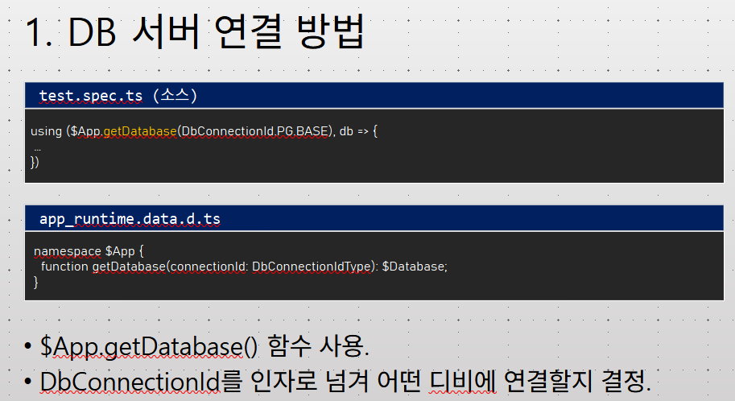

# Daily Retrospective  
**작성자**: [박성재]  
**작성일시**: [2025-01-15]  

## 1. 오늘 배운 내용 (필수)  
- Action 실습 구현 및 연결
- ESQL 이론

## Action 실습 구현 및 연결
기존에 구현했던 외화코드 업무의 `CRUD` 기능들의 경우 `Action`을 배제한채 구현했었습니다. 오늘은 이 `Action`을 구현하고, 기존 로직과 연결하는 실습을 진행했습니다.

### 1. Action 인터페이스 정의
```typescript
export const ICreateForeignCurrencyAction = new ActionIdentifier(
	'ICreateForeignCurrencyAction',
	'/api/app.tutorials/action/CreateForeignCurrencyAction'
);

export interface ICreateForeignCurrencyAction
	extends IActionImpl<ActionDataBase<ForeignCurrencyRequestDto>, ApiResultDto> {}

// ... IModifyForeignCurrencyAction, IDeleteForeignCurrencyAction, IUnDeleteForeignCurrencyAction, IDeleteForeignCurrencyAction도 구현하였음.
```
- `Action`의 일반적인 로직을 수행할 수 있도록 `IActionImpl`을 상속받아 인터페이스를 구현하였습니다.
- 프레임워크가 인터페이스를 인지할 수 있도록 `ActionIdentifier`를 통해 외부로 공개하였습니다.

### 2. Action 구현체 구현
```typescript
export default class CreateForeignCurrencyAction
	extends ApiActionBase<ActionDataBase<ForeignCurrencyRequestDto>, ExecuteSetupMainResultDto>
	implements ICreateForeignCurrencyAction
{
	executeSync(
		context: IExecutionContext,
		request: ActionDataBase<ForeignCurrencyRequestDto>
	): ExecuteSetupMainResultDto {
		const bizz_manager = context.getFeature<manager.IBizzManager>(manager.IBizzManager);

		const bizz_definition = bizz_manager.getBizzDefinition(context, context.action.bizz_sid);
		const derive_target = bizz_definition?.attributes?.find((attr) =>
			_.vIsEquals(attr.attr_id, definition_attrs.info.derive_use_info)
		)?.data?.list as DeriveBizzInfoTargetDto[];

		const slip_dto = {
			bizz_sid: context.action.action_mode,
			action_mode: EN_ACTION_MODE.Create,
			menu_type: EN_MENU_TYPE.Input,
			slip_data_model: request.data.slip_data_model,
			derive_info: {
				smc: {} as SlipDataModelContainer,
				derive_target: derive_target,
			},
		} as IActionProgramResolveProgramRequestDto;

		const program = ProgramBuilder.create<
			IActionProgramResolveProgramRequestDto,
			IActionProgramResolveProgramResult
		>(IActionProgramResolveProgram, context);

		const result = program.execute(slip_dto);

		return result;
	}
}
```
- 재고 업무의 로직을 참고해서 `action`의 구현체를 최대한 간단하게 구현해보았습니다.
- `feature`에 등록되있던 `bizz_manager`를 통해 업무의 `definition`을 불러오고, 그로부터 파생에 대한 정보를 정의하고 있습니다.
- 하위 프로그램에 전달할 `slip_dto`를 정의하고, 하위 프로그램을 찾아줄 `resolver program`에게 전달하여 로직의 실행을 위임하고 있습니다.

### 3. input.ts
```typescript
BizzUtil.setMenu(bizz_definition, {
	menu_sid: 'TM_000000E040114',
	menu_name: '외화 입력',
	menu_type: EN_MENU_TYPE.Input,
	data_model: [{ object_id: EN_INPUT_MENU_TYPE.Master, menu_role: EN_INPUT_MENU_TYPE.Master } as IMenuDataModelInfo],
	attributes: [
        // ...
		{
			prop_id: '',
			attr_id: definition_attrs.info.action_program_resolver,
			attr_type: EN_ATTR_TYPE.Information,
			data: {
				[EN_ACTION_MODE.Create]: ICreateForeignCurrencyProgram,
				[EN_ACTION_MODE.Modify]: IModifyForeignCurrencyProgram,
				[EN_ACTION_MODE.Delete]: IModifyStatusForeignCurrencyProgram,
				[EN_ACTION_MODE.UnDelete]: IModifyStatusForeignCurrencyProgram,
				[EN_ACTION_MODE.Remove]: IRemoveForeignCurrencyProgram,
			},
		},
	],
});
```
- 아주 예전에 정의해뒀었던, 외화코드 업무의 `menu definition` 중 `input`에 해당하는 파일입니다.
- 추가한 `Action`에서 `resolver program`을 통해 하위 프로그램을 찾을 수 있도록 `action_mode` 별로 매칭할 `program`들을 명세하였습니다.
- 이제 `Action`과 기존 로직의 시작점이던 `Program`들이 연결되었습니다.
- UI 부분의 로직은 연결하거나 추가된 것이 없으므로, 디버깅 등의 테스트는 팀장님께서 직전까지만하라고 하셔서 추가적인 테스트는 진행하지 않았습니다.   

## ESQL 이론
전달받은 `ESQL 교육자료`를 기반으로 금일 대부분의 내용을 학습하였으나, 아직 학습을 못한 부분이 있고 추가 복습도 해야할 것 같습니다. 무엇보다 실제로 써보면서 익히는 것이 필요하다고 느꼈습니다. 공부했던 내용을 목록화하면 다음과 같습니다.

- DB 연결방법
- 쿼리 생성 방법
- 옵션 설정 방법
- 쿼리 실행 방법
- 트랜잭션
- DbProfiler
- ESQL 특징
- 스키마/테이블 모델
- Statement 생성 및 구성
- 미리보기
- 쿼리 생성 및 호출 방법

위 내용 중에서 특히 집중해서 학습했던 내용들에 대해 정리해보겠습니다.   

<br/>

### Statement 생성 메소드 종류
`ESQL`에서 `Statement`를 생성할 시 크게 `table` 정보를 기반으로 생성하는 방법과 `viewer`라고하는 `ESQL`만의 것을 기반으로 생성하는 방법이 존재합니다. 먼저 `table` 정보를 기반으로 생성하는 방식을 살펴보겠습니다.

```sql
$ESql.from<table>(table)            // => SELECT Statement 생성
$ESql.insert<table>(table)          // => INSERT Statement를 생성
$ESql.insertBulk<table>(table)      // => INSERT Statement를 생성하는데, 대량 데이터시 사용
$ESql.insertSelect<table>(table)    // => INSERT SELECT Statement를 생성 (SELECT된 데이터를 INSERT하고 싶을 때)
$ESql.update<table>(table)          // => UPDATE Statement를 생성
$ESql.remove<table>(table)          // => DELETE Statement를 생성
$ESql.upsert<table>(table)          // => 테이블에 해당 데이터가 들어있다면 UPDATE, 아니라면 INSERT Statement를 생성
$ESql.upsertBulk<table>(table)      // => upsert와 같지만, 대량 데이터시 사용
```
- 대부분의 `SQL`에서 지원하는 기본 문법을 지원하고 있습니다.
- 특히, `Bulk` 연산도 지원하고 있는데, `Bulk` 연산의 경우는 `DB` 성능 개선을 위해 입력 값을 파라미터가 아닌 리터럴로 전달하며, 내부적으로 300개의 행씩 나눠서 처리된다고 합니다.
- 제네릭 매개변수로 대상 테이블의 `인터페이스`를 전달하고, 매개변수로 대상 테이블의 `identifier`를 전달해야 합니다.

### ef의 정체
```typescript
const esql = $ESql
			.update(viewerP, (opt) => {})
			.set(viewerP['status_type'], data.status_type)
			.where((ef, t) => ef._equal(t.tenant_sid, this.execution_context.session.tenant_sid))
			.where((ef, t) => ef._equal(t.foreign_currency_cd, data.foreign_currency_cd));
```
실습 중 위와 같은 `esql`문법을 보았을 때, 대충 어떤일을 하리라는것은 예상이 갔지만, `where` 절에 인자로 넘어가는 콜백함수의 인자인 `ef`와 `t`가 대체 무엇인지 궁금했습니다.

### EF 정적 객체
- 위 실습 코드에서 `ef`란 `ESql` 프레임워크에서 지원하는 하나의 정적 객체입니다.
- 정적 객체에서 제공하는 함수는 크게 `언더바로 시작하는 함수`와 `그 외 함수` 두 종류로 이루어져 있습니다.
- `언더바로 시작하는 함수` : 콜백함수 외부의 `clause`가 필요로하는 `expression type`을 반환하게 됩니다. 예를들어, 위 예시에서 `where`은 `condition type`이 필요하며, `where`절 안에서 콜백함수로 전달되는 `ef` 정적 객체는 `언더바로 시작하는 함수`로 `condition type`의 `expression`을 반환하는 함수만을 제공합니다.
- `그 외 함수` : 해당 절에서 필요로하는 `expression type`이 아닌 모든 절에 공통적으로 제공되는 함수가 제공 됩니다.

### Viewer
`ESql`에서 `Viewer`란 실제 존재하는 테이블 자체, 서브쿼리, 단순한 값의 조합, Json 등 쿼리할 때 참조하여 사용할 수 있는 모든 데이터 소스를 의미한다고 할 수 있습니다.

```javascript
// Table로 사용
const v_cust = $ESql.viewer<cust>(cust, 'A');
const v_emp = $ESql.viewer<cust_emp>(cust_emp);

constesql = $ESql.from(v_cust)
            .select((ef) => ef._all(v_cust))
            .join((type) => type.innerJoin, on => {
                on((ef) => ef_equal(v_cust.com_code, v_emp.com_code));
                on((ef) => ef._equal(v_cust.business_no, v_emp.business_no));
            })
            .where((ef) => ef._equal(v_cust.com_code, '80000'));

// 서브쿼리로 사용
const esqlSelect = $ESql.from<cust>(cust)
                    .select(ef => ef._all())
                    .where((ef, t) => ef._equal(t.com_code, '80000'));
const v_cust = esqlSelect.toViewer();

const esql = $ESql.from(v_cust)
            .select((ef) => ef._all())
            .where((ef) => ef.equal(v_cust['com_code'], '80000'));

// Values로 사용
interface i_value {
    A: number,
    B: string,
    C: number
};

const values: i_value[] = [
    {
        A: 1,
        B: "b1",
        C: 3
    },
    {
        A: 2,
        B: "b2",
        C: 4
    },
    {
        A: 3,
        B: "b3",
        C: 5
    },
];

const viewer = $Esql.viewerWithValue(values, "t1");
const eSql = $ESql.from(view1)
            .select(ef => ef._all());

// Json로 사용
const json = '{"id": "0003", "name": "ipad", "quantity": 100}';
const viewer_j = $ESql.viewerWithJson(json, opt => {
    opt.defineColumn("id", schema => schema.createString(20));
    opt.defineColumn("name", schema => schema.createString(100));
    opt.defineColumn("quantity", schema => schema.createInteger());
}, "J")

const eSql = $ESql.from(view_j)
    .select(ef => [viewer_j['id'], viewer_j['name'], viewer_j['quantity'],])
    .where(ef => ef._equal(viewer_j['id'], '0003'));
```
- 테이블로 `Viewer`를 사용할 때, 주로 테이블 간 `Join`이 필요한 경우 사용됩니다.
- 테이블 `Viewer`를 만들려면 대상 테이블 모델의 인터페이스와 `identifier`가 필요합니다.
- 테이블 `Viewer`를 만들면 예시처럼 뷰어끼리 Join할 수도 있고, 테이블과 뷰어를 조인할 수 있습니다.
- `Values`로 `Viewer`를 사용한다는 의미는 위처럼 값들 자체를 하나의 `Viewer`로서 선언하여 관리한다는 것입니다.
- `Values`로 `Viewer`를 생성하려면 위처럼 정적객체 `$ESql`에서 제공하는 `viewerWithValue` 함수를 사용하면 됩니다.


위 학습에서 저는 `ESql`에서 `Join`은 반드시 `View`를 사용해야만 가능한 것인지 궁금해졌습니다. 나중에 체크해볼 리스트해 추가해두고, 추후 해소해볼 예정입니다.  

<br/>

## 2. 동기에게 도움 받은 내용 (필수)

#### 설다은 선임
LibreOffice 사용이 익숙치 않다보니 PPT의 메모를 어떻게 봐야하는지 몰랐습니다. 이에 대해 여쭤보니 어떻게 보면되는지 잘 알려주셔서 교육 자료로 주신 PPT의 메모를 보며 공부할 수 있어 도움이 되었습니다.

#### 고건호 선임
어제와 오늘 `Generator`와 관련해서 여러가지 질문을 주셨는데, 여러번 설명을 하게되면서 저도 정리를 할 수 있어 좋은 기회가 되었습니다.

---

## 3. 개발 기술적으로 성장한 점 (선택)
아래의 3가지 주제 중 하나를 선택하여 작성합니다.

### 1. DB Connect 타이밍

`ESql` 교육자료 초반 부분에 DB를 연결하는 부분이 있었습니다. 저는 여기서 로직이 흘러갈 때 어떤 타이밍에 서버에서 DB에 연결하는지 알고싶었습니다. 따라서 견적입력 기능을 시작으로 로직을 타고 들어가봤습니다.  

<br/>

결론적으로 살펴보니 `EsqlDacCommand` 클래스에서 `execute`가 호출될 때 `databaseExecutableFeature` 함수를 호출해서 DB에 연결하고 있었습니다.

```typescript
export abstract class ESqlDacCommand<
	TDataModel,
	TResult,
	TContext extends IContextBase = IExecutionContext
> extends DacCommandSync<TDataModel, TResult, TContext> {
	execute(data: TDataModel): TResult {
		using($App.trace(`${this.getTraceId(data)}.execute`));
		return decorateTransaction<TResult>(this, () => {
			if (!this.databaseExecutableFeature) {
				Exception.throw(ExceptionBuilder.createSystemException('DacCommand::required database'));
			}
			this.onValidate(data);
			const esql = this.generateESql(data);
			if (!esql) {
				return undefined as TResult;
			}
			return this.databaseExecutableFeature<TResult>(this.default_connection_id, (db) => {
				return this.onExecute(db, esql);
			});
		});
	}

    // ...
export interface IDatabaseExecuteFeature extends IFeature {
	<TResult>(connection_id: DbConnectionIdType, cb: (db: $Database) => TResult): TResult;
}
export const IDatabaseExecuteFeature = new FeatureIdentifier('IDatabaseExecuteFeature');
const defaultInstance = function <TResult>(connection_id: DbConnectionIdType, cb: (db: $Database) => TResult): TResult {
	if (cb) {
		return cb($App.getDatabase(connection_id));
	}
	return {} as TResult;
} as IDatabaseExecuteFeature;
defaultInstance.feature_id = 'IDatabaseExecuteFeature';
```
- 여기서 `ESqlDacCommand`는 Data의 액세스를 관할하는 `master program`에서 생성되며 `excute`됩니다.
- `ESqlDacCommand`는 우리가 DB에 액세스하기위한 로직을 작성하는 `Dac`의 부모 클래스입니다.
- 즉, `master`프로그램에서 DB에 액세스하기 위해 `Dac`을 생성하고 `Excetute`할 때마다 설정해둔 DB에 연결을 시도하게 되는 것입니다.

### 3. 해소못한 의문사항
Esql을 공부하면서 아직 해소하지 못한 의문사항들입니다.

- 트랜잭션 데코레이터를 통해 트랜잭션 설정 시, 프레임워크에서 Scope 해제할 때 Commit한다는것이 무슨 말인가?
- View에서 Table을 들고 올 경우, Table의 모든 데이터가 View에 담기는 것인가?
- 6강의 esql로 생성될 쿼리문 미리 확인 방법이 이해가 안가는 상태
- 4강의 CTE 기능 추가 공부 필요