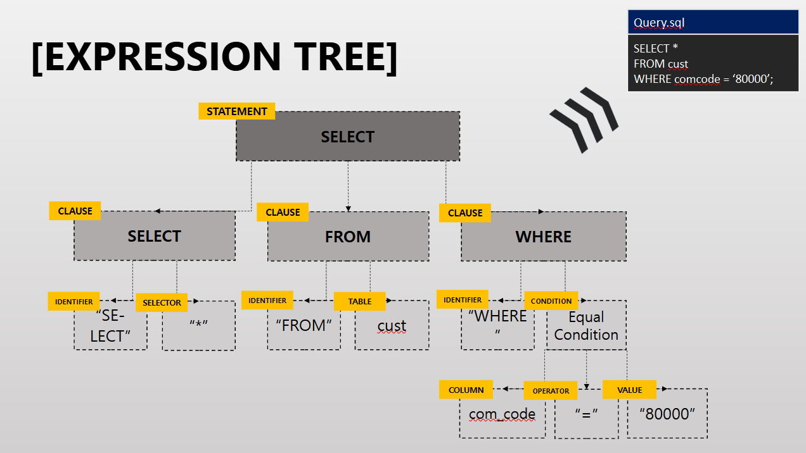
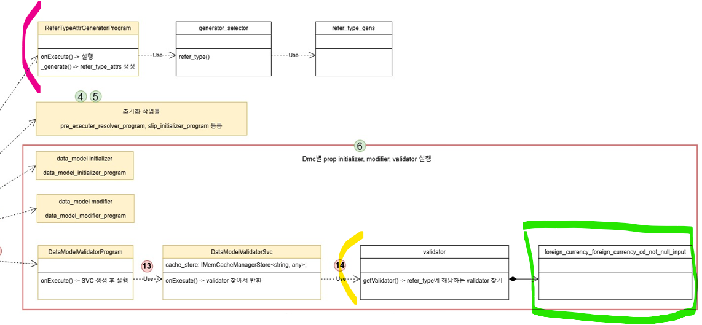
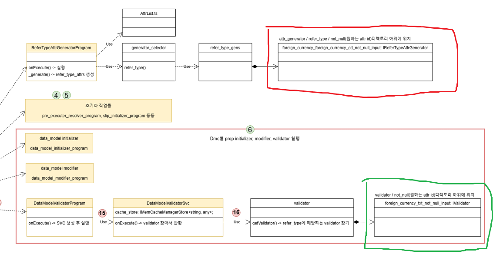
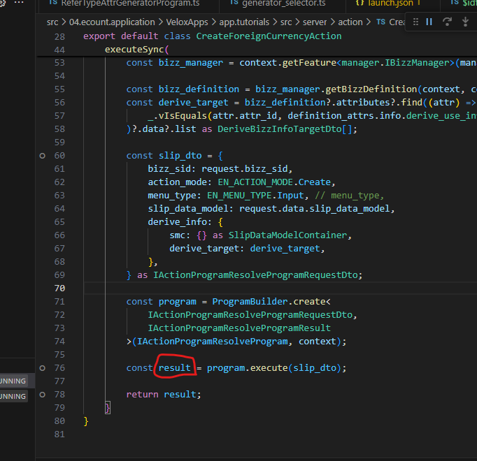
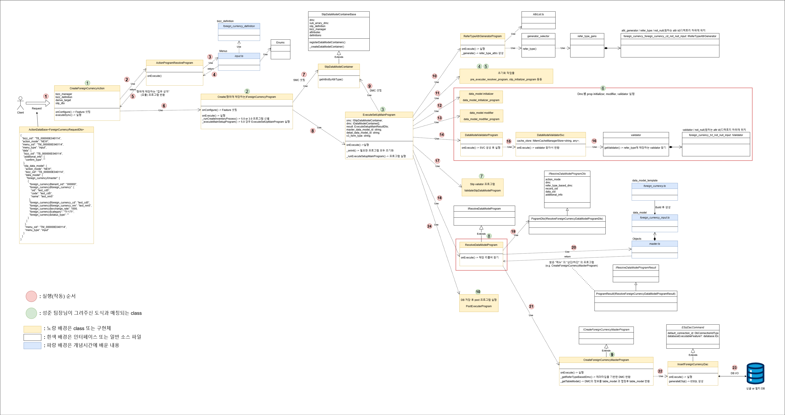

# Daily Retrospective

**작성자**: [박주현]  
**작성일시**: [2025-01-15]

# 1. 오늘 배운 내용

## 1️⃣ ESQL을 학습하였습니다.

5.0에선 3.0과 다르게 ESQL 만을 사용하여 DB에 데이터를 저장하도록 권고하고 있습니다. 3.0 에서는 RAW QUERY, PROCEDURE, ORM, UDP 4가지를 활용하여 데이터를 저장합니다. 하지만 5.0에서는 ESQL을 활용합니다. ESQL 이 ECOUNT SQL 인줄 알았지만, EXPRESSION SQL 이었습니다. ESQL은 트리 구조로 되어 있어, STATEMENT를 시작으로 구성되게 됩니다. 아래 그림과 같습니다.



RAW QUERY, PROCEDURE, ORM, UDP 대신 ESQL을 사용하는 이유는 MSSQL, MYSQL, PG 서버 프로바이더를 구분짓지 않고, 공통적으로 사용하기 위함입니다. 각각의 SQL 문법은 기본 SQL을 토대로 여러가지 방언처럼 되어 있습니다. 하지만 ESQL을 사용하면 프로바이더에 비종속적이게 되고 ORM 문법에 따라 그리고 DB 프로바이더 양식에 따라 쿼리를 작성하게 됩니다.

특히나 실습에서 update 쿼리를 사용할 때 esql에 심도있는 학습을 할 수 있었습니다. esql에서 update 는 rest api 에서 put 처럼 데이터를 덮어씌우는 방식입니다. 그래서 컬럼이 즉 필드가 누락된다면 기본값이나 null이 들어가게 됩니다. 실습에서도 `환율` 만 바꿔주고 싶어서 기본키로 사용하는 tenant_sid와 foreign_currency_cd 그리고 변경할 exchange_rate 만을 넘겨주었습니다.

```ts
foreign_currencyXmaster: [
			{
				foreign_currency$tenant_sid: '303101',
				foreign_currency$foreign_currency_cd: 'test_cd5',
				foreign_currency$exchange_rate: 2000,
			},
		],

```

이렇게 하니 다른 필드들이 모두 빈값으로 들어가게됐습니다. 그렇다면 update 할 때 마다 수정하기 싫은 컬럼들은 원본 데이터의 컬럼의 값을 계속 넣어줘야하나 했습니다. 하지만 이는 비효율적이므로 그렇게 하지 않는 방법이 있을 것이라 생각했습니다. 그리고 가공하지 않을 컬럼을 제외시키는 clause 를 학습했습니다.

```ts
const esql = $ESql
  .update<pg.foreign_currency_20250110_pjh_ecback>(
    pg.foreign_currency_20250110_pjh_ecback,
    data,
    (opt) => {
      opt.excludeColumns((t) => [
        t.tenant_sid,
        t.foreign_currency_cd,
        t.foreign_currency_nm,
        t.category,
        t.status_type,
        t.write_dtm,
      ]);
    }
  )
  .where((ef, t) =>
    ef._equal(t.tenant_sid, this.execution_context.session.tenant_sid)
  )
  .where((ef, t) => ef._equal(t.foreign_currency_cd, data.foreign_currency_cd));
return esql;
```

위 방식처럼 excludeColumns() 함수를 사용하면 됐습니다. 변경하지 않을 값은 excludeColumns() 에 넣어주고, 변경할 값만 덮여씌여지게 됩니다.

## generator 와 validator

어제 학습했던 refer type 에 대해 generator, validator 부분에서 착오가 있어. 민준님의 열띈 강연으로 완벽하게 습득했습니다.

먼저 어제 이미지입니다.



자주색 부분은 refer type 에 따라 prop 에 속성을 추가해주는 프로그램이고, 노랑 부분은 그 속성들을 밸리데이션 하는 프로그램 파트입니다. 여기서 초록 박스의 파일에 명시해둔 내용을 토대로 속성을 추가하고 그 파일을 이용해서 밸리데이션을 하는 흐름으로 이해를 했지만, 둘은 연관이 없으며 각각 다른 흐름입니다.

```ts
return (refer_type_gens[
  `${bizz_id}_${refer_type}_${attr_id}_${menu_type}` as keyof typeof refer_type_gens
] ||
  refer_type_gens[
    `${bizz_id}_${refer_type}_${attr_id}` as keyof typeof refer_type_gens
  ] ||
  refer_type_gens[
    `${bizz_type}_${refer_type}_${attr_id}_${execution_context.session.site}` as keyof typeof refer_type_gens
  ] ||
  refer_type_gens[
    `${bizz_type}_${refer_type}_${attr_id}_${menu_type}` as keyof typeof refer_type_gens
  ] ||
  refer_type_gens[
    `${bizz_type}_${refer_type}_${attr_id}` as keyof typeof refer_type_gens
  ] ||
  refer_type_gens[
    `${refer_type}_${attr_id}_${menu_type}` as keyof typeof refer_type_gens
  ] ||
  refer_type_gens[`${refer_type}_${attr_id}` as keyof typeof refer_type_gens] ||
  refer_type_gens[`${attr_id}_${menu_type}` as keyof typeof refer_type_gens] ||
  refer_type_gens[
    attr_id as keyof typeof refer_type_gens
  ]) as IReferTypeAttrGenerator<any>;
```

이런 파일 네이밍을 통해서 generator 와 validator 를 찾아오게 됩니다. 둘의 로직에서 비슷한 흐름이 있어 한 파일을 공동으로 사용하는 줄 알았습니다.



최종적으로 제대로 된 흐름은 위와 같습니다. 각기 다른 경로의 파일을 찾아보게 되고, 반환해서 가져오는 인터페이스의 자료형 또한 다릅니다. 두 프로그램은 연관이 하나도 없고, 개별적인 로직입니다. 방식이 비슷했을 뿐 다른 경로와 다른 파일을 참조해 generator 와 validator 를 찾아오게 됩니다.

---

# 2. 동기에게 도움 받은 내용

민준님이 어제 잘못 알려주신 refer type 에 대한 내용을 오늘 AS 해주셨습니다. 특히나 오전 내내 많은 분들을 돌아다니시며 해당 개념을 설명해주셨습니다. 또한 개인적으로는 ExecutionContextFactory, Bizzmanager, 트랜잭션 전파 수준에 대해서도 이야기 나눠봤습니다. 현철님과 건호님과도 이야기를 하면 구현 방법을 모색해 보고, 성범 책임님께 피들러 사용하여 api 쏘는 걸 배웠습니다. 강민님께도 리졸버를 찾지못하는 에러에 대해 배웠습니다.
오늘 점심에 자리가 없어 밥을 혼자 앉아서 먹었는데 연아님이 챙기러 와주셨습니다. 역시 큰누님이 최고라는 생각을 했습니다.

---

# 3. 개발 기술적으로 성장한 점

## 3-1. 교육 과정 상 배운 내용이 아닌 개인적 호기심을 해결하기 위해 추가 공부한 내용

### (1) ESQL 에서 트랜잭션 전파 수준

```
const enum TransactionOption {
        /// <summary>
        /// The ambient transaction context is suppressed when creating the scope. All operations
        /// within the scope are done without an ambient transaction context. This is the default value.
        /// </summary>
        Suppress = 0,

        /// <summary>
        /// A transaction is required by the scope. It uses an ambient transaction if one already exists.
        /// Otherwise, it creates a new transaction before entering the scope.
        /// </summary>
        Required = 1,

        /// <summary>
        /// A new transaction is always created for the scope. You must use this option in background tasks
        /// when you do not want to affect or join main thread's transaction.
        /// </summary>
        RequiresNew = 2,

        /// <summary>
        /// A new transaction is always created for the scope. Currently, not supported.
        /// </summary>
        RequiresEach = 4,

        /// <summary>
        /// The none transaction
        /// </summary>
        None = 0x10
    }
```

위에서 보는 것과 같이 트랜잭션 전파 수준이 있습니다. `@_transaction(TransactionOption.Required)` 소스에서는 데코레이터를 활용하여 명시하고 있습니다. 여기서 TransactionOption 이 전파 수준을 설정할 수 있는 부분입니다. 전파 수준에서 `Suppress`가 있는데 이것이 무엇인지 학습해 보았습니다. 스프링에서도 전파수준을 설정할 수 있습니다. `Propagation.REQUIRED` ,`Propagation.REQUIRES_NEW`, `Propagation.SUPPORTS`, `Propagation.NOT_SUPPORTED`,`Propagation.NEVER` 등이 있습니다. 하지만 ESQL에 해당하는 `Suppress` 는 존재 하지 않습니다.

#### Suppress

Suppress은 트랜잭션 컨텍스트를 사용하지 않고 범위를 생성합니다.범위 내 작업은 트랜잭션 컨텍스트 없이 수행됩니다. 즉 앞선 트랜잭션이 있다면 합류하지도 않고, 새로운 트랜잭션을 만들지도 않고, 독립적으로 수행될 수 있다는 뜻입니다. `Suppress` 옵션은 현재 활성화된 트랜잭션 컨텍스트를 사용하지 않고 작업을 수행하겠다는 것을 나타냅니다.

이는 스프링의 `Propagation.SUPPORTS` 과 비슷한 개념이었습니다. 그밖에 Required 과 RequiredNew 는 널리 쓰이는 옵션입니다.
`Required`은 기존에 존재하는 트랜잭션 컨텍스트가 있다면 이를 사용하며, 없다면 새로운 트랜잭션을 생성합니다. `RequiresNew` 항상 새로운 트랜잭션을 생성합니다. 특히 백그라운드 작업에서 사용되며, 메인 스레드의 트랜잭션에 영향을 주지 않습니다. 스프링의 REQUIRED 와 REQUIRES_NEW 개념과 일치합니다.

### (2) Redis 프로토콜

ESQL 학습 도중 Redis 프로토콜을 사용하는 SSDB 라는 개념을 배웠습니다. 그리고 이 SSDB 는 디스크 기반의 DB 라고 했습니다. 제가 아는 REDIS 는 인메모리 DB로서 해당 내용이 잘못된 줄 알았습니다. 하지만 REDIS 가 아니라 Redis 프로토콜 사용하는 디스크 DB 라는 말로 설명이 틀린 내용이 아니었습니다.

`Redis 프로토콜`이란 Redis 서버와 클라이언트가 효율적으로 데이터를 송수신하도록 설계된 경량 프로토콜입니다. REQ/RES(요청/응답) 구조를 따릅니다. Redis 명령어(GET, SET, DEL 등)를 문자열로 표현하며, 각 명령은 하나의 요청/응답 사이클로 처리됩니다. REDIS DB는 실제로 Redis 프로토콜을 사용합니다.

하지만 Redis 프로토콜은 꼭 REDIS DB에서만 쓰이는 게 아니며 저장 매체와는 무관하게 동작합니다. 따라서 SSDB와 같은 디스크 기반 스토리지는 Redis 프로토콜을 사용할 수 있습니다.

## 3-2. 오늘 직면했던 문제 (개발 환경, 구현)와 해결 방법

### (1) 헤더 에러

피들러를 통해 API 를 쏴서 ACTION에 도달하게 했는데, REQUEST 가 정상적으로 오지 않았습니다. 디버깅을 통해 REQUEST 를 봤지만 UNDIFINED가 나타났습니다. 이유는 헤더가 하나 빠졌기 때문이었습니다. REQUEST BODY 에서 JSON으로 데이터를 보내 외화코드를 생성하게 되는데, `Content-Type: application/json` 이 누락되어 보낸 REQUEST 를 인식하지 못하는 것이었습니다. 성범책임님께서 알려주셔서 문제를 해결활 수 있었습니다.

### (2) 리졸버를 찾지 못하는 에러



<br>

ActionProgramResolveProgram 의 반환 값으로 CreateForeignCurrencyProgram 을 찾아와야합니다. 하지만 `result` 변수에 계속 빈객체 `{}` 가 들어 왔습니다. 강민님도 해당 이슈를 겪어서 이유에 대해 공유해주셨습니다.

```
BizzUtil.setMenu(bizz_definition, {
	menu_sid: 'TM_000000E040114',
	menu_name: '외화 입력',
	menu_type: EN_MENU_TYPE.Input,
	data_model: [{ object_id: EN_INPUT_MENU_TYPE.Master, menu_role: EN_INPUT_MENU_TYPE.Master } as IMenuDataModelInfo],
	attributes: [
		{
			prop_id: '',
			attr_id: 'api',
			attr_type: EN_ATTR_TYPE.Api,
			data: {

			},
		},
		{
			prop_id: '',
			attr_id: definition_attrs.info.action_program_resolver,
			attr_type: EN_ATTR_TYPE.Information,
			data: {
				[EN_ACTION_MODE.Create]: 'ICreateForeignCurrencyProgram',
			} as definition_attrs.info.action_program_resolver,
		},
	],
});
```

바로 리졸버를 설정해주는 속성이 누락이 되었기 때문입니다. ActionProgramResolveProgram 에서 해당 파일을 참조해 CreateForeignCurrencyProgram 을 반환하게 되는데, 이 설정이 누락이 되었습니다. 추가를 해주고 다시 API 를 쏴보니 정상적으로 데이터가 DB에 저장됐습니다.

### (3) 도식 갱신



```
화질구지는 이미지를 클릭하여 확대해주세요.
```

<br>

refer type 에 대해 generator 와 validator 부분이 잘못되어 해당 부분을 수정했습니다. 또한 5.0개념 시간에 배운 내용과 해당하는 파일을 추가해주었습니다. 또한 Action을 구현했기 때문에 관련 내용도 추가해서 갱신했습니다.

### +) 추가적인 궁금증

피들러를 통해 현재 HTTP REQUEST를 보내고 있습니다. 하지만 지금 저희가 만든 ACTION은 REQUEST 를 파싱하여 요청을 처리해주는 구조가 아닙니다. 저희가 만든 ACTION이 실행되기 전에 파싱과 해당 ACTION을 찾아 DTO 를 전송하는 부분이 있을 거라 추측하고 있습니다. `endpoint.ts` 또한 ACTION이 실행되기 전에 실행되는 걸 디버깅 통해 알 수 있습니다. 저희가 만든 ACTION 에 오기 전의 로직들을 학습하여 어떻게 HTTP REQUEST 를 처리하는지 궁금했습니다.
UI 파트를 학습하게 된다면 이를 알 수 있을 거라 생각했습니다. UI 파트에서 저희가 만든 ACTION 의 인스턴스를 생성하고 REQUEST로 온 데이터를 파싱해 파라미터로 보내준다는데, 해당 부분의 로직을 빨리 보고 싶습니다. 5.0은 프레임워크로서 매우 추상화 되어 구현되어 있을 것 같습니다.

---
