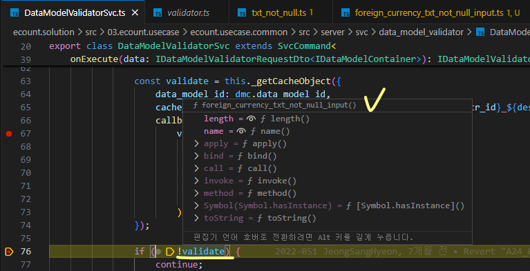
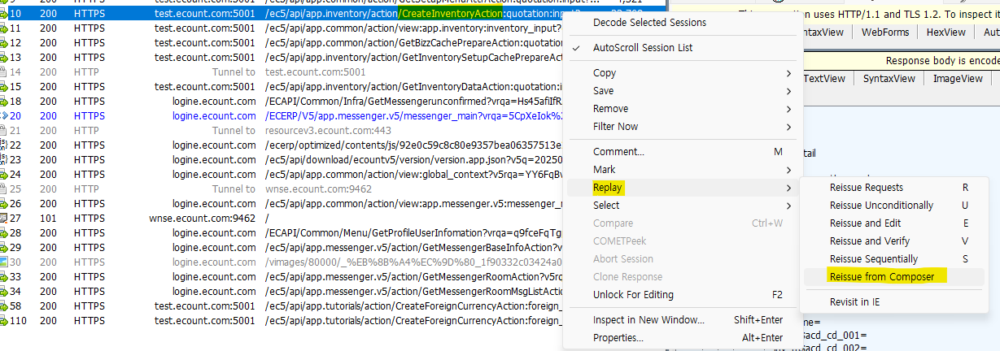
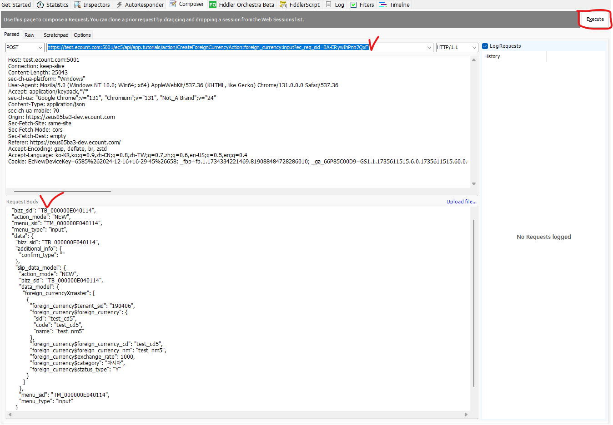
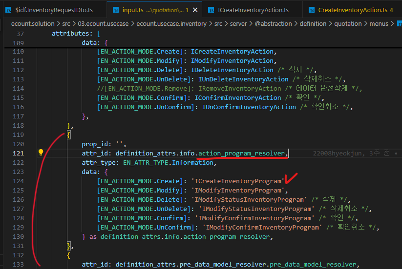
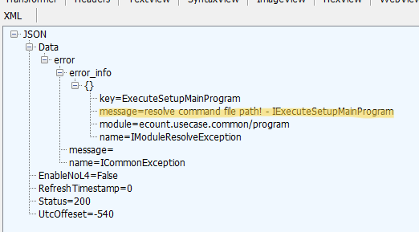
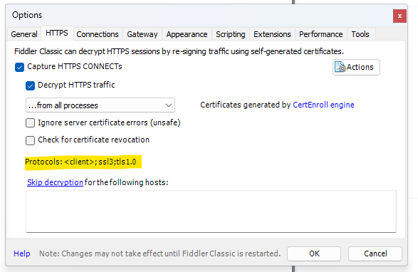

# Daily Retrospective

**작성자**: [설다은]  
**작성일시**: [2025-01-15]

## 1. 오늘 배운 내용 (필수)

### 🗒️ [validator 이해]<br>

_1. TempExecuteSetupMainProgram.ts (원래는 그냥 ExecutsSetupMainProgram.ts)_<br>
: Action 에대해서 우선순위대로 로직을 실행<br>

```ts
// 03.ecount.usecase\ecount.usecase.common\src\server\program\TempExecuteSetupMainProgram.ts

// data_model_validator 로직은 DataModelValidatorProgram가 들어감.
const validator_result = data_model_validator_program.execute({
  data_model_container: dmc,
  menu_type,
});

if (!_.vIsEmpty(validator_result.exception)) {
  validator_error_list.push(...validator_result.exception.details);
}

if (!_.vIsEmpty(validator_error_list)) {
  Exception.throw(
    ExceptionBuilder.create<IDataModelValidationException>(IDataModelValidationException, {
      data_model_id: this.master_data_model_id,
      details: validator_error_list,
    })
  );
}
```

<br>
_2. DataModelValidatorProgram.ts_<br>
data_model_validtor을 돌리는 공통 프로그램<br>

```ts
// 03.ecount.usecase\ecount.usecase.common\src\server\program\data_model\DataModelValidatorProgram.ts
onExecute(dto: IDataModelValidatorRequestDto<IDataModelContainer>): IDataModelValidatorResultDto {

const svc = SvcCommandBuilder.create(DataModelValidatorSvc, this.execution_context);
const result = svc.execute(dto);

return result;
}
```

<br>
_3. DataModelValidatorSvc.ts_<br>

```ts
// 03.ecount.usecase\ecount.usecase.common\src\server\svc\data_model_validator\DataModelValidatorSvc.ts

const validate = this._getCacheObject({
  data_model_id: dmc.data_model_id,
  cache_key: `${bizz_type}_${descriptor?.data_type}_${attr.attr * id}*${descriptor.refer_type}_${data.menu_type}\_validator`,
  callback: () =>
    // 필요한 validator를 가져옴 (generator_selector랑 비슷한 역할 수행)
    validators.getValidator(descriptor.data_type || "", attr.attr_id, descriptor.refer_type, this.execution_context.action.menu_type, bizz_type),
});
// 4번 실행결과로 validate에 내가 생각한 파일 (foreign_currency_txt_not_null_input)이 잘 들어왔는지 확인
if (!validate) {
  continue;
}
let target_data = [];
if (!Array.isArray(attr.data)) {
  target_data = [attr.data];
} else {
  target_data = attr.data;
}
let is_continue = true;
let error_message: undefined | string;
```

**_[validate의 값 캡처본]_**<br>
<br>
<br>
_4. Validator.ts_<br>

```ts
// 02.ecount.infrastructure\ecount.infra.attribute\src\server\provider\validator.ts

export function getValidator(
  data_type: data_types,
  attr_id: string,
  refer_type?: string,
  menu_type?: string,
  bizz_type?: string
): IValidator | undefined {
  data_type = data_type?.replace(/\$\$/, "");

  return (validators[`${bizz_type}_${data_type}_${attr_id}_${refer_type}` as keyof typeof validators] ||
    validators[`${bizz_type}_${data_type}_${attr_id}_${menu_type}` as keyof typeof validators] ||
    validators[`${bizz_type}_${data_type}_${attr_id}` as keyof typeof validators] ||
    validators[`${data_type}_${attr_id}_${refer_type}` as keyof typeof validators] ||
    validators[`${data_type}_${attr_id}_${menu_type}` as keyof typeof validators] ||
    validators[`${data_type}_${attr_id}` as keyof typeof validators] ||
    validators[`default_${attr_id}` as keyof typeof validators] ||
    validators[attr_id as keyof typeof validators]) as IValidator | undefined;
}
```

4번에서 validators를 돌 때, 아무런 작업을 하지 않았으면 우선순위를 타서 txt_not_null파일이 validator로 수행된다.<br>
만약 foreign_currency의 txt data_type의 not null을 검사해야하는 로직이 다르다고 하면 아래 경로에 validator를 만들어서 수행할 수 있도록 추가 작업이 필요하다.<br>
경로 : 02.ecount.infrastructure\ecount.infra.attribute\src\@shared_infra_attribute\validator\not_null\foreign_currency_txt_not_null_input.ts<br>
물론 index.ts에 경로를 추가하는 작업도 필수적으로 진행해줘야한다!!!<br>

### 🗒️ [CreateForeignCurrencyAction 구현]<br>

**_[필요한 파일 생성]_**

_1. input.ts_<br>>
attr_id : api > action_mode : create의 주석 해제

```ts
// 03.ecount.usecase\ecount.usecase.tutorials\src\server\@abstraction\definition\foreign_currency\menus\input.ts
```

_2. dto생성_<br>

```ts
// 03.ecount.usecase\ecount.usecase.tutorials\src\@shared_usecase_tutorials\@abstraction\dto\$idf.ForeignCurrencyRequestDto.ts
import { ISlipDataModel, NotificationRequestDto } from "ecount.usecase.base/@abstraction";

export const ForeignCurrencyRequestDto = new $InterfaceIdentifier("ForeignCurrencyRequestDto");

export interface ForeignCurrencyRequestDto {
  slip_data_model: ISlipDataModel;
  additional_info?: {
    [additional_info_id: string]: any;
  };
  notification?: NotificationRequestDto;
  current_template?: number;
  is_za_from_only?: boolean;
}
```

_3. ICreateForeignCurrencyAction 생성_<br>

```ts
// 03.ecount.usecase\ecount.usecase.tutorials\src\@shared_usecase_tutorials\@abstraction\action\ICreateForeignCurrencyAction.ts

import { ActionDataBase, ActionIdentifier, IActionImpl } from "ecount.infra.base/abstraction";
import { ApiResultDto } from "ecount.usecase.base/@abstraction";
import { ForeignCurrencyRequestDto } from "../dto";

export const ICreateForeignCurrencyAction = new ActionIdentifier(
  "ICreateForeignCurrencyAction",
  "/api/app.ForeignCurrency/action/CreateForeignCurrencyAction"
);

export interface ICreateForeignCurrencyAction extends IActionImpl<ActionDataBase<ForeignCurrencyRequestDto>, ApiResultDto> {}
```

_4. CreateForeignCurrencyAction 구현체 생성_<br>

```ts
//04.ecount.application\VeloxApps\app.tutorials\src\server\action\CreateForeignCurrencyAction.ts

import { ApiActionBase } from 'ecount.application.common/action';
import { IExecutionContext } from 'ecount.infra.bridge/base';
import { ProgramBuilder } from 'ecount.infra.common/program';

import { AuthorityDataDto, definition_attrs } from 'ecount.usecase.base/@abstraction';
import { ActionDataBase, IConfigurationContext } from 'ecount.infra.base/abstraction';
import { EN_ACTION_MODE, EN_AUTHORITY_TYPE, EN_MENU_TYPE } from 'ecount.fundamental.define/enum';

import { BizzVersionCheckFeature, SlipDataModelContainer } from 'ecount.usecase.common/@implement';
import {
DeriveBizzInfoTargetDto,
ExecuteSetupMainRequestDto,
ExecuteSetupMainResultDto,
IActionProgramResolveProgram,
IActionProgramResolveProgramRequestDto,
IActionProgramResolveProgramResult,
IValueResolverConfigureFeature,
IVersionCheckFeature,
} from 'ecount.usecase.common/@abstraction';
import { manager } from 'ecount.infra.bridge/feature';
import { InventoryExecuteMainValueResolverConfigureFeature } from 'ecount.usecase.inventory/@implement';
import { ForeignCurrencyRequestDto, ICreateForeignCurrencyAction } from 'ecount.usecase.tutorials/@abstraction';
import { Authority } from './action_util/Authority';

@\_authorize({ authority_type: EN_AUTHORITY_TYPE.Insert } as AuthorityDataDto, Authority.getForeignCurrencyAuthority)
export default class CreateInventoryAction
extends ApiActionBase<ActionDataBase<ForeignCurrencyRequestDto>, ExecuteSetupMainResultDto>
implements ICreateForeignCurrencyAction
{
protected onConfigure(configuration_context: IConfigurationContext, execution_context: IExecutionContext): void {
configuration_context.setFeature<IVersionCheckFeature>(
IVersionCheckFeature,
new BizzVersionCheckFeature(execution_context)
);

    	configuration_context.setFeature<IValueResolverConfigureFeature>(
    		IValueResolverConfigureFeature,
    		new InventoryExecuteMainValueResolverConfigureFeature(execution_context)
    	);
    }

    executeSync(
    	context: IExecutionContext,
    	request: ActionDataBase<ForeignCurrencyRequestDto>
    ): ExecuteSetupMainResultDto {
    	const { action_mode, menu_type } = request;
    	// menu_type을 내려주지 못해 하드코딩
    	// ===================================================
    	// context.action.menu_type = EN_MENU_TYPE.Input;
    	// ===================================================
    	const bizz_manager = context.getFeature<manager.IBizzManager>(manager.IBizzManager);

    	const bizz_definition = bizz_manager.getBizzDefinition(context, context.action.bizz_sid);
    	const derive_target = bizz_definition?.attributes?.find((attr) =>
    		_.vIsEquals(attr.attr_id, definition_attrs.info.derive_use_info)
    	)?.data?.list as DeriveBizzInfoTargetDto[];

    	const slip_dto = {
    		bizz_sid: context.action.action_mode,
    		action_mode: EN_ACTION_MODE.Create,
    		menu_type: EN_MENU_TYPE.Input, // menu_type,
    		slip_data_model: request.data.slip_data_model,
    		derive_info: {
    			smc: {} as SlipDataModelContainer,
    			derive_target: derive_target,
    		},
    		current_template: request.data.current_template,
    		is_za_from_only: request.data.is_za_from_only,
    		additional_info: request.data.additional_info,
    		notification: request.data.notification,
    	} as IActionProgramResolveProgramRequestDto;

    	const program = ProgramBuilder.create<
    		IActionProgramResolveProgramRequestDto,
    		IActionProgramResolveProgramResult
    	>(IActionProgramResolveProgram, context);

    	const result = program.execute(slip_dto);

    	return result;
    }

}
```

**_[소스코드 실행]_**

_0. 로컬 > 견적서입력에 저장버튼 클릭하면 fiddler에 CreateInventoryAction이 있는데 이거 composer로 수정해서 실행(execute)해보기_<br>
<br>
<br>

_1. CreateForeignCurrencyAction.ts_<br>

```ts
  // 04.ecount.application\VeloxApps\app.tutorials\src\server\action\CreateForeignCurrencyAction.ts
  executeSync(
  ...
  const slip_dto = {
  bizz_sid: context.action.action_mode,
  action_mode: EN_ACTION_MODE.Create,
  menu_type: EN_MENU_TYPE.Input,
  slip_data_model: request.data.slip_data_model,
  derive_info: {
  smc: {} as SlipDataModelContainer,
  derive_target: derive_target,
  },
  current_template: request.data.current_template,
  is_za_from_only: request.data.is_za_from_only,
  additional_info: request.data.additional_info,
  notification: request.data.notification,
  } as IActionProgramResolveProgramRequestDto;

        const program = ProgramBuilder.create<
          IActionProgramResolveProgramRequestDto,
          IActionProgramResolveProgramResult
        >(IActionProgramResolveProgram, context);

        const result = program.execute(slip_dto);

        return result;
  )
```

_2. ActionProgramResolveProgram.ts_<br>

```ts
// 03.ecount.usecase\ecount.usecase.common\src\server\program\slip\ActionProgramResolveProgram.ts
rotected onExecute(dto: ProgramDto): ProgramResult {
const { slip*data_model, additional_info, derive_info, current_template, is_za_from_only } = dto;
const action_mode = *.vSafe(dto.action_mode, this.execution_context.action.action_mode);

    const resolver = this.execution_context.bizz_mgr
      .getMenuDefinition(
        this.execution_context,
        this.execution_context.action.bizz_sid,
        this.execution_context.action.menu_sid || ''
      )
      // attr_id가 definition_attrs.info.action_program_resolver인것에 action_mode가 'NEW'인 것을 찾아야함.
      // 근데 foreign_currency의 input에는 attr_id가 api인 것만 있고 action_program_resolver인 것이 없음 -> 해당 부분을 추가 후 빌드 필요함. (아래이미지 참조)
      ?.attributes?.find((x) => x.attr_id == definition_attrs.info.action_program_resolver)?.data[action_mode];

    // 빌드 후 다시 실행하면 foreign_currency의 input에 일치하는 값이 있으니 그에 해당하는 프로그램을 찾아줄 것 (CreateForeignCurrencyProgram)
    // 그 이후부터의 동작은 우리가 이전에 구현했던 흐름대로 동작하며 DB에 값이 저장됨
    if (resolver) {
      const program = ProgramBuilder.create<ExecuteSetupMainRequestDto, ExecuteSetupMainResultDto>(
        resolver,
        this.execution_context
      );
      return program.execute({
        slip_data_model: slip_data_model,
        additional_info: additional_info,
        derive_info: derive_info,
        current_template: current_template,
        is_from_za_only: is_za_from_only,
      }) as unknown as ProgramResult;
    }

    return {} as unknown as ProgramResult;
  }
```

<br>

## 2. 동기에게 도움 받은 내용 (필수)

**민준님**<br>
어제에 이어 오늘은 validator에 대한 흐름을 전체적으로 설명해주셨습니다.<br>
어디에서 어디를 호출하고 이런것들을 디버깅을 통해 세심하게 알려주셔서 잘 이해가 갑니다.<br>
이렇게하면 혼자 스스로 디버깅할때도 이런 부분이 있었지하고 참고하게되어 학습에 많은 도움이 되었습니다.<br>

## 3. 개발 기술적으로 성장한 점 (선택)

### 1. 교육 과정 상 배운 내용이 아닌 개인적 호기심을 해결하기 위해 추가 공부한 내용

### 2. 오늘 직면했던 문제 (개발 환경, 구현)와 해결 방법

**_1. 견적서입력 저장 시 path관련 에러가 뜨는데 어딘지 제대로 못찾는 문제_**<br>



이전에 도형님이랑 디버깅하면서 TempExecute랑 Execute랑 헷갈리니까 Execute가 안먹히도록 주석처리한 적이 있다.<br>
해당 위치에 있는 index에 가서 한번 봤을 때 분명히 주석 해제되어있었는데....다시 보니까 여전히 주석 상태였다.<br>
해제하고 빌드한 이후에는 디버깅이 잘 잡혔다.<br><br>

**_2. CreateForeignAction을 디버깅하려그랬는데 피들러에서 500이나 502 gateway 오류 발생_**<br>



피들러 설치 시 위 프로토콜을 분명 변경했었는데, 다시 보니까 안바뀌어있었던 것이다.<br>
`<client>;ssl3;tls1.0;tls1.1;tls1.2`<br>
이걸로 바꾼 후 실행했더니 디버깅이 잘 먹혔다.<br>

## 4. 소프트 스킬면에서 성장한 점 (선택)

디버깅을 할 때 인내심을 가지는 스킬이 늘었습니다.
(갑자기 디버깅이 꺼질때도 당황하지 않고 유연하게 대처하는 스킬 등)

그리고 소스를 분석할 때 더 적극적으로 타고타고 들어가는 경로를 확인하려고 노력하는 느낌이 들었습니다!

## 5. 제안하고 싶은 내용

교육장 컴퓨터도 MS Office가 설치되면 좋겠습니다.<br>
엑셀이나 피피티 사용을 하는 경우가 있는데 libre는 익숙치 않다보니 그에 필요한 기능을 숙지하는데 시간이 걸립니다.<br>
그리고 엑셀에서는 사용가능한 단축키 같은게 동작 안할 때가 있어 불편합니다...
