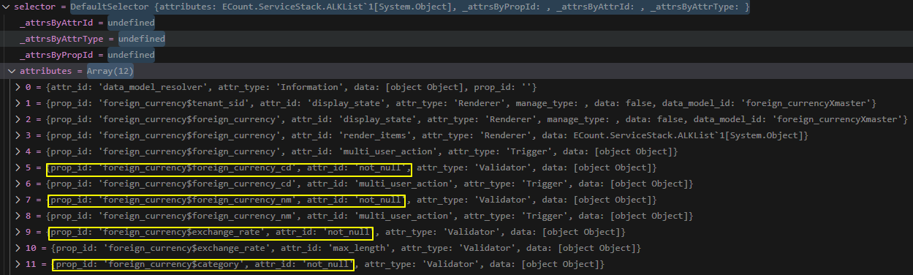
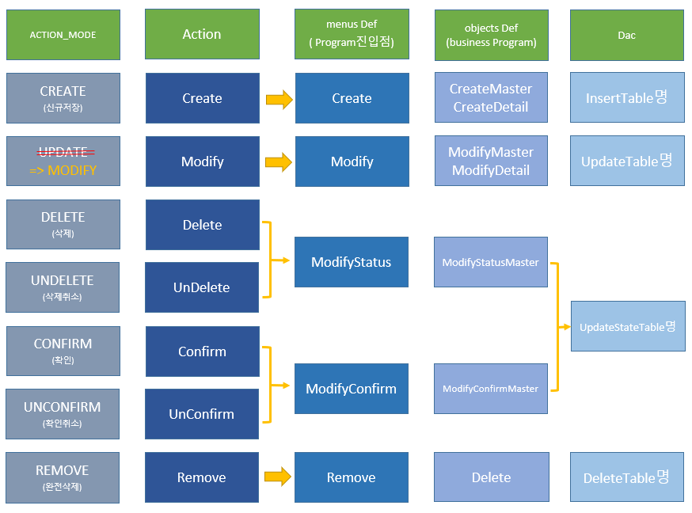

# Daily Retrospective  
**작성자**: 이연아  
**작성일시**: 2025-01-15  

## 1. 오늘 배운 내용 (필수)  
### Generator 디버깅 및 추가 구현
외화코드 입력 테스트로 generator에 생성된 속성들을 디버깅을 통해 확인해봤습니다.

`TempExecuteSetupMainProgram.ts` - dmc에 속성 추가
```typescript
const smc_definition = this.smc.getDataModelDefinitions();
    // refer_type generator 실행 -> dmc에 generator를 통해 생성된 속성 정보 추가
    for (const dmc of this.smc.createDataModelContainer((def) => {
        const data_model_id = def?.data_model_id as string;
        const setup: ISetup = {
            tenant: {} as ITenant,
            user: {} as IUser,
            bizz: {} as IBizz,
            menu: {} as IMenu,
            function: [] as IFunction[],
            view_container: [] as IViewContainer[],
            data_model: {} as IDataModelMapper,
            data_model_definitions: {} as IDataModelDefinitionMapper,
        };

        const refer_type_attr_program = ProgramBuilder.create<ISetup, ISetup>(
            IReferTypeAttrGeneratorProgram,
            this.execution_context
        );

        setup.data_model_definitions[data_model_id] = def as IDataModelDefinition;
        refer_type_attr_program.execute(setup);

        const selector = new DefaultSelector(setup.data_model_definitions[data_model_id]?.attributes);

        return { selector };
    })) {
        this.dmc.push(dmc);
    }
```
- generator를 구현해보기 위해 refer_type generator를 직접 돌려서 dmc에 generator로 생성된 속성 정보를 추가해주는 임시 코딩
- 기존 로직은 3.0 양식정보 조회 -> 5.0 속성으로 컨버팅 -> DMC의 속성으로 추가
    - db 사용자 설정 정보에서 속성 정보를 가져온다.
    
`AttrList.ts` - 관련 prop과 속성 정보 추가 
```typescript
export const refer_type_attr_map: { [refer_type: string]: { [menu_type in EN_MENU_TYPE]?: string[] } } = {
	foreign_currency_nm: {
		[EN_MENU_TYPE.Input]: [validator_attrs.not_null],
	},
	category: {
		[EN_MENU_TYPE.Input]: [renderer_attrs.view_type, renderer_attrs.render_items, validator_attrs.not_null],
	},
	foreign_currency_cd: {
		[EN_MENU_TYPE.List]: [trigger_attrs.user_action, renderer_attrs.view_type],
		[EN_MENU_TYPE.Input]: [validator_attrs.not_null],
	},
	exchange_rate: {
		[EN_MENU_TYPE.Input]: [validator_attrs.not_null, renderer_attrs.value_format, validator_attrs.max_length],
		[EN_MENU_TYPE.Upload]: [validator_attrs.max_length],
	},
```
- 속성 매핑을 정의해 속성 생성의 정보를 제공

### Validator 디버깅 및 추가 구현
`foreign_currency_foreign_currency_cd_not_null_input.ts`- validator 속성을 generator로 추가하기 위한 파일 생성
```typescript
export const foreign_currency_foreign_currency_cd_not_null_input: IReferTypeAttrGenerator<
	validator_attrs.ip_single_condition_not_null
> = (execution_context, setup, target) => {
	return {
		prop_id: target.prop.prop_id,
		attr_id: validator_attrs.not_null,
		attr_type: EN_ATTR_TYPE.Validator,
		data: { data: true, caller_type: [EN_EXECUTE_CALLER_TYPE.apply] },
                                        // 적용, 저장시 발행
	};
};
```
- `{bizz_type}_{refer_type}_{attr_id}_{menu_type}` 형식으로 파일 추가
	- foreign_currency_foreign_currency_nm_not_null_input.ts
	- foreign_currency_exchange_rate_not_null_input.ts
	- foreign_currency_category_not_null_input.ts



- 속성에 not_null이 잘 들어간 것을 확인할 수 있다.

```typescript
export const slip_data_model = {
	action_mode: 'NEW',
	bizz_sid: 'TB_000000E040114',
	data_model: {
		foreign_currencyXmaster: [
			{
				foreign_currency$tenant_sid: '303101',
				foreign_currency$foreign_currency: { sid: 'test_cd7', code: 'test_cd7', name: 'test_nm7' },
				foreign_currency$foreign_currency_cd: 'test_nm7',
			},
		],
	},
```
- 위의 slip_data_model로 테스트 해본 결과 아래와 같은 오류가 발생하는 것을 확인했고, validator가 잘 실행되었다고 생각했습니다.

```
 {"error":{"name":"ICommonException","error_info":[{"name":"IDataModelValidationException","data_model_id":"foreign_currencyXmaster","details":[{"data_model_id":"foreign_currencyXmaster","prop_id":"foreign_currency$foreign_currency_nm","attr_ids":["not_null"],"error_message":"","display_name":"외화명"},{"data_model_id":"foreign_currencyXmaster","prop_id":"foreign_currency$exchange_rate","attr_ids":["not_null"],"error_message":"","display_name":"환율"},{"data_model_id":"foreign_currencyXmaster","prop_id":"foreign_currency$category","attr_ids":["not_null"],"error_message":"","display_name":"카테고리"}],"message":""}],"message":""}}
 ```

### Action 구현
전날까지 작성했었던 외화코드 작성에 이어 오늘은 Action을 구현해봤습니다.


파일을 생성할 때마다 ModifyStatus, Remove 부분이 헷갈려서 사진을 참고하며 파일을 작성했습니다.

- `CreateForeignCurrencyAction`
- `ModifyForeignCurrencyAction`
- `DeleteForeignCurrencyAction`
- `UnDeleteForeignCurrencyAction`
- `RemoveForeignCurrencyAction`

Action 파일은 server layer 시작점으로, `ActionProgramResolverProgram`을 실행하고, action_mode에 해당하는 프로그램을 호출하게 됩니다. 각 프로그램 파일은 이전에 작성해뒀기 때문에 오늘은 Action 파일을 만들고 데이터가 어떻게 처리되는지 디버깅을 하며 확인해봤습니다.</br>

```typescript
BizzUtil.setMenu(bizz_definition, {
	menu_sid: 'TM_000000E040114',
	menu_name: '외화 입력',
	menu_type: EN_MENU_TYPE.Input,
	data_model: [{ object_id: EN_INPUT_MENU_TYPE.Master, menu_role: EN_INPUT_MENU_TYPE.Master } as IMenuDataModelInfo],
	attributes: [
		{
			prop_id: '',
			attr_id: definition_attrs.info.action_program_resolver,
			attr_type: EN_ATTR_TYPE.Information,
			data: {
				[EN_ACTION_MODE.Create]: 'ICreateForeignCurrencyProgram',
				[EN_ACTION_MODE.Modify]: 'IModifyForeignCurrencyProgram',
				[EN_ACTION_MODE.Delete]: 'IModifyStatusForeignCurrencyProgram'
				[EN_ACTION_MODE.UnDelete]: 'IModifyStatusForeignCurrencyProgram'
				[EN_ACTION_MODE.Remove]: 'IRemoveForeignCurrencyProgram'
			} as definition_attrs.info.action_program_resolver,
		},
	],
});
```
- action_mode에 따른 프로그램 호출을 위한 foreign_currency\menus\input 파일에 속성을 추가

## 2. 동기에게 도움 받은 내용 (필수)
- 민준님과 validator 디버깅을 같이 해보고, Action 구현하는 부분에서도 프로그램 호출하는 방법에 대해 이야기하면서 아낌없이 본인이 이해한 내용을 공유해주셨습니다. 너무 감사합니다!!!!!!!!!!!
- 강민님이 action 디버깅 하는 방법과 RequestBody 값을 공유해주셨습니다. 그럼에도 불구하고 오류로 인해 못하고 있었는데, 바로 문제를 파악하고 해결해주셨습니다. 너무 감사합니다!!!!!!!

---

## 3. 개발 기술적으로 성장한 점 (선택)
### 1. 교육 과정 상 배운 내용이 아닌 개인적 호기심을 해결하기 위해 추가 공부한 내용
Action 파일을 구현하는 과정에서 민준님과 이야기하면서 프로그램 호출 방식에 대한 궁금증이 생겼습니다. 기존 로직에서는 `ActionProgramResolveProgram`을 실행한 후, actcion_mode에 따라 해당 프로그램을 실행하는 방식으로 동작한다고 이해했는데, Action 파일에서 직접 해당 프로그램을 호출해 사용하는 것은 안되는지 의문이 들었습니다.
```typescript
// 기존 로직
const program = ProgramBuilder.create<
	IActionProgramResolveProgramRequestDto,
	IActionProgramResolveProgramResult
>(IActionProgramResolveProgram, context);

const result = program.execute(slip_dto);

// 직접 호출
const program = ProgramBuilder.create<ExecuteSetupMainRequestDto, ExecuteSetupMainResultDto>(
		ICreateForeignCurrencyProgram,
		context
	);

const result = program.execute(slip_dto);
```
궁금증을 성준팀장님께 여쭤본 결과, 오늘 구현해야 할 방식은 resolver를 사용해 프로그램을 호출하는 방식으로 구현해야 한다는 점을 알게 되었습니다. 그렇다면 resolver를 사용하는 이유가 공통화를 위한건가 싶었는데, 서로 다른 기능에 대한 처리에 대한 호출을 하나로 관리하기 위함이라고 설명해 주셨습니다.

### 2. 오늘 직면했던 문제 (개발 환경, 구현)와 해결 방법
Action 파일을 작성한 이후에 파일을 맞게 작성한건지 궁금했는데, 강민님이 디버깅 하는 방법을 공유해주셔서 피들러를 통해 확인할 수 있었습니다.
그 과정에서 문제들이 있었지만, 강민님이 문제점을 같이 찾아주면서 해결하면서 데이터가 DB까지 잘 들어가는 것을 확인할 수 있었습니다.

- resolver값이 undefined로 프로그램을 호출하지 못하는 문제
```typescript
BizzUtil.setMenu(bizz_definition, {
	menu_sid: 'TM_000000E040114',
	menu_name: '외화 입력',
	menu_type: EN_MENU_TYPE.Input,
	data_model: [{ object_id: EN_INPUT_MENU_TYPE.Master, menu_role: EN_INPUT_MENU_TYPE.Master } as IMenuDataModelInfo],
	attributes: [
		{
			prop_id: '',
			// resovler가 undefined일 수 밖에 없던 이유..
			attr_id: definition_attrs.info.data_model_resolver,
			attr_type: EN_ATTR_TYPE.Information,
			data: {
				[EN_ACTION_MODE.Create]: 'ICreateForeignCurrencyProgram',
```

`ActionProgramResolveProgram.ts` -> resovler를 불러오지 못함
```typescript
export class ActionProgramResolveProgram
	extends BaseProgram<ProgramDto, ProgramResult>
	implements IActionProgramResolveProgram
{
	protected onExecute(dto: ProgramDto): ProgramResult {
		const { slip_data_model, additional_info, derive_info, current_template, is_za_from_only } = dto;
		const action_mode = _.vSafe(dto.action_mode, this.execution_context.action.action_mode);

		const resolver = this.execution_context.bizz_mgr
			.getMenuDefinition(
				this.execution_context,
				this.execution_context.action.bizz_sid,
				this.execution_context.action.menu_sid || ''
			)
			// resovler가 undefined일 수 밖에 없던 이유..
			?.attributes?.find((x) => x.attr_id == definition_attrs.info.action_program_resolver)?.data[action_mode];
```
- 확인해보니 속성 설정하는 코드를 작성하면서 잘못 설정되어서 참조하지 못하고 있었습니다. 다행히 코드를 수정해보니 잘 참조해서 작동했습니다.

### 3. 위 두 주제 중 미처 해결 못한 과제. 앞으로 공부해볼 내용.
