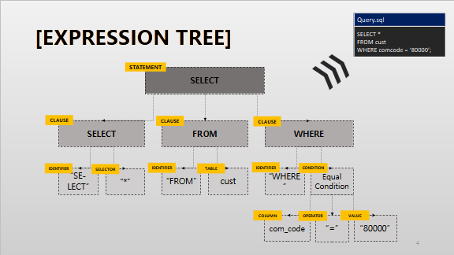
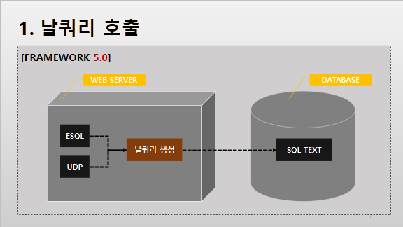
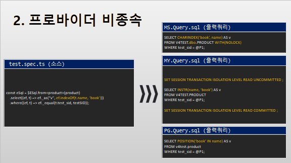
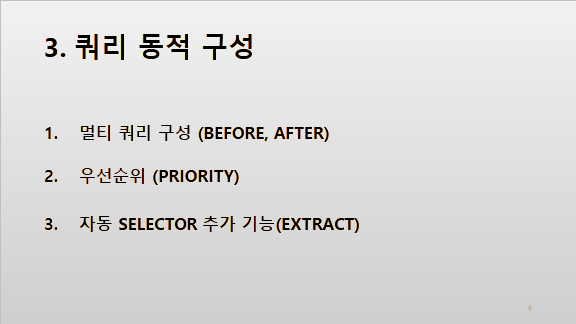
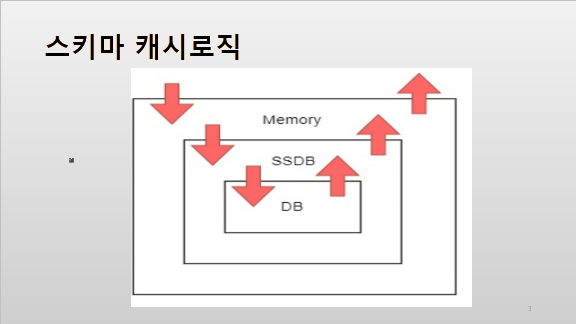

# Daily Retrospective

**작성자**: [이지은]  
**작성일시**: [2025-01-15]

## 1. 오늘 배운 내용 (필수)

ESQL 강의를 수강하며 공부했다.

### ESQL 개발 이유

지난 프레임워크는 대표적으로 Row query, Procedure, ORM, UDP와 같은 네 가지 도구로 쿼리를 생성했다. 각 도구를 사용하면서 여러 불편한 점이 있었다.

-   Row query의 경우, 테이블 구조 변경에 따른 쿼리 수정이 어려웠다.
-   ORM의 경우, 다양한 쿼리 생성이 어려웠다.
-   UDP의 경우, 소스 분석과 생성되는 쿼리를 확인하기 어려웠다.

이러한 단점들을 보완하여 ESQL이라는 쿼리 생성 도구가 개발되었다. 프레임워크 5.0에서는 특별한 이슈가 있지 않는 한, ESQL만을 이용하여 쿼리를 생성하는 것을 목표로 하고 있다.

### Expression Tree


ESQL은 Statement와 Clause, 그리고 이를 구성하는 모든 요소들을 Expression으로 정의하고 트리 구조를 통해 관리한다.

개발자는 ESQL을 통해 expression tree를 구성해야 한다. 이러한 expression tree는 DB 호출 시점에 각 Provider 별 컴파일러를 거쳐 실행할 쿼리로 생성된다.

### ESQL의 특징



-   기존 3.0 프레임워크에서 ORM은 SP generator를 통해 procedure를 생성하였다.
-   ESQL은 SQL 텍스트 명령, 즉 Row Query로 생성되어 호출된다.



-   ESQL은 MS, MY 그리고 PG 같은 Provider에 종속되지 않는다. 즉, ESQL은 Provider에 따라 사용 방법이 달라지지 않는다.
-   샘플 코드에서는 indexOf 함수를 사용하여 select 구문을 생성한다. MS의 경우 CHARINDEX로, MY의 경우 INSTR로, PG의 경우 POSITION 함수로 변환되는 것을 확인할 수 있다.
-   일부 특수한 기능의 경우에는 특정 Provider에서 지원되지 않을 수 있다.



-   ESQL을 통해 쿼리를 동적으로 구성할 수 있다.
-   ESQL에서 제공되는 Before, After 메서드를 통해 여러 개의 statement를 하나의 쿼리로 호출할 수 있다.
-   뿐만 아니라, priority 기능을 통해 clause의 순서 또한 동적으로 배치할 수 있다.
-   또한 extract 기능을 통해 자동적으로 selector expression을 추가할 수 있다.

### ESQL 스키마

```json
// user 테이블 스키마 정보
{
    {
        "column_name": "age",
        "data_type": "character varying",
        "character_maximum_length": 100,
        "numeric_precision": 0,
        "numeric_scale": 0,
        "pk_yn": "n"
    },
    …
}
```

-   스키마 정보란, 실제 데이터베이스에 존재하는 테이블 칼럼의 명세서이다.
-   이 명세서에는 칼럼의 이름, 타입, 사이즈, PK 여부 등이 명시되어 있다.



-   스키마 정보는 캐시하여 사용하고 있다.
-   서버 별로 스키마가 필요한 시점에 메모리에 캐시되어 있는지 본 후, 없으면 SSDB를 바라본다. SSDB에도 없으며 DB에 스키마를 조회하는 쿼리를 보내 가져온다. 그리고 가져오면서 SSDB와 메모리에 캐시해놓는다.
    > SSDB: Redis 프로토콜을 사용하는 디스크 기반 스토리지

### ESQL 테이블 모델

```ts
// user 테이블 모델
export const user = new $TableIdentifier(DbConnectionId, PG.BASE);
export interface user extends $TableESqlExpression {
	com_code?: string;
	user_id?: string;
	name?: string;
	age?: number;
	address?: string;
}
```

-   비즈니스 로직 작성을 위해 실제 테이블과 일대일로 대응하는 테이블 모델을 정의해야 한다.
-   테이블 모델을 정의하기 위해서는 Identifier 변수 선언과 인터페이스 선언이 필요하다.
-   테이블 모델은 두 가지 방법으로 사용될 수 있다.
    1. 테이블의 데이터를 담는 그릇
    2. ESQL에서 테이블 칼럼에 접근하기 위한 도구
-   테이블 모델 생성 방법
    1. 배포 프로그램 > Development > V5 ESqlSupport > Table Model 탭
    2. 환경 정보 세팅 (서버 그룹, 존 구분, 데이터베이스, 테이블, 연결 정보)
    3. 실행
-   5.0 환경에서 변수는 소문자(snake case)로 작성되어야 한다. 이때 테이블 이름이 대문자인 경우, 테이블 Identifier의 두 번쨰 인자로 실제 정의된 테이블 이름을 전달해주면 된다.
    ```ts
    export const user = new $TableIdentifier(DbConnectionId.PG_BASE, "USER");
    ```

## 2. 동기에게 도움 받은 내용 (필수)

**민준님**, **다은님**: Action 구현할 때 생긴 문제를 함께 찾아주셨습니다.
**성철님**: 저녁을 먹을 때 피자를 좋아하지 않아서 따로 먹으려고 했는데 같이 먹을 메뉴를 찾아서 주문해주셨습니다.

---

## 3. 개발 기술적으로 성장한 점 (선택)

### 1. 교육 과정 상 배운 내용이 아닌 개인적 호기심을 해결하기 위해 추가 공부한 내용

#### CRUD 구현할 때 DELETE 메서드가 아닌 POST를 사용하는 이유

1. **브라우저 및 HTML 폼의 한계**

-   HTML 폼에서는 기본적으로 GET과 POST만 지원한다.
-   DELETE와 같은 HTTP 메서드는 직접적으로 사용할 수 없다.
-   따라서 POST를 사용하여 서버에 DELETE 요청을 전달하도록 설계하는 경우가 많다.

2. **방화벽 및 캐시 문제**

-   일부 방화벽, 프록시 서버, 네트워크 장비 또는 캐시 시스템은 DELETE와 같은 비표준(덜 일반적인) HTTP 메서드를 차단하거나 제대로 처리하지 못할 수 있다.
-   POST는 일반적으로 더 널리 사용되고 안전하게 처리될 가능성이 높다.

3. **RESTful API 표준 준수보다 현실적인 고려**

-   RESTful 원칙에서는 DELETE 메서드를 사용하는 것이 권장되지만, 실제 구현 환경에서 REST 원칙을 완벽히 따르지 않고 현실적인 제약을 고려하여 POST를 선택하기도 한다.
-   POST 메서드는 데이터를 전송하고 서버에서 작업을 수행하는 데 일반적으로 사용되므로, 삭제 작업을 트리거하는 데도 활용될 수 있다.

4. **보안 및 인증**

-   DELETE 메서드 사용 시, 브라우저 또는 클라이언트에서 악의적으로 DELETE 요청을 보낼 가능성이 있다. POST는 이를 방지하기 위해 CSRF 토큰을 활용하여 보안을 강화하는 방식으로 사용된다.

5. **라우팅 간소화**

-   일부 프레임워크(Laravel, Django 등)는 DELETE와 PUT 메서드를 직접 처리하지 않고, POST를 통해 이들 메서드를 에물레이션하도록 설계한다.
-   예를 들어, POST 요청에 `_method=DELETE` 같은 필드를 포함하여 DELETE 동작을 구현한다. 5.0 프레임워크에서 `action_mode=REMOVE` 같은 필드를 포함하는 것과 동일한 방식이다.

=> DELETE 메서드는 RESTful API 원칙에 따라 삭제 작업에 적합하지만, POST를 사용하는 것은 기술적 제약, 보안 요구사항, 또는 편리성 때문인 경우가 많다. RESTful 설계를 고수하려면 DELETE를 사용하고, 제약 조건이 있는 경우 POST로 대체하며 보안 강화 및 명시적 의도를 드러내는 방식으로 보완하면 된다.

### 2. 오늘 직면했던 문제 (개발 환경, 구현)와 해결 방법

#### 헤더 문제

```console
> at D:\ecountv5\Runtime\...dules\app.tutorials\action\RemoveForeignCurrencyAction.js (17, 8)
	: const slip_dto = {
            bizz_sid: context.action.action_mode,
            action_mode: "REMOVE" /* EN_ACTION_MODE.Remove */ ,
            menu_type: "input" /* EN_MENU_TYPE.Input */ ,
            slip_data_model: request.data.slip_data_model,
            derive_info: {
                smc: {},
                derive_target: derive_target
            },
            current_template: request.data.current_template,
            is_za_from_only: request.data.is_za_from_only,
            additional_info: request.data.additional_info,
            notification: request.data.notification
        };

SummaryMessage: ReferenceError: a reference is not defined or unresolvable.
```

Action을 테스트하기 위해 피들러로 요청을 보낸 후 디버깅을 하면 자꾸 request.data.slip_data_model에서 문제가 생겼다. 문제의 원인은 헤더 누락으로 인해 request.data 파싱에 실패했기 때문이다. 강민님이 문제를 찾아주셔서 헤더를 추가해서 request를 보냈더니 정상 작동했다.

1. 헤더의 역할

    - HTTP 헤더는 요청과 응답에 대한 메타 데이터를 전달하는 중요한 요소다. 특히 요청 본문(body)의 데이터 형식이나 인코딩 방식 등을 명확히 하기 위해 헤더를 반드시 포함해야 한다.

2. 요청에서 헤더 누락의 영향

    - `Content-type`이 없는 경우, 서버는 요청 본문이 어떤 형식인지 알 수 없다.
        - 예) JSON 데이터인 경우, `content-type: application/json`을 명시해야 한다.
    - 이 헤더가 없으면 서버는 본문을 제대로 파싱하지 못하고, request data가 비어있거나 예상치 못한 형태로 처리된다.
    - 결과적으로 request.data.slip_data_model을 참조할 때, 객체가 정의되지 않거나 undefined가 되어 에러가 발생한다.

3. 해결 방안 - 헤더 추가

    ```
    Host: test.ecount.com:5001
    Connection: keep-alive
    Content-Length: 1046
    sec-ch-ua-platform: "Windows"
    User-Agent: Mozilla/5.0 (Windows NT 10.0; Win64; x64) AppleWebKit/537.36 (KHTML, like Gecko) Chrome/131.0.0.0 Safari/537.36
    Accept: application/keypack,*/*
    sec-ch-ua: "Google Chrome";v="131", "Chromium";v="131", "Not_A Brand";v="24"
    Content-Type: application/json
    sec-ch-ua-mobile: ?0
    Origin: https://zeus05ba3-dev.ecount.com
    Sec-Fetch-Site: same-site
    Sec-Fetch-Mode: cors
    Sec-Fetch-Dest: empty
    Referer: https://zeus05ba3-dev.ecount.com/
    Accept-Encoding: gzip, deflate, br, zstd
    Accept-Language: ko-KR,ko;q=0.9,en-US;q=0.8,en;q=0.7
    Cookie: _gcl_au=1.1.1303468347.1734564686; EcNewDeviceKey=3523%262024-12-19+08-31-27%26352; _ga=GA1.1.36747582.1734564711; _fbp=fb.1.1734564711188.917584855341598241; _ga_66P85C00D9=GS1.1.1736211092.5.0.1736211097.55.0.0; ECOUNT_SessionId=E-ERyw9QzfGTSgX=38303030307c4c45454a4945554e&E-PRywcptOlCSTi=38303030307c323032342d303735&BA-ERyxFKI81OmwD=3330303030307c256561256238256230256563253838253938; login_info_cookie=com_code=5847555a4209&userid=81cfd586faa1&check=Y; X-SVID=waiting_ECOUNT_
    ```

    - User-Agent
        - 클라이언트의 종류(예: 브라우저 또는 도구)를 서버에 알리는 역할.
        - 서버는 이 정보를 기반으로 클라이언트가 어떤 환경에서 요청을 보냈는지 확인하고, 최적화된 응답을 제공하거나 특정 클라이언트를 차단할 수도 있다.
        - 예: Fiddler로 테스트 중임을 알리거나, 실제 브라우저 요청처럼 보이기 위해 브라우저 정보를 제공.
    - Host
        - 요청이 어떤 도메인과 포트로 전달되어야 하는지를 지정.
        - 서버는 이를 통해 여러 도메인을 관리하거나, 특정 포트로 전달된 요청을 처리한다.
    - Connection
        - 요청-응답 사이 연결을 유지할지를 지정.
        - keep-alive는 한 번 연결 후 여러 요청을 처리하므로 성능 향상을 위해 사용.
    - Content-Length
        - 요청 본문(body)의 길이를 바이트 단위로 명시.
        - 서버는 이 정보를 통해 데이터가 모두 전송되었는지 확인하고, 잘못된 요청인지 판단할 수 있다.
    - sec-ch-ua 및 sec-ch-ua-platform
        - 클라이언트 힌트(Client Hints)로, 브라우저와 플랫폼 정보를 제공.
        - 서버는 이를 통해 특정 환경에 맞게 응답을 최적화(예: 모바일, 데스크톱 등).
    - Content-Type
        - 요청 본문의 데이터 형식을 명시.
        - 서버는 이 헤더를 보고 요청 데이터를 처리할 방식을 결정한다.
        - 예: application/json이면 JSON 형식으로 파싱.
    - Origin
        - 요청을 보낸 출처(도메인과 프로토콜)를 명시.
        - CORS 정책에 따라 서버는 이 출처가 요청을 보낼 권한이 있는지 확인한다.
    - Sec-Fetch-Site, Sec-Fetch-Mode, Sec-Fetch-Dest
        - 요청의 출처와 컨텍스트를 명시.
            - same-site: 같은 사이트에서 발생한 요청.
            - cors: CORS(Cross-Origin Resource Sharing) 요청.
            - empty: 데이터 목적 없이 단순 API 호출.
        - 보안 및 요청 컨텍스트 파악에 사용.
    - Referer
        - 요청을 보낸 페이지의 URL.
        - 서버는 이 정보를 통해 요청이 올바른 경로에서 발생했는지 확인하거나, 통계적으로 추적.
    - Accept
        - 클라이언트가 서버로부터 수신 가능한 데이터 형식을 명시.
        - 서버는 이 정보에 따라 응답 콘텐츠 형식을 결정.
    - Accept-Encoding
        - 클라이언트가 지원하는 데이터 압축 방식.
        - 서버는 이를 기반으로 응답 데이터를 압축하여 전송해 네트워크 성능 최적화.
    - Accept-Language
        - 클라이언트의 언어 선호도.
        - 서버는 이 정보를 기반으로 사용자 언어에 맞는 응답 제공.
    - Cookie
        - 클라이언트의 세션 상태나 인증 정보.
        - 서버는 쿠키를 통해 클라이언트의 상태를 유지하거나, 인증 토큰을 확인해 요청을 처리.

4. 헤더 누락 시 API가 실패하는 이유 요약
    - 인증 실패: Cookie 또는 User-Agent가 없으면 서버가 클라이언트를 신뢰하지 않아 요청을 거부.
    - CORS 제한: Origin이나 Referer가 없으면 CORS 정책에 의해 요청 차단.
    - 데이터 누락: Content-Type이 없으면 서버가 요청 본문을 올바르게 처리하지 못함.
    - 잘못된 환경: sec-ch-ua 또는 Host 정보가 없으면 서버가 클라이언트를 올바르게 식별하지 못함.

---

### 3. 위 두 주제 중 미처 해결 못한 과제. 앞으로 공부해볼 내용.

#### generator 네이밍 룰

generator_selector에서 매핑될 때 파일의 이름이 너무 길다고 생각했다.

```ts
refer_type_gens[`${bizz_id}_${refer_type}_${attr_id}` as keyof typeof refer_type_gens] ||
		refer_type_gens[
			`${bizz_type}_${refer_type}_${attr_id}_${execution_context.session.site}` as keyof typeof refer_type_gens
		] ||
		refer_type_gens[`${bizz_type}_${refer_type}_${attr_id}_${menu_type}` as keyof typeof refer_type_gens] ||
		refer_type_gens[`${bizz_type}_${refer_type}_${attr_id}` as keyof typeof refer_type_gens] ||
		refer_type_gens[`${refer_type}_${attr_id}_${menu_type}` as keyof typeof refer_type_gens] ||
		refer_type_gens[`${refer_type}_${attr_id}` as keyof typeof refer_type_gens] ||
		refer_type_gens[`${attr_id}_${menu_type}` as keyof typeof refer_type_gens] ||
		refer_type_gens[attr_id as keyof typeof refer_type_gens]) as IReferTypeAttrGenerator<any>;
```

우리가 만들었던 파일들만 해도 `foreign_currency_category_not_null_input`, `foreign_currency_exchange_rate_not_null_input`,
`foreign_currency_foreign_currency_cd_not_null_input`,
`foreign_currency_foreign_currency_nm_not_null_input`
이렇게 길었다.

그래서 refer_type(`foreign_currency`)으로 디렉터리를 만들어 그 안에 `category_not_null_input`, `exchange_rate_not_null_input`,
`foreign_currency_cd_not_null_input`,
`foreign_currency_nm_not_null_input`을 넣으면 되지 않을까 고민했다.

하지만 모든 selector가 refer_type으로 시작되는게 아니다. 큰 범위부터 매칭되는데 bizz_type, refer_type, attr_id로 각각 최상위 조건이 다르다. 그래서 디렉터리를 만드는 조건이 생기기 쉽지 않을거 같다.

그렇지만 모든걸 언더바로 구분하여 쓰는 것은 변경되는게 좋지 않을까 생각한다. 카멜 케이스로 한 조건을 쓰고 다음 조건을 쓸때 언더바를 쓰면 눈에 더 잘 들어오지 않을까 싶다. 이 부분에 대해서는 팀장님께 여쭤봐야겠다.

### ESql

ESql 강의를 다 보지 못해서 내일 이어서 봐야겠다.

---
