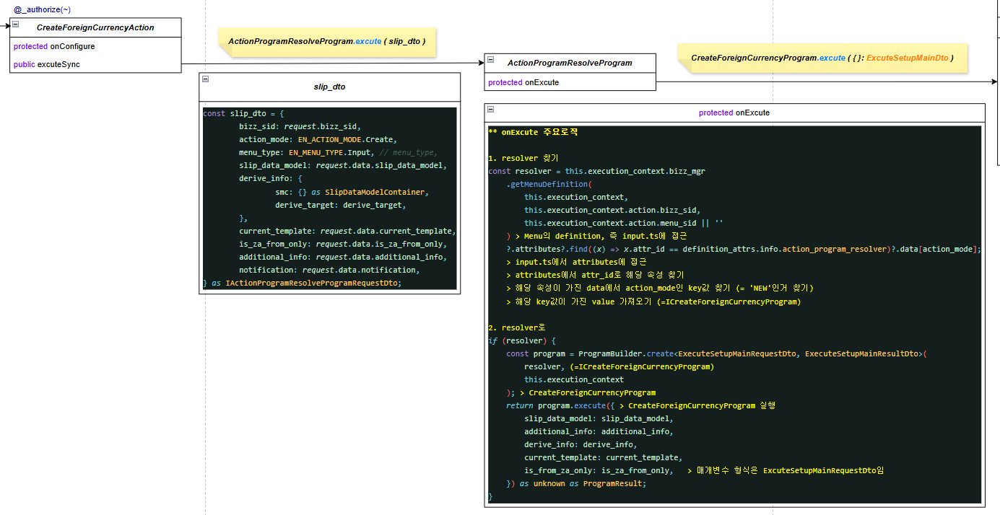

# Daily Retrospective

**작성자**: [최현철]  
**작성일시**: [2025-01-15]

## 1. 오늘 배운 내용 (필수)

1. CRUD 구현 - 완료
2. Generator 디버깅 및 추가 구현 - 구현은 완료 / 디버깅 / 흐름이해 부족
3. Validator 디버깅 및 추가 구현 - 구현은 완료 / 디버깅 / 흐름이해 부족
4. Action 적용 - 완료
5. ESQL 개별 학습 및 dac 적용 - dac 적용은 완료 / ESQL 학습 미완료

## 2. 동기에게 도움 받은 내용 (필수)

승준, 주원님이 오늘 서로 궁금증에 대한 토론을 많이 해주셔서 등뒤로 몰랐던 내용들을 많이 엿들을 수 있었습니다.

강민님께서 액션단에서 resolver를 찾지 못하는 문제를 해결해주셨습니다. (메뉴명세에 해당
속성 없는 문제)

민준, 건호님께서 액션이 어떻게 호출될지에 대해 브라우저에서 이벤트로 정의되어있을거고, endpoint단에서 경로를 통해 액션으로 유도해준다는 큰 개념을 설명해주셨습니다.

주현님께서 액션을 구현하면서 발생하는 문제+해결방법들을 실시간으로 공유해주시면서, 제가 에러를 해결하는데 시간을 뺏기지않도록 도와주셨습니다.

성범책임님께서 피들러 컴포저 사용법을 알려주시고, 액션단에서 request가 빈상태로 들어오는 문제를 해결해주셨습니다.

---

## 3. 개발 기술적으로 성장한 점 (선택)

### 1. 교육 과정 상 배운 내용이 아닌 개인적 호기심을 해결하기 위해 추가 공부한 내용

1. 자바/타입스크립트 내장함수들을 안쓰고 왜 lodash 라이브러리를 쓸까 ?

- 안정성 : 코드가 어떤 환경에서도 동일하게 동작하도록 보장

  - Ex. 오래된 브라우저에서 새로운 JavaScript 기능을 사용할 수 없는 경우

- 유지보수 용이성 : Lodash 같은 라이브러리는 오픈소스 커뮤니티에서 지속적으로 유지보수되고 업데이트되므로, 새로운 JavaScript 표준에 맞춰 자동으로 개선

- 의존성 관리 : 특정 동작이 JavaScript 표준이나 내장 함수가 업데이트될 경우 기존 코드가 의도치 않게 깨질 가능성이 있음

2. Action에서 어떻게 CreateForeignCurrencyProgram으로 이어지는가 ?
   

### 3. 위 두 주제 중 미처 해결 못한 과제. 앞으로 공부해볼 내용.

제너레이터, 속성, 벨리데이터 등의 흐름

액션 구현 / 액션에서 넘어오는 로직 파악하는데 시간을 다써서 아직도 제너레이터를 못봤음.
ESQL도 공부해야하는데..

---

## 5. 제안하고 싶은 내용

진도 나간뒤에 주어지는 자습시간은 정말 좋은 것 같습니다.
하지만 온전한 자습시간이라기 보다는 과제가 주어진 상태로 자습시간이 주어지다보니, 자습을 많이 못하게 되는게 아쉽습니다.

10시간이 주어지면, 진도에 따라 구현하는데 8시간(오류 해결..)이 걸리고 결국 자습할 수 있는 시간은 2시간이어서 (10시까지 야근하더라도) 이해못했던 부분을 이해하기 위해 쓸 수 있는 시간이 부족합니다.

제러네이터를 공부하고 싶었지만, 오늘 액션을 구현하면서 액션에 대한 궁금증이 생겼고, 구현 및 궁금증을 해결하려다보니 결국 제너레이터를 또 공부하지 못했습니다.

매일 늦게까지 야근을 하거나 주말에 보충하는 방식으로 보완해보겠습니다.
