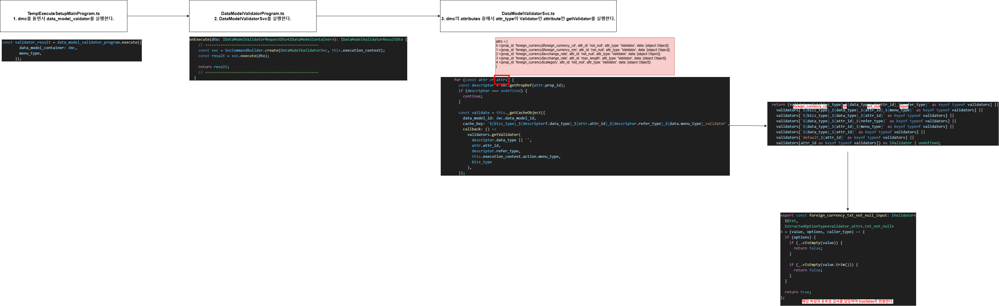

# Daily Retrospective

**작성자**: 허수경

**작성일시**: 2025-01-15(수)

## 1. 오늘 배운 내용 (필수)

- generator 디버깅 및 추가구현
- validator 디버깅 및 추가구현

### 1. generator 디버깅 및 추가구현

---

- TestCase 중에서 `CreateForeignCurrencyProgram.spec.ts`를 이용해서 `generator` 생성 과정을 디버깅해봅니다.

#### 1. `TempExecuteSetupMainProgram.ts`

- TempExecuteSetupMain내의 dmc에 속성을 추가하기 위해 refer_type_attr_program을 실행합니다.
- 3.0 양식정보 조회 -> 5.0 속성으로 컨버팅 -> DMC의 속성으로 추가

```ts
const smc_definition = this.smc.getDataModelDefinitions();
for (const dmc of this.smc.createDataModelContainer((def) => {
  const data_model_id = def?.data_model_id as string;
  const setup: ISetup = {
    // 생략
  };

  const refer_type_attr_program = ProgramBuilder.create<ISetup, ISetup>(
    IReferTypeAttrGeneratorProgram,
    this.execution_context
  );

  setup.data_model_definitions[data_model_id] = def as IDataModelDefinition;
  refer_type_attr_program.execute(setup);

  const selector = new DefaultSelector(
    setup.data_model_definitions[data_model_id]?.attributes
  );

  return { selector };
})) {
  this.dmc.push(dmc);
}
```

#### 2. `ReferTypeAttrGeneratorProgram.ts`

1. `refer_type`과 그에 해당하는 `attribute` 찾기

.png>)

2. 위에서 찾은 `attributes`를 기준으로 `generator` 파일 찾기

.png>)

3. 찾은 `generator` 파일속 `attribute` 추가하기

.png>)

#### 3. `TempExecuteSetupMainProgram.ts`

- `selector`를 통해 각 prop의 attribute에 추가된 것을 확인할 수 있습니다.

```ts
const selector = new DefaultSelector(
  setup.data_model_definitions[data_model_id]?.attributes
);
```


### 2. validator 디버깅 및 추가구현

---

- TestCase 중에서 `CreateForeignCurrencyProgram.spec.ts`를 이용해서 `validator`를 통해 유효성검사 과정을 디버깅해봅니다.



#### 1. `TempExecuteSetupMainProgram.ts`

- dmc를 돌면서 data_model_vaidator를 실행합니다.

```ts
const validator_result = data_model_validator_program.execute({
  data_model_container: dmc,
  menu_type,
});
```

#### 2. `DataModelValidatorProgram.ts`

- `DataModelValidatorSvc`를 실행합니다.

```ts
onExecute(dto: IDataModelValidatorRequestDto<IDataModelContainer>): IDataModelValidatorResultDto {
    // ===================================================
    const svc = SvcCommandBuilder.create(DataModelValidatorSvc, this.execution_context);
    const result = svc.execute(dto);

    return result;
    // ===================================================
  }
```

#### 3. `DataModelValidatorSvc.ts`

- dmc의 attributes 중에서 `attr_type`이 `Validator`인 attribute만 getValidator를 실행합니다.

```ts
for (const attr of attrs) {
  const descriptor = dmc.getPropDef(attr.prop_id);
  if (descriptor === undefined) {
    continue;
  }

  const validate = this._getCacheObject({
    data_model_id: dmc.data_model_id,
    cache_key: `${bizz_type}_${descriptor?.data_type}_${attr.attr_id}_${descriptor.refer_type}_${data.menu_type}_validator`,
    callback: () =>
      validators.getValidator(
        descriptor.data_type || '',
        attr.attr_id,
        descriptor.refer_type,
        this.execution_context.action.menu_type,
        bizz_type
      ),
  });
```

#### 4. `validator.ts`

- 파라미터의 조합으로 해당 파일이 존재하면 그 파일을 실행하여 유효성 검사를 실행합니다.
  - 사진 속 파라미터는 `foreign_currency`, `txt`, `not_null`, `input`을 받아 `foreign_curreny_txt_not_null_input.ts`를 실행합니다.

```ts
return (validators[
  `${bizz_type}_${data_type}_${attr_id}_${refer_type}` as keyof typeof validators
] ||
  validators[
    `${bizz_type}_${data_type}_${attr_id}_${menu_type}` as keyof typeof validators
  ] ||
  validators[
    `${bizz_type}_${data_type}_${attr_id}` as keyof typeof validators
  ] ||
  validators[
    `${data_type}_${attr_id}_${refer_type}` as keyof typeof validators
  ] ||
  validators[
    `${data_type}_${attr_id}_${menu_type}` as keyof typeof validators
  ] ||
  validators[`${data_type}_${attr_id}` as keyof typeof validators] ||
  validators[`default_${attr_id}` as keyof typeof validators] ||
  validators[attr_id as keyof typeof validators]) as IValidator | undefined;
```

---

## 2. 동기에게 도움 받은 내용 (필수)

- 주현님께서 커피를 사주셔서 오후에도 활력을 유지하며 업무에 집중할 수 있었습니다.
- Action을 구현하던 중, Fiddler의 Composer 기능을 통해 요청 패킷을 작성·전송하는 과정에서 에러가 발생했습니다. 이때 지은님께서 겪었던 헤더 에러와 유사한 상황이라며 헤더를 수정해주셔서 문제를 해결할 수 있었습니다.
- 강민님, 주현님께서 Filddler에서 Composer 요청 시 보내야하는 데이터를 공유해주셔 헤매지 않고 빠르게 테스트 해볼 수 있었ㅅ브니다.
- 민준님께서 validator 파일을 추가해가면서 전체 흐름에 대해 설명해주셨습니다.

---

## 3. 개발 기술적으로 성장한 점 (선택)

### 1. 교육 과정 상 배운 내용이 아닌 개인적 호기심을 해결하기 위해 추가 공부한 내용

#### `setup api`와 `data api` 캐싱

- `GetInventorySetupProgram`은 재고 입력 페이지와 관련된 고정 속성 정보를 내려주는 역할을 합니다. 이 정보는 정적인 형태를 지니므로, 매번 파일에 접근하기보다는 캐싱하여 효율적으로 처리할 수 있습니다.
  반면, `data api`는 캐싱을 적용하지 않습니다. 특정 `refer_type`을 호출했을 때 해당 `refer_type generator`가 정보성 데이터를 가져오는 역할을 한다면, `data api`에서 직접 그 `refer_type generator`를 실행합니다. 이처럼 `data api`는 요청 시점에 **동적으로** 데이터를 조회하도록 설계되어 있으므로, 별도의 캐싱이 필요하지 않습니다.

### 2. 오늘 직면했던 문제 (개발 환경, 구현)와 해결 방법

#### `ActionProgramResolveProgram`의 역할

어제 확인해보니, `Create{bizz}Action`과 `Modify{bizz}Action`에서는 `ActionProgramResolveProgram`을 통해 해당 프로그램을 실행하는 반면, `Get{bizz}DataAction`에서는 곧바로 `Get{bizz}InputDataProgram`을 호출하는 구조였습니다. 이를 보고 단순 조회(GET)의 경우에는 굳이 `ActionProgramResolveProgram`이 필요 없어 보이는데, 왜 생략되지 않았는지 궁금했습니다.

또한 `Create{bizz}Action`의 경우, `action_mode`를 `Create`로 넘겨 즉시 `CreateInventoryProgram`을 실행할 수 있는데도, `GET` 방식처럼 `Action`에서 `Program`으로 바로 넘어가지 않고 굳이 `ActionProgramResolveProgram`을 거치는 이유가 무엇인지 의문이 들었습니다.

이에 대해 성준 팀장님께 여쭤보니, “createXXXAction처럼 이미 행위(action_mode)가 고정된 상태에서는 의미가 크지 않다. 다만 추후 CommonAction 등으로 action_mode 개념 자체가 사라지면, ActionProgramResolveProgram이 더 유용해질 수 있다.”고 설명해 주셨습니다.

.png>)

.png>)
