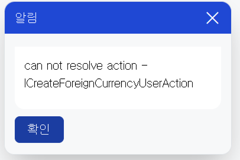

# Daily Retrospective

**작성자**: [김도형]  
**작성일시**: [2025-01-16]

## 1. 오늘 배운 내용 (필수)

- 성준 팀장님이 주신 과제
- UserAction이란?
- 수업 내용
- Create/Modify/Remove UserAction 구현

## 과제

1번 케이스에서, browser layer에서 TempExecuteSetupMainProgram을 생성해서, 호출합니다. (ServerLayer에 있는 로직과 내부 로직은 다를수 있습니다.) 1번 케이스와 2번 케이스를 진행했을때의 각각에 대해서 설명하고, 본인은 어떤 선택이 더 좋아보이는지 설명해주세요.

```ts
export class CreateForeignCurrencyUserAction {
    static executeAsync: ICreateForeignCurrencyUserAction = async (request) => {
        const { execution_context, dm_manager, vmc } = request;

        execution_context.action.action_mode = EN_ACTION_MODE.Create;
        execution_context.action.menu_type = EN_MENU_TYPE.Input;

        //// 1. 서버저장 로직과 같은 공통 프로그램 호출
        // todo..

        // 2. 서버 Action 직접 호출
               ....
}

```

<br>

### 과제에 대한 답변

#### == 1번 케이스) TempExecuteSetupMainProgram을 통한 처리 ==

**장점**

- 공통 프로그램을 통한 일관된 처리가 가능합니다.

- 비즈니스 로직의 중복을 줄일 수 있습니다.

- 서버와 클라이언트 간의 로직 동기화가 용이합니다.

- 변경 사항이 발생할 때 한 곳만 수정하면 되므로 유지보수가 편리합니다.

**단점**

- 모든 케이스를 커버하기 위한 범용적인 설계가 필요하므로 초기 구현이 복잡할 수 있습니다.

- 작은 변경사항에도 공통 프로그램을 거쳐야 하는 오버헤드가 있을 수 있습니다.

<br>

#### == 2번 케이스) 직접 서버 Action 호출 ==

**장점**

- 구현이 직관적이고 단순하며, 디버깅이 쉽습니다.

- 특정 UseCase에 맞춘 최적화된 구현이 가능합니다.

**단점**

- 비즈니스 로직이 여러 곳에 분산될 수 있습니다.

- 코드 중복이 발생할 가능성이 높습니다.

- 일관성 있는 처리가 어려울 수 있습니다.

- 변경 사항 발생 시 여러 곳을 수정해야 할 수 있습니다.

1번 케이스가 필요하다고 생각합니다. 실무에서 다루게 되는 방대한 코드와 동일한 로직 중복, 확장성 및 유지보수 측면을 고려하면 1번 케이스가 적합하다고 생각합니다. 하지만, 금일은 수업을 듣고, 데이터의 흐름에 대해 배우는 시간으므로 2번 방식으로 디버깅을 하면서 내부 흐름을 이해하려고 합니다.

디버깅을 통해 클라이언트 <-> 서버 간의 데이터 흐름을 이해하고 나서, 1번 케이스로 수정할 것입니다. 단순한 CRUD의 경우에는 코드가 복잡하지 않고, 단순하여 2번 케이스로 진행해도 무리가 없을 것으로 보입니다.

결과적으로 아래와 같은 이유로 1번 케이스가 적절하다고 판단했습니다.

| 측면         | 장점                 | 세부 내용                                                                                                  |
| ------------ | -------------------- | ---------------------------------------------------------------------------------------------------------- |
| **유지보수** | 비즈니스 로직 집중화 | • 비즈니스 로직이 한 곳에 집중되어 있어 변경 사항 적용이 용이                                              |
|              | 영향도 파악 용이성   | • 버그 수정이나 기능 개선 시 영향도 파악이 쉬움                                                            |
| **일관성**   | 통일된 로직 사용     | • 서버와 클라이언트에서 동일한 로직을 사용 <br> • 동작의 일관성 보장                                       |
| **재사용성** | 모듈 재사용          | • 다른 모듈에서도 동일한 로직이 필요할 때 쉽게 재사용 가능 <br> • 공통 처리 로직을 통해 코드 중복을 최소화 |

<br>

## UserAction

**UserAction의 핵심 구성요소**

| 구성요소   | 설명                                                       |
| ---------- | ---------------------------------------------------------- |
| Identifier | UserAction의 고유 식별자로, payload와 result의 타입을 정의 |
| Handler    | UserAction이 실행될 때 수행할 실제 로직을 구현             |
| Request    | 컴포넌트가 전달한 payload 정보와 추가 컨텍스트 정보를 포함 |

<br>

**UserAction의 실행 원칙**

1. 페이지에 등록된 handler가 우선 실행됨
2. 페이지에 없다면 app.common의 handler가 실행됨
3. 둘 다 없다면 아무 로직도 실행되지 않음

<br>

```ts
@action_impl(ISearchUserAction)
export class SearchUserAction {
  static executeAsync: ISearchUserAction = async (request) => {
    const { action_target } = request.payload;
    const { vmc } = request;

    // VMC를 통한 UI 상태 관리
    const state = vmc.getPageState<page_state.IPageState>();

    // DMC를 통한 데이터 관리
    const dmc = request.dmc_mapper[request.owner.dmc_id];

    // 비즈니스 로직 수행
    const result = await someBusinessLogic();

    return result;
  };
}
```

<br>

## 수업 내용

브라우저에서 서버를 거쳐 DB에 저장되기까지의 데이터 흐름에 대해 배웠습니다. 먼저 Setup 구조에 대해 파악했는데, 여기서 중요한 점은 Setup이 단순한 설정 정보가 아닌 속성과 데이터 정보를 모두 포함하는 종합적인 정보라는 것입니다. 이 Setup 정보는 캐싱되어 관리되는데, 이는 양식 설정이 자주 변경되지 않는 특성을 고려한 설계라고 말씀해주셨습니다. 설명을 듣기 전에는 사용자가 자주 접근하는 데이터가 아닐까 의구심을 품고, 성준 팀장님께 질문을 드렸습니다.

**Q. 질문**

`현재 시스템에서 사용자가 설정 정보를 변경하면 캐시가 초기화되는 구조인데, 이는 조회 성능 개선이라는 본래 목적과 다르지 않나요?`

**A. 답변**

`이 Setup 정보는 이카운트 ERP 사용자가 초기에 설정 정보를 설정한 후에는 설정 정보를 수정하는 일이 빈번하지 않을 것입니다. 그래서 캐시를 사용하고 있습니다.`

답변을 듣고, 이해했습니다. 설정 정보는 초기에 설정하겠구나 ㅎㅎ

Front 측에서 Data Model은 흥미로운 방식으로 동작합니다. 신규 생성 시에는 빈 데이터 구조를 제공하고, 수정 시에는 DB에서 데이터를 조회하는 방식입니다. 페이지에서 사용되는 정보가 데이터와 속성이 합쳐진 형태입니다. 이 병합 과정은 load_setup에서 처리되며, mergeSetup 함수를 통해 최종적으로 foreign_currency_list.ui.tsx에 반영됩니다.

저희는 디버깅이 쉽고, 효율적인 테스트를 위해 UI를 직접 접근하기보다는 test UI 페이지를 활용하여 실습을 진행하기로 하였습니다. 이때 서버가 실행되어 있어야 하고, API 인증키를 통한 사용자 로그인 권한이 필요합니다. 이렇게 하면 실제 사용자가 로그인한 것과 동일한 세션 정보가 생성되어 테스트가 가능합니다.

주의해야 할 점은 CreateForeignCurrencyUserAction에서 data model ID를 강제로 부여하는 방식은 지양해야 한다는 것을 배웠습니다. 또한 견적서 조회 시 삭제된 항목도 복구 가능하다는 점은 사용자 경험 측면에서 중요한 기능이라고 생각됩니다. 이러한 구조를 통해 이카운트가 어떻게 효율적으로 데이터를 관리하고, 사용자 경험을 개선하는지 이해할 수 있었습니다.

<br>

## Create/Modify/Remove UserAction 구현

[file] CreateForeignCurrencyUserAction.ts

```ts
import { EN_ACTION_MODE, EN_MENU_TYPE } from "ecount.fundamental.define/enum";
import { Exception } from "ecount.fundamental.define/exception";
import { ActionDataBase } from "ecount.infra.base/abstraction";
import { IArrayDataModelMapper } from "ecount.infra.base/setup";
import { IExecutionContext } from "ecount.infra.bridge/base";
import { IDMManager } from "ecount.infra.bridge/data_model";
import { attribute, manager, system } from "ecount.infra.bridge/feature";
import { IViewModelStateContainer } from "ecount.infra.bridge/view_model";
import { action_impl } from "ecount.infra.common/decorator";
import { ExceptionBuilder } from "ecount.infra.common/exception";
import { ProgramBuilder } from "ecount.infra.common/program";
import {
  definition_attrs,
  ISlipDataModel,
  menu_attrs,
} from "ecount.usecase.base/@abstraction";
import { DeriveBizzInfoTargetDto } from "ecount.usecase.common/@abstraction";

import {
  ICreateForeignCurrencyAction,
  ICreateForeignCurrencyUserAction,
  ForeignCurrencyRequestDto,
  ForeignCurrencyResultDto,
} from "ecount.usecase.tutorials/@abstraction";

@action_impl(ICreateForeignCurrencyUserAction)
export class CreateForeignCurrencyUserAction {
  static executeAsync: ICreateForeignCurrencyUserAction = async (request) => {
    const { execution_context, dm_manager, vmc } = request;

    execution_context.action.action_mode = EN_ACTION_MODE.Create;
    execution_context.action.menu_type = EN_MENU_TYPE.Input;
    execution_context.action.bizz_sid = "TB_000000E040114";
    execution_context.action.menu_sid = "TM_000000E040114";

    const { result } = await execution_context
      .getFeature<system.IHttpRequestFeature>(system.IHttpRequestFeature)
      .sendAsync<
        ActionDataBase<ForeignCurrencyRequestDto>,
        ForeignCurrencyResultDto
      >(ICreateForeignCurrencyAction, {
        data: {
          bizz_sid: execution_context.action.bizz_sid,
          menu_type: execution_context.action.menu_type,
          action_mode: EN_ACTION_MODE.Create,
          data: {
            slip_data_model: {
              bizz_sid: execution_context.action.bizz_sid,
              menu_sid: execution_context.action.menu_sid,
              action_mode: EN_ACTION_MODE.Create,
              data_model: CreateForeignCurrencyUserAction._getDataModel(
                execution_context,
                dm_manager
              ),
            } as ISlipDataModel,
          },
        },
      });

    vmc.sendMessage({ redraw: true });

    return;
  };

  private static _getDataModel(
    execution_context: IExecutionContext,
    dm_manager: IDMManager
  ): IArrayDataModelMapper {
    const data_model_id = "foreign_currencyXmaster";
    const dmc = dm_manager.getDataModelContainer(data_model_id);

    return {
      [data_model_id]: dmc.getDataModel() as any,
    } as IArrayDataModelMapper;
  }
}
```

<br>

[file] foreign_currency_input_setup.ui.ts

```ts
import { BasePage } from "ecount.application.view/page";
import { IExecutionContext } from "ecount.infra.bridge/base";
import { ISetup } from "ecount.infra.base/setup";
import { page_impl } from "ecount.infra.common/decorator";
import {
  IForeignCurrencyInputPage,
  // IGetForeignCurrencyDataModelProgram,
  IForeignCurrencyInputPageParam,
  IForeignCurrencyInputPageMessage,
} from "ecount.usecase.tutorials/@abstraction";
import { renderer_attrs } from "ecount.fundamental.define/attribute";
import { EN_ACTION_MODE, EN_ATTR_TYPE } from "ecount.fundamental.define/enum";
import { setup } from "./foreign_currency_setup";

@page_impl({
  identifier: IForeignCurrencyInputPage,
  setup: setup,
  //data_model: IGetForeignCurrencyDataModelProgram,
})
export class ForeignCurrencyInputPage extends BasePage<
  IForeignCurrencyInputPageParam,
  IForeignCurrencyInputPageMessage
> {
  static async onInitalizeSetup(
    execution_context: IExecutionContext,
    setup: ISetup
  ) {
    // action 모드에 따라서 버튼의 표시여부가 결정되어야 됨
    // 현재 버튼의 표시관련 처리는 5.0화 되어있지 않음. 임시코딩.
    //this._buttonFilter(setup, execution_context);
  }

  private static _buttonFilter(
    setup: ISetup,
    execution_context: IExecutionContext
  ) {
    const action_mode = execution_context.action.action_mode;
    const refer_type_by_refer_type = this._getTargetReferTypeByActionMode(
      action_mode as EN_ACTION_MODE
    );

    this._buttonFilterByReferType(
      setup,
      "footer_toolbar",
      refer_type_by_refer_type
    );
  }

  private static _buttonFilterByReferType(
    setup: ISetup,
    target: string,
    delete_target_refer_types: string[]
  ) {
    if (_.vIsEmpty(delete_target_refer_types)) {
      return;
    }

    delete_target_refer_types.forEach((refer_type) => {
      const prop = setup.data_model_definitions[target].props.find((x) =>
        _.vIsEquals(x.refer_type, refer_type)
      );

      if (_.vIsEmpty(prop)) {
        return;
      }

      const attr = setup.data_model_definitions[target].attributes?.find(
        (x) =>
          _.vIsEquals(x.prop_id, prop?.prop_id) &&
          _.vIsEquals(x.attr_id, renderer_attrs.display_state)
      );

      if (_.vIsEmpty(attr)) {
        setup.data_model_definitions[target].attributes?.push({
          attr_type: EN_ATTR_TYPE.Renderer,
          attr_id: renderer_attrs.display_state,
          prop_id: prop?.prop_id as string,
          data: false,
        });
      }
    });
  }

  private static _getTargetReferTypeByActionMode(
    action_mode: EN_ACTION_MODE
  ): string[] {
    switch (action_mode) {
      case EN_ACTION_MODE.GetCreate:
        return ["modify"];
      case EN_ACTION_MODE.GetModify:
        return ["save"];
    }
    return [];
  }
}
```

<br>

## 2. 동기에게 도움 받은 내용 (필수)

주원님과 승준님과 함께 디버깅을 하며 에러를 찾았습니다.

현철님과 강민님과 ModifyStatus를 어떻게 처리할 지에 대해 고민하며 토론하였습니다.

아연님, 현철님, 민준님, 승준님, 강민님, 건호님과 점심 시간에 한식 뷔페에서 식사를 하였습니다. 오늘은 현철님이 내기에서 지셨습니다.

<br>

---

## 3. 개발 기술적으로 성장한 점 (선택)

아래의 3가지 주제 중 하나를 선택하여 작성합니다.

### 2. 오늘 직면했던 문제 (개발 환경, 구현)와 해결 방법

### 마주한 문제: can not resolve action 에러

Test UI에서 저장 버튼을 클릭하니 위와 같은 문제가 발생했습니다. 이 에러는 ICreateForeignCurrencyUserAction을 찾을 수 없다는 의미입니다. 다음과 같은 에러가 있을 수 있다고 판단했습니다.



**1. Action Identifier 미등록**

UserAction이 제대로 등록되지 않았을 수 있음

ActionIdentifier 설정이 누락되었을 가능성

**2. 경로 문제**

Action의 경로가 잘못 지정되었을 수 있음

예: /api/app.tutorials/action/CreateForeignCurrencyUserAction 경로 확인 필요

**3. Implementation 문제**

ICreateForeignCurrencyUserAction 인터페이스가 제대로 구현되지 않았을 수 있음

UserAction 클래스가 올바르게 export되지 않았을 수 있음

#### 해결 방법

index.ts과 UserAction, foreign_currency_input_setup.ui.ts 모두 살펴보았습니다. 문제는 Server에서의 Remove를 수행하는 파일들의 네이밍과 UserAction을 만들면서 작성했던 파일들의 네이밍이 달라서 발생한 문제였습니다.

<br>

### 3. 위 두 주제 중 미처 해결 못한 과제. 앞으로 공부해볼 내용.

- Action Mode와 Context 변환 로직 깊이 파악하기

- Setup과 Data Model의 상세 구조 이해하기

- 설정 변경 시 전체 캐시를 초기화하는 것이 최선일까?

- 실시간성과 성능 사이의 균형점은 어디일까?

- 더 효율적인 캐싱 전략은 없을까?

<br>

---

## 4. 소프트 스킬면에서 성장한 점 (선택)

### 디버깅 스킬 향상을 통한 성장

처음에는 에러가 발생하면 막연한 두려움이 앞섰습니다. 3.0과 5.0 프레임워크의 구조로 이루어진 프로젝트 파일의 구조를 이해하지 못하였고, 흐름도 복잡했습니다. 하지만 꾸준히 디버깅을 하고, `성범 책임님께서 어떻게 하면 디버깅을 잘할 수 있는지 말씀해주셨고, 개발 실력도 중요하지만 문제 상황에 마주했을 때 디버깅을 통해 문제를 찾고 해결하는 능력이 더욱 중요하다고 말씀해주셨습니다. ` 현재는 말씀해주신 내용을 듣고, 문제를 해결할 때 까지 최대한 혼자서 디버깅을 해보려고 노력하고 있습니다. 앞으로도 이런 경험들을 토대로, 더 효율적이고 체계적인 디버깅 능력을 키워나가고 싶습니다. 이는 결국 더 나은 코드를 작성하고, 안정적인 시스템을 만드는 데 큰 도움이 될 것이라 믿습니다.
