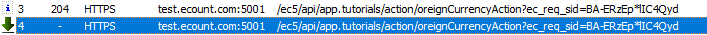

# Daily Retrospective

**작성자**: [김승준]  
**작성일시**: [2025-01-16]

## 1. 오늘 배운 내용 (필수)

-   UI 페이지 구현
-   TestUI 페이지의 구현
-   Setup구조 이해
-   UserAction 구현
    UI -> Server -> DB 흐름도
    
-   TestUI는 setup을 강제로 주입해서 사용합니다.<br> 또한 UserAction에서도 서버의 Action을 직접 호출하는 방식으로 우선 구현했습니다.

## 2. 동기에게 도움 받은 내용 (필수)

-   저녁에 너무 맵지 않은 뜨끈한 국물이 먹고싶었는데 **성재님**께서 찌개나 육개장을 먹으러가자고 해서 맛잇게 먹었습니다.<br> 맵지도 않고 든든한 저녁을 먹고 힘을내서 남은 공부를 진행할 수 있었습니다.
-   오늘도 저를 포함에 다들 에러가 많이 나셨는데, 에러가 날 때 마다 다들 토론하고 해결하면 다들 공유하는 분위기가 형성되어서 좋은 것 같습니다.

---

## 3. 개발 기술적으로 성장한 점 (선택)

### 1. 교육 과정 상 배운 내용이 아닌 개인적 호기심을 해결하기 위해 추가 공부한 내용

-   어제의 궁금증이었던 `ActionIdentifier`의 파일이 `03.ecount.usecase\ecount.usecase.tutorials\src\@shared_usecase_tutorials\@abstraction\action\ICreateForeignCurrencyAction.ts`에 위치하는 것을 보고, 해당 옵션의 값이 server측이 아닌 browser에서 쓰이는 것이 아닐까? 라는 추측을 했습니다.<br>

```ts
import { ActionDataBase, ActionIdentifier, IActionImpl } from "ecount.infra.base/abstraction";
import { IForeignCurrencyRequestDto } from "../dto";
import { ApiResultDto } from "ecount.usecase.base/@abstraction";

export const ICreateForeignCurrencyAction = new ActionIdentifier("ICreateForeignCurrencyAction", "/api/app.tutorials/action/CreateForeignCurrencyAction"); // *1.

export interface ICreateForeignCurrencyAction extends IActionImpl<ActionDataBase<IForeignCurrencyRequestDto>, ApiResultDto> {}
```

마침 오늘 ui부분을 진행하게 되어 \*1 부분의 값을 `/api/app.tutorials/action/oreignCurrencyAction` 으로 변경하여 저장버튼을 눌러봤습니다.

피들러에서 확인하자 url이 `https://test.ecount.com:5001/ec5/api/app.tutorials/action/oreignCurrencyAction?ec_req_sid=BA-ERzEp*lIC4Qyd` 로 간다는 것을 확인했습니다.



결국 `ActionIdenfier`의 Path는 browser에서 Action의 url을 가져오는 용도라는 것을 알게되었습니다.

### 2. 오늘 직면했던 문제 (개발 환경, 구현)와 해결 방법

userAction에서 바뀐 코드가 브라우저화면에서는 바뀌지 않는 문제가 많이 발생했습니다.<br>
해결방법은 빌드의 순서를 지켜서 하는 것이었습니다.

1. 모든 디버거와 test중인 ui를 종료합니다.
2. 4번레이어를 빌드합니다.
3. testui를 빌드합니다.
4. 산출물을 확인한 후 해당 userAction이 제대로 변경되었는지 확인합니다.
5. 서버를 실행시킨 후, test ui를 실행합니다.
6. 크롬의 개발자도구 source에서 test.ecount.com:5001의 userAction파일이 제대로 변경되었는지 확인합니다.

## 4. 소프트 스킬면에서 성장한 점 (선택)

### 나 자신에게 아쉬운 부분

개인적으로 그러한 부분을 키워드라도 적어서 남겨놨어야 했는데 막상 그 상황에서는 해당 방법이 정답인지 아닌지 확실히 알지못해 좀만 더 알아보자 하다보니 넘어가거나, 성공했다는 희열에 넘어가는 상황이 많았습니다. <br>
앞으로는 문제가 생겼을때, 문제를 해결했을 때, 문제를 해결하지 못하거나, 궁금증이 생길때 등등을 간단하게라도 어딘가에 작성해 남겨놓는 습관을 가지는 것이 중요할 것 같다는 점을 다시 한번 느끼고 있습니다.

---

# 학습내용

-   테스트 코드

`04.ecount.application\VeloxApps\app.tutorials\src\browser\@test\@src.cases\foreign_currency\foreign_currency_input_setup.ui.tsx`

```ts
import { setup } from "./foreign_currency_setup";

@page_impl({
    identifier: IForeignCurrencyInputPage,
    setup: setup, // 원래는 DB에서 setup정보를 받아오지만 테스트 환경에서는 우선 강제로 주입한뒤 실행
})
export class ForeignCurrencyInputPage extends BasePage<IForeignCurrencyInputPageParam, IForeignCurrencyInputPageMessage> {
    static async onInitalizeSetup(execution_context: IExecutionContext, setup: ISetup) {
        // action 모드에 따라서 버튼의 표시여부가 결정되어야 됨
        // 현재 버튼의 표시관련 처리는 5.0화 되어있지 않음. 임시코딩.
        this._buttonFilter(setup, execution_context);
    }

    private static _buttonFilter(setup: ISetup, execution_context: IExecutionContext) {
        const action_mode = execution_context.action.action_mode;
        const refer_type_by_refer_type = this._getTargetReferTypeByActionMode(action_mode as EN_ACTION_MODE);

        this._buttonFilterByReferType(setup, "footer_toolbar", refer_type_by_refer_type);
    }

    private static _buttonFilterByReferType(setup: ISetup, target: string, delete_target_refer_types: string[]) {
        if (_.vIsEmpty(delete_target_refer_types)) {
            return;
        }

        delete_target_refer_types.forEach((refer_type) => {
            const prop = setup.data_model_definitions[target].props.find((x) => _.vIsEquals(x.refer_type, refer_type));

            if (_.vIsEmpty(prop)) {
                return;
            }

            const attr = setup.data_model_definitions[target].attributes?.find((x) => _.vIsEquals(x.prop_id, prop?.prop_id) && _.vIsEquals(x.attr_id, renderer_attrs.display_state));

            if (_.vIsEmpty(attr)) {
                setup.data_model_definitions[target].attributes?.push({
                    attr_type: EN_ATTR_TYPE.Renderer,
                    attr_id: renderer_attrs.display_state,
                    prop_id: prop?.prop_id as string,
                    data: false,
                });
            }
        });
    }

    private static _getTargetReferTypeByActionMode(action_mode: EN_ACTION_MODE): string[] {
        switch (action_mode) {
            case EN_ACTION_MODE.GetCreate:
                return ["modify"];
            case EN_ACTION_MODE.GetModify:
                return ["save"];
        }
        return [];
    }
}
```

-   강제주입하는 setup정보

`04.ecount.application\VeloxApps\app.tutorials\src\browser\@test\@src.cases\foreign_currency\foreign_currency_setup.ts`

```ts
tenant: {} as ITenant,
	user: {} as IUser,
	bizz: {
		attributes: [
            ...
    menu: {
		attributes: [],
	} as IMenu,
	function: [] as IFunction[],
	view_container: [
...
footer_toolbar: {
			data_model_id: 'footer_toolbar',
			props: [
				{ prop_id: 'new', data_type: $$never, refer_type: 'new' },
				{ prop_id: 'save', data_type: $$never, refer_type: 'save' },
				{ prop_id: 'modify', data_type: $$never, refer_type: 'modify' },
				{ prop_id: 'delete', data_type: $$never, refer_type: 'delete' },
				{ prop_id: 'remove', data_type: $$never, refer_type: 'remove' },
				{ prop_id: 'close', data_type: $$never, refer_type: 'close' },
			],
			attributes: [
				{
					prop_id: 'save',
					attr_id: renderer_attrs.view_type,
					attr_type: EN_ATTR_TYPE.Renderer,
					data: 'BUTTON',
				},
				{
					prop_id: 'save',
					attr_id: renderer_attrs.display_name,
					attr_type: EN_ATTR_TYPE.Renderer,
					data: '저장',
				},
				{ prop_id: 'save', attr_id: renderer_attrs.color, attr_type: EN_ATTR_TYPE.Renderer, data: 'primary' },
				{
					prop_id: 'save',
					attr_id: trigger_attrs.user_action,
					attr_type: EN_ATTR_TYPE.Trigger,
					data: { identifier: 'ICreateForeignCurrencyUserAction' },
				},
				{ prop_id: 'save', attr_id: trigger_attrs.shortcut, attr_type: EN_ATTR_TYPE.Trigger, data: 'F8' },
				{
					prop_id: 'modify',
					attr_id: renderer_attrs.view_type,
					attr_type: EN_ATTR_TYPE.Renderer,
					data: 'BUTTON',
				},
				{
					prop_id: 'modify',
					attr_id: renderer_attrs.display_name,
					attr_type: EN_ATTR_TYPE.Renderer,
					data: '수정',
				},
				{
					prop_id: 'modify',
					attr_id: trigger_attrs.user_action,
					attr_type: EN_ATTR_TYPE.Trigger,
					data: { identifier: 'IModifyForeignCurrencyUserAction' },
				},
    ...
```

    - 버튼에 UserAction연결

-   userAction

```ts

@action_impl(ICreateForeignCurrencyUserAction)
export class CreateForeignCurrencyUserAction {
	static executeAsync: ICreateForeignCurrencyUserAction = async (request) => {
		const { execution_context, dm_manager, vmc } = request;

		execution_context.action.bizz_sid = 'TB_000000E040114'; // 테스트환경에서는 업무, 메뉴가 없어서 강제주입.
		execution_context.action.menu_sid = 'TM_000000E040114';
		execution_context.action.menu_type = EN_MENU_TYPE.Input;
		execution_context.action.action_mode = EN_ACTION_MODE.Create;
        // const attr_feature = execution_context.getFeature<attribute.IAttributeFeature>(attribute.IAttributeFeature);
		// execution_context.action.action_mode =
		// 	attr_feature.getMenuAttr<menu_attrs.save_action_mode>('save_action_mode')?.data ||
		// 	(execution_context.action.action_mode as EN_ACTION_MODE);

		//// 1. 서버저장 로직과 같은 공통 프로그램 호출
		// todo..
		// const program = await ProgramBuilder.createAsync<
		// 	ITempExecuteSetupMainProgramRequest,
		// 	ITempExecuteSetupMainProgramResult
		// >(ITempExecuteSetupMainProgram, execution_context);
        ... // 구현해야할 부분

        const { result } = await execution_context
                    .getFeature<system.IHttpRequestFeature>(system.IHttpRequestFeature)
                    .sendAsync<ActionDataBase<IForeignCurrencyRequestDto>, IForeignCurrencyResultDto>(
                        ICreateForeignCurrencyAction,
                        {
                            data: {
                                bizz_sid: execution_context.action.bizz_sid,
                                menu_type: execution_context.action.menu_type,
                                action_mode: execution_context.action.action_mode,
                                data: {
                                    slip_data_model: {
                                        bizz_sid: execution_context.action.bizz_sid,
                                        menu_sid: execution_context.action.menu_sid,
                                        action_mode: execution_context.action.action_mode,
                                        data_model: CreateForeignCurrencyUserAction._getDataModel(
                                            execution_context,
                                            dm_manager
                                        ),
                                    } as ISlipDataModel,
                                },
                            },
                        }
                    );
                vmc.sendMessage({ redraw: true });
    };
    ...
```

-   사용자의 클릭에 따라 서버의 `CreateForeignCurrencyAction`으로 진입
