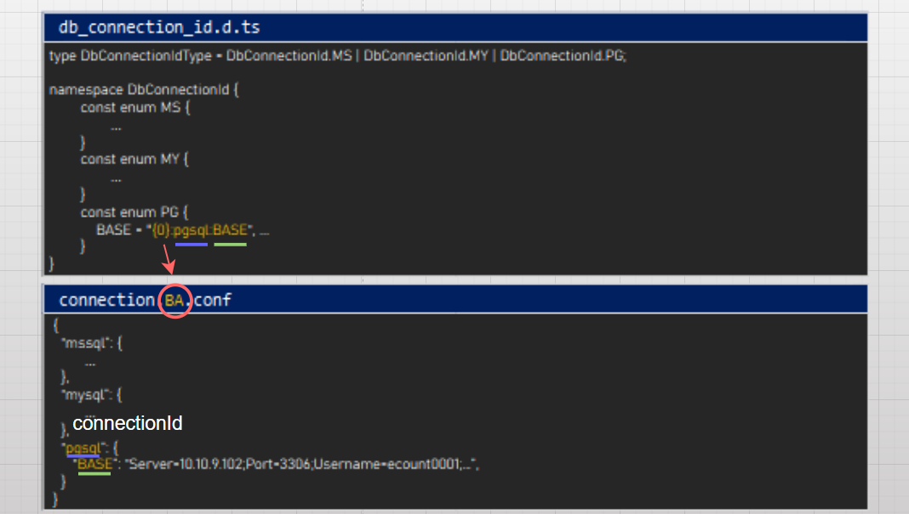
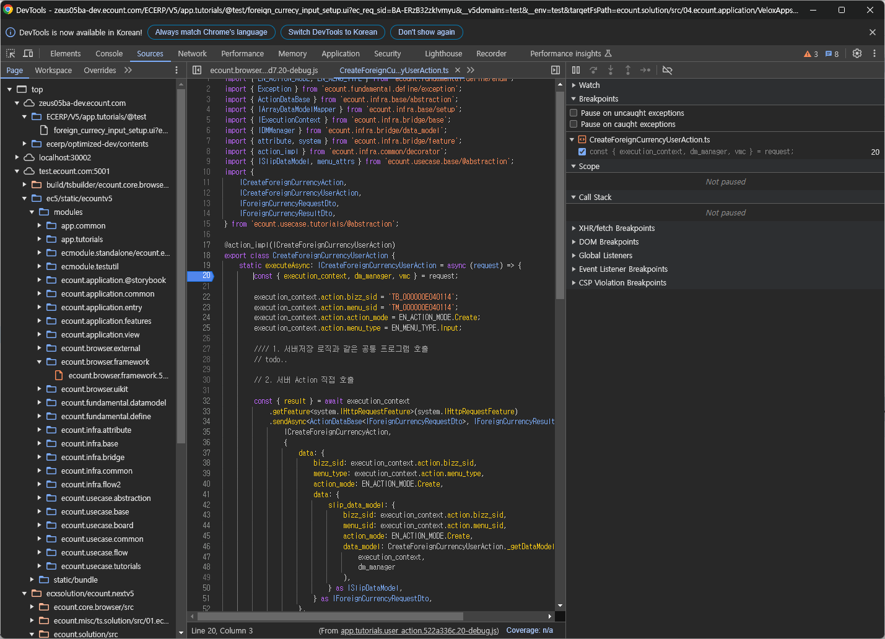

# Daily Retrospective

**작성자**: 나아연

**작성일시**: 2025-01-16

## 1. 오늘 배운 내용 (필수)

### DB 서버 연결 방법

- `$App.getDatabase()` 사용

  - DbConnectionId를 인자로 넘겨 어떤 DB에 저장할지 결정
  - 이넘으로 정의된 커넥션 아이디를 인자로 전달
  - 메서드를 실행하여 데이터베이스 객체가 반환된다면 DB 서버에 정상적으로 연결되었음을 의미한다.

- DbConnectionId

  - DbConnectionId는 `connection.{ZONE}.conf` 혹은 `connection.conf` 파일의 각각의 연결 정보를 구분하는 key값
  - 해당 Key의 Value값은데이터베이스에 연결하기 위한 정보가 담긴 문자열
  - TableIdentifier 첫번째 인자로 사용된다.
  - 존별 디비인 경우 커넥션 아이디에 중괄호로 감싸아진 formatter가 prefix로 붙는다.
  - 이를 현재 세션 정보로 포매팅하여 알맞은 연결 정보를 읽어온다.
    
  - 간혹 뒤에 suffix가 있는데, 이는 뭘 의미하는 걸까 . ?
    ```ts
    const enum PG {
      BASE = "{0}...{1}",
    }
    ```

### ESQL

- ESQL을 통해 쿼리를 동적으로 구성할 수 있습니다.
- before, after method를 통해 여러 개의 statement를 하나의 쿼리로 호출할 수 있습니다.
- priority 기능을 통해 clause의 순서 또한 동적으로 배치할 수 있습니다.
- extract 기능을 통해 자동적으로 selector expression을 추가할 수 있습니다.

### 5.0

- SP를 생성할 때 마다 DB를 조회하여 필요한 명세를 읽어왔습니다.
- 이러한 방식은 CPU와 같은 DB 성능에 영향을 주어, 서버별로 SSDB 와 MEMORY를 활용하여 스키마 정보를 캐시하도록 개선했습니다.

  - Redis 프로토콜을 사용하는 디스크 기반 스토리지

---

페이지에 따라서 setup이 캐싱이 되기 때문에
현재는 전체를 가져오고 필요한 버튼을 필터링한다고 한다.
이를 해결하는 방법 중 하나로 캐싱의 단위를 ation으로 분리하는 것을 말씀해주셨다.

UserAction부터 DB까지의 흐름을 정리해보았다.
페이지에 들어오면 setup api와 data api를 호출하고 어떤 버튼 등이 필요한지 찾아 화면을 그린다. ui 상 요청으로 userAction 호출하고 useraction에서 적절한 action을 호출하여 로직을 처리하는 방식이다.

구현 과제에서 setup 파일을 사용하여서 UI 상 유효성검사와 서버 상 유효성검사가 분리되었다고 생각했다. 그래서 유효성 검사 기준이 변경된다면 두 곳을 수정해야하지 않나 라는 생각이 들어서 성준 책임님께 질문을 드렸으나 그렇지 않다고 하셨다. 다시 생각해보니 테스트를 위해 setup 파일을 사용하는 것이고 이 setup도 XXXSetupAction으로부터 받아오는 값인 것을 이해했고, 유효성검사가 UI와 서버 각각 분리된 것이 아니라는 것을 파악했다.

## 2. 동기에게 도움 받은 내용 (필수)

- 주현님, 현철님께서 resolver를 찾지 못하는 문제에 대한 힌트를 주셨습니다.

## 3. 개발 기술적으로 성장한 점 (선택)

### 1. 교육 과정 상 배운 내용이 아닌 개인적 호기심을 해결하기 위해 추가 공부한 내용

어제 성준팀장님과 restful api에 대한 이야기를 나누면서 외부 사람이 사용하기 어렵겠다고 생각했다. 동시에 plugin처럼 외부에서 사용할 수 있는 api (openAPI)를 만들게 된다면 서버에서 사용하는 방식처럼 사용할지 궁금했는데 오늘 마침 이카운트의 openAPI에 대해 언급해주셨다. 덕분에 조금 찾아보니 아래 API를 확인했다.

**openAPI**

```
POST https://oapi{ZONE}.ecount.com/OAPI/V2/Quotation/SaveQuotation?SESSION_ID={SESSION_ID}
```

**server API**

```
POST /ec5/api/app.inventory/action/CreateInventoryAction:quotation:input?ec_req_sid=...
```

openAPI는 외부 사람도 이해하기 쉽도록 설계하였고, server API는 개발자가 디버깅을 쉽게 하고자 디렉토리 구조를 uri로 설계한 것이 아닐까 생각했다.

### 2. 오늘 직면했던 문제 (개발 환경, 구현)와 해결 방법

- UserAction을 구현했는데 resolver를 못찾는 이슈가 있었다. UserAction에 breaking point를 달았지만 디버깅을 할 수 없었다. UserAction은 브라우저 단이라 웹브라우저에서 디버깅이 가능하다는 것을 알았다. 웹브라우저에서 디버깅하는 방법은 개발자도구에서 ctrl+p로 디버깅할 파일(XXXUserAction)을 찾는다. 여기서 breaking point를 걸면 디버깅이 된다.
- 해당 방법으로 bizz_sid, menu_sid가 들어오지 않는다는 것을 파악하고 UserAction에 임시로 하드코딩하여 처리했다.



---

과제

```ts
export class CreateForeignCurrencyUserAction {
    static executeAsync: ICreateForeignCurrencyUserAction = async (request) => {
        const { execution_context, dm_manager, vmc } = request;

        execution_context.action.action_mode = EN_ACTION_MODE.Create;
        execution_context.action.menu_type = EN_MENU_TYPE.Input;

        //// 1. 서버저장 로직과 같은 공통 프로그램 호출
        // todo..

        // 2. 서버 Action 직접 호출
               ....
}
```

```
1번 케이스에서, browser layer에서 TempExecuteSetupMainProgram을  생성해서, 호출합니다.
(ServerLayer에 있는 로직과 내부 로직은 다를수 있습니다.)

1번 케이스와 2번 케이스를 진행했을때의 각각에 대해서 설명하고,
본인은 어떤 선택이 더 좋아보이는지 설명해주세요.

* 각각의 장/단점을 정리하고, 그 과정에서  본인이 선택한 이유를 설명해주시면 됩니다.
   1번으로 해결될수 없다. 1번이 필요없다고 생각하시는 분은 2번에 대한 설명과 함께
    본인의 판단을 설명해주시면 됩니다.
```

**1번**

장점1) UserAction은 어떤 Action을 호출해야하는지 전혀 알 필요가 없어 한 쪽이 변경되더라도 반대는 전혀 영향을 받지 않는다. 예를 들어, ICreateForeignCurrencyAction이 아닌 IMakeForeignCurrencyAction를 사용하게 된다하더라도 정의한 속성만 변경하면 되고 UserAction은 변경할 필요가 없다.

단점1) 이미 CreateForeignCurrencyAction이라는 클래스명에서 '외화생성'이라는 역할이 부여되었음에도 어떤 Action을 호출하는지 바로 알 수 없다. 굳이 속성을 정의한 곳을 찾아서 확인해야한다.

단점2) ITempExecuteSetupMainProgram를 사용하기 위해 특정 dto 형태로 맞춰주는 과정이 필요할 것 같다. 이로 인해 사용하지 않는 불필요한 필드가 늘어나 실제로 해당 dto를 사용하는 action의 역할에 혼동이 올 수도 있지 않을까 생각한다.

**2번**

장점1) 외화를 만드는 또 다른 Action 구현체가 생성된다면 CreateForeignCurrencyUserAction에는 변경사항 없이 새로운 기능으로 교체 가능할 것이다.

장점2) 외화를 만드는 브라우저 UserAction이 어떤 서버 Action을 사용하는지 바로 파악 가능하다. 해당 구조를 처음 보는 사람의 이해를 도울 수 있다.

단점1) ICreateForeignCurrencyAction의 구현체가 변경되는 것이 아니라 IAction 자체가 변경되면 CreateForeignCurrencyUserAction에도 수정이 필요하다. ex) ICreateForeignCurrencyAction => IMakeForeignCurrencyAction

단점2) ICreateForeignCurrencyAction의 구현체가 사실상 1개인데 불필요한 추상화 단계를 거친다. (사실 ICreateForeignCurrencyAction를 구현하는 또 다른 구현체가 생기는 경우가 있는지 의문입니다)

2번 방법을 선호합니다. 사용하던 IXXXAction이 아닌 전혀 다른 인터페이스를 사용하는 일은 흔치 않을 것 같으며(이런 일이 발생한다면 적절하지 않은 기준으로 인터페이스를 정의한 게 아닐까 생각합니다) 이미 UserAction의 역할이 정해졌고, Action 역할도 정해졌는데 이를 추상화하여 적절한 Action을 찾으로 순회하는 것은 번거롭고 이해하기 어려운 과정이라고 생각합니다.
