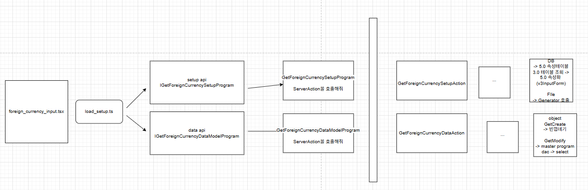
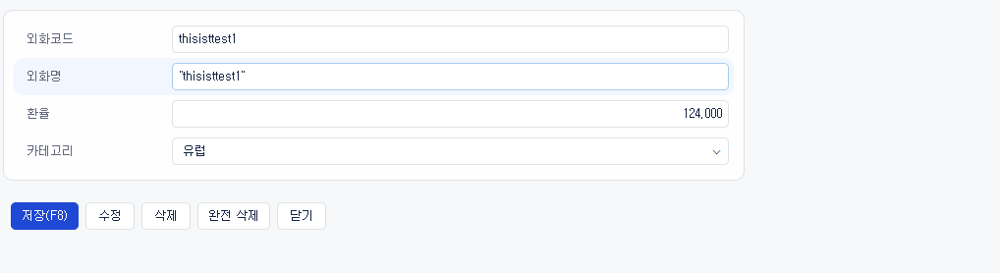

# Daily Retrospective  
**작성자**: [박성재]  
**작성일시**: [2025-01-16]  

## 1. 오늘 배운 내용 (필수)
- UI에서 서버로 연결되기 까지의 흐름
- UserAction의 개념
- UI와 서버의 로직 연결 실습

<br/>

## UI에서 서버로 연결되기 까지의 흐름

UI에서 저장버튼을 눌러 서버에 데이터 저장 요청을 하기까지의 흐름을 정리해보겠습니다.



위 그림의 흐름을 다시 정리하면 아래와 같습니다.

### 1. foreign_currency_input.tsx
브라우저에서 UI를 그려낼 때 최초 진입점입니다. 데코레이터를 통해, `setup`과 `data_model`을 명시하여 프레임워크에게 `Setup` 프로그램과 `DataModel` 프로그램을 어떤 것을 사용할지 알려줄 수 있습니다.

### 2. load_setup.ts
- 실제로 `setup` 프로그램과 `DataModel`을 호출하여 각각 API를 호출하고 속성 정보와 DB 데이터 정보를 불러와서 합쳐서 소스로 사용하여 `setup` 정보로 가지고 있게됩니다.
- `UI`에서는 결국 해당 속성이 있으면 표시하고, 없으면 표시안하고하는 식으로 처리가 된다고 합니다.
- 여기서 `setup`에는 서버에서 관리되는 유효성 체크의 속성들도 모두 담기게 되는데, 해당 유효성 체크 속성들 중 필요에 따라 선택해서 UI에서 유효성 체크를 수행할 수 있습니다.

### 3-1. IGetForeignCurrencySetupProgram
UI 부문 입장에서는 줄여서 `setup API`라고도 부를 수 있을 것 같습니다. 해당하는 업무, 메뉴 등의 정보를 기반으로 서버 또는 DB에 존재하는 속성정보를 `setup` 정보에 담아주는 역할을 합니다.

### 3-2. IGetForeignCurrencyDataModelProgram
줄여서 `data API`라고도 부를 수 있을 것 같습니다. 해당하는 업무, 메뉴 등의 정보를 기반으로 DB 데이터를 불러오는 역할을 합니다. 이때 `render_item`이라는 화면을 그려주는 속성도 이 프로그램을 통해 불러오게되는데, `setup API`로 받아온 정보는 사용자 요청에 따라 실시간으로 변경될 수 있기 때문이라고 합니다.

예를들면, 사용자가 양식 설정을 할 때 사용중이던 캐시가 초기화됩니다. 그때 고정적인 `render_item`은 DB나 서버에서 다시 가져와야하기 때문에, `setup API`에서 가져오지 않고 여기서 가져오게 되는 것입니다. 이때 캐시의 기준은 브라우저 캐시, 서버 캐시 모두 포함된 개념입니다.

### 4-1. GetForeignCurrencySetupProgram
`httpFeature`를 통해 Server의 `SetUp`을 담당하는 `Action Program`을 호출하고, 응답 데이터를 반환합니다.

### 4-2. GetForeignCurrencyDataModelProgram
`httpFeature`를 통해 Server의 `Data Model 조회`를 담당하는 `Action Program`을 호출하고, 응답 데이터를 반환합니다.

### 5-1. GetForeignCurrencySetupAction
해당하는 업무, 메뉴 등의 정보를 기반으로 서버 또는 DB에 존재하는 속성 정보들을 불러옵니다.

### 5-2. GetForeignCurrencyDataAction
해당하는 업무, 메뉴 등의 정보를 기반으로 필요한 DB 데이터를 불러옵니다.

### 6. CreateForeignCurrencyUserAction
- 5번까지 수행되면, 데이터를 저장하기 위해 화면에 표현될 속성 정보들이 그려지게되고, 사용자가 입력값을 입력 후, 저장 버튼을 누를 수 있게 됩니다. 
- 저장 버튼을 누르면 이 클래스로 요청이 전달되며 브라우저 부문의 종단점 역할을 하게됩니다.
- 서버에서 돌아가고 있는 진입점인 `Action`을 불러와서 저장 로직을 수행시키게 됩니다.

### 7. CreateForeignCurrencyAction
요청 데이터를 받아서 DB에 액세스하여 데이터를 저장하는 로직을 수행합니다. 로직에 따라, 유효성 체크 등을 수행합니다.

<br/>

## UserAction의 개념
`UserAction`이란 비즈니스 로직을 UI단에서 핸들링할 수 있는 하나의 창구 역할을 합니다. 예를들어 `견적서 입력`의 `저장` 버튼을 누르면 이미 그려진 UI에서 서버에 저장해달라고 `UserAction`을 하출하게됩니다.

### dmc_manager
`DMC`를 관리하는 매니저입니다. UI에서는 현재 `SMC`의 개념이 존재하지 않는다고 합니다. 추후에 UI 딴에도 통일되게 `SMC` 개념을 도입할 수도 있다고하는데, 현재는 변경에 따른 리소스가 너무 많이 들어 반영되지는 않는 상태입니다.

### User_Action 에서 특정 정보들을 직접 입력해줘야하는 경우
action_mode와 menu_type을 직접 입력해주는 경우, 실제로 input 들어왔을 때 input이 아니고 신규조회인 `new` 등입니다. → `action`의 변경이 일어나는 가장 마지막 시점이 `UserAction`이기 때문에 여기서 정해주는 것입니다.

이후에 Server의 `Action`에서 해당 정보를 변경하는 것이 아니고, 기존 값을 변경해줘야합니다.

<br/>

## UI와 서버의 로직 연결 실습
기존에 구현해놨던 서버의 비즈니스 로직과 테스트 코드로서 작성해놓은 UI를 연결해보는 실습 과정을 거쳤습니다. `저장`, `수정저장`, `삭제 상태변경`, `완전삭제` 4가지를 실습하였습니다.

대표적으로 `저장` 로직 하나의 경우를 코드로 정리해보겠습니다.

### 1. Test UI

```typescript
import { BasePage } from 'ecount.application.view/page';
import { IExecutionContext } from 'ecount.infra.bridge/base';
import { ISetup } from 'ecount.infra.base/setup';
import { page_impl } from 'ecount.infra.common/decorator';
import {
	IForeignCurrencyInputPage,
	IGetForeignCurrencyDataModelProgram,
	IForeignCurrencyInputPageParam,
	IForeignCurrencyInputPageMessage,
} from 'ecount.usecase.tutorials/@abstraction';
import { renderer_attrs } from 'ecount.fundamental.define/attribute';
import { EN_ACTION_MODE, EN_ATTR_TYPE } from 'ecount.fundamental.define/enum';
import { setup } from './foreign_currency_setup';

@page_impl({
	identifier: IForeignCurrencyInputPage,
	setup: setup,
	//data_model: IGetForeignCurrencyDataModelProgram,
})
export class ForeignCurrencyInputPage extends BasePage<
	IForeignCurrencyInputPageParam,
	IForeignCurrencyInputPageMessage
> {
	static async onInitalizeSetup(execution_context: IExecutionContext, setup: ISetup) {
		// action 모드에 따라서 버튼의 표시여부가 결정되어야 됨
		// 현재 버튼의 표시관련 처리는 5.0화 되어있지 않음. 임시코딩.
		//this._buttonFilter(setup, execution_context);
	}

	private static _buttonFilter(setup: ISetup, execution_context: IExecutionContext) {
		const action_mode = execution_context.action.action_mode;
		const refer_type_by_refer_type = this._getTargetReferTypeByActionMode(action_mode as EN_ACTION_MODE);

		this._buttonFilterByReferType(setup, 'footer_toolbar', refer_type_by_refer_type);
	}

	private static _buttonFilterByReferType(setup: ISetup, target: string, delete_target_refer_types: string[]) {
		if (_.vIsEmpty(delete_target_refer_types)) {
			return;
		}

		delete_target_refer_types.forEach((refer_type) => {
			const prop = setup.data_model_definitions[target].props.find((x) => _.vIsEquals(x.refer_type, refer_type));

			if (_.vIsEmpty(prop)) {
				return;
			}

			const attr = setup.data_model_definitions[target].attributes?.find(
				(x) => _.vIsEquals(x.prop_id, prop?.prop_id) && _.vIsEquals(x.attr_id, renderer_attrs.display_state)
			);

			if (_.vIsEmpty(attr)) {
				setup.data_model_definitions[target].attributes?.push({
					attr_type: EN_ATTR_TYPE.Renderer,
					attr_id: renderer_attrs.display_state,
					prop_id: prop?.prop_id as string,
					data: false,
				});
			}
		});
	}

	private static _getTargetReferTypeByActionMode(action_mode: EN_ACTION_MODE): string[] {
		switch (action_mode) {
			case EN_ACTION_MODE.GetCreate:
				return ['modify'];
			case EN_ACTION_MODE.GetModify:
				return ['save'];
		}
		return [];
	}
}
```
- 테스트를 위해 제공된 코드입니다.
- 서버로직을 실행시킨 뒤, 해당 테스트코드를 실행하여 UI를 볼수있게됩니다.
- 그려지는 화면은 아래와 같습니다.

<br/>



<br/>

해당화면에서 저장버튼을 누르면 아래의 `UserAction`으로 이동되게됩니다.

```typescript
import { EN_ACTION_MODE, EN_MENU_TYPE } from 'ecount.fundamental.define/enum';
import { Exception } from 'ecount.fundamental.define/exception';
import { ActionDataBase } from 'ecount.infra.base/abstraction';
import { IArrayDataModelMapper } from 'ecount.infra.base/setup';
import { IExecutionContext } from 'ecount.infra.bridge/base';
import { IDMManager } from 'ecount.infra.bridge/data_model';
import { attribute, system } from 'ecount.infra.bridge/feature';
import { IViewModelStateContainer } from 'ecount.infra.bridge/view_model';
import { action_impl } from 'ecount.infra.common/decorator';
import { ExceptionBuilder } from 'ecount.infra.common/exception';
import { ProgramBuilder } from 'ecount.infra.common/program';
import { ISlipDataModel, menu_attrs } from 'ecount.usecase.base/@abstraction';
import {
	ITempExecuteSetupMainProgram,
	ITempExecuteSetupMainProgramRequest,
	ITempExecuteSetupMainProgramResult,
	ILoadingBizzForPageProgram,
	LoadingBizzForPageProgramRequestDto,
} from 'ecount.usecase.common/@abstraction';
import {
	ICreateForeignCurrencyAction,
	ICreateForeignCurrencyUserAction,
	IForeignCurrencySetupRequestDto,
	IForeignCurrencySetupResultDto,
} from 'ecount.usecase.tutorials/@abstraction';

@action_impl(ICreateForeignCurrencyUserAction)
export class CreateForeignCurrencyUserAction {
	static executeAsync: ICreateForeignCurrencyUserAction = async (request) => {
		const { execution_context, dm_manager, vmc } = request;

		execution_context.action.action_mode = EN_ACTION_MODE.Create;
		execution_context.action.menu_type = EN_MENU_TYPE.Input;
		execution_context.action.bizz_sid = 'TB_000000E040114';
		execution_context.action.menu_sid = 'TM_000000E040114';

		//// 1. 서버저장 로직과 같은 공통 프로그램 호출
		// todo..

		// 2. 서버 Action 직접 호출
		const slip_data_model = {
			bizz_sid: execution_context.action.bizz_sid,
			menu_sid: execution_context.action.menu_sid,
			action_mode: EN_ACTION_MODE.Create,
			data_model: CreateForeignCurrencyUserAction._getDataModel(execution_context, dm_manager),
		} as ISlipDataModel;

		const { result } = await execution_context
			.getFeature<system.IHttpRequestFeature>(system.IHttpRequestFeature)
			.sendAsync<ActionDataBase<IForeignCurrencySetupRequestDto>, IForeignCurrencySetupResultDto>(
				ICreateForeignCurrencyAction,
				{
					data: {
						bizz_sid: execution_context.action.bizz_sid,
						menu_type: execution_context.action.menu_type,
						action_mode: EN_ACTION_MODE.Create,
						data: {
							bizz_sid: execution_context.action.menu_sid,
							slip_data_model: slip_data_model,
						},
					},
				}
			);
		vmc.sendMessage({ redraw: true });

		// 신규창 팝업 호출하는 경우에는 닫아야됨.
		//vmc.closePage();
		return;
	};

	private static _getDataModel(execution_context: IExecutionContext, dm_manager: IDMManager): IArrayDataModelMapper {
		//// data_model_id를 고정시키지않고 공통을 사용해서 조회하는 방법
		// const attr_feature = execution_context.getFeature<attribute.IAttributeFeature>(attribute.IAttributeFeature);
		// const data_model_id = attr_feature.getMenuAttr<menu_attrs.data_model_id>(menu_attrs.data_model_id).data;
		//const dmc = dm_manager.getDataModelContainer(data_model_id);

		const data_model_id = 'foreign_currencyXmaster';
		const dmc = dm_manager.getDataModelContainer(data_model_id);

		return {
			[data_model_id]: dmc.getDataModel() as any,
		} as IArrayDataModelMapper;
	}
}
```
- `_getDataModel`: `dm_manager`를 통해 `data_model_id` 값을 기반으로 요청 데이터를 DMC 형식으로 변환해 반환해줍니다.
- 요청 정보들을 가지고 서버 `Action`을 호출해줍니다.
- 테스트 환경 상 주입이 안되는 정보들을 `execution_context`에 하드코딩으로 넣어주고 있습니다. 이는 테스트 환경으로 인한 임시적인 코드이며, 실제로 로직을 구현할 때는 요청을 받아올 때 이미 채워진 상태로 넘어오게 됩니다.
- 여기서는 제가 이전에 구현해놓은 `ICreateForeignCurrencyAction`으로 요청을 보내어 저장로직을 실행시키고 있습니다.

이후로는 제가 이미 구현해놓은 서버 비즈니스 로직을 타게됩니다.

### 느낀 점
UI에서 서버로 어떻게 요청이 전달되는지 흐름까지 파악하게되면서 이카운트의 프레임워크를 통한 웹 서비스의 흐름에 대해 이해도가 보다 높아진 것 같습니다.

아직 브라우저 딴에서의 로직들이 어떻게 돌아가는지는 잘 모르지만, 각각 어떤 역할을 한다는 큰 흐름은 알게된 것 같습니다.
UI 부문과의 연결만을 다루었지만, 제가 기존에 잘못 짜놓은 로직들이 몇몇 존재하여 그것때문에 에러가 발생하거나 정상적으로 동작되지 않는 등의 문제들도 겪었습니다.

그에 따라 `Dac`이나 다른 부분들에서 어떤 점들을 주의해서 로직을 작성해야하는지 보다 전반적인 이해도가 높아진 것 같습니다.

<br/>

## 2. 동기에게 도움 받은 내용 (필수)

#### 김승준 선임
오늘 실습을 하는 중간중간 궁금한 내용을 물어보며 의견을 공유하는 시간을 가졌는데, 진행하는데 도움이 되었습니다.

#### 이연아 선임
금일 병원도 갔다오고 했었는데, 옆자리에 계시면서 걱정도 해주시고 상태를 파악하는 등, 덕분에 보다 안정을 취하며 교육에 임할 수 있었습니다. 

<br/>

## 3. 개발 기술적으로 성장한 점 (선택)

### 1-1. Transaction 선언 방식에 따른 궁금한점

```typescript
export class CreateInventoryMasterProgram 
// ...

@_transaction(TransactionOption.Required)
	protected onExecute(dto: IResolveInventoryDataModelProgramDto): IResolveInventoryDataModelProgramResult {
```
오늘 현우팀장님께 `_transaction`의 선언방식에 클래스 레벨에 데코레이터를 추가해도 하위의 모든 함수에 트랜잭션이 적용되지 않는다고 배웠습니다.

저는 해당 설명을 듣고, Java에서는 클래스에서 선언해주면 하위의 모든 함수에 트랜잭션이 적용되는데, 왜 우리 프레임워크에서는 그게 안되고 있을까? 궁금했습니다.

#### Js에서의 클래스와 함수
위 예시를 보면 `@_transaction`는 클래스 내부의 메소드로서 존재하는 함수에 선언되고 있습니다.

클래스 내부의 메소드는 사실 클래스에 존재하는 함수라고 할 수 없습니다.

해당 클래스를 기반으로 생성되는 인스턴스의 프로토타입 객체 내의 함수라고 할 수 있습니다.

그리고, <U>클래스와 프로토타입 객체는 메모리 상에서 서로 분리되어 있습니다.</U>

바로 메모리 상에서 서로 분리되어 있기 때문에, 클래스 레벨에 `@_transaction`을 선언해도 하위 메소드들에 모두 트랜잭션을 걸어주는 것이 불가능한 것인가? 라는 생각이 들었습니다.

다음에 트랜잭션 관련 질문을 추가적으로 하거나, TS의 데코레이터를 공부해서 의문을 해소해야겠다는 생각이 들었습니다.

<br/>

### 1-2. 5.0 프레임워크의 목표와 DB 종속성 문제에 대한 고민
금일 팀장님께서 프레임워크 아키텍처의 흐름에 대해 쭉 설명을 해주셨으며, 오늘도 "5.0 프레임워크의 목표에 따라 `속성 정보`들이 결국에는 DB에 들어가게 될 것이다" 라고 설명해주셨습니다.

그런데 저는 계속 이 내용을 듣다보니 한가지 의문이 들었습니다.

비즈니스의 핵심 로직을 담당하게될 정보들이 점점 DB에 존재하게되면 소프트웨어의 가치가 점점 DB 데이터에 종속되어가는 것이 아닐까? 이것이 과연 최선인 방법일까? 라는 생각이 들었습니다.

<U>DB 데이터가 지워져버리게되면 기존에 개발하던 방식이 완전히 불가능하게될 것이고, 이게 과연 바람직한가?</U> 라는 의문이 들었습니다.

팀장님께서도 이러한 부분들에 대한 우려를 갖고 계셨고, 10.0 까지 가게되면서 해결해야할 우리의 과제라고 말씀 주셨습니다.

앞으로 이카운트에서 일해나가게 되면서 해당 고민을 어떻게 해결할 수 있을지 끊임없이 고민해봐야할 과제라는 생각이 들었습니다.

<br/>

### 2. 만약 하드코딩을 할수밖에 없다면, 어디에서 할 것인가?

#### [ 개요 ]

금일 실습으로 기능 하나의 흐름을 UI부터 DB 단까지 전체적으로 어떻게 돌아가는지 알 수 있었습니다. CRUD 기능을 구현해보았는데, 그 중 `삭제상태 변경`이라는 요구사항이 있었습니다.

그런데 테스트 UI를 사용하는 등, 실무에서와 다소 상이한 환경으로 인해 아래와 같이 어딘가에서 하드코딩으로 데이터를 넣어줘야만 했습니다.

```typescript
export class ModifyStatusForeignCurrencyUserAction {
	static executeAsync: IModifyStatusForeignCurrencyUserAction = async (request) => {
		const { execution_context, dm_manager, vmc } = request;

		execution_context.action.action_mode = EN_ACTION_MODE.Delete;
		execution_context.action.menu_type = EN_MENU_TYPE.Input;
		execution_context.action.bizz_sid = 'TB_000000E040114';
		execution_context.action.menu_sid = 'TM_000000E040114';

		// ...
```

위 코드는 `UserAction` 레벨의 코드입니다. `UserAction`은 서버로 요청이 전달되기 전, 브라우저 레벨의 종단점으로, 하나의 액션 정보가 변경될 수 있는 마지막 장소라고할 수 있습니다.

따라서 `action_mode` 또는 관련된 초기 정보를 `UserAction`에서 선언하여 실습을 진행하도록 수업시간에 전달을 받았었습니다.

하지만 `삭제 상태 변경` 시 필요한 요청 값의 `status_type`의 경우 `삭제` 버튼을 누르면 `삭제` 상태를 의미하는 문자열이 들어올 것이고, `삭제 취소` 버튼을 누르면 `삭제 취소` 상태를 의미하는 문자열이 들어올 것입니다.

이 `삭제 상태`를 의미하는 문자열은 액션 정보와는 성격이 다르며, 요청할 때 이미 프로퍼티가 지정되고, 그 값이 변하지 않는 상태 그대로 서버로 넘겨져야된다고 생각했습니다.

#### [ 문제 ]
그러나, 실습 진행 시, 삭제 버튼에는 어떠한 값도 채워지지 않았습니다. 즉, 요청값으로 `status_type`이 빈 값으로 들어오는 것입니다. 따라서 어딘가에서는 반드시 `status_type`을 임의로 넣어주는 작업이 필요했습니다.

그렇다면 저는 어디에서 이 하드코딩이라고 불릴 수 있는 작업을 하는 것이 좋을까? 라는 고민이 들었습니다.

#### [ 해결 ]

제가 내린 결론은 **'하드 코딩 작업은 최대한 `저수준` 모듈에서 작업이 처리되어야한다'** 입니다. `고수준`이란 작업의 변경이 덜 일어날 수록 `고수준`이며, 작업의 변경이 많이 일어날 확률이 높을수록 `저수준`이라고 할 수 있습니다.

현재 이카운트 5.0 프레임워크의 아키텍처 흐름 상에서는 `UI` -> `서버` 로 갈수록 `고수준`이라고 느꼈습니다. 따라서 서버보다는 UI 부분에서 하드코딩 작업이 이루어져야하는데, 현재 상황에서 가장 좋은것은 `삭제` 버튼을 눌렀을 때 요청값으로 들어오는 값(프로퍼티)를 최초로 지정해주는 것입니다.

하지만 우리는 아직 어떤 `setup` 정보를 기반으로 UI를 그리는지 배우지 않았기 때문에, 현재 할 수 있는 최선은 UI의 종 단점인 `UserAction` 레벨에서 해당 하드코딩을 적용하는 것입니다.

#### [ DeleteForeignCurrencyUserAction.ts ]

```typescript
private static _getDataModel(execution_context: IExecutionContext, dm_manager: IDMManager): IArrayDataModelMapper {
		//// data_model_id를 고정시키지않고 공통을 사용해서 조회하는 방법
		// const attr_feature = execution_context.getFeature<attribute.IAttributeFeature>(attribute.IAttributeFeature);
		// const data_model_id = attr_feature.getMenuAttr<menu_attrs.data_model_id>(menu_attrs.data_model_id).data;
		//const dmc = dm_manager.getDataModelContainer(data_model_id);

		const data_model_id = 'foreign_currencyXmaster';
		const dmc = dm_manager.getDataModelContainer(data_model_id);

		const result = {
			[data_model_id]: dmc.getDataModel() as any,
		};

		result[data_model_id][0]['foreign_currency$status_type'] = EN_STATUS_TYPE.Delete;

		return {
			[data_model_id]: dmc.getDataModel() as any,
		} as IArrayDataModelMapper;
	}
```
따라서 위와 같이 `UserAction`의 네이밍을 `DeleteUserAction`, `UnDeleteUserAction`으로 변경하고 위와 같이 `Data Model`을 `DMC` 데이터로 매핑할 때 하드코딩 작업을 추가해주었습니다.

이에 따라 서버 로직은 `status_type`과 관련없이 동일하게 로직이 수행되며, 변경이 일어나도 추가 변경에 대한 영향을 최소화할 수 있습니다.

이러한 상황은 실무에서 개발할 때도 자주 마주치는 주제일 것이라고 생각되며, 항상 위 규칙을 준수하며 개발해나가야겠다는 생각이 들었으며, `고수준`이 어디이고, `저수준`이 어디인지 생각해나가며 개발해나가야겠다고 다짐했습니다.