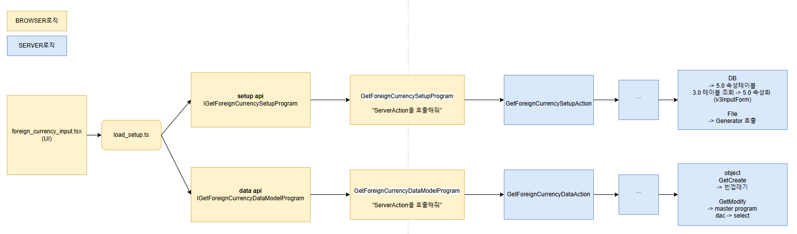
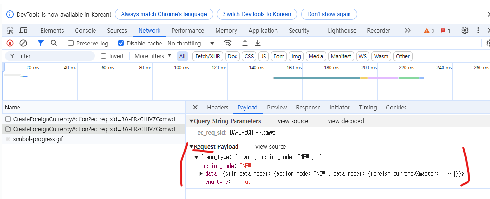
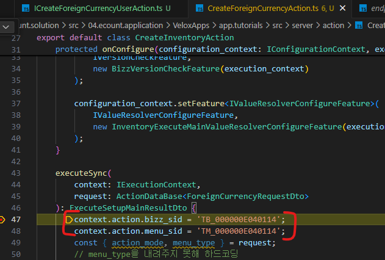

# Daily Retrospective

**작성자**: [설다은]  
**작성일시**: [2025-01-16]

## 1. 오늘 배운 내용 (필수)

### 🗒️ [ESQL 강의 정리 (일부분)]

### 1강. Data 프레임워크

**1. DB연결하는 방법 (만약 연결하고자하는 dbConnectionId가 없다면 EFS팀 담당자에게 문의)**<br>

1. 연결방법의 변화
   3.0 : DB모델을 제네릭 매개변수로전달하여 어떤 디비에 연결할지 결정함
   5.0 : dbConnectionId를 이넘으로 정의하여 $App.getDatabase(DbConnectionId.PG.BASE. db => {})로 연결 가능함.
   getDatabase메서드를 실행하면 DB 객체가 반환되고, DB서버에 정상적으로 연결되었음을 의미함.

2. ENUM으로 제공되는 DbConnectionId
   ConnectionId : connection.BA.cof 등 커넥션컨피그 파일에 있는 각 연결정보를 구분하는 "키값"

   ```ts
   // 파일명 : db_conneciton_id.d.ts
   const enum PG {BASE = "{0}:pgsql:BASE{1}",,,,}
   ```

   위 소스를 보면
   BASE의 값에 중괄호로 감싸진 포매터가 프리픽스로 붙는다.
   이와같이 존별DB인 경우, 커넥션 아이디에 포매터가 붙고, 이를 현재 세션정보로 포매팅하여 알맞은 연결 정보를 읽어온다.
   = 커넥션 아이디로 커넥션 컨피그 파일에서 연결 정보를 읽어오고, 읽어온 정보로 DB서버에 연결한다.

   ```ts
   // 파일명 connection.BA.conf
   "pgsql": {
   "BASE": "Server=10.10.10.107;Port=45111;Username=ecount0001;{SData=9V45u4qRUKdINAn2qkD9duki/FgFXIKKAfj0JjGDnuJvJNMHbrMaAXgr5pCexOIuvNtFaxz3wv111Ts2iACkerAL1rAM4986H/+G7HjQjRWRFN7Ss1U1KwVDYYNY6+TSdv1eXerm/BeUu1QBEHxDCg==};Database=ecount;Enlist=false;CustomDtc=true;schema=base;ServerCompatibilityMode=NoTypeLoading;ChangeSchema=true;Maximum Pool Size=;Minimum Pool Size=;Timeout=;",
    ...
   }
   ```

**2. 쿼리 생성하여 커맨드 핸들러를 만드는 방법**<br>

1. 날쿼리<br>
   ```ts
   using($App.getDatabase(DbConnectionId.PG.BASE), db => {const handler = db.sqlText(`SELECT * FROM cust`;)});
   ```
2. ESQL : 매개변수로 실행할 ESQL의 키값과 매개변수 전달<br>

   ```ts
   const esql = $Esql.from<cust>(cust)
   .select((ef, t) => ef.\_all())
   .where((ef, t) => ef.\_all(t.com_code, '80000'));

   using($App.getDatabase(DbConnectionId.PG.BASE), db => {const handler = db.expressionSql(SelectCustDac, esql)});
   ```

3. UDP (User Defined Procedure) : 매개변수로 실행할 UDP 파일경로 전달<br>

   ```ts
   using($App.getDatabase(DbConnectionId.PG.BASE), (db) => {
     const handler = db.userDefinedProcedure("udp/udp_select_cust");
   });
   ```

4. SP : 매개변수로 실행한 SP이름 전달<br>
   ```ts
   using($App.getDatabase(DbConnectionId.PG.BASE), (db) => {
     const handler = db.storedProcedure("esp_select_cust");
   });
   ```
   ★ 특수한 경우 제외하고 5.0에서는 ESQL만 사용하기를 권장함 ★<br>

# 3. 커맨드 핸들러에 옵션을 설정하는 방법

1.  파라미터 설정

    ```ts
    using($App.getDatabase(DbConnectionId.PG.BASE), db => {
    const sql = `SELECT *
    FROM cust
    WHERE com_code = @P1 AND business_no = @P2;`;

    const handler = db.sqlText(sql).setParamter({P1: '80000', P2: '0001'});

    const result = handler.query().data;
    ```

2.  리소스 설정<br>
    리소스 컬럼을 조회하여 치환이 필요한 경우, 컬럼명을 넘기면 현재 언어에 맞게 치환된 값을 조회할 수 있음.<br>

    ```ts

    using($App.getDatabase(DbConnectionId.PG.BASE), db => {
    const sql = `SELECT 'rex00321' AS myresc1, 'rex00373' AS myrex2;`;

    const handler = db.sqlText(sql).setResource(['myrex1','myrex2']);

    const result = handler.query().data;
    ```

3.  Response Message 설정<br>

    ```ts
    // DbConnectionType은 ENUM으로 정의되어 있음.
    // setResponseMessage (exceptionType, message)로 구성됨
    using($App.getDatabase(DbConnectionId.PG.BASE), db => {const handler = db.sqlText(`SELECT * FROM cust;`).setResponseMessage(DbConnectionType.Timeout, "검색 데이터 양이 많으니 조건을 재설정하여 조회하기 바랍니다.");

    const result = handler.query().data;
    ```

# 4. 생성한 쿼리를 실행하는 방법

1.  함수 명세

    ```ts
    // db_conneciton_handler.d.ts

    class $DbCommandHandler {
    execute(): $DbCommandResult<void>;
    sclar<T=any>(): $DbCommandResult<T>;
    fetch(): $DbCommandResult<unknown>;
    query(): $DbCommandResult<Array<unknown>>;
    ...
    }
    ```

2.  execute() : 결과값을 반환하지 않는 쿼리 실행 시 사용
    ```ts
    using($App.getDatabase(DbConnectionId.PG.BASIC), (db) => {
      const sql = `INSERT INTO cust(com_code, business_no, cust_name) VALUES('80000', '0001', 'test');`;
      db.sqlText(sql).execute();
    });
    ```
3.  scalar() : 조회한 결과집합에서 첫행 첫열 데이터를 반환 시 사용

    ```ts
    using($App.getDatabase(DbConnectionId.PG.BASIC), (db) => {
      const sql = `SELECT business_no FROM cust WHERE com_code = '80000';`;
      var result = db.sqlText(sql).scalr<string>().data;

      Assert.equal("0001", result);
    }); // Assert(예상값, 실제값)는 단위 테스트를 수행하기위한 어설션함수 / 특정값이 예상한 값과 일치하는지 확인하기 위해 사용함.
    ```

4.  fetch() : 조회한 결과집합에서 첫행 데이터만 반환하는 함수<br>
    (1) 인자가 없는 경우 : 결과값으로 JS오브젝트를 반환 / . 인텔리센스를 사용하려면 결과값을 원하는 형태로 캐스팅해줘야함.<br>

    ```ts
    using($App.getDatabase(DbConnectionId.PG.BASIC), db => {const sql = `SELECT business_no FROM cust WHERE com_code = '80000';`;
    var result = db.sqlText(sql).fetch().data as cust;
    ```

    (2) 인자가 있는 경우 : creator나 mapper를 인자로 받음<br>
    creator : fetch의 첫번째 인자로 Object Identifier나 class constructor을 넘겨줘야함.<br>

    ```ts
    using($App.getDatabase(DbConnectionId.PG.BASIC), (db) => {
      const sql = `SELECT business_no FROM cust WHERE com_code = '80000';`;
      var result = db.sqlText(sql).fetch(cust.dto).data; // Dto는 제네릭 타입을 지정하지 않아도 됨
      Assert.equal("0001", result.business_no);
    });
    ```

    mapper : 조회 쿼리 실행 시 내부적으로 데이터레코드라는 객체가 생성됨 --> 객체를 통해 각 행의 열 값에 엑세스 가능 -> 현재 레코드가 가리키는 행의 특정 컬럼값을 직접 조회할 수 있음.<br>
    mapper의 두번째 인자인 'data'는 현재 행의 "모든 필드값이 매핑된 오브젝트 인스턴스" --> 값 직접 수정 가능함<br>

5.  query() : 조회한 모든 결과집합을 반화하는 함수, fetch와 동일하게 2가지 형태로 제공함.

6.  querySet() : fetch, query 모두 내부적으로 쿼리셋 함수를 실행함. 쿼리셋으로부터 데이터리더 객체를 받아 이 객체에서 제공하는 함수 실행.

**5. 트렌젝션 스코프 설정하는 방법**

1. $App.beginTransaction함수 사용

   ```ts
   using($App.beginTransaction(TransationOption.Required), trx => {
   const sql = `DELETE FROM cust WHERE com_code = '80000' AND id = '0001';`;

   using($App.getDataBase($DataTestHelper.connectionID.PG_V4TEST), db => {db.sqlText(sql).execute();})

   trx.commit();
   }
   ```

2. 트렌젝션 데코레이터 : 개발자가 커밋하지 않아도 내부에서 스코프가 종료될 때 커밋함.
   ```ts
   class testTrxAction{
   @\_transation(TransationOption.Required)
   test_trx() {
   ...}
   }
   ```

# 6. DB Profiler 사용 방법

DB Profiler : 로컬이나 테스트 서버에서 실행되고 있는 디비 정보를 로그 형태로 보여주는 프로그램.

실행된 쿼리를 파라미터 라이즈드된 형태, 논파라미터 라이즈드된 형태 모두 확인 가능하며, 디비 커넥션 및 트렌젝션이 생성되고 클로즈된 순서를 확인할 수 있음.
산출물에 위치한 application 컨피그 파일에서 enable프로파일러 옵션을 true로 설정해주셔야 프로그램이 동작함.
컨피그 파일을 설정하고 쿼리를 실행하면 트랜잭션, 커넥션, 쿼리 실행 정보를 모두 확인가능함.
캡처Mode를 로컬 또는 리모트로 설정하고 Start캡처를 실행하기

=====================================================================================================================================

2강. ESQL 개요

3.0프레임워크 쿼리 생성 방법 : 날쿼리, 프로시저, ORM, UDP

- 날쿼리 : 테이블 구조 변경에 따른 수정 힘듦
- ORM : 다양한 쿼리 생성 어려움
- UDP : 소스분석과 생성되는 쿼리 확인 힘듦

  5.0프레임워크 쿼리 생성 방법 : ESQL (쿼리 생성 도구)

ESQL : statement / clause / 이를 구성하는 요소를 expression tree로 정의하고 관리해야함.
expression tree는 DB호출시점에 각 프로바이더별 컴파일러를 거쳐 실행할 쿼리로 생성됨

ESQL 특징

1. 날쿼리 호출

- sqlText()명령으로 생성되어 호출됨

2. 프로바이더 비종속

- 하나의 쿼리를 만들면 각 프로바이더별로 컴파일러를 거치게됨
- 특정 DB의 쿼리를 알지 않아도 사용 가능함

3. 쿼리 동적 구성

- befor/after메서드를 통해 N개의 statement를 하나의 쿼리로 호출 가능
- priority 기능을 통해 clasue의 순서를 동적으로 배치
- extract 기능을 통해 자동적으로 selector expression 추가 가능

=====================================================================================================================================

3강. ESQL 스키마, 테이블모델

스키마 정보

- 실제 DB에 존재하는 컬럼의 명세서 (컬럼명, 타입, 사이즈, PK 등이 명시됨)
- 사용자 값 or PK컬럼 체크의 기준이 됨

  3.0 SP 생성 시 실제 DB 시스템 테이블 조회하여 명세 읽어옴 -> CPU부하발생 - 5.0 서버별로 SSDB와 MEMORY를 활용하여 캐싱함.

캐싱을 확인하는 방식

- 서버별로 스키마가 필요한 시점에 메모리 > SSDB > DB 순으로 스키마를 조회해오는 쿼리를 날림. 가져오면 SSDB와 메모리에 캐싱함. (SSDB는 Redis 프로토콜을 사용하는 디스크 기반 스토리지)<br>

테이블모델

- 비즈니스 로직 작성을 위해 실제 테이블과 1:1로 대응해야함.
- identifier와 interface 선언이 필요함

용도

1. 테이블 데이터를 담는 그릇
2. ESQL에서 테이블 칼럼에 접근하는 도구

### 🗒️ [UI 구현]

UI 구현 흐름<br>



#### _구현하기 위해 추가한 파일_

1. foreign_currency_input_setup.ui.tsx<br>
   D:\ecxsolution\ecount.nextv5\ecount.solution\src\04.ecount.application\VeloxApps\app.tutorials\src\browser\@test\@src.cases\foreign_currency\foreign_currency_input_setup.ui.tsx<br>

2. foreign_currency_input.ui.tsx<br>
   D:\ecxsolution\ecount.nextv5\ecount.solution\src\04.ecount.application\VeloxApps\app.tutorials\src\browser\@test\@src.cases\foreign_currency\foreign_currency_input.ui.tsx<br>

3. foreign_currency_setup.ts<br>
   D:\ecxsolution\ecount.nextv5\ecount.solution\src\04.ecount.application\VeloxApps\app.tutorials\src\browser\@test\@src.cases\foreign_currency\foreign_currency_setup.ts<br>

4. ICreateForeignCurrencyUserAction.ts<br>
   D:\ecxsolution\ecount.nextv5\ecount.solution\src\03.ecount.usecase\ecount.usecase.tutorials\src\browser\@abstraction\user_action\ICreateForeignCurrencyUserAction.ts<br>

5. CreateForeignCurrencyUserAction.ts<br>
   D:\ecxsolution\ecount.nextv5\ecount.solution\src\04.ecount.application\VeloxApps\app.tutorials\src\browser\user_action\CreateForeignCurrencyUserAction.ts<br>

## 2. 동기에게 도움 받은 내용 (필수)

**현철님**<br>
테스트할 때 로그인 클릭하면 로그인화면으로 돌아갔는데 현철님이 도와줘서 해결했습니다.

**지은님**<br>
UI Action구현에 도움을 주셨습니다.

**민준님**<br>
index 누락된 부분을 발견해주셨습니다.

## 3. 개발 기술적으로 성장한 점 (선택)

### 1. 교육 과정 상 배운 내용이 아닌 개인적 호기심을 해결하기 위해 추가 공부한 내용

### 2. 오늘 직면했던 문제 (개발 환경, 구현)와 해결 방법

구현을 하면서 궁금한 점이 있었는데 성준팀장님께 질문하여 해결했습니다.<br>
Q1. 해당 폴더에 담기는 것들은 어떤 역할을 하기 위함인지? (왜 생성되는건지 궁금합니다. server와 browser에서 공통으로 쓰기 위한건가?)<br>
A1. 서버 브라우저에서 사용되는 공통로직이 맞습니다. 이카운트의 최종적인 모습입니다. 서버/브라우저의 소스를 통일한다.<br>
<br>
Q2. @shared_usecase_XXX > @abstraction > data_model > foreign_currency폴더 안에 파일은 data_model_template으로 자동 생성된 것 같은데, 그 외 파일은 실습을 하면서 추가했습니다.<br>
자동생성되는것과 수동생성해야하는 파일은 어떻게 할 수 있는지? 수동으로 생성해야하는 파일의 기준은 뭔지?<br>
A2.빌드를 통한 자동생성되면 소스 처음부분에 아래와 같이 표시됩니다..<br>
`This file is generated by "data model template" and modifying it directly is not allowed.`<br>
// 03.ecount.usecase\ecount.usecase.tutorials\src\@shared_usecase_tutorials\@abstraction\data_model\foreign_currency\foreign_currency_input.ts<br>
<br>
Q3. server > @abstraction의 index.ts에는 data_model이 아닌 @shared_usecase_tutorials/@abstraction'을 쓰던데 왜 그런건지?<br>
A3. 두소스의 차이는 하나는 interface로 명세되어 있습니다. 해당시점에 interfae의 정보가 필요해서 해당 참조를 한것으로 보입니다.<br>
<br>
Q4. @shared_usecase_tutorials/@abstraction'을 import할때는 빨간줄 에러가 발생하는데 빠른수정으로 바꾸어 usecase.XXX로 바꾸면 정상이 되던데 어떤 논리때문에 그런건지?<br>
(04.ecount.application\VeloxApps\app.tutorials\src\server\action\CreateForeignCurrencyAction.ts 해당경로에 import { ForeignCurrencyRequestDto } from '@shared_usecase_tutorials/@abstraction'; 이부분 import { ForeignCurrencyRequestDto } from 'ecount.usecase.tutorials/@abstraction'; 이렇게 바꾸면 에러 안남)
A4. 참조가능 기준이 있습니다. 참조 관련 메뉴얼을 참고해주세요.<br>

### 3. 위 두 주제 중 미처 해결 못한 과제. 앞으로 공부해볼 내용.

Create를 구현하는데 request Payload에 액션모드와 메뉴타입이 있는데 디버깅을 하면 그 값이 들어오지 않았습니다.<br>
일단은 하드코딩으로 아예 박아놓고 실행했을 때는 문제가 없어서 이렇게 돌렸는데 왜 안들어오는지 중단점을 여러개 찍고 확인해봐야할 것 같습니다.<br>
<br><br>
<br><br>
<br><br>
Esql로 CRUD하는 것을 공부했는데 손으로 많이 써봐야지 익숙해질 것 같습니다.<br>
시간이 나는대로 틈틈히 ppt를 다 공부해볼 예정입니다.<br>

## 5. 제안하고 싶은 내용

다음 기수 진행 시에는 커리큘럼이나 일정을 미리미리 공유되었으면 합니다..<br>
기존에 제공해주신 커리큘럼은 5.0교육 1달이라고 되어있어 그 기간동안 뭘할지 감이 잘 안잡힙니다.<br>
generator구현, validator구현, 조회로직구현, esql자습 등 상세하진 않더라도 키워드가 쓰여 있으면 이 날에는 뭘 하는구나 정도 감을 잡기 좋을 것 같습니다.<br>
발표일정은 아직 협의가 안되신 것 같은데 준비를 하는 시간이 어느정도 필요하기 때문에 조금 미리 공지를 주시면 좋겠습니다!
