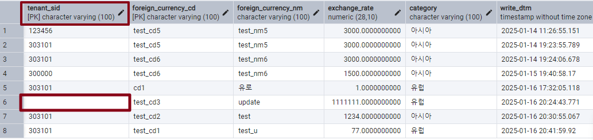
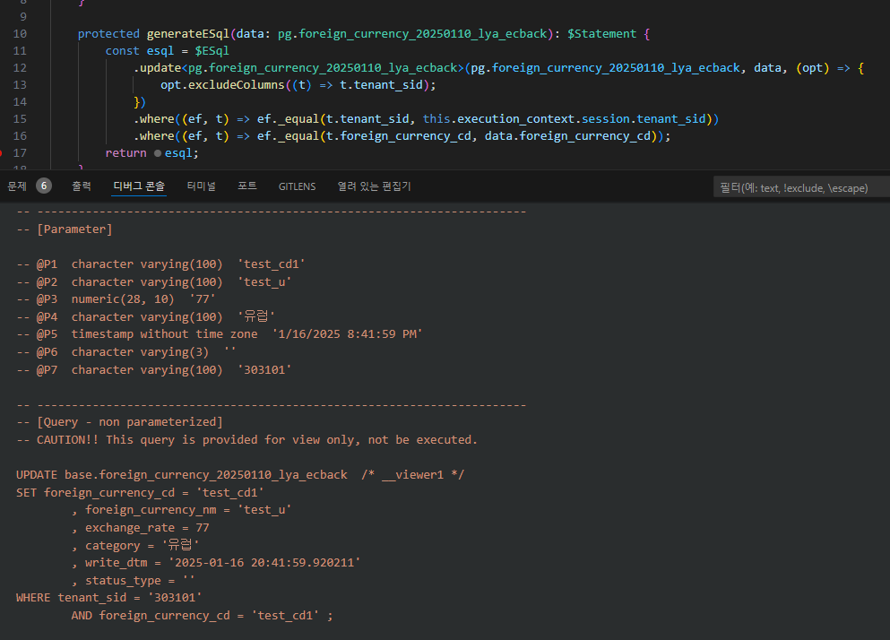
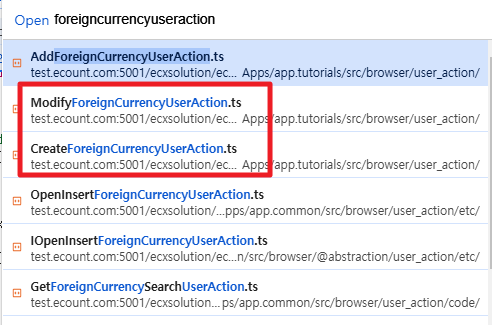

# Daily Retrospective  
**작성자**: [이연아]  
**작성일시**: [2025-01-16]  

## 1. 오늘 배운 내용 (필수)  
### Esql
트랜잭션 설정 방법
- `$App.beginTransaction` 사용
개발자가 명시적으로 커밋하지 않으면 롤백
- `@_transaction` 사용
개발자가 명시적으로 커밋하지 않아도, 내부에서 스코프가 종료될 때 커밋
```typescript
@program_impl(ICreateForeignCurrencyMasterProgram)
export class CreateForeignCurrencyMasterProgram
	extends BaseProgram<IResolveForeignCurrencyDataModelProgramDto, IResolveForeignCurrencyDataModelProgramResult>
	implements ICreateForeignCurrencyMasterProgram
{   
    // 데코레이더 사용
	@_transaction(TransactionOption.Required)
	protected onExecute(
		dto: IResolveForeignCurrencyDataModelProgramDto
	): IResolveForeignCurrencyDataModelProgramResult {
    ...
		const dac = DacCommandBuilder.create(InsertForeignCurrencyDac, this.execution_context, DbConnectionId.PG.BASE);
		dac.execute(_.vFirst(req) as pg.foreign_currency_20250110_lya_ecback);
		return true;
	}
```

### 입력 테스트 페이지 구현 
#### UserAction
04 application(browser)과 03 usecase(browser)의 경계에 대한 명세

`CreateForeignCurrencyUserAction` 구현
```typescript
@action_impl(ICreateForeignCurrencyUserAction)
export class CreateForeignCurrencyUserAction {
	static executeAsync: ICreateForeignCurrencyUserAction = async (request) => {
		const { execution_context, dm_manager, vmc } = request;

		execution_context.action.action_mode = EN_ACTION_MODE.Create;
		execution_context.action.menu_type = EN_MENU_TYPE.Input;

		//// 1. 서버저장 로직과 같은 공통 프로그램 호출
		// todo..
		// const program = await ProgramBuilder.createAsync(IExecuteSetupMainProgram, execution_context);
		// program.executeAsync()

		// 2. 서버 Action 직접 호출
		const { result } = await execution_context
			.getFeature<system.IHttpRequestFeature>(system.IHttpRequestFeature)
			.sendAsync<ActionDataBase<ForeignCurrencyRequestDto>, ForeignCurrencyResultDto>(
				ICreateForeignCurrencyAction,
				{
					data: {
						bizz_sid: execution_context.action.bizz_sid,
						menu_type: execution_context.action.menu_type,
						action_mode: EN_ACTION_MODE.Create,
						data: {
							slip_data_model: {
								bizz_sid: execution_context.action.bizz_sid,
								menu_sid: execution_context.action.menu_sid,
								action_mode: EN_ACTION_MODE.Create,
								data_model: CreateForeignCurrencyUserAction._getDataModel(
									execution_context,
									dm_manager
								),
							} as ISlipDataModel,
						},
					},
				}
			);
		vmc.sendMessage({ redraw: true });

		// 신규창 팝업 호출하는 경우에는 닫아야됨.
		//vmc.closePage();
		return;
	};

	private static _getDataModel(execution_context: IExecutionContext, dm_manager: IDMManager): IArrayDataModelMapper {
		//// data_model_id를 고정시키지않고 공통을 사용해서 조회하는 방법
		// const attr_feature = execution_context.getFeature<attribute.IAttributeFeature>(attribute.IAttributeFeature);
		// const data_model_id = attr_feature.getMenuAttr<menu_attrs.data_model_id>(menu_attrs.data_model_id).data;
		//const dmc = dm_manager.getDataModelContainer(data_model_id);

		const data_model_id = 'foreign_currencyXmaster';
		const dmc = dm_manager.getDataModelContainer(data_model_id);

		return {
			[data_model_id]: dmc.getDataModel() as any,
		} as IArrayDataModelMapper;
	}
}
```
과제를 통해 UserAction이 1번 케이스와 2번 케이스에 대해 어떤 과정으로 로직이 실행되는지, 생각해보는 시간을 가졌습니다.
그 과정에서 UserAction에서 MainProgram을 호출했을 때 데이터가 어떤식으로 전달되는지 파악하지 못했습니다. 동기들의 답변도 확인하고, 제 답변을 보고 민준님이 제 자리까지 와서 과정에 대해 설명해주셔서 이해할 수 있었습니다. 그 과정에 대해서는 내일 오전 중에 구현을 다 끝내고 꼭 정리하도록 하겠습니다!


## 2. 동기에게 도움 받은 내용 (필수)
- 민준님이 과제에 대한 답변을 보고 제가 궁금해하는 부분에 대해 알려주셨습니다.
- 성재님이 modify UserAction 구현 중에 tenent_sid를 수정하지 않고 DB에 저장하는 방법을 알려주셨습니다.

---

## 3. 개발 기술적으로 성장한 점 (선택)
### 2. 오늘 직면했던 문제 (개발 환경, 구현)와 해결 방법
`ModifyForeignCurrencyUserAction` 파일을 작성하고 테스트하는 과정에서 아래 사진과 같이 tenant_sid 값이 빈값으로 저장되는 문제가 발생했습니다.


성재님의 도움으로 `UpdateForeignCurrencyDac`에서 작성했던 esql 부분을 수정해서 tenant_sid 값은 제외하고 값을 update하는 방법으로 해결했습니다.



### 3. 위 두 주제 중 미처 해결 못한 과제. 앞으로 공부해볼 내용.


- `CreateForeignCurrencyUserAction`
- `ModifyForeignCurrencyUserAction`
- `ModifyStatusForeignCurrencyUserAction`
- `RemoveForeignCurrencyUserAction`

4개의 UserAction 파일을 작성했으나, 테스트를 진행했을 때 브라우저에서 확인해보니 파일이 생성되지 않는 문제가 있습니다. 

1. 전체 빌드하기, 각 파일 빌드하기
2. VSCode 다시 실행하기
3. 테스트 화면 다시 실행하기
4. index 파일 잘 작성했는지 확인하기

모두 시도해보았지만, 계속해서 생성되지 않아서 내일 출근해서 맑은 정신으로 다시 시도해봐야할 것 같습니다.