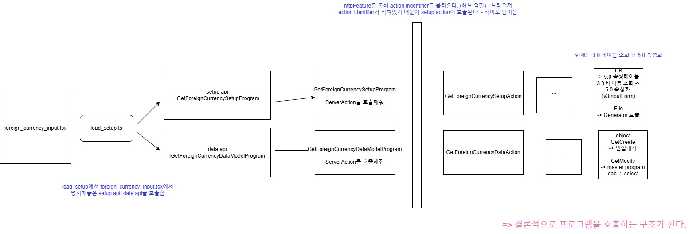

# Daily Retrospective

**작성자**: [이지은]  
**작성일시**: [2025-01-16]

## 1. 오늘 배운 내용 (필수)

### UserAction 흐름



### UserAction

UserAction은 `04.application(browser)`와 `03.usecase(browser)`의 경계에 대한 명세이다.

컴포넌트는 Native 이벤트를 기반으로 사전에 정의된 UserAction을 dispatch한다. 이때 컴포넌트는 해당 UserActionIdentifier에 정의된 payload 정보를 구성하여 전달한다.

컴포넌트에서 dispatch된 user_action은 해당 UserActionIdentifier로 등록된 action_handler를 찾아 실행한다.

**action handler는 반드시 identifier에 명시된 result형을 반환해야 한다.**

5.0에서는 페이지 단위 기능별로 useraction을 구현한다.

definition에 기능에 대한 정의를 하고, 개별 파일로 형성된 UserAction을 실행한다. 이 구조를 통해 재사용성이 확대되고, TDD 개발이 가능해진다.

저장 버튼 클릭, 특정 버튼 클릭 시 컴포넌트 내 UI 변경 등 UI Action으로 발생되는 모든 기능들이 UserAction으로 분리된다.

최종적으로 페이지 화면에는 특이 케이스를 제외하고는 소스가 추가되지 않는다.

#### UserAction Request

5.0에서는 페이지에서 Payload 정보를 동적으로 할당할 수 없다.
페이지의 소스를 최소화하여, 기능 단위(UserAction)로 프로그램을 구현한다. 페이지에서 데이터를 동적으로 전달하는 것이 아닌 UserAction 호출 시 제공하는 파라미터 정보들로부터 필요한 데이터를 가공한다.

Payload를 통한 정보 전달은 Setup 정보 또는 컴포넌트를 통해서만 제공한다.

-   setup은 구조 자체에서 데이터 모델 정보를 포함하고 있다. 속성과 데이터 정보를 둘 다 가지고 있어서 둘을 merge한다. 실제로 input에서 내려오는 정보는 둘이 합쳐진 완전체 정보를 쓴다. 이런 로직이 load_setup.ts에 포함되어 있다.

UserAction의 Request에는 해당 컴포넌트가 전달한 payload 정보 이외에 몇 가지 정보들이 추가 전달된다.

-   owner: 해당 action을 dispatch한 컴포넌트의 기본 정보
-   dm_manager: 해당 page에서 생성되어 있는 dmc 관리 정보<br>
    => server에서 smc를 쓰는 것과 충돌되는 개념 (미래에는 하나로 합쳐지지 않을까 생각하신다고 함)
-   vmc: UI를 변경하거나 UI의 상태 정보를 읽을 수 있는 모듈
-   payload: UserAction을 dispatch한 컴포넌트에서 전달한 정보, 각 UserAction마다 정의된다.
-   execution_context

    ```ts
    interface IOwnerInfo {
    	dmc_id?: string;
    	prop_id?: string;
    	data_model_index?: nuember;
    	sect_sid?: string;
    }

    export interface IBaseUserActionRequest<TPayload> {
    	execution_context: IExecutionContext;
    	vmc: Omit<IViewModelStateContainer, "usePageState">; //react hook 제공X
    	dm_manager: IDMManager;
    	owner: IOwnerInfo;
    	payload: TPayload;
    }
    ```

## 2. 동기에게 도움 받은 내용 (필수)

**성철님**: 어제 회고록 날짜를 작년으로 잘못 적었는데 수정해서 커밋해주셨다.
**주원님**, **민준님**, **연아님**, **성재님**, **도형님**: 실습 중 에러가 생겼을 때 같이 문제를 찾아주셨습니다.
**강민님**: vscode의 open editors 탭을 아래 탭으로 내리는 법을 알려주셨습니다.
**수경님**: UserAction에서의 동작을 같이 이야기하며 학습할 수 있었습니다.
**주현님**: resolve를 찾지 못하는 에러가 발생했을 때 문제될만한 상황에 대해 조언해주셨습니다.

---

## 3. 개발 기술적으로 성장한 점 (선택)

### 1. 오늘 직면했던 문제 (개발 환경, 구현)와 해결 방법

UserAction을 구현한 뒤 브라우저에서 버튼을 누를 때 `can't resolve ~` 팝업창이 뜨면서 IXXXXForeignCurrencyUserAction을 resolve할 수 없다는 에러가 발생했다. 이때 다른 동기분들이 테스트 모드인지, `index.ts`에 파일을 잘 추가했는지 확인해보라고 하셨는데 둘다 문제가 없었다.

그러던 중 민준님이 크롬 개발자 도구를 통해 소스 파일에 현재 찾지 못하고 있다고 뜨는 파일이 제대로 생성되었는지 확인해보라고 말해주셨다. 그래서 레이어4에 XXXXForeignCurrencyUserAction이 제대로 들어있는지 확인해본 결과, 현재 작동하지 않는 두 버튼에 대해서만 js 파일이 만들어지지 않은 상태였다.

그래서 전체 빌드를 해보고 각 파일을 다시 빌드하였더니 파일이 생기면서 문제를 해결할 수 있었다.

전체 빌드를 통해서 누락되는 파일들이 있는게 의문이긴 했지만 앞으로는 빌드된 결과를 제대로 확인해보는 습관을 가져야겠다.

### 2. 위 두 주제 중 미처 해결 못한 과제. 앞으로 공부해볼 내용.

현재 UserAction에서 완전삭제 버튼을 누르면 제대로 작동하지 않는다. foreign_currency_cd를 slip_data_model에서는 잘 보내고 있는데 `esql.toPreviewString()`을 통해 확인해본 결과 `foreign_currency_cd` 조건이 자꾸 `foreign_currency_cd = null`으로 넘어가고 있다. 내일 와서 해결해봐야겠다.

---
