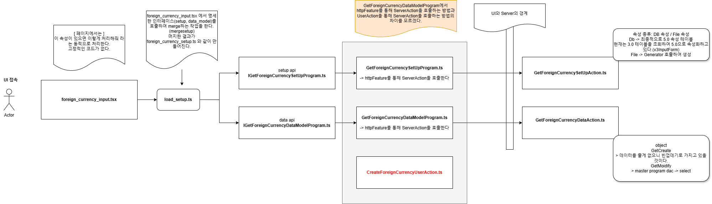
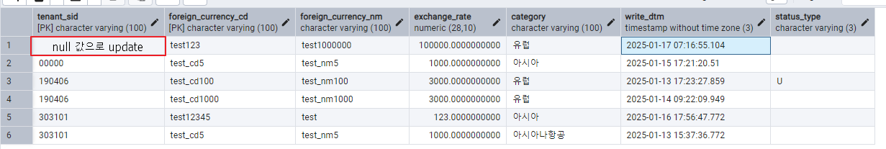

# Daily Retrospective

**작성자**: 허수경

**작성일시**: 2025-01-16(목)

## 1. 오늘 배운 내용 (필수)

- UI 페이지의 흐름
- TestUI 페이지의 구현
- UI 레이어에서의 `ExecuteSetupMainProgram`

### UI 페이지의 흐름

---



#### 1. `foreign_currency_input.tsx`

- 작업 파일을 zeus05에 배포해서 외화코드 메뉴를 클릭한 경우는 해당파일로 실행된다는 의미입니다.
- 해당 페이지는 속성을 가지고 있으면 속성에 따라 처리해줘라는 것을 동적으로 처리합니다.

#### 2. `load_setup.ts`

- `foreign_currency_input.tsx` 에서 명세한 인터페이스(setup, data_model)를 호출하여 merge하는 작업을 한다.(mergesetup)
- 머지한 결과가 `foreign_currency_setup.ts` 와 같이 만들어진다.

#### 3. `GetForeignCurrencySetUpProgram.ts` / `GetForeignCurrencyDataModelProgram.ts`

- httpFeature를 통해 ServerAction을 호출합니다.
- `GetForeignCurrencySetUpProgram`: 외화 페이지와 관련된 고정 속성 정보를 내려주는 역할을 합니다. 이 정보는 정적인 형태를 지니므로, 매번 파일에 접근하기보다는 캐싱하여 효율적으로 처리할 수 있습니다.

#### 4. `GetForeignCurrencySetUpAction.ts`

- 속성의 종류는 DB 속성과 File 속성이 있습니다.
  - DB 속성은 최종적으로 5.0 속성 테이블을 의미합니다. 현재는 3.0 테이블을 조회하여 5.0으로 속성화하고 있습니다.(v3InputForm을 통해)
  - File 속성은 Generator을 호출하여 생성합니다.

#### 5. `GetForeignCurrencyDataAction.ts`

- GetCreate는 가지고 있을 데이터가 없으니 빈껍데기의 형태로 가지고 있을 것입니다.
- GetModify 할 때는 Dac을 통해 select를 할 수 있습니다.

### TestUI 페이지의 구현

---

#### 1. foreign_currency_input_setup.ui.tsx

- 경로: D:\ECXSolution\ecount.nextv5\ecount.solution\src\04.ecount.application\VeloxApps\app.tutorials\src\browser\@test\@src.cases\foreign_currency\foreign_currency_input_setup.ui.tsx

- `onInitalizeSetup` 함수
  - 속성/데이터를 가져오는 action이 분리되어 있는데 이것에 대한 창고역할을 합니다.
    - setup: IGetForeignCurrencySetupProgram
    - data_model: IGetForeignCurrencyDataModelProgram
  - setup과 data_model이 합쳐져서 처리가 필요한 경우도 onInitalizeSetUp에서 처리합니다.
    - ex)결제에 전표를 첨부하는 경우 해당 전표에 대해 수정/삭제를 막아야함
  - setup을 통해 전체(양식정보)를 캐싱합니다. 그래서 화면에 필요한 버튼들을 다 가지고 있고 액션별로 화면에 내릴 수 있도록 필터링하는 로직을 담당합니다.

#### 2. `foreign_currency_setup.ts`

- 경로: `D:\ECXSolution\ecount.nextv5\ecount.solution\src\04.ecount.application\VeloxApps\app.tutorials\src\browser\@test\@src.cases\foreign_currency\foreign_currency_setup.ts`
- UI에서도 Validator 과정을 진행합니다. 예를 들어, 자릿수 검증이 필요한 경우 UI에서 먼저 검증을 수행한 뒤 서버로 데이터를 전송합니다. 이를 통해 사용자 입력을 사전에 확인하여 불필요한 서버 요청을 줄일 수 있습니다.

```ts
{
  prop_id: 'foreign_currency$exchange_rate',
  attr_id: renderer_attrs.value_format,
  attr_type: EN_ATTR_TYPE.Renderer,
  data: {
    basic_tf: false,
    option: {
      zero_dec_tf: true,
      dec_separator: 'P',
      thou_separator: 'C',
      zero_display_tf: true,
      decimal_part_size: 3,
    },
  },
},
```

- 해당 항목의 검증은 추후 `UserAction`의 `ExecuteSetupMainProgram`을 통해 이루어집니다.(Server layer와 다른 Browser layer의 ExecuteSetupMainProgram 존재)

#### 3. `{action_mode}{bizz}UserAction.ts`

- 경로: `D:\ECXSolution\ecount.nextv5\ecount.solution\src\04.ecount.application\VeloxApps\app.tutorials\src\browser\user_action\CreateForeignCurrencyUserAction.ts`
- **역할: request 받은 데이터를 서버로 전달합니다.**
- 전달하는 방법은 2가지가 있습니다.
  1. 서버 Action을 직접 호출합니다.
  - `getFeature`와 `IHttpRequestFeature`을 통해 서버 Action을 호출합니다.
  2. 속성을 판단해서 속성이 가지는 기능을 실행시켜주는 브라우저 프로그램(`ExecuteSetupMainProgram`)을 호출합니다.
  - 프로그램 내부에서 smc의 dmc를 통해 서버로 preExecute 진행, dmc마다 순회하면서 서버로 요청 전 유효성 검사(validator), api 호출합니다.
    - `vlaidator` 속성을 실행시켜줘
    - `action 명세` 속성을 실행시켜줘 (ex. createIneventoryaction)

### browser 레이어에서의 `ExecuteSetupMainProgram`

---

- `{action_mode}{bizz}UserAction.ts`

```ts
export class CreateForeignCurrencyUserAction {
    static executeAsync: ICreateForeignCurrencyUserAction = async (request) => {
        const { execution_context, dm_manager, vmc } = request;

        execution_context.action.action_mode = EN_ACTION_MODE.Create;
        execution_context.action.menu_type = EN_MENU_TYPE.Input;

        //// 1. 서버저장 로직과 같은 공통 프로그램 호출
        // todo..

        // 2. 서버 Action 직접 호출
               ....
}
```

- 1번 케이스에서, browser layer에서 TempExecuteSetupMainProgram을 생성해서, 호출합니다.
- 2번 케이스는 서버 Action을 직접 호출합니다.

1번과 2번 케이스에서 장/단점을 생각해 볼 수 있습니다.

#### 1) TempExecuteSetupMainProgram 사용

**장점**

- 서버 저장 로직과 같이 브라우저의 데이터를 서버로 넘기기전에 데이터를 검사하거나 서버 Action의 api를 찾는 로직을 하나의 파일에서 관리할 수 있습니다.
- 변경 사항이 발생했을 때 하나의 파일에서 수정하면 되므로 유지보수가 편리하고 확장성이 뛰어납니다.

**단점**

- 다양한 케이스를 고려해야하므로 개발난이도와 복잡도가 큽니다.

#### 2) 서버 Action 직접 호출

**장점**

- 구현이 직관적이고 단순하며, 디버깅이 쉽습니다.
- 해당 UserAction에 최적화된 로직을 수행시킬 수 있도록 할 수 있다

**단점**

- 코드 중복이 발생할 가능성이 높습니다.
- 일관성 있는 처리가 어려울 수 있습니다.
- 변경 사항 발생 시 여러 곳을 수정해야 할 수 있습니다.

#### 나의 이해

- 과제를 받았을 때 UserAction의 이해가 부족했었습니다. 그래서 단순히 UserAction에서 서버의 Action을 호출하는 역할로만 이해했습니다.
- 이후 브라우저의 ExecuteSetupMainProgram의 파일을 찾아보고 동기들의 생각을 읽어보고나서 UserAction의 역할을 이해할 수 있었습니다. 대부분의 동기들이 1번 구현방법이 이카운트가 지향하는 로직이라고 생각한 것 같습니다. 저 또한, 파일을 이해하니 1번 구현방법이 좀 복잡하더라도 현재 상황에서는 최선이라고 생각합니다.

#### ExecuteSetupMainProgram 의 대략적인 흐름

- request 데이터 속 `menu_sid`, `bizz_sid`을 통해 `menu_definition`과 `master_data_model_id`를 가져옵니다.
- getDmcArray을 통해 dmc를 담는 배열을 만듭니다.
- dmc를 통해 `validator`를 실행합니다.
- `menu_definition`에 정의된 `attr_type`이 `Api`인 `attribute`를 찾아서 `action_mode`에 맞는 구현체(서버 Action)를 `request` 요청합니다.

---

## 2. 동기에게 도움 받은 내용 (필수)

- 민준님께서 여러 에러를 함께 해결해 주셨습니다. 특히, 브라우저 상의 `ExecuteSetupMainProgram`에 대해 고민해야 하는 과제가 있었는데, 그동안 서버 레이어 용으로 접했기에 브라우저 레이어의 ExecuteSetupMainProgram 파일이 존재하는지조차 몰랐습니다. 민준님께서 해당 파일의 존재를 알려주시고, 어떻게 동작하는지 상세히 설명해 주셔서 큰 도움을 받았습니다.

- 지은님, 아연님과 에러를 공유하며 해결 방안을 함께 모색한 덕분에 문제를 더 빠르게 해결할 수 있었습니다. 함께 고민하고 논의하는 과정이 매우 유익했습니다.

- 강민님께서는 UI 테스트 페이지가 정상적으로 뜨지 않을 때 이를 고치기 위해 도와주셨습니다. 문제의 원인은 제가 Zeus 서버를 잘못 선택한 것이었는데, 강민님의 도움 덕분에 문제를 확인하고 해결할 수 있었습니다. (다음부터는 주의하겠습니다, 하하!)

- 다은님께서 점심시간에 커피를 사 주셨습니다. 덕분에 성철님, 주원님, 연아님, 지은님, 주현님과 함께 커피를 사러 가며 즐거운 산책을 즐길 수 있었습니다. 짧지만 활력을 얻는 시간이었습니다.

---

## 3. 개발 기술적으로 성장한 점 (선택)

### 2. 오늘 직면했던 문제 (개발 환경, 구현)와 해결 방법

#### `excludeColumns` 의 역할

**문제**

- Update를 구현하는 과정에서 `tenant_sid`에 빈 값이 들어가는 에러가 발생했습니다.
  

**원인**

- `UpdateForeignCurrencyDac`에서 `esql.toPreviewString()`로 쿼리를 확인한 결과, `tenant_sid`에 빈 값이 대입되는 것을 확인했습니다.
- `tenant_sid`는 `context`에 존재하며 사용자가 직접 수정할 수 없는 항목으로 data_model에는 빈 값으로 존재했습니다. 그러나 데이터 저장 과정에서 data_model의 `tenant_sid`가 DB로 전달되어 대입되었습니다. 결과적으로, `Update` 작업 시 `tenant_sid`가 의도치 않게 빈 값으로 덮어씌워졌습니다.

**해결방법**

- 이러한 문제를 방지하기 위해 `excludeColumns`를 활용해 Update 작업에서 제외해야 할 열을 명시적으로 설정했습니다.
- `excludeColumns`는 업데이트 작업 시 특정 열의 값을 변경하지 않고 유지하도록 설정할 수 있는 메커니즘입니다. 이를 통해 `tenant_sid`가 변경되지 않도록 방지할 수 있습니다.

```ts
protected generateESql(data: pg.foreign_currency_20250110_hsg_ecback): $Statement {
  const esql = $ESql
    .update<pg.foreign_currency_20250110_hsg_ecback>(pg.foreign_currency_20250110_hsg_ecback, data, (opt) => {
      opt.disAllowNullIf((c) => c.isPrimaryKey == false && c.isNullable == false);
      opt.alterCheckColumnRule(ENUM_CONDITION_LEVEL.HIGH, (t) => [t.tenant_sid]);
      opt.excludeColumns((t) => {
        return [t.tenant_sid];  // tenant_sid 업데이트 제외
      });
    })
    .where((ef, t) => ef._equal(t.tenant_sid, this.execution_context.session.tenant_sid))
    .where((ef, t) => ef._equal(t.foreign_currency_cd, data.foreign_currency_cd));

  return esql;
}
```

**`excludeColumns` 의 역할**

- `Update` 작업에서 변경이 필요 없는 열을 제외하도록 명시적으로 지정하는 역할을 합니다.
- 중요한 열(tenant_sid)이 의도치 않게 덮어씌워지는 것을 방지합니다.

### 3. 위 두 주제 중 미처 해결 못한 과제. 앞으로 공부해볼 내용.

#### SetUpProgram/DataModelProgram과 UserAction의 역할

- 금일 교육에서는 `GetForeignCurrencySetUpProgram`과 `GetForeignCurrencyDataModelProgram`이 `httpFreature`를 통해 serverAction 을 호출한다고 배웠습니다. 그러나 실습에서는 `CreateForeignCurrencyUserAction`을 통해 serverAction을 호출하고 있었습니다. 이로 인해 SetUpProgram과 DataModelProgram이 각각 어떤 역할을 수행하며, UserAction과의 차이는 무엇인지에 대한 명확한 이해가 필요하다고 느꼈습니다. 특히, 각 파일이 서버와의 통신에서 구체적으로 어떤 책임을 지고 있는지, 그리고 UserAction이 이 흐름에서 어떤 방식으로 동작하는지를 공부할 계획입니다.

---

## 4. 소프트 스킬면에서 성장한 점 (선택)

이번 주 동안 민준님께서 디버깅 과정과 코드 흐름에 대한 정보를 적극적으로 공유해 주셨습니다. 특히, 오늘은 오전 내내 본인 자리를 떠나 여러 팀원을 도와주며 문제 해결에 기여하셨습니다. 그 과정에서 저 또한 함께 디버깅하며 문제를 이해하고 해결책을 찾아가는 경험을 할 수 있었습니다.

특히, 민준님은 문제를 단순히 "고치는 것"이 아니라 그 근본 원인을 분석하고, 이를 공유하는 과정에서 상대방이 이해했는지 확인하고 해당 과정의 본인이 모르는 부분으로 공유하며 서로의 질문과 의견을 통해 더욱 깊이 있는 이해를 추구하셨습니다. 이를 보며 문제를 대하는 태도에 대한 새로운 관점을 얻을 수 있었습니다.

또한, 민준님의 회고록이나 평소 질문을 보면 적극적으로 탐구하고 답을 찾아가는 모습을 보여주십니다. 단순한 지식 전달에서 끝나지 않고, 이를 기반으로 새로운 시도를 해보는 모습은 저에게 큰 동기 부여가 되었습니다. 민준님이 다양한 문제 상황에서 어떻게 해결책을 찾아가는지, 그리고 그 과정을 체계적으로 정리하고 공유하는 방식을 보며 저도 궁금증을 갖고 깊이 탐구하며 성장해야겠다고 다짐했습니다.
