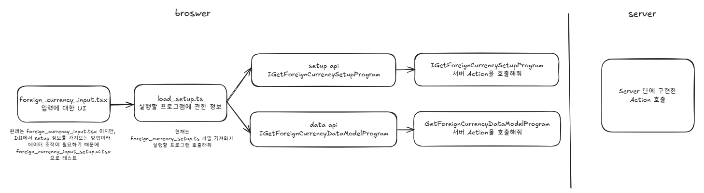
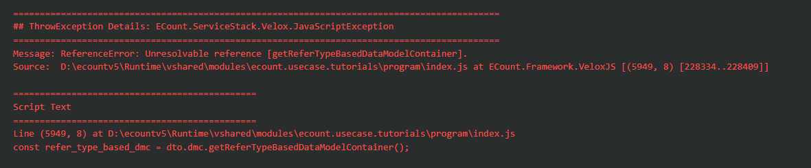

# Daily Retrospective  
**작성자**: [황주원]  
**작성일시**: [2025-01-16]  

## 1. 오늘 배운 내용 (필수)  
### 브라우저 - 서버 연결
현재까지 파악한 브라우저 - 서버 연결 흐름입니다. <br />
틀릴수도 있고 아직은 완전하지 않지만 브라우저에서 서버 action으로 진입하는 흐름은 다음과 같습니다. 

- foreign_currency_input.tsx
	- UI 입력화면
	- 원래는 해당 파일처럼 setup과 datamodel 프로그램을 구현해 사용
	- 실제 DB 설정을 가져와 UI에 뿌려주는 방식이기 때문에 데이터 조작과 프로그램 파일들을 만들어야 하기 때문에 복잡해 foreign_currency_input_setup.ui.tsx 활용
- load_setup.ts (설정 정보 가져오기)
	- 실행해야 할 프로그램을 찾는 부분
- setup과 datamodel 프로그램을 각각 호출해 정보에 맞는 Action을 호출



### UserAction 
XXXUserAction 부분은 브라우저의 진입점
- 현재는 서버단 Action 직접 호출 방식으로 구현
```typescript
const { result } = await execution_context
	.getFeature<system.IHttpRequestFeature>(system.IHttpRequestFeature)
	.sendAsync<ActionDataBase<IForeignCurrencyRequestDto>, ForeignCurrencyResultDto>(
		ICreateForeignCurrencyAction,
		{
			data: {
				bizz_sid: execution_context.action.bizz_sid,
				menu_type: execution_context.action.menu_type,
				action_mode: EN_ACTION_MODE.Create,
				data: {
					slip_data_model: {
						bizz_sid: execution_context.action.bizz_sid,
						menu_sid: execution_context.action.menu_sid,
						action_mode: EN_ACTION_MODE.Create,
						data_model: CreateForeignCurrencyUserAction._getDataModel(
							execution_context,
							dm_manager
						),
					} as ISlipDataModel,
				},
			},
		}
	);
vmc.sendMessage({ redraw: true });
```

CreateForeignCurrencyUserAction과 DeleteForeignCurrencyUserAction 연결하여 확인해 봤습니다.


#### 🤔 생각해 볼 것

**직접 Action 호출이 아닌 TempExecutionProgram 호출해서 Action 호출하는 방식**

처음에 Temp Program 이 브라우저 단을 말하는 것이 아닌 서버단의 Temp 프로그램을 부른다고 생각했습니다. 그래서 서버단의 Action 주입 유무를 고려하여 생각했습니다. 

그렇지 않고 브라우저에서의 Temp Program (공통 프로그램)을 호출하는 방식으로 한 번 생각해 봤습니다.

브라우저에서 서버로 진입하기 전 필터 역할을 할 수 있을거라 생각합니다. 헤더에 대한 정보나 CORS 등 확인 후 서버로 진입할 수 있어 보다 안전할 거라 생각합니다. 


## 2. 동기에게 도움 받은 내용 (필수)
- 성범 책임님께서 제가 가진 흐름에 대한 궁금증을 속시원하게 알려주셨습니다. 감사합니다 !
- 도형님, 승준님과 모르는 부분을 함께 얘기하며 이해할 수 있었습니다. 감사합니다.
- 성철님께서 회고록 git 연결 안 되는 오류가 있어 대신 올려주셨습니다. 감사합니다.

---

## 3. 개발 기술적으로 성장한 점 (선택)
### 1. 교육 과정 상 배운 내용이 아닌 개인적 호기심을 해결하기 위해 추가 공부한 내용
1. UserAction 디버깅 
	- 브라우저에서 디버깅하면서 입력한 값들을 확인해 봤습니다.
	- UserAction 부분에서 자동으로 세팅이 안 되는 값(bizz_sid, menu_sid) 를 설정했는데도 서버 Action에 들어오지 않아 서버 Action에서 값 설정을 해주었습니다.
	- 다른 동기들의 말을 들어보니 캐싱된 부분이 있어선지 빌드를 무한 반복하면 된다고 해서 내일 UserAction에서도 값 설정을 하면 서버 Action으로 설정한 값이 들어오는 지 확인해 볼 것 입니다.


### 2. 오늘 직면했던 문제 (개발 환경, 구현)와 해결 방법
1. resolver 진입하지 못하는 문제
	- 원인 : 파일 이름과 설정된 이름이 맞지 않아 발생한 문제였습니다.

2. refer type 가져오지 못하는 에러

	- 원인1 : delete 할 때 action mode가 delete 인줄 알았는데 설정에 remove 로 설정되어 있어 맞지 않았습니다.
	- 원인2 : index 파일에 delete 가 하나 빠져있었습니다. 


### 3. 위 두 주제 중 미처 해결 못한 과제. 앞으로 공부해볼 내용.
- create, remove 까지는 구현을 하였지만 update 2개 구현을 완료하지 않았습니다. 내일 오전엔 마무리 할 계획입니다.
- 남은 흐름도를 그리며 이해해 볼 예정입니다. 또한, 제가 작성한 흐름도가 맞는지 확인할 예정입니다.

## 4. 소프트 스킬면에서 성장한 점 
- 직접 브라우저와 서버에서 디버깅해 보면서 교육에서 받은 내용과 일치하는지 이해할 수 있었습니다. 52시간을 맞추느라 시간이 부족해 더 하지 않고 귀가하는 부분이 아쉬움이 남습니다. 그만큼 열정 .. 있는 거라 생각하며 이 마음가짐이 성장했다고 생각합니다.