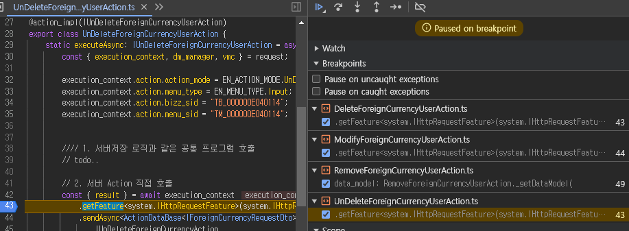
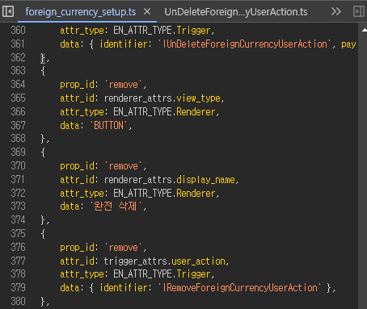
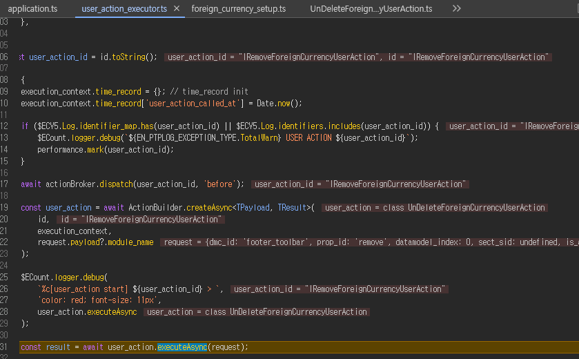
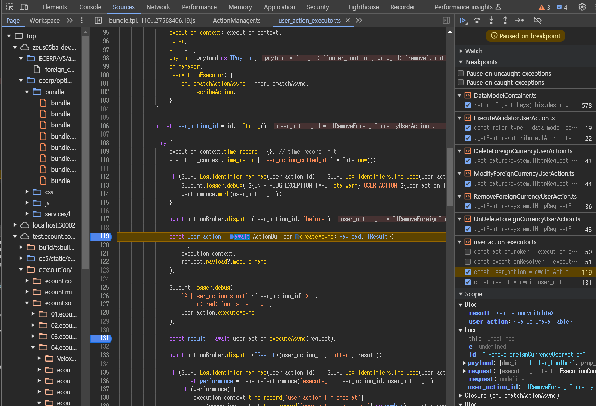
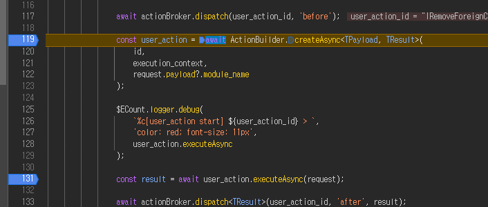
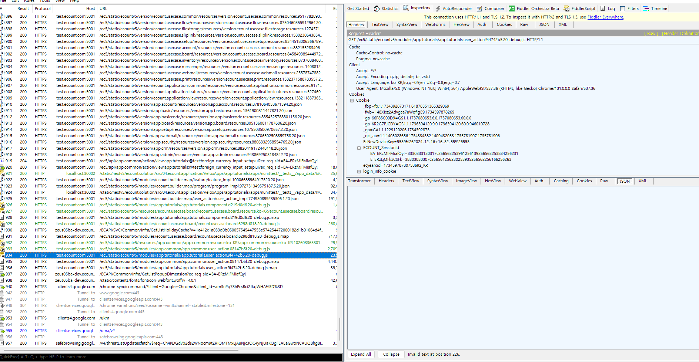
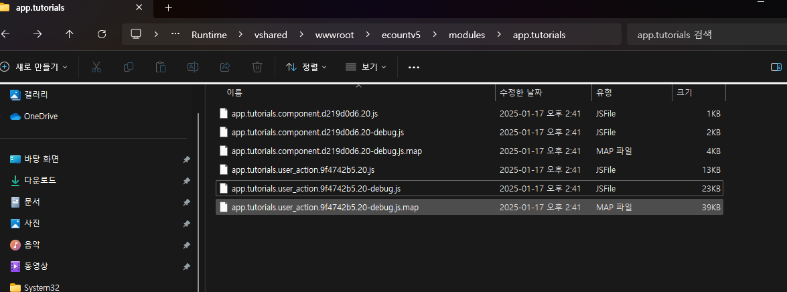
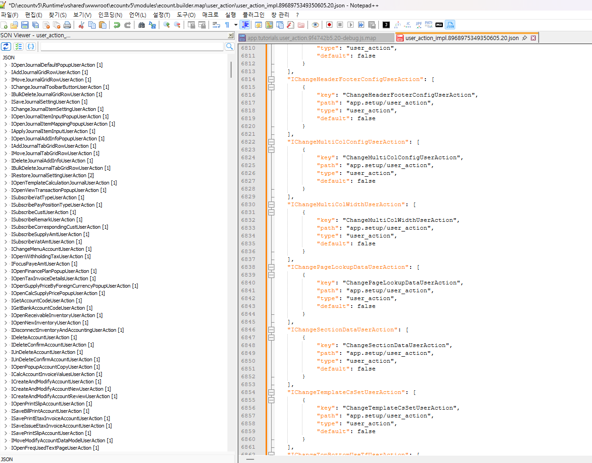

# 오늘 생긴 문제 
완전 삭제 버튼을 눌렀을 때 RemoveUserAction으로 이동하는 것이 아닌 UndeleteUserAction으로 이동하는 이유.

제가 원하는 부분은 RemoveUserAction으로 이동해야하는데 위 사진과 같이 UnDeleteForeignCurrencyUserAction으로 이동합니다.

그래서 서버레이어에서 호출이 잘못된 부분이 아니기 때문에 현재 저희가 작업한 setup 파일이 과연 빌드 이후에 제대로 값이 존재할까? 할 땐 매우 잘되어있었습니다. 

그러면 어디서 문제일까? 라고 생각을 했을 때 call stack을 통해서 어느 부분에서 값이 변경되었을까 확인했습니다.

Call stack 이전으로 돌아가봤을 때 여기서 자세히 보면 user_action_id는 'IRemoveForeignCurrencyUserAction'이고 user_action은 class UnDeleteForeignCurrencyUserAction으로 바뀌었습니다. 

 해당 key값이 변경되어 있는 user_action_executor을 이동해서 user_action.executeAsync 이전 호출을 디버깅을 찍으면서 user_action 부분에서 값이 달라졌기 때문에 해당 부분을 들어가게 되면 feature들을 찾게되고 해당 feature를 찾게 되면서 ActionManager로 이동하고, 그 과정에서 getPath 함수에서 map이라는 정보 안에 actionId를 기준으로 값을 리턴하고 있음을 알 수 있었습니다. 

 this.map의 형태를 확인했고 계속 더 들어가고 싶었지만 너무 데이터의 흐름이 많아서 피들러를 통해 내 생각엔 빌드를 통해 나온 산출물을 확인하고 map형태로 만들어져서 ActionIdentifier를 확인할텐데 그러면 API 중 해당 정보를 지니고 있는 json 파일을 찾아보자 생각하고 피들러를 확인했습니다.

 피들러를 통해 해당 디버깅 부분에서 호출되고 있던 json형태의 파일들을 확인해보면서 해당 map의 내용을 가진 파일들을 확인하고 해당 파일이 위치한 부분을 파일탐색기로 찾아 들어가 해당 파일에 key값을 원래대로 되있어야 하는 값으로 변경하여 수정했습니다. 

 