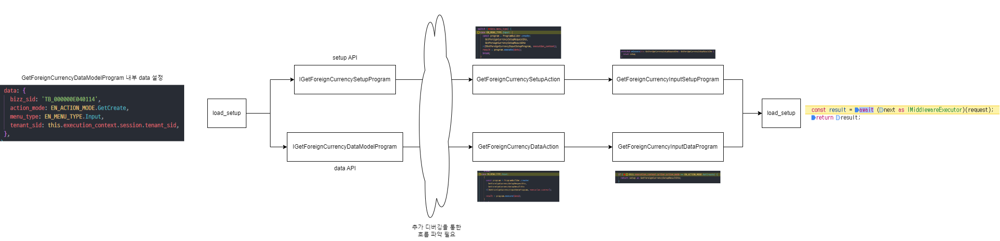

# Daily Retrospective

**작성자**: 고건호
**작성일시**: 2025-01-20

## 1. 오늘 배운 내용

- Foreign Currency
  - 신규 입력 화면 & 수정 조회 화면
    - Setup API
    - Data API
  - 흐름도

### Foreign Currency

저번 주에 Foreign Currency 관련 기본적인 CRUD는 모두 끝낸 상태였기에, 오늘부터는 신규 입력 화면 및 수정 조회 화면을 구현하는 작업을 시작했습니다.

#### 신규 입력 화면 & 수정 조회 화면

> 제가 구현한 코드까지 추가하게되면 코드만 너무 장황한 것 같아서 설명만 하도록 하겠습니다.

##### Setup API

`Setup API`는 다음의 파일들을 추가해야합니다.

- **browser layer**
  - `GetForeignCurrencySetupProgram`
- **server layer**
  - `GetForeignCurrencySetupAction`
  - `GetForeignCurrencyInputSetupProgram`

각각의 역할은 다음과 같습니다.

- `GetForeignCurrencySetupProgram`

browser layer의 `GetForeignCurrencySetupProgram`은 `httpFeature`의 `sendAsync()` 함수를 통해 server layer에서 사용할 `SetupAction`을 지정합니다.

그리고 이후 `data_model`과 함께 다양한 정보(`data_model_definitions`, `view_container` 등등)들을 반환합니다.

- `GetForeignCurrencySetupAction`

server layer의 `GetForeignCurrencySetupAction`은 현재 제가 작성한 코드 기준으로는 `data.menu_type`을 기준으로 `Input`, `Popup`, `Status` 등의 종류에 따라 각기 다른 `Program`을 실행합니다.

예를 들어, 이번에 추가적으로 구현한 `신규 조회`의 경우, `data.menu_type`이 `EN_MENU_TYPE.Input`으로 설정해줬기 때문에 아래와 같은 `switch-case` 구문에서 걸려 실행되게 됩니다.

```typescript
// GetForeignCurrencySetupAction.ts
...

switch (data.menu_type) {
			case EN_MENU_TYPE.Input: {
				const program = ProgramBuilder.create<
					GetForeignCurrencySetupRequestDto,
					GetForeignCurrencySetupResultDto
				>(IGetForeignCurrencyInputSetupProgram, execution_context);
				result = program.execute(data);
				break;
			}

...
```

- `GetForeignCurrencyInputSetupProgram`

server layer의 `GetForeignCurrencyInputSetupProgram`은 실제로 어떻게 브라우저의 화면을 구성해줄지를 결정해주는 코드가 작성되어 있습니다.

BE보다는 FE에 좀 더 익숙한 `head`, `footer`, `toolbar`와 같은 키워드들이 작성되어 있습니다.

##### Data API

`Data API`는 다음의 파일들을 추가해야합니다.

- **browser layer**
  - `GetForeignCurrencyDataModelProgram`
- **server layer**
  - `GetForeignCurrencyDataAction`
  - `GetForeignCurrencyInputDataProgram`
  - `GetForeignCurrencyMasterProgram`
  - `GetForeignCurrencyDac`

제가 정리해 본 각각의 파일들의 역할은 다음과 같습니다.

- `GetForeignCurrencyDataModelProgram`

browser layer의 `GetForeignCurrencyDataModelProgram`에서는 `Request`에 담긴 `bizz_sid`, `action_mode` 같은 요소들에 따라

- `GetForeignCurrencyDataAction`

server layer의 `GetForeignCurrencyDataAction`은 `execution_context.action.menu_type`에 따라 3.0이 적용된 데이터를 5.0으로 변환시켜주거나 데이터 검증을 해주는 등의 `Feature`를 `onConfigure()` 함수에서 적용시켜주고 `executeSync()` 함수에서는 `data.menu_type`에 따라 실행시킬 `Program`에 `RequestDto`와 `ResultDto`를 제네릭으로 넘겨주어 이후 로직 흐름을 이어나갑니다.

- `GetForeignCurrencyInputDataProgram`

server layer의 `GetForeignCurrencyInputDataProgram`에서는 `onExecute()` 함수에서 `this.execution_context.action.action_mode`의 값에 따라 `신규 조회`인지 `수정 조회`인지를 판단하여 각각에 알맞는 `Program`을 호출하는 역할을 합니다.

현재 제가 구현한 코드에서는 `onExecute()` 함수에서 만약 `신규 조회`일 경우 빈 객체를 그대로 반환해주고, `수정 조회`일 경우 `GetForeignCurrencyDac`을 사용하여 DB에 접근해 해당하는 데이터를 조회해오고, 이를 `setup.data_model[input_data_model_id]`에 담아서 반환해줍니다.

```typescript
// GetForeignCurrencyInputDataProgram.ts
...

if (this.execution_context.action.action_mode == EN_ACTION_MODE.GetModify) {
			///////////////////////
			// 수정 시 초기 데이터
			///////////////////////
			const program = ProgramBuilder.create<
				IGetForeignCurrencyMasterProgramDto,
				IGetForeignCurrencyMasterProgramResult
			>(IGetForeignCurrencyMasterProgram, this.execution_context);
			const { data_model } = program.execute({ foreign_currency_cd: dto.foreign_currency_cd } as any);

			const input_data_model_id = this.execution_context.bizz_mgr.getBizzDataModelId(
				this.execution_context,
				this.execution_context.action.bizz_sid,
				EN_INPUT_MENU_TYPE.Master
			);

			setup.data_model[input_data_model_id] = [data_model];
		}

		if (this.execution_context.action.action_mode == EN_ACTION_MODE.GetCreate) {
			return setup as GetForeignCurrencySetupResultDto;
		}
		return setup as GetForeignCurrencySetupResultDto;

...
```

추후 리팩토링이 필요해보이는 코드이나, 현재 구현에 우선 순위를 뒀기에 정상 동작에 초점을 맞췄습니다.

- `GetForeignCurrencyMasterProgram`

server layer의 `GetForeignCurrencyMasterProgram`에서는 `GetForeignCurrencyDac`과 `DacCommandBuilder.create()` 함수를 사용하여 ESQL을 생성해 DB에서 원하는 데이터를 뽑아오는 로직이 작성되어 있습니다.

- `GetForeignCurrencyDac`

server layer의 `GetForeignCurrencyDac`은 ESQL이 작성되어 있습니다.

현재 `수정 조회`시 해당 파일에서 ESQL을 작성하여 DB에 접근하는데, 작성된 코드는 다음과 같습니다.

```typescript
// GetForeignCurrencyDac

import { IExecutionContext } from "ecount.infra.bridge/base";
import { pg } from "ecount.infra.bridge/table_model";
import { ESqlDacCommand } from "ecount.infra.common/dac";

/**
 * GetForeignCurrencyDac
 * foreign_currency_20250110_kkh_ecback
 */
export class GetForeignCurrencyDac extends ESqlDacCommand<
  pg.foreign_currency_20250110_kkh_ecback,
  pg.foreign_currency_20250110_kkh_ecback
> {
  constructor(execution_context: IExecutionContext) {
    super(execution_context, DbConnectionId.PG.BASE);
  }
  protected generateESql(
    data: pg.foreign_currency_20250110_kkh_ecback
  ): $Statement {
    const esql = $ESql
      .from<pg.foreign_currency_20250110_kkh_ecback>(
        pg.foreign_currency_20250110_kkh_ecback,
        (opt) => {
          opt.alterCheckColumnRule(ENUM_CONDITION_LEVEL.HIGH, (t) => [
            t.tenant_sid,
          ]);
        }
      )
      .select((ef, t) => ef._all())
      .where((ef, t) =>
        ef._equal(t.tenant_sid, this.execution_context.session.tenant_sid)
      )
      .where((ef, t) =>
        ef._equal(t.foreign_currency_cd, data.foreign_currency_cd)
      );
    return esql;
  }
  protected onExecute(
    db: $Database,
    esql: $Statement
  ): pg.foreign_currency_20250110_kkh_ecback {
    let result = {} as pg.foreign_currency_20250110_kkh_ecback;

    result = db
      .expressionSql(GetForeignCurrencyDac, esql)
      .fetch<pg.foreign_currency_20250110_kkh_ecback>(
        pg.foreign_currency_20250110_kkh_ecback
      ).data;
    return result;
  }
}
```

`foreign_currency_cd`를 기준으로 DB에 해당 컬럼의 값이 동일한 데이터를 조회하여 가져온 뒤 `result`로 반환합니다.

#### 흐름도

오늘 구현을 완료하고 간략하게 정리해 본 흐름도입니다.

아직 추가 디버깅을 통해 확인하고 싶은 부분이 있어 완벽한 흐름도는 아닙니다.



내일 오전에 와서 나머지 정리를 끝내려 합니다.

---

## 2. 동기에게 도움 받은 내용

강민님, 현철님, 주현님께 구현에 관한 여러 질문들을 드렸는데 흔쾌히 대답해주셨습니다.

---

## 4. 소프트 스킬면에서 성장한 점

요즘 동기들의 출근 시간이 눈에 띄게 빨라지고 있습니다. 그에 더 탄력을 받아 근성있게 노력하고 싶습니다.
