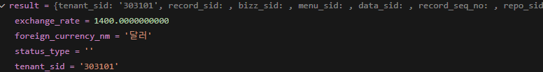
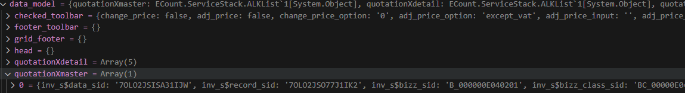

# Daily Retrospective

**작성자**: [김승준]  
**작성일시**: [2025-01-20]

## 1. 오늘 배운 내용 (필수)

### data api 구현

-   browser/DataModelProgram 구현
-   server/get dataAction 구현
-   server/inputDataModelProgram 구현
    -   원래는 GetExecuteSetupMainProgram을 호출하지만, 실습에서는 (직접 master프로그램을 호출.)
-   server/get masterProgram 구현
-   server/get Single Dac 구현

## 2. 동기에게 도움 받은 내용 (필수)

-   **주원님**께서 디버그하는 과정을 같이 지켜보며 도움을 주셨습니다.
-   **성재님**께서 execution_context가 어떠한 방식으로 browser에서 server로 넘어가는지 간단하게 알려주셨습니다.<br>
    심지어 추가 학습을 통해 자세히 알려주신다고 해주셨습니다.
-   오늘도 모든 동기분들이 자신이 겪은 문제점을 동기들과 공유하며 오류를 해결해주셨습니다. <br>상상도 못했던 여러 오류들과 해결방법을 보았고, 모든 부분을 원리까지 이해하진 못햇지만, 조금이나마 성장한 것 같습니다.

---

## 3. 개발 기술적으로 성장한 점 (선택)

아래의 3가지 주제 중 하나를 선택하여 작성합니다.

### 1. 교육 과정 상 배운 내용이 아닌 개인적 호기심을 해결하기 위해 추가 공부한 내용

### 2. 오늘 직면했던 문제 (개발 환경, 구현)와 해결 방법

dac에서 db를 통해 정보를 가져왔는데 해당 정보가 브라우저까지 도달하지 못하는 문제가 발생했습니다. <br>
executeMainProgram을 사용하지 않고 직접 masterProgram을 호출하는 과정에서 vmc, data_model등의 dto를 적용한 dto를 사용하지 않았고, table_model을 dto로 사용했기 때문에 생긴 문제였습니다. <br>
우선 masterProgram에서 어떤 데이터를 어떤 데이터 형식으로 가져오는지 확인했습니다.



그리고 기존 소스 코드에서는 어떤 데이터를 어떤 형식으로 가져오는지 확인했습니다. (inventory_single_dac)



```
data_model :{ $data_model_id(ex.foreignCurrencyXmaster) : $data}
```

형식으로 가져와야 한다는 것을 알았습니다.<br>
원래는 GetExecuteSetupMainProgram을 이용해 dto를 맞추면 되지만, 실습코드 상에서는 많은 데이터가 없기 때문에 해당 프로그램을 이용할 수 없는 상황이기 때문에 직접
이것을 그냥 `{data_model:{[$data_model_id : data ]}}`형식으로 하드코딩해도 괜찮은가? 에 대해 고민을 했습니다. <br>
마침 수경님께서 비슷한 문제에 대해 **조성준 팀장님** 께 질문하였고, 해당 내용을 공유해주었습니다. data_model의 형식을 맞추는 것에 대해 너무 고민하거나, 시간을 쓰지말라고 하셨습니다. 그리고 해당 부분에 대한 샘플소스를 공유해주셨습니다.
`GetForeignCurrencyMasterProgram.ts`

```ts
    ...
    const data_model = this._getDataModel(table_model);

		return { data_model };
	}
	private _getDataModel(table_model: pg.foreign_currency_20250110_ksj_ecback) {
		const data_model = Object.entries(table_model).reduce((acc, [key, value]) => {
			acc[`foreign_currency$${key}`] = value;
			return acc;
		}, {} as any);
		return data_model;
	}
```

결론부터 말하자면 제가 생각했던 하드코딩 방식과 비슷했고, '실무에서는 searchProgram을 이용하는 것이기 때문에 이러한 하드코딩이 필요없다'고 하셨습니다.<br>
다만 달라지는 부분이 일부 존재했습니다.

```ts
const table_model = {
    a: 1,
    b: 2,
    c: 3
};
//// reduce 실행 후

data model = {
    foreign_currency$a: 1,
    foreign_currency$b: 2,
    foreign_currency$c: 3
}
```

달라지는 부분은 기존 key 앞에 foreign_currency$를 붙인 키를 넣는 것입니다.

### 3. 위 두 주제 중 미처 해결 못한 과제. 앞으로 공부해볼 내용.

기존 key 앞에 foreign_currency$를 붙인 키를 넣는 이유에 대해 공부해보고 싶습니다.<br>
해당 키가 mapper부분에서 쓰인다고 짐작은 가지만 구체적인 디버깅과 소스코드를 통해 확인하고, 이유를 알고 싶습니다.

---

## 4. 소프트 스킬면에서 성장한 점 (선택)

오늘은 동기분들의 코드를 보며 에러를 확인하는 시간이 많았습니다.<br> 디버깅을 통해 에러의 원인을 찾고, 해결하는 과정을 통해 프로그램의 동작원리를 조금 더 이해하게 되었습니다.<br>
비록 모든 문제를 해결하진 못했지만, 다양한 에러를 마주칠 수 있었습니다. 단시간에 더 많은 경험치를 쌓는 하루 였다고 생각합니다.<br>
다만, 같은 오류가 나타났을 때, 도움이 될 것이지만, 막상 어떤내용들이 있었지? 라고 생각해보면 잘 떠오르지 않아 아쉽습니다.<br>자리에서 뿐만이 아니라 언제 어디서나 메모를 하거나, 돌아와서 바로 메모를 정리할 수 있어야 할 것 같습니다.

---
