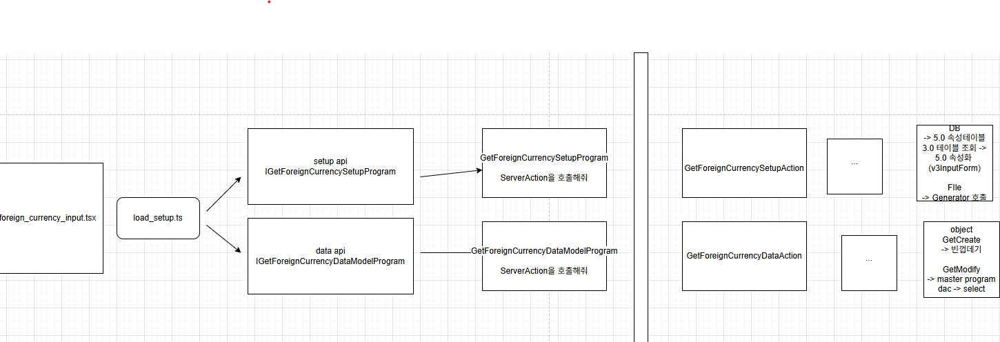
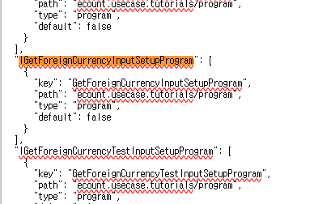

# Daily Retrospective  
**작성자**: [박성재]  
**작성일시**: [2025-01-20]  

## 1. 오늘 배운 내용 (필수)  
오늘 새롭게 배운 개념이나 내용을 간략히 정리합니다.  

**예시**:  
- [ 실습 ] : Setup Api 구현
- [ 실습 ] : Data Api 구현

<br/>

## [ 실습 ] : Setup Api 구현
```typescript
@page_impl({
	identifier: IForeignCurrencyInputPage,
	setup: setup,
	// data_model: IGetForeignCurrencyDataModelProgram,
})
export class ForeignCurrencyInputPage extends BasePage<
	IForeignCurrencyInputPageParam,
	IForeignCurrencyInputPageMessage
> {
    // ...
}
```
- 이전 시간에 위처럼 `setup` 정보를 정적으로 붙인 뒤, CRUD 작업을 UI와 연결하는 실습을 진행했었습니다.
- 이번에는 해당 `setup` 정보를 정적으로 붙이는 것이 아닌, `Program`을 통해 서버와 연동하여 가지고 와보겠습니다. (인터페이스와 인덱스를 입력하는 작업은 생략하겠습니다.)

<br/>

### foreign_currency_input_setup.ui.tsx

```typescript
@page_impl({
	identifier: IForeignCurrencyInputPage,
	setup: IGetForeignCurrencySetupProgram,
	// data_model: IGetForeignCurrencyDataModelProgram,
})
export class ForeignCurrencyInputPage extends BasePage<
	IForeignCurrencyInputPageParam,
	IForeignCurrencyInputPageMessage
> {
}
```
- 데코레이터로 넘겨줄 `setup` 정보를 `IGetForeignCurrencySetupProgram`을 전달하여 프로그램 수행의 결과값으로 UI에 전달되도록 합니다.
- 해당 정보는 추후 `load.setup.ts` 라는 파일로 전달되며, 추후 `Data api`를 통해 받아온 데이터 모델 정보와 합쳐져, UI를 그려주게 됩니다.

<br/>

### GetForeignCurrencySetupProgram.ts

```typescript
@program_impl(IGetForeignCurrencySetupProgram)
export class GetForeignCurrencySetupProgram
	extends BaseProgram<LoadSetupProgramRequestDto, ISetup>
	implements IGetForeignCurrencySetupProgram
{
	protected async onExecuteAsync(request: LoadSetupProgramRequestDto): Promise<ISetup> {
		const { param } = this.execution_context.routeConfig.pageRouteOptions;

		const httpFeature = this.execution_context.getFeature<system.IHttpRequestFeature>(system.IHttpRequestFeature);
		const { result } = await httpFeature.sendAsync<
			IGetForeginCurrencySetupActionRequest,
			IGetForeginCurrencySetupActionResult
		>(IGetForeignCurrencySetupAction, {
			data: {
				bizz_sid: this.execution_context.action.bizz_sid,
				menu_type: this.execution_context.action.menu_type,
			},
		});

		const setup_info = result.setup;

		if (param?.menu_attributes) {
			setup_info.menu.attributes.push(...param.menu_attributes);
		}

		return {
			menu: setup_info.menu,
			data_model: setup_info.data_model as IDataModelMapper | IArrayDataModelMapper,
			data_model_definitions: setup_info.data_model_definitions,
			view_container: setup_info.view_container,
			tenant: setup_info.tenant,
			user: setup_info.user,
			bizz: setup_info.bizz,
			function: [],
		};
	}
}
```
- 서버 API를 `httpFeature`를 사용해서 호출하고 있습니다. 서버에 존재하는 `Action`을 호출하여 로직을 수행하도록 합니다.
- `ISetup` 인터페이스를 통해 기본적인 `Setup`의 데이터 구조 형식을 맞춰 응답값을 반환해줍니다.

### GetForeignCurrencySetupAction.ts
```typescript
export default class GetForeignCurrencySetupAction
	extends ApiActionBase<IGetForeginCurrencySetupActionRequest, IGetForeginCurrencySetupActionResult>
	implements IGetForeignCurrencySetupAction
{
	executeSync(
		context: IExecutionContext,
		request: IGetForeginCurrencySetupActionRequest
	): IGetForeginCurrencySetupActionResult {
		const program = ProgramBuilder.create<IForeignCurrencySetupRequestDto, ISetup>(
			IGetForeignCurrencyInputSetupProgram,
			context
		);
		const result = program.execute({ bizz_sid: '' });

		return {
			setup: result,
		};
	}
}
```
- 서버의 흐름 중 최상단에 위치하는 `Action` 레벨의 모듈입니다.
- `Setup` 정보를 구하는 책임을 하위 프로그램인 `GetForeignCurrencyInputSetupProgram`에 위임하고 있습니다.
- 여기서 주의할 점은 `Action` 모듈을 `export`할 때는 반드시 `default`로 내보내주어야합니다. 왜냐하면 그래야 `Velox` 프레임워크에서 `Action`을 정상적으로 인식하여 브라우저나 외부에서 동작되도록 만들어줍니다.

### GetForeignCurrencyInputSetupProgram.ts

```typescript
import {
	IForeignCurrencySetupRequestDto,
	IGetForeignCurrencyInputSetupProgram,
} from 'ecount.usecase.tutorials/@abstraction';
import { ISetup } from 'ecount.infra.base/setup';
import { IExecutionContext } from 'ecount.infra.bridge/base';
import { BaseProgram } from 'ecount.infra.common/program';
import { setup } from './foreign_currency_setup_info';
import { program_impl } from 'ecount.infra.common/decorator';

@program_impl(IGetForeignCurrencyInputSetupProgram)
export class GetForeignCurrencyInputSetupProgram
	extends BaseProgram<IForeignCurrencySetupRequestDto, ISetup>
	implements IGetForeignCurrencyInputSetupProgram
{
	constructor(execution_context: IExecutionContext) {
		super(execution_context);
	}

	protected onExecute(dto: IForeignCurrencySetupRequestDto): ISetup {
		return setup;
	}
}
```
- 본래 요청정보를 활용해서 `generator`나 다양한 로직을 수행해서 `setup` 정보를 채워야합니다.
- 하지만, 전체적인 흐름을 익히는 것이 목적이므로, 금일 실습에서는 정적 파일을 불러와 이곳에서 채워넣는 것으로 대체하였습니다.

<br/>

## [ 실습 ] : Data Api 구현



다시 흐름을 상기시키며 이번에는 `Data Api`를 구현해보겠습니다.

<br/>

### foreign_currency_input_setup.ui.tsx

```typescript
@page_impl({
	identifier: IForeignCurrencyInputPage,
	setup: IGetForeignCurrencySetupProgram,
	data_model: IGetForeignCurrencyDataModelProgram,
})
export class ForeignCurrencyInputPage extends BasePage<
	IForeignCurrencyInputPageParam,
	IForeignCurrencyInputPageMessage
> {
    // ...
}
```
- 이번에는 `data_model`로 전달할 `GetForeignCurrencyDataModelProgram` 부터 구현해보겠습니다.

### GetForeignCurrencyDataModelProgram.ts
```typescript
@program_impl(IGetForeignCurrencyDataModelProgram)
export class GetForeignCurrencyDataModelProgram
	extends BaseProgram<IGetForeignCurrencyDataModelProgramRequest, IDataModelMapper>
	implements IGetForeignCurrencyDataModelProgram
{
	protected async onExecuteAsync(request: IGetForeignCurrencyDataModelProgramRequest): Promise<IDataModelMapper> {
		const httpFeature = this.execution_context.getFeature<system.IHttpRequestFeature>(system.IHttpRequestFeature);
		const { result } = await httpFeature.sendAsync<
			IGetForeignCurrencyDataModelProgramRequest,
			IGetForeignCurrencyDataModelProgramResult
		>(IGetForeignCurrencyDataAction, {
			data: {
				currency_cd: 'test_cd8',
				bizz_sid: 'TB_000000E040114',
				menu_type: EN_MENU_TYPE.Input,
				action_mode: EN_ACTION_MODE.GetModify,
			},
		});

		return {
			data_model: {
				foreign_currencyXmaster: [result as IGetForeignCurrencyDataModelProgramResult],
			},
		};
	}
}
```
- `setup`과 마찬가지로 UI의 종단점인 `Data Model Program`에서 서버의 시작점인 `Action`을 호출하고 있습니다.
-  실습 환경 상, 온전한 UI를 가지고 진행하는 것이 아니므로, 데이터 조회 시 필요한 정보들은 해당 위치에서 불가피하게 하드코딩하여 서버로 요청해주고 있습니다.

### GetForeignCurrencyDataAction.ts
```typescript
export default class GetForeignCurrencyDataAction
	extends ApiActionBase<IGetForeignCurrencyDataModelProgramRequest, IGetForeignCurrencyDataModelProgramResult>
	implements IGetForeignCurrencyDataAction
{
	executeSync(
		execution_context: IExecutionContext,
		data: IGetForeignCurrencyDataModelProgramRequest
	): IGetForeignCurrencyDataModelProgramResult {
		let result = {} as IGetForeignCurrencyDataModelProgramResult;

		const program = ProgramBuilder.create<
			IGetForeignCurrencyDataModelProgramRequest,
			IGetForeignCurrencyDataModelProgramResult
		>(IGetForeignCurrencyInputDataProgram, execution_context);

		result = program.execute(data);

		return result;
	}
}
```
- 서버의 시작점으로서, 데이터 모델을 조회해오는 처리를 하위의 `GetForeignCurrencyInputDataProgram`에 위임하고 있습니다.

### GetForeignCurrencyInputDataProgram.ts
```typescript
@program_impl(IGetForeignCurrencyInputDataProgram)
export class GetForeignCurrencyInputDataProgram
	extends BaseProgram<IGetForeignCurrencyDataModelProgramRequest, IGetForeignCurrencyDataModelProgramResult>
	implements IGetForeignCurrencyInputDataProgram
{
	constructor(execution_context: IExecutionContext) {
		super(execution_context);
	}

	protected onExecute(dto: IGetForeignCurrencyDataModelProgramRequest): IGetForeignCurrencyDataModelProgramResult {
		let result = {} as IGetForeignCurrencyDataModelProgramResult;

		if (this.execution_context.action.action_mode == EN_ACTION_MODE.GetModify) {
			const program = ProgramBuilder.create<
				IGetForeignCurrencyDataModelProgramRequest,
				IGetForeignCurrencyDataModelProgramResult
			>(IGetForeignCurrencyMasterProgram, this.execution_context);
			result = program.execute(dto);
		}
		return result;
	}
}
```
- 데이터를 핸들링하게되는 `Master Program`을 호출하여 데이터를 조회해옵니다.
- `수정조회`, `신규조회`를 `action_mode`를 통해 분기하여 처리하고 있습니다.

### GetForeignCurrencyMasterProgram.ts
```typescript
@program_impl(IGetForeignCurrencyMasterProgram)
export class GetForeignCurrencyMasterProgram
	extends BaseProgram<IGetForeignCurrencyDataModelProgramRequest, IGetForeignCurrencyDataModelProgramResult>
	implements IGetForeignCurrencyMasterProgram
{
	@_transaction(TransactionOption.Required)
	protected onExecute(dto: IGetForeignCurrencyDataModelProgramRequest): IGetForeignCurrencyDataModelProgramResult {
		const dac = DacCommandBuilder.create(GetForeignCurrencySingleDac, this.execution_context);
		const result = dac.execute(dto);

		return this._getDataModel(result);
	}

	private _getDataModel(table_model: pg.foreign_currency_20250110_psj_ecback): any {
		return Object.entries(table_model).reduce((acc, [key, value]) => {
			acc[`foreign_currency$${key}`] = value;
			return acc;
		}, {} as any);
	}
}
```
- DB에 액세스하는 `Dac`을 생성하여 데이터 조회를 요청하고 있습니다.
- 조회해온 데이터는 `UI`에 그려줄 때, `setup` 정보의 형식과 일치하도록 매핑하는 작업을 해주고 있습니다.
(해당 작업은 실무에서는 공통화되어 있는 것이 대부분이라고 합니다)

### GetForeignCurrencySingleDac.ts
```typescript
export class GetForeignCurrencySingleDac extends ESqlDacCommand<
	IGetForeignCurrencyDataModelProgramRequest,
	IGetForeignCurrencyDataModelProgramResult
> {
	constructor(execution_context: IExecutionContext) {
		super(execution_context, DbConnectionId.PG.BASE);
	}

	protected generateESql(data: IGetForeignCurrencyDataModelProgramRequest): $Statement {
		const esql = $ESql
			.from<pg.foreign_currency_20250110_psj_ecback>(pg.foreign_currency_20250110_psj_ecback, (opt) => {})
			.select((ef, t) => ef._all())
			.where((ef, t) => ef._equal(t.tenant_sid, this.execution_context.session.tenant_sid))
			.where((ef, t) => ef._equal(t.foreign_currency_cd, data.currency_cd));

		return esql;
	}

	protected onExecute(db: $Database, esql: $Statement): IGetForeignCurrencyDataModelProgramResult {
		return db.expressionSql(GetForeignCurrencySingleDac, esql).fetch()
			.data as IGetForeignCurrencyDataModelProgramResult;
	}
}
```
- 조회를 위한 쿼리를 `ESql`을 통해 수행하고 있습니다.
- 필요한 요청 데이터와 외부로 반환되기위한 데이터의 형식을 제네릭을 통해 지정해주었습니다.
- 단 하나의 데이터만 조회해오는 로직이므로 `fetch`를 사용했습니다.

<br/>

### 느낀점
드디어 조회까지 CRUD를 한번씩 다 구현해보았습니다. 이제 다건조회만 남았는데, 전체적인 흐름을 반복적으로 수행하게되면서, 프레임워크 구조에 조금씩 익숙해지고 있는 것 같습니다.

하지만, 아직 디테일하게 다양한 상황이 발생했을 때, 어떤 요소들을 어디에 배치해야하는지 등 경험이 상당히 부족한 것 같습니다.

매우 간단한 로직만을 돌려봤기에 아직 한참 부족하다고 느끼고 있으며, 계속 정진해야겠다는 생각이 들었습니다.

<br/>

## 2. 동기에게 도움 받은 내용 (필수)

#### 김승준 선임
오늘 이슈가 생겼을 때 여러가지로 함께 의견 공유를 하였는데, 소통을 통해 전반적으로 진행하는데 도움이 되었습니다.

#### 김민준 선임
`Action`의 경우 모듈을 `default`로 내보내주어야한다는 것을 공유하는 등 지식과 경험 등을 공유하며 공부의 효율을 높일 수 있어 좋았습니다.

---

## 3. 개발 기술적으로 성장한 점 (선택)

### 2-1. ProgramIdentifier 미인식 문제



`Setup Api`를 구현하던 도중 브라우저에서 `IGetForeignCurrencyInputSetupProgram`를 못찾는 오류가 발생했습니다.

`@program_impl`도 구현체에 명시하고, 빌드 확인도 수차례하였으며 인덱스 파일에도 잘 배치되어 있는 것을 확인했는데도 계속 찾지 못했습니다.

심지어 위 사진처럼 인터페이스와 그 구현체에 대한 정보가 잘 등록되있는지 `program_impl.json` 파일을 통해 확인까지 했는데도 파일을 찾지 못했다는 에러가 계속 발생하고 있었습니다.

도저히 원인을 모르겠어서 결국 직접 눈으로 확인해보기로 했습니다.

<br/>

### GetForeignCurrencySetupAction

```typescript
export default class GetForeignCurrencySetupAction
	extends ApiActionBase<IGetForeginCurrencySetupActionRequest, IGetForeginCurrencySetupActionResult>
	implements IGetForeignCurrencySetupAction
{
	executeSync(
		context: IExecutionContext,
		request: IGetForeginCurrencySetupActionRequest
	): IGetForeginCurrencySetupActionResult {
		const program = ProgramBuilder.create<IForeignCurrencySetupRequestDto, ISetup>(
			IGetForeignCurrencyInputSetupProgram,
			context
		);
		const result = program.execute({ bizz_sid: '' });

		return {
			setup: result,
		};
	}
}
```
- 위 코드에서 `program`을 찾아지지 않는 문제였습니다. 따라서 `ProgramBuilder`의 `create`를 타고 들어갔습니다.

### DefaultProgramBuilder.create
```typescript
create<TProgramDto, TResult>(
		id: ProgramIdentifier,
		execution_context: TContext,
		configure?: IProgramConfigure
	): IBaseProgram<TProgramDto, TResult, TContext> {
		const instanceTarget = this.getCtor(id, execution_context);
		const program = new instanceTarget(execution_context);

		// program 내부에 정의된 configure 먼저 실행후 builder configure 적용, 실행 위치는 execute
		if (configure) {
			program[CommandConfigureFunctionName] = configure;
		}

		return program as unknown as IBaseProgram<TProgramDto, TResult, TContext>;
	}
```
- 위 코드에서 `instanceTarget`을 했을 때 `undefined`로 결과가 반환되었습니다.
- 다시 `getCtor`을 타고들어갔습니다.

### DefaultProgramBuilder.getCtor
```typescript
    getCtor(id: ProgramIdentifier, execution_context: TContext): any {
		const mapper = execution_context.getFeature<command.ICommandManager>(command.ICommandManager);

		const instanceTarget = mapper.getContructor<any>(id as unknown as $$svc_type) as any;

		return instanceTarget;
	}
```
- `mapper`는 잘 찾아졌으며, `instanceTarget`이 다시 `undefined`가 나왔습니다.
- 여기서 `getContructor`를 타고들어가니 `ICommandManager`의 인터페이스가 나와 구현체로 추정되는 `CommandManager`를 타고 들어갔습니다.

### DefaultCommandManager.getContructor
```typescript
getContructor<TInput = any, TResult = any, TCommand extends ICommand<TInput, TResult> = ICommand<TInput, TResult>>(
		id: $$svc_type,
		impl_id?: string
	): ConstructorT<TCommand> {
		return this.getContructorT<TCommand>(id, impl_id);
	}
```
바로 이어서 `this.getContructorT`를 보았습니다.

### DefaultCommandManager.getContructorT
```typescript
getContructorT<TCommand extends ICommandBase>(id: $$svc_type, impl_id?: string): ConstructorT<TCommand> {
		const { ctor, key, path } = this._tryGetConstructorT<TCommand>(id, impl_id);
		if (!ctor) {
			Exception.throw(
				ExceptionBuilder.create<IModuleResolveException, IModuleResolveExceptionImpl>(IModuleResolveException, {
					module: path ?? '',
					key: key,
					message: `resolve command file path! - ${CommandIdentifier.string(id)}`,
					name: '',
				})
			);
		}
		return ctor;
	}
```
- `_tryGetConstructorT` 함수를 통해 `ctor` 을 찾고 없으면 에러를 반환하고 있습니다.
- 여기서 제가 봤던 에러인 `resolve command file path!` 메시지를 찾을 수 있었습니다.
- 다시 더 들어가보겠습니다.

### DefaultCommandManager._tryGetConstructorT
```typescript
private _tryGetConstructorT<TCommand extends ICommandBase>(
		id: $$svc_type,
		impl_id?: string
	): { ctor: ConstructorT<TCommand> | undefined; key: string | undefined; path: string | undefined } {
		const key = CommandIdentifier.string(id);
		let ctor = this._ctorMap[key] as ConstructorT<TCommand>;
		if (!impl_id || impl_id == '') {
			impl_id = '@';
		}
		let info;
		if (!ctor || impl_id != '@') {
			info = this.getMappingInfo(id, impl_id);

			let path = info?.path;

			if (!path) {
				if (this._managers) {
					for (const mgr of this._managers) {
						info = mgr.getMappingInfo(id, impl_id);
						path = info?.path;
						if (path) {
							break;
						}
					}
				}
			}
			if (!path || !info) {
				return { ctor: undefined, key: info?.key, path: info?.path };
			}
			if (info.id != '@') {
				ctor = require<any>(path, true)[info.key] as ConstructorT<TCommand>;
			} else {
				ctor = require(path) as ConstructorT<TCommand>;
			}
			if (!impl_id) {
				this._ctorMap[key] = ctor;
			}
		}
		return { ctor: ctor, key: info?.key, path: info?.path };
	}
```
- 여기서 주된 원인을 찾을 수 있었습니다. 
- `info` 정보에 프로그램 구현체의 경로와 정보가 잘 담겨있었습니다.
- 하지만 `Velox` 함수인 `require`에서 `ConstructorT`라는 생성자를 가져오는 듯한 모양새의 그것에서 `undefined`가 반환되고 있었습니다.
- 해당 정보를 통해 저는 구현체인 `GetForeignCurrencyInputSetupProgram`의 경로까지는 잘 찾았으나 그 클래스 혹은 생성자에 접근을 못하고 있는 것으로 원인을 파악했습니다.

#### [ 주요 원인 ]
```typescript
@program_impl(IGetForeignCurrencyInputSetupProgram)
export default class GetForeignCurrencyInputSetupProgram
	extends BaseProgram<IForeignCurrencySetupRequestDto, ISetup>
	implements IGetForeignCurrencyInputSetupProgram
{
	constructor(execution_context: IExecutionContext) {
		super(execution_context);
	}

	protected onExecute(dto: IForeignCurrencySetupRequestDto): ISetup {
		return setup;
	}
}
```
- 문제 없어보이는 `program` 코드 같아 보이지만 문제가 하나 있습니다.
- 바로 모듈을 `default`로 반환하고 있습니다.
- 다른 프로그램들을 보니 모두 `default`가 아닌 네이밍 방식으로 모듈을 내보내고 있었습니다.
- `Velox`의 `require` 함수가 프로그램 정보를 가져올 때, `default`가 아닌 네이밍 방식으로 내보낸 프로그램들만 가져올 수 있는 것으로 이해했습니다.

#### [ 해결 ]
```typescript
@program_impl(IGetForeignCurrencyInputSetupProgram)
export class GetForeignCurrencyInputSetupProgram
	extends BaseProgram<IForeignCurrencySetupRequestDto, ISetup>
	implements IGetForeignCurrencyInputSetupProgram
{
	constructor(execution_context: IExecutionContext) {
		super(execution_context);
	}

	protected onExecute(dto: IForeignCurrencySetupRequestDto): ISetup {
		return setup;
	}
}
```
- 예상대로 `default` 키워드를 지우고 빌드해주니 프로그램을 아주 잘 찾아주고 잘 동작되었습니다.

### 후기
프로그램 구현체를 모듈화해 내보내줄때는 반드시 `default`로 선언하자!

<br/>

### 2-2. UI -> 서버로 execution_context 공유가 안되는 문제
```typescript
@program_impl(IGetForeignCurrencyDataModelProgram)
export class GetForeignCurrencyDataModelProgram
	extends BaseProgram<IGetForeignCurrencyDataModelProgramRequest, IDataModelMapper>
	implements IGetForeignCurrencyDataModelProgram
{
	protected async onExecuteAsync(request: IGetForeignCurrencyDataModelProgramRequest): Promise<IDataModelMapper> {
		this.execution_context.action.action_mode = EN_ACTION_MODE.GetModify;

        // ...
        const httpFeature = this.execution_context.getFeature<system.IHttpRequestFeature>(system.IHttpRequestFeature);
		const { result } = await httpFeature.sendAsync<
			IGetForeignCurrencyDataModelProgramRequest,
			IGetForeignCurrencyDataModelProgramResult
		>(IGetForeignCurrencyDataAction, {
            // ...
        });

        // ...
        return //...
    }
}
```
- 위처럼 `UI`의 종단점인 `Data Model Program`에서 `execution_context`에 값을 하드코딩하여 넣어주고, 서버에서 이를 재사용하고자 했습니다.

### GetForeignCurrencyDataAction.ts
```typescript
export default class GetForeignCurrencyDataAction
	extends ApiActionBase<IGetForeignCurrencyDataModelProgramRequest, IGetForeignCurrencyDataModelProgramResult>
	implements IGetForeignCurrencyDataAction
{
	executeSync(
		execution_context: IExecutionContext,
		data: IGetForeignCurrencyDataModelProgramRequest
	): IGetForeignCurrencyDataModelProgramResult {
		let result = {} as IGetForeignCurrencyDataModelProgramResult;

		const program = ProgramBuilder.create<
			IGetForeignCurrencyDataModelProgramRequest,
			IGetForeignCurrencyDataModelProgramResult
		>(IGetForeignCurrencyInputDataProgram, execution_context);

		result = program.execute(data);

		return result;
	}
}

// execution_context.action.action_mode    =>   undefined
```
하지만 서버의 시작점인 `Action` 레벨부터 하위의 모든레벨까지 UI 시점에서 초기화해준 `execution_context`의 정보들이 공유가 되지 않는 문제가 있었습니다.

생각을 해보면 `execution_context`라는 정보는 하나의 메모리 공간에 존재하는 데이터 덩어리입니다.
그런데, UI 레벨에서는 브라우저에서 동작을 하여 브라우저의 메모리를 사용하고, 서버로 로직이 들어오는 순간 서버의 컴퓨터 (로컬에서 서버를 켰으니, 지금은 나의 컴퓨터)의 메모리를 사용하게 되는 것이었습니다.

  
> 즉, 어딘가에서 전달해주거나 하지 않으면 `execution_context`라는 정보는 공유가 되지 않는 것이 당연했습니다.
`UI`의 종단점을 다시 보겠습니다.

```typescript
@program_impl(IGetForeignCurrencyDataModelProgram)
export class GetForeignCurrencyDataModelProgram {
    protected async onExecuteAsync(request: IGetForeignCurrencyDataModelProgramRequest): Promise<IDataModelMapper> {
        // ... 
        const httpFeature = this.execution_context.getFeature<system.IHttpRequestFeature>(system.IHttpRequestFeature);
		const { result } = await httpFeature.sendAsync<
			IGetForeignCurrencyDataModelProgramRequest,
			IGetForeignCurrencyDataModelProgramResult
		>(IGetForeignCurrencyDataAction, {
            data: {
                currency_cd: 'test_cd8',
            }
        });
    }
}
```
- 저는 실습을 진행하는데 딱 필요한 정보만 사용하고 싶었고, 따라서 요청 데이터에 `currency_cd` 단 하나만을 서버에 전달해 사용하고 있었습니다.
- 그리고 서버에서도 해당 데이터는 잘 받아와지고 있었습니다.
- 그런데, 메모리가 분리된 서버의 시작점인 `Action`에 무언가를 전달할 방법은 여기서 사용하는 `Http` 통신 단 하나밖에 없었습니다.
- 전달하는 정보에는 `execute_conext`는 없었으며, 달랑 `currency_cd` 하나밖에 없었습니다.
- 그런데, `execute_conext`라는 것을 전달해주지 않는데도 `Action`에서 데이터들이 모두 비어있었지만 `execute_conext` 자체는 객체로서 존재하는 것을 확인했었습니다.
- 저는 이 정보를 기반으로 요청 데이터를 통해 `execution_context`에 필요한 내용을 채워주고 있을 것이라 예상했습니다.

<br/>

#### [ 해결 ]
```typescript
export interface IGetForeignCurrencyDataModelProgramRequest extends ActionDtoBase {
	currency_cd: string;
}

export interface ActionDtoBase extends ActionBase {
	readonly bizz_id?: string;
	bizz_sid: string;
	referer?: ActionReferer;
}

export interface ActionBase {
	bizz_id?: string;
	bizz_sid?: string;
	action_mode?: EN_ACTION_MODE;
	menu_sid?: string;
	menu_type?: EN_MENU_TYPE;
	menu_nm?: string;
	authority_type?: EN_AUTHORITY_TYPE;
	object_id?: string;
}

// GetForeignCurrencyDataModelProgram.onExecuteAsync
const httpFeature = this.execution_context.getFeature<system.IHttpRequestFeature>(system.IHttpRequestFeature);
		const { result } = await httpFeature.sendAsync<
			IGetForeignCurrencyDataModelProgramRequest,
			IGetForeignCurrencyDataModelProgramResult
		>(IGetForeignCurrencyDataAction, {
			data: {
				currency_cd: 'test_cd8',
				bizz_sid: 'TB_000000E040114',
				menu_type: EN_MENU_TYPE.Input,
				action_mode: EN_ACTION_MODE.GetModify,
			},
		});
```
- 먼저 `request`로 넘겨주던 제네릭 타입인 인터페이스를 타 로직을 참고하여 `ActionDtoBase`를 확장하도록 했습니다.
- 또한 data에 `action_mode`, `bizz_sid` 등 `execution_conext`에서 확인할 수 있는 요소들을 추가해보았습니다.

```typescript
export default class GetForeignCurrencyDataAction
	extends ApiActionBase<IGetForeignCurrencyDataModelProgramRequest, IGetForeignCurrencyDataModelProgramResult>
	implements IGetForeignCurrencyDataAction
{
	executeSync(
		execution_context: IExecutionContext,
		data: IGetForeignCurrencyDataModelProgramRequest
	): IGetForeignCurrencyDataModelProgramResult {
		let result = {} as IGetForeignCurrencyDataModelProgramResult;

		const program = ProgramBuilder.create<
			IGetForeignCurrencyDataModelProgramRequest,
			IGetForeignCurrencyDataModelProgramResult
		>(IGetForeignCurrencyInputDataProgram, execution_context);

		result = program.execute(data);

		return result;
	}

    // execution_context.action.action_mode  =>  'Get_Modify'
    // execution_context.action.bizz_sid  =>  'TB_000000E040114'
    // execution_context.action.menu_type  =>  'EN_MENU_TYPE.Input'
}
```
- 위처럼 서버로 넘어가서도 `execution_context`의 정보가 잘 담기는 것을 확인할 수 있습니다.
- 이를 통해 예상대로, UI -> 서버로 `execution_context` 정보를 공유하기 위해서는 `Request`의 정보를 통해 서버에서 해당 데이터를 기반으로 `execution_context` 객체를 채워넣어 하위 로직에서도 함께 사용되도록 하는 것을 알 수 있었습니다.

<br/>

### 추후 공부해야할 과제
- `Velox`의 `require` 함수 내부 동작 방식
- UI -> 서버로 요청이 넘어갈 때, `Request` 데이터를 기반으로 `Action`에서 어떻게 `Execute_context`정보를 다시 생성하여 컨텍스트를 공유하는지 확인해보기