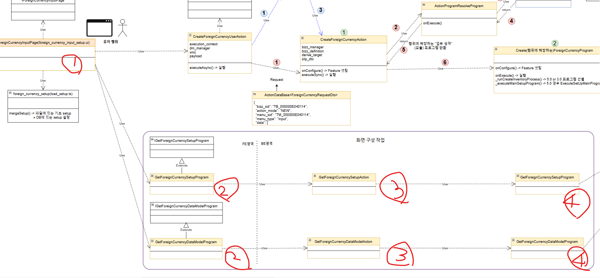
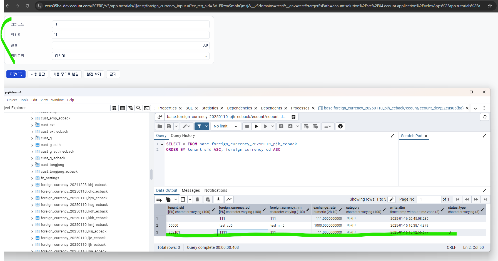

# Daily Retrospective

**작성자**: [박주현]  
**작성일시**: [2025-01-20
]

# 1. 오늘 배운 내용

## 1️⃣ UI 화면을 구성하기 위한 Setup API 와 Data API 를 구현하였습니다.



1 번
입력 UI 화면으로 이카운트는 Server driven UI 이기 때문에 항목 속성 정보들과 그 안의 값들을 호출해야합니다. 각각 Setup api 이고 Data api 입니다.

이때 호출하는 api 는 정확히는 browser 폴더내에 있는 프로그램(2번)입니다. 이 브라우저 프로그램은 서버의 action(3번) 을 호출합니다. 서버는 액션에 맞는 프로그램(4번)을 호출하고, 4번 프로그램은 원래대로라면 GetExecuteSetUpMain 프로그램을 호출하여 로직의 흐름을 다루게 됩니다.

하지만 진도 편의상 4번 프로그램에서 바로 저장에 관련된 프로그램을 호출하고 그 프로그램은 상단 MASTER 프로그램을 호출하여 DB 조회를 하게 됩니다.

신규 조회시, 값이 없기 때문에 Data api의 반환값은 빈 객체가 됩니다. 하지만 수정 조회시, 특정한 기록을 수정하는 것이기 때문에 기록에 대한 값들이 입력 돼 있어야합니다.

수정조회를 하게 되면 아래와 같은 화면이 나옵니다.



---

# 2. 동기에게 도움 받은 내용

민준님과 디버깅이 계속 안잡히는 에러와 씨름을 했습니다. 됐다 안됐다. 하는 게 조금 화가 났습니다. 성범 책임님께 빌드가 잘 안돼서 브라우저 코드가 제대로 반영안되는 점도 토로하였습니다. 그냥 계속 해보는 수 밖에 없다는 얘길 들었습니다. 현철님과 함께 고민해볼만한 문제를 상의해보았습니다. 그리고 데이터가 제대로 담기지 않는 점에 대해 여쭤봐 해결법을 들었습니다.

---

# 3. 개발 기술적으로 성장한 점

## 3-2. 오늘 직면했던 문제 (개발 환경, 구현)와 해결 방법

### (1) 캐시 이슈

set up 정보를 가져올 땐 모든 전부의 set up 정보를 가져오게 됩니다. 그래서 데이터 양이 방대하기 때문에 캐싱하는 것을 배웠습니다. 캐싱되어 있을 경우엔 캐싱되어 있는 정보를 가져와서 화면에 뿌려주게 됩니다.

캐싱 관련 로직은 프로그램 상단에 데코레이터로 명시되어 있습니다.

```ts
@action_response_cache(get_inventory_setup_action)
```

이 부분에 대해 타지 않게 주석처리를 해줬지만, dto 에서도 캐시 관련한 로직을 주석처리 하지 않아, 캐시 관련 에러가 생겼습니다.

캐시 관련 로직을 모두 주석처리하여 해결했습니다.

### (2) menu_type이 undefined 에러

```ts
let menu_type = request.menu_type;
// if (!menu_type) {
// 	menu_type = getMenuTypeByViewName(this.execution_context.routeConfig.pageRouteOptions.viewName as string);
// }
if (!menu_type) {
  menu_type = EN_MENU_TYPE.Input;
}
```

위 코드에서 원래는 주석처리된 부분이 기존 코드였습니다. 그리고 아래 if 문이 없었습니다. 하지만, getMenuTypeByViewName() 함수를 실행할 유틸 클래스가 없기 때문에 주석처리 할 수 밖에 없습니다.

저희는 ui 메뉴에서 "외화코드" 라는 배너를 클릭하고 들어오는 것이 아니기에 이것이 어떤 메뉴인지 알려줘야할 필요가 있습니다. 하지만 이 부분을 누락했기 때문에 menu_type이 undefined가 됐고, server 의 switch 문에서 조건절을 타지 않았습니다.

menu_type = EN_MENU_TYPE.Input 으로 하드코딩하여 문제를 해결했습니다.

---

# 4. 소프트 스킬면에서 성장한 점

오늘 기존 코드가 이상하게 짜여져 있어서 제 코드를 방해하는 문제로 몇시간 동안 시간을 낭비했는데, 이걸 해결하면서 저와 같은 에러를 겪는 사람을 도와 줄 수 있어서 좋았습니다.
