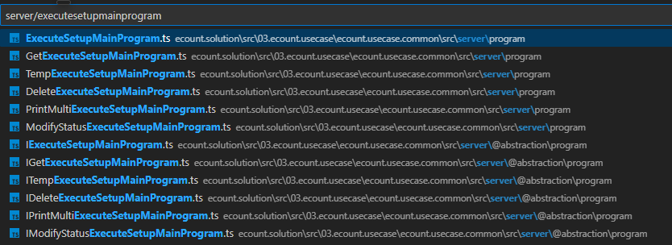
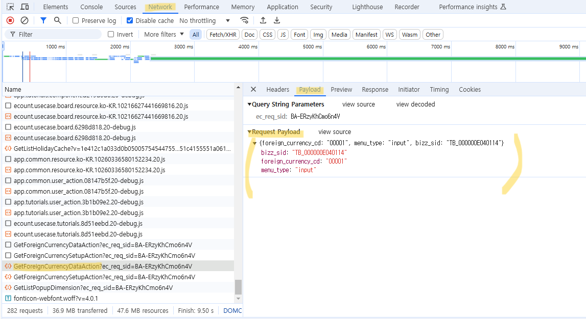
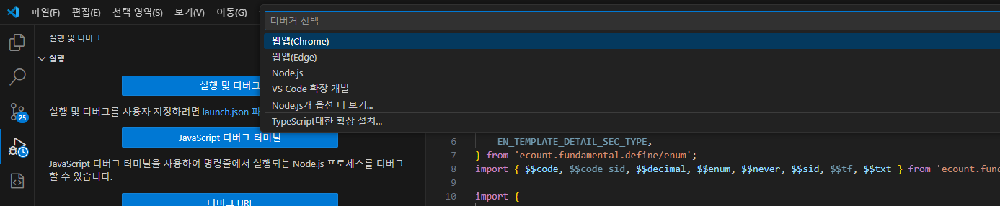
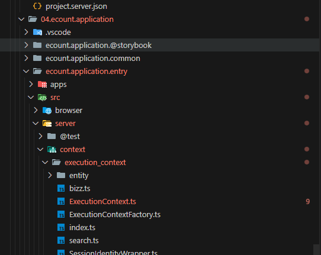

# Daily Retrospective

**작성자**: [설다은]  
**작성일시**: [2025-01-20]

## 1. 오늘 배운 내용 (필수)

오늘은 크게 진도는 나가지 않았습니다.<br>

### 1. ExecuteMainProgram파일이 왜 N개인지?<br>

<br>

- action_mode에 따라서 분리한 것이 아님.
- execute파일은 모든 로직을 추상화해서 만들고 있으나, 중간에 하드코딩된 부분에 따라서는 파일이 분리되어야함.
- 하드코딩된 부분은? --> 프로그램의 사용순서를 지정하는 부분

### 2. payload<br>

- 확인하는 경로 : 개발자도구 > 네트워크탭 > 파일클릭 > payload탭<br>
  <br>
- 속성이 그려질 때 알 수 있는 부분을 담을 수 있음
- 동적으로 변하는데이터(전표성 데이터)는 setup하는 시점에 알 수 없기 때문에 payload에 넣는것은 불가능함<br>

### 3. Data Api 구현<br>

**_[browser]_**<br>

1. IGetForeignCurrencyDataModelProgram<br>

   ```ts
   // 03.ecount.usecase\ecount.usecase.tutorials\src\browser\@abstraction\program\IGetForeignCurrencyDataModelProgram.ts
   import { ProgramIdentifier } from "ecount.infra.base/abstraction";
   import { ISetup } from "ecount.infra.base/setup";
   import { IBaseProgram } from "ecount.infra.bridge/base";
   import { LoadDataModelProgramRequestDto } from "ecount.usecase.common/@abstraction";

   export const IGetForeignCurrencyDataModelProgram = new ProgramIdentifier("IGetForeignCurrencyDataModelProgram");
   export interface IGetForeignCurrencyDataModelProgram extends IBaseProgram<LoadDataModelProgramRequestDto, Partial<ISetup>> {}
   ```

2. GetForeignCurrencyDataModelProgram<br>

   ```ts
   //03.ecount.usecase\ecount.usecase.tutorials\src\browser\program\GetForeignCurrencyDataModelProgram.ts
   import { EN_ACTION_MODE, EN_MENU_TYPE } from "ecount.fundamental.define/enum";
   import { ISetup } from "ecount.infra.base/setup";
   import { ITenantInfo, IUserInfo } from "ecount.infra.bridge/base";
   import { system } from "ecount.infra.bridge/feature";
   import { program_impl } from "ecount.infra.common/decorator";
   import { BaseProgram } from "ecount.infra.common/program";
   import { LoadDataModelProgramRequestDto } from "ecount.usecase.common/@abstraction";
   import {
     GetForeignCurrencySetupRequestDto,
     GetForeignCurrencySetupResultDto,
     IGetForeignCurrencyDataAction,
     IGetForeignCurrencyDataModelProgram,
   } from "ecount.usecase.tutorials/@abstraction";
   import { ExceptionBuilder } from "ecount.infra.common/exception";
   import { Exception, IException } from "ecount.fundamental.define/exception";

   @program_impl(IGetForeignCurrencyDataModelProgram)
   export class GetForeignCurrencyDataModelProgram
     extends BaseProgram<LoadDataModelProgramRequestDto, Partial<ISetup>>
     implements IGetForeignCurrencyDataModelProgram
   {
     protected async onExecuteAsync(request: LoadDataModelProgramRequestDto): Promise<Partial<ISetup>> {
       const { menu_nm, action_mode, data_sid, record_sid, hid, data_dt, data_no, copy_target_info } = this._init(request);

       const httpFeature = this.execution_context.getFeature<system.IHttpRequestFeature>(system.IHttpRequestFeature);
       const { result } = await httpFeature.sendAsync<GetForeignCurrencySetupRequestDto, GetForeignCurrencySetupResultDto>(
         IGetForeignCurrencyDataAction,
         {
           // 외화코드, 메뉴타입, 비즈SID를 강제로 주입함.
           data: {
             foreign_currency_cd: "00001",
             menu_type: EN_MENU_TYPE.Input,
             bizz_sid: "TB_000000E040114",
             action_mode,
             data_sid,
             record_sid,
             hid,
             data_dt,
             data_no,
             menu_nm,
             ...request.template_info,
             copy_target_info,
             from_bizz_info: request.pageRouteOptions?.param?.from_bizz_info,
             data_map: request.pageLoadOptions?.data_map,
             is_from_approval: request.pageLoadOptions?.is_from_approval,
             room_seq: request.pageLoadOptions?.room_seq,
           },
         }
       );

       if (!_.isEmpty(result.error)) {
         Exception.throw(ExceptionBuilder.create(result.error?.name as string, result?.error as IException));
       }

       if (result.tenant_info) {
         this.execution_context.tenant = result.tenant_info as ITenantInfo;
       }
       if (result.user_info) {
         this.execution_context.user = result.user_info as IUserInfo;
       }
       return {
         menu: result.menu,
         data_model: result.data_model,
         data_model_definitions: result.data_model_definitions,
         view_container: result.view_container,
         tenant: result.tenant,
         user: result.user,
         bizz: result.bizz,
         function: [],
       };
     }

     private _init(request: LoadDataModelProgramRequestDto) {
       const { menu_nm, action_mode, data_sid, record_sid, data_dt, data_no, copy_target_info, hid } =
         this.execution_context.routeConfig.pageRouteOptions?.param || {};

       return {
         action_mode: this.execution_context.action.action_mode,
         menu_nm,
         data_sid,
         record_sid,
         hid,
         data_dt,
         data_no,
         copy_target_info,
       };
     }
   }
   ```

**_[server]_**<br>

3. GetForeignCurrencyDataAction<br>

   ```ts
   // 04.ecount.application\VeloxApps\app.tutorials\src\server\action\GetForeignCurrencyDataAction.ts
   import { ApiActionBase } from "ecount.application.common/action";
   import { EN_AUTHORITY_TYPE, EN_MENU_TYPE } from "ecount.fundamental.define/enum";
   import { IConfigurationContext } from "ecount.infra.base/abstraction";
   import { IExecutionContext } from "ecount.infra.bridge/base";
   import { ProgramBuilder } from "ecount.infra.common/program";
   import { AuthorityDataDto } from "ecount.usecase.base/@abstraction";
   import { ICreateHistoryFeature, IDataValidationFeature, IValueResolverConfigureFeature } from "ecount.usecase.common/@abstraction";
   import { createConsoleHistoryFeature, SlipDataValidationFeature } from "ecount.usecase.common/@implement";
   import {
     GetForeignCurrencySetupRequestDto,
     GetForeignCurrencySetupResultDto,
     IGetForeignCurrencyDataAction,
     IGetForeignCurrencyInputDataProgram,
   } from "ecount.usecase.tutorials/@abstraction";

   import {
     IGetV3FormTypeMapperProgram,
     ITemplateCodeDetailFormFeature,
     ITemplateUtilFeature,
     IV3DataModelFeature,
     IV3FormAttributeFeature,
     IV3TemplateUtilFactory,
     V3FormTypeMapperRequestDto,
   } from "ecount.usecase.setup/@abstraction";
   import {
     InputFormAttrV3ToV5ConvertFeature,
     OutputFormAttrV3ToV5ConvertFeature,
     TemplateCodeDetailFormFeature,
     V3DataModelFeature,
   } from "ecount.usecase.setup/@implement";
   import { ISetup } from "ecount.infra.base/setup";

   @_authorize({ authority_type: EN_AUTHORITY_TYPE.Access } as AuthorityDataDto)
   export default class GetForeignCurrencyDataAction
     extends ApiActionBase<GetForeignCurrencySetupRequestDto, GetForeignCurrencySetupResultDto>
     implements IGetForeignCurrencyDataAction
   {
     protected onConfigure(configuration_context: IConfigurationContext): void {
       const execution_context = configuration_context as unknown as IExecutionContext;

       configuration_context.setFeature(ICreateHistoryFeature, new createConsoleHistoryFeature());

       configuration_context.setFeature<ITemplateUtilFeature>(
         ITemplateUtilFeature,
         execution_context.getFeature<IV3TemplateUtilFactory>(IV3TemplateUtilFactory).createInstance(execution_context)
       );

       switch (execution_context.action.menu_type) {
         case EN_MENU_TYPE.Input:
           configuration_context.setFeature<IV3FormAttributeFeature>(
             IV3FormAttributeFeature,
             new InputFormAttrV3ToV5ConvertFeature(execution_context)
           );
           configuration_context.setFeature<IV3DataModelFeature>(IV3DataModelFeature, new V3DataModelFeature(execution_context));
           break;
         default: {
           configuration_context.setFeature<IV3FormAttributeFeature>(
             IV3FormAttributeFeature,
             new OutputFormAttrV3ToV5ConvertFeature(execution_context)
           );
           break;
         }
       }
     }

     executeSync(execution_context: IExecutionContext, data: GetForeignCurrencySetupRequestDto): GetForeignCurrencySetupResultDto {
       let result = {} as GetForeignCurrencySetupResultDto;

       if (_.vIsEmpty(data.form_type)) {
         const form_type_program = ProgramBuilder.create<V3FormTypeMapperRequestDto, string>(IGetV3FormTypeMapperProgram, execution_context);

         data.form_type = form_type_program.execute({
           bizz_sid: _.vSafe(execution_context.action.bizz_sid, data.bizz_sid),
           menu_type: _.vSafe(execution_context.action.menu_type, data.menu_type),
           template_sub_type: _.vSafe(data.template_sub_type),
         });
       }

       execution_context.getFeature<ICreateHistoryFeature>(ICreateHistoryFeature).excute();

       switch (data.menu_type) {
         case EN_MENU_TYPE.Input:
           {
             const program = ProgramBuilder.create<GetForeignCurrencySetupRequestDto, ISetup>(IGetForeignCurrencyInputDataProgram, execution_context);
             result = program.execute(data);
           }
           break;
       }
       return result;
     }
   }
   ```

4. GetForeignCurrencyInputDataProgram<br>

   ```ts
   // 03.ecount.usecase\ecount.usecase.tutorials\src\server\program\GetForeignCurrencyInputDataProgram.ts
   import { foreign_currency } from "@shared_usecase_tutorials/@abstraction";
   import { EN_ACTION_MODE, EN_INPUT_MENU_TYPE } from "ecount.fundamental.define/enum";
   import {
     IBizz,
     IDataModelDefinitionMapper,
     IDataModelMapper,
     IFunction,
     IMenu,
     ISetup,
     ITenant,
     IUser,
     IViewContainer,
   } from "ecount.infra.base/setup";
   import { pg } from "ecount.infra.bridge/table_model";
   import { program_impl } from "ecount.infra.common/decorator";
   import { BaseProgram, ProgramBuilder } from "ecount.infra.common/program";
   import { IGetForeignCurrencyInputDataProgram, IGetForeignCurrencyMasterProgram } from "ecount.usecase.tutorials/@abstraction";

   @program_impl(IGetForeignCurrencyInputDataProgram)
   export class GetForeignCurrencyInputDataProgram
     extends BaseProgram<foreign_currency.foreign_currency_input, pg.foreign_currency_20250110_sde_ecback>
     implements IGetForeignCurrencyInputDataProgram
   {
     protected onExecute(dto: foreign_currency.foreign_currency_input) {
       const setup = this._getSetupBase();
       // 아직 리스트가 없어서 GetCreate/GetModify를 알 수 없음. 일단은 하드코딩...
       this.execution_context.action.action_mode = EN_ACTION_MODE.GetModify;
       if (this.execution_context.action.action_mode == EN_ACTION_MODE.GetModify) {
         ////////////////////////
         // 수정 시 초기 데이터 //
         ///////////////////////
         const program = ProgramBuilder.create<foreign_currency.foreign_currency_input, pg.foreign_currency_20250110_sde_ecback>(
           IGetForeignCurrencyMasterProgram,
           this.execution_context
         );
         const { data_model } = program.execute(dto);

         const input_data_model_id = this.execution_context.bizz_mgr.getBizzDataModelId(
           this.execution_context,
           this.execution_context.action.bizz_sid,
           EN_INPUT_MENU_TYPE.Master
         );

         setup.data_model[input_data_model_id] = [data_model];
       }
       return setup as pg.foreign_currency_20250110_sde_ecback;
     }

     private _getSetupBase(): ISetup {
       return {
         tenant: {} as ITenant,
         user: {} as IUser,
         bizz: {} as IBizz,
         menu: { attributes: [] } as IMenu,
         function: [] as IFunction[],
         view_container: [] as IViewContainer[],
         data_model: {} as IDataModelMapper,
         data_model_definitions: {} as IDataModelDefinitionMapper,
       };
     }
   }
   ```

5. GetForeignCurrencyMasterProgram<br>

   ```ts
   // 03.ecount.usecase\ecount.usecase.tutorials\src\server\program\data_model\GetForeignCurrencyMasterProgram.ts
   import { foreign_currency } from "@shared_usecase_tutorials/@abstraction";
   import { pg } from "ecount.infra.bridge/table_model";
   import { DacCommandBuilder } from "ecount.infra.common/dac";
   import { program_impl } from "ecount.infra.common/decorator";
   import { BaseProgram } from "ecount.infra.common/program";
   import { IGetForeignCurrencyMasterProgram } from "ecount.usecase.tutorials/@abstraction";
   import { GetForeignCurrencyDac } from "ecount.usecase.tutorials/dac";

   @program_impl(IGetForeignCurrencyMasterProgram)
   export class GetForeignCurrencyMasterProgram
     extends BaseProgram<foreign_currency.foreign_currency_input, pg.foreign_currency_20250110_sde_ecback>
     implements IGetForeignCurrencyMasterProgram
   {
     protected onExecute(dto: foreign_currency.foreign_currency_input): pg.foreign_currency_20250110_sde_ecback {
       const table_model = DacCommandBuilder.create(GetForeignCurrencyDac, this.execution_context, DbConnectionId.PG.BASE).execute(dto);

       const data_model = this._getDataModel(table_model);

       return { data_model };
     }

     private _getDataModel(table_model: pg.foreign_currency_20250110_sde_ecback): any {
       // 일반적으로는 조회시 서치프로그램을 타게 되어있다. 따라서 아래와같은 번거로운 변환 로직이 필요없다.
       const data_model = Object.entries(table_model).reduce((acc, [key, value]) => {
         acc[`foreign_currency$${key}`] = value;
         return acc;
       }, {} as any);
       return data_model;
     }
   }
   ```

6. GetForeignCurrencyDac : DB에서 조건에 맞는 값을 조회하는 Esql 실행하는 파일<br>

```ts
// 03.ecount.usecase\ecount.usecase.tutorials\src\server\dac\GetForeignCurrencyDac.ts
import { foreign_currency } from "@shared_usecase_tutorials/@abstraction";
import { EN_STATUS_TYPE } from "ecount.fundamental.define/enum";
import { IExecutionContext } from "ecount.infra.bridge/base";
import { pg } from "ecount.infra.bridge/table_model";
import { ESqlDacCommand } from "ecount.infra.common/dac";
import { inventory_single } from "ecount.usecase.inventory/@abstraction";

/**
 * GetForeignCurrencyDac
 * foreign_currency_20250110_SDE_ecback 조회
 */
export class GetForeignCurrencyDac extends ESqlDacCommand<foreign_currency.foreign_currency_input, pg.foreign_currency_20250110_sde_ecback> {
  constructor(execution_context: IExecutionContext) {
    super(execution_context, DbConnectionId.PG.BASE);
  }
  protected generateESql(data: foreign_currency.foreign_currency_input): $Statement {
    const esql = $ESql
      .from<pg.foreign_currency_20250110_sde_ecback>(pg.foreign_currency_20250110_sde_ecback, (opt) => {
        opt.alterCheckColumnRule(ENUM_CONDITION_LEVEL.HIGH, (t) => [t.tenant_sid]);
      })
      .select((ef, t) => ef._all())
      .where((ef, t) => ef._equal(t.tenant_sid, this.execution_context.session.tenant_sid))
      .where((ef, t) => ef._equal(t.foreign_currency_cd, data.foreign_currency_cd));

    return esql;
  }
  protected onExecute(db: $Database, esql: $Statement): pg.foreign_currency_20250110_sde_ecback {
    let result = {} as pg.foreign_currency_20250110_sde_ecback;

    result = db
      .expressionSql(GetForeignCurrencyDac, esql)
      .fetch<pg.foreign_currency_20250110_sde_ecback>(pg.foreign_currency_20250110_sde_ecback).data;
    return result;
  }
}
```

## 2. 동기에게 도움 받은 내용 (필수)

**강민님, 지은님, 민준님, 수경님, 주현님**<br>
오늘 하루종일 억까를 당하는 일이 많았는데 다들 오류에 대해서 물어보면 자세하게 알려주셨습니다.<br>
기존에 있던 파일명이 잘못된 것 같아서 수정해서 했던것이 제일 큰 원인이었습니다.<br>
주현님께서 기존에 있었던 파일은 절대 건들지 말라고 하셔서 다시 복구하고 진행했더니 정상이었습니다.<br>
빌드를 했을 때, vscode를 껐다 켰을 때 분명히 계속 에러가 나는데 동기들이 봐주러오면 신기하게 오류가 나지 않는 경험을 했습니다...<br>
<br>

**성철님**<br>
점심시간에 생크림 카스테라를 가져와주셔서 맛있게 나눠먹었습니다.<br>
저녁에는 저번 저녁때 먹다남은 베라를 9층에서 3층까지 가지고 와줘서 감사했습니다. 역시 동기들이랑 먹을 때 제일 맛있습니다!<br>

## 3. 개발 기술적으로 성장한 점 (선택)

### 1. 교육 과정 상 배운 내용이 아닌 개인적 호기심을 해결하기 위해 추가 공부한 내용

### 2. 오늘 직면했던 문제 (개발 환경, 구현)와 해결 방법

<br>
`문제상황`<br>
vscode를 새창으로 열어서 ecount.nextv5 폴더를 오픈했는데, 디버깅을 하려니까 갑자기 저런 화면이 나타났습니다.<br>
`해결방법`<br>
알고보니 ecount.nextv5폴더를 오픈해야하는데 그것보다 한단계 상위폴더인 ecxsolution을 오픈해서 그런 것이었습니다. 다시 제대로 폴더를 오픈하니 기존에 보이던 디버깅 실행 아이콘으로 바뀌었습니다.<br><br>
<br>
`문제상황`<br>
어느작업으로 인해 발생한건지 모르겠는데 갑자기 수정하지 않은 파일에 에러가 발생했습니다.이로인해 전체빌드를 못하니까 계속 마이크로모듈단에서 빌드를 진행하는 상황이 왔는데, 때로는 전체빌드를 해야지만 해결되는 문제가 있기 때문에 추후에 문제가 되지 않기위해 해결해야한다고 생각했습니다.<br>
`해결방법`<br>
기존에 있던 파일의 명이 잘못된 줄 알고 고쳤는데, 그것의 영향을 받은 것으로 보입니다. 해당 파일을 복구하니까 기존에 오류가 나던 파일이 정상적으로 돌아왔습니다 + 계속해서 vscode를 껐다 켰다 진행했습니다.<br> 때로는 환경문제가 발생하는 것 같기도한데...이것은 소스코드가 잘못된 것도 아니라서 찾아내는데 시간을 많이 잡아먹습니다...ㅜㅜ<br>

### 3. 위 두 주제 중 미처 해결 못한 과제. 앞으로 공부해볼 내용.

Seyup Api와 Data Api가 어떤 흐름으로 동작하는지는 이해했습니다.<br>
다만, 각각의 파일들이 왜 이렇게 동작하는건지에 대해서는 아직도 잘 모른다는 느낌을 받았습니다.<br>
소스를 많이보고 디버깅을 통해 들어오는 값 + 호출되는 파일을 잘 정리해봐야할 것 같습니다.<br>
