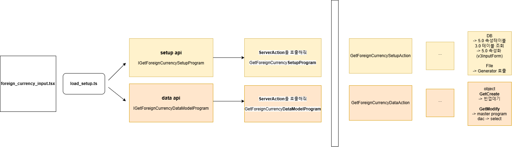
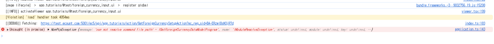
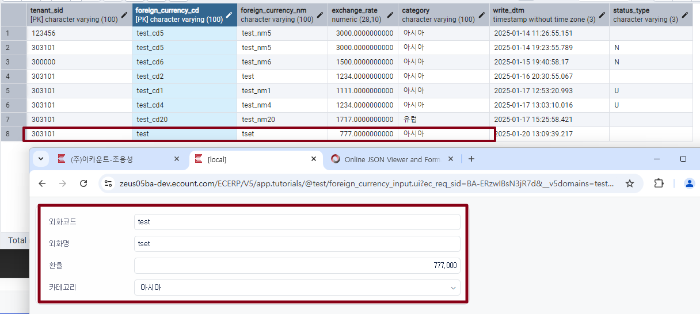

# Daily Retrospective  
**작성자**: [이연아]  
**작성일시**: [2025-01-20]  

## 1. 오늘 배운 내용 (필수)  
### 신규 입력, 수정 조회 화면 구현하기


#### Setup Api
설정 관련 API
- browser layer
	- GetForeignCurrencySetupProgram : GetForeignCurrencySetupAction 호출
	```typescript
	data: {
				bizz_sid: 'TB_000000E040114',
				menu_sid: 'TM_000000E040114',
				action_mode: EN_ACTION_MODE.GetModify,
				foreign_currency_cd: 'test',
	},
	```
	- 조회하려는 데이터 직접 설정
- server layer
	- GetForeignCurrencySetupAction : GetForeignCurrencyInputSetupProgram 호출
	- GetForeignCurrencyInputSetupProgram : Setup 정보 호출, 실습 시 setup 파일 직접 입력해서 사용

#### Data Api
데이터 관련 API
- browser layer
	- GetForeignCurrencyDataModelProgram : GetForeignCurrencyDataAction 호출
	```typescript
	data: {
				bizz_sid: 'TB_000000E040114',
				menu_sid: 'TM_000000E040114',
				action_mode: EN_ACTION_MODE.GetModify,
				foreign_currency_cd: 'test',
	},
	```
	- 조회하려는 데이터 직접 설정
- server layer
	- GetForeignCurrencyDataAction : GetForeignCurrencyInputDataProgram 호출
	- GetForeignCurrencyInputDataProgram : GetExecuteSetupMainProgram 호출, 실습 시 직접 조회 관련 MasterProgram 호출
	- GetForeignCurrencyMasterProgram
		- 신규 조회 **GetCreate** : 빈껍데기 상태 
		- 수정 조회 **GetModify** : 조회 시 데이터 필요, master program => dac => select 순서로 데이터 가져옴
	- GetForeignCurrencyDac : 실제 esql을 통한 데이터 조회

### ExecuteSetupMainProgram의 이해
지난 과제에 대한 피드백을 받고 정리해봤습니다.

```typescript
export class CreateForeignCurrencyUserAction {
    static executeAsync: ICreateForeignCurrencyUserAction = async (request) => {
        const { execution_context, dm_manager, vmc } = request;

        execution_context.action.action_mode = EN_ACTION_MODE.Create;
        execution_context.action.menu_type = EN_MENU_TYPE.Input;

        //// 1. 서버저장 로직과 같은 공통 프로그램 호출
        // todo..
   
        // 2. 서버 Action 직접 호출
               ....
}
```

#### 1. ExecuteSetupMainProgram 사용
장점
- 코드 재사용이 가능하며, 속성을 활용해 소스를 일원화할 수 있어 비용 절감 효과를 얻을 수 있다.

단점
- 공통 로직 사용 시 특정 DTO 형식에 맞춰야 하며, 이로 인해 사용하지 않는 불필요한 필드가 포함될 수 있다.

#### 2. Action 직접 호출
장점
- 소스를 직관적으로 파악할 수 있다.

단점 
- 공통 로직의 장점과 반대로 소스 재생산이 늘어난다.

=> 회사의 궁극적인 목표는 비용 절감이며, 이를 위해 하나의 소스를 중심으로 효율적인 코드 관리를 지향해야 한다. 이를 실현하기 위해 공통 로직을 활용하여 중복을 최소화하고, 공통 처리 과정에서 발생하는 차이에 대해서는 효과적으로 처리할 방법을 고민해야 한다.
	

## 2. 동기에게 도움 받은 내용 (필수)
- 오늘 하루도 도움을 너무 많이 받았지만, 가까운 자리의 지은님, 다은님, 성재님이 오류를 찾아주시고 도움을 받을 수 있었습니다. 그리고 먼 자리임에도 불구하고 주현님, 강민님, 수경님에게도 도움을 받고 무사히 실습을 진행할 수 있었습니다.
- 수경님과 성철님이 오류 찾는 과정을 같이 보다가 성철님 컴퓨터를 꺼버렸는데 괜찮다고 해주셔서 죄송하고 감사합니다ㅠㅠ.. 그리고 성철님이 점심시간에 나눠주신 카스테라도 맛있게 먹을 수 있었습니다. 감사합니다!!! 

---

## 3. 개발 기술적으로 성장한 점 (선택)
### 1. 교육 과정 상 배운 내용이 아닌 개인적 호기심을 해결하기 위해 추가 공부한 내용
### 2. 오늘 직면했던 문제 (개발 환경, 구현)와 해결 방법
1. 오늘 구현해야 할 `GetForeignCurrencyDac.ts` 파일이 있었는데, 이전에 작성된 `GetForeignCuurencyDac.ts(오타?)` 파일에서 `export class GetForeignCurrencyDac`으로 되어 있어 문제가 발생했습니다.
MasterProgram에서 제가 작성한 dac을 사용하려 했지만, 엉뚱한 파일이 import되어 사용되고 있었습니다. 주현님의 도움을 받아 올바르게 수정했고, 제가 작성한 dac 파일이 제대로 동작하도록 설정하여 실행할 수 있었습니다. 이 경험을 통해 파일명과 export 설정의 중요성을 다시 한 번 깨달았습니다.

2. IGetForeignCurrencyDataModelProgram을 찾지 못하는 에러가 발생했습니다.


```typescript
// 데코레이터 작성하지 않아서 오류 발생..
@program_impl(IGetForeignCurrencyDataModelProgram)
export class GetForeignCurrencyDataModelProgram
	extends BaseProgram<LoadDataModelProgramRequestDto, Partial<ISetup>>
	implements IGetForeignCurrencyDataModelProgram
```

위와 같이 데코레이터를 작성하지 않아 인터페이스와 구현체 간의 매핑이 이루어지지 않는 문제를 겪었습니다.
implements 키워드로 인터페이스를 상속받아 사용했지만, 데코레이터를 생략하면 구현체임을 제대로 알리지 못해 에러가 발생한다는 것을 알게 되었습니다.
성재님의 도움을 받아 놓친 부분을 찾아 작성하고, 정삭적으로 코드가 동작할 수 있도록 수정할 수 있었습니다.




### 3. 위 두 주제 중 미처 해결 못한 과제. 앞으로 공부해볼 내용.
전체적인 흐름은 이해하고 있다고 생각했지만, 실습을 진행하면서 어떤 값을 어디서 받아오고 어떻게 사용하는지에 대한 이해가 부족하다는 것을 느꼈습니다. 이 부분은 단순히 흐름을 아는 것에 그치지 않고, 코드를 직접 분석하고 동작 과정을 세세히 따라가며 익히는 연습이 필요하다고 깨달았습니다. 코드를 많이 읽고 실제 동작 방식을 추적하며 이해도를 높이는 데 집중해야겠습니다. 아자!