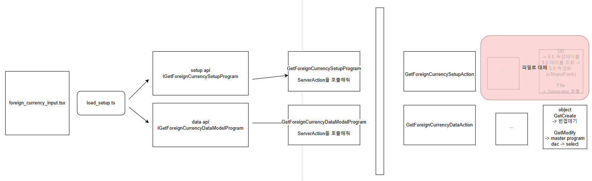

# Daily Retrospective

**작성자**: [최현철]  
**작성일시**: [2025-01-20]

## 1. 오늘 배운 내용 (필수)

### setup api 구현

1. (browser) GetForeignCurrencySetupProgram

2. (server) GetForeignCurrencySetupAction

3. (server) GetForeignCurrencyInputSetupProgram

- setup 테이블 가서 가져와야 하나, 간랸하게 해당 프로그램에서 setup파일 쓰는걸로

### Data Api 구현

1. (browser) GetForeignCurrencyDataModelProgram

2. (server) GetForeignCurrencyDataAction

3. (server) GetForeignCurrencyInputDataProgram

- 직접 Master프로그램 호출

4. GetForeignCurrencyMasterProgram

5. GetForeignCurrencyDac

### ▶ setup, data merge는 load_setup.ts에서 진행

## 2. 동기에게 도움 받은 내용 (필수)

건호, 주현, 강민, 승준님이 구현과제 동안 발생하는 의문점들을 질문/답변 해주셨습니다.

- 분기처리 필요성
- 하드코딩 (메뉴타입 등) 위치
- 제너레이터 사용여부

---

### 3. 위 두 주제 중 미처 해결 못한 과제. 앞으로 공부해볼 내용.

1. 제너레이터, 속성, 벨리데이터 등의 흐름
2. Action, UserAction 로직
3. setup / data api 흐름 정리 (중간중간 제너레이터들의 역할)

---

## 5. 제안하고 싶은 내용

공부해볼내용이 점점 쌓여가는게 두렵습니다.
