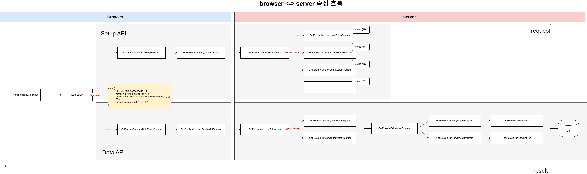

# Daily Retrospective

**작성자**: 허수경

**작성일시**: 2025-01-20(월)

## 1. 오늘 배운 내용 (필수)

- Setup API 추가하기
- Data API 추가하기

### Setup API 추가하기

---

- 화면을 그릴 때에는 `Setup API`를 통해 해당 업무에 필요한 항목, 속성들을 들고오고 `Data API`를 통해 데이터 값을 들고온다.
- `Setup`(=속성) 정보는 `DB`와 `File`로 관리할 수 있습니다.
  - `DB`: 3.0 테이블을 조회하여 5.0으로 속성화합니다.
  - `File`: `setup`과 같이 변수로 관리하거나 `generator`를 통해 생성합니다.

#### 1. `GetForeignCurrencySetupProgram.ts`

- browser layer
- `httpFeature`를 통해 서버 Action(`IGetForeignCurrencySetupAction`)를 호출합니다.

```ts
const httpFeature =
  this.execution_context.getFeature<system.IHttpRequestFeature>(
    system.IHttpRequestFeature
  );
const { result } = await httpFeature.sendAsync<
  GetForeignCurrencySetupRequestDto,
  ISetup
>(IGetForeignCurrencySetupAction, {
  data: {
    // test를 위한 하드코딩
    bizz_sid: "TB_000000E040114",
    menu_sid: "TM_000000E040114",
    foreign_currency_cd: "test_cd5",
  },
});
```

#### 2. `GetForeignCurrencySetupAction.ts`

- server layer
- `EN_MENU_TYPE`에 따라 Program을 호출합니다.
  - 테스트에서는 Input의 경우만 고려했습니다.

```ts
const program = ProgramBuilder.create<
  GetForeignCurrencySetupRequestDto,
  GetForeignCurrencySetupResultDto
>(IGetForeignCurrencyInputSetupProgram, execution_context);
result = program.execute(data);
```

#### 3. `GetForeignCurrencyInputSetupProgram.ts`

- server layer
- setup 정보를 반환합니다.

### Data API 추가하기

---

- Action mode에 따라 반환되는 값이 다릅니다.
  - `GetCreate`: 신규조회 건으므로 빈 값을 가지고 있습니다.
  - `GetModify`: 수정조회 건으로 수정할 data_model의 값을 가지고 있습니다.

#### 1. `GetForeignCurrencyDataModelProgram.ts`

- browser layer
- `httpFeature`를 통해 서버 Action(`IGetForeignCurrencyDataAction`)를 호출합니다.

```ts
protected async onExecuteAsync(request: LoadDataModelProgramRequestDto): Promise<Partial<ISetup>> {
  const httpFeature = this.execution_context.getFeature<system.IHttpRequestFeature>(system.IHttpRequestFeature);
  const { result } = await httpFeature.sendAsync<
    GetForeignCurrencySetupRequestDto,
    GetForeignCurrencySetupResultDto
  >(IGetForeignCurrencyDataAction, {
    data: {
      bizz_sid: 'TB_000000E040114',
      menu_sid: 'TM_000000E040114',
      action_mode: EN_ACTION_MODE.GetModify, //수정조회
      foreign_currency_cd: 'test_cd5',
    },
  });

  return result;
}
```

#### 2. `GetForeignCurrencyDataAction.ts`

- server layer
- `EN_MENU_TYPE`에 따라 Program을 호출합니다.
  - 테스트에서는 Input의 경우만 고려했습니다.

```ts
const program = ProgramBuilder.create<
  GetForeignCurrencySetupRequestDto,
  GetForeignCurrencySetupResultDto
>(IGetForeignCurrencyInputDataProgram, execution_context);

result = program.execute(data);
```

#### 3. `GetForeignCurrencyInputDataProgram.ts`

- `table_model`과 `data_model`를 매핑한 값을 반환합니다.
  - 매핑을 해주는 이유는 화면 상에서 `table_model`에서 가져온 값을 보여주기 위함입니다.

```ts
protected onExecute(dto: GetForeignCurrencySetupRequestDto): GetForeignCurrencySetupResultDto {
  const setup = this._getSetupBase();

  if (this.execution_context.action.action_mode == EN_ACTION_MODE.GetModify) {
    ///////////////////////
    // 수정 시 초기 데이터
    ///////////////////////
    const program = ProgramBuilder.create<GetForeignCurrencySetupRequestDto, GetForeignCurrencySetupResultDto>(
      IGetForeignCurrencyMasterProgram,
      this.execution_context
    );
    const { data_model } = program.execute(dto);

    const input_data_model_id = this.execution_context.bizz_mgr.getBizzDataModelId(
      this.execution_context,
      this.execution_context.action.bizz_sid,
      EN_INPUT_MENU_TYPE.Master
    );

    setup.data_model[input_data_model_id] = [data_model];
  }
  return setup as GetForeignCurrencySetupResultDto;
}
```

```ts
private _getSetupBase(): ISetup {
  return {
    tenant: {} as ITenant,
    user: {} as IUser,
    bizz: {} as IBizz,
    menu: { attributes: [] } as IMenu,
    function: [] as IFunction[],
    view_container: [] as IViewContainer[],
    data_model: {} as IDataModelMapper,
    data_model_definitions: {} as IDataModelDefinitionMapper,
  };
}
```

#### 3. `GetForeignCurrencyMasterProgram.ts`

- 일반적으로는 조회시 서치프로그램을 타게 되어있습니다.

```ts
private _getDataModel(table_model: pg.foreign_currency_20250110_hsg_ecback): any {
		//
		const data_model = Object.entries(table_model).reduce((acc, [key, value]) => {
			acc[`foreign_currency$${key}`] = value;
			return acc;
		}, {} as any);
		return data_model;
	}
```

#### 4. `GetForeignCurrencyDac.ts`

- DB에서 정보를 조회하여 반환합니다.
- 해당 값은 UI를 통해 확인할 수 있습니다.

---

## 2. 동기에게 도움 받은 내용 (필수)

- 브라우저에서 데이터가 넘어오지 않는 이유에 대해 궁금해했는데 민준님께서 디버깅을 통해 그 궁금증을 해결해 주셨습니다.
- 주현님께서 진행 중인 실습에서 다시 한번 생각해볼 주제를 제안해 주셨습니다. 이를 통해 실습 내용을 보다 깊이 이해할 수 있었습니다.
- 성철님과 함께 에러를 해결하며 저도 부족했던 부분을 다시 공부할 기회를 얻었고, 신규 조회와 수정 조회의 차이점에 대해 자세히 설명해 주셨습니다. 또한 맛있는 카스테라도 나눔해주셨습니다.

---

## 3. 개발 기술적으로 성장한 점 (선택)

### 1. 교육 과정 상 배운 내용이 아닌 개인적 호기심을 해결하기 위해 추가 공부한 내용

#### 캐싱을 하는 이유

- 캐싱은 서버와 클라이언트 간의 데이터 전송을 최소화하고, 응답 속도를 높이기 위해 사용됩니다.
- 특히 setup 데이터는 용량이 크고 자주 변경되지 않는 특성이 있기 때문에, 캐싱을 활용하여 서버 부하를 줄이고 성능을 최적화할 수 있습니다.
- 캐싱된 데이터를 사용하면 동일한 요청에 대해 중복 처리를 피할 수 있어, 처리 속도가 빨라지고 사용자가 더 원활한 경험을 할 수 있습니다.

**캐싱을 구현하는 방법**

- `@action_response_cache` 데코레이터를 활용하여 특정 액션의 응답 데이터를 캐싱할 수 있습니다.

```ts
@action_response_cache(get_inventory_setup_action)
```

**실습에서는 캐싱을 하지 않는 이유**

- 디버깅 과정에서는 캐싱을 사용하면 문제가 될 수 있습니다. 캐싱은 동일한 요청에 대해 이전에 저장된 응답을 반환하기 때문에, 코드가 수정되거나 데이터 상태가 변경되더라도 캐싱된 결과가 반환될 수 있습니다
- 특히, 현재 실습 환경에서는 코드의 동작과 데이터 흐름을 명확히 이해하며 발생하는 문제를 직접 관찰하고 해결하는 것이 핵심 목표입니다. 캐싱을 활성화하면 디버깅 중 데이터의 변화를 즉시 확인하기 어려워지고, 문제 해결 과정을 방해할 수 있습니다.

### 2. 오늘 직면했던 문제 (개발 환경, 구현)와 해결 방법

#### browser <-> server 속성 흐름



- 이전에는 `SetUpProgram`, `DataModelProgram`, 그리고 `UserAction`의 역할을 명확히 이해하지 못했습니다.

  > "금일 교육에서는 `GetForeignCurrencySetUpProgram`과 `GetForeignCurrencyDataModelProgram`이 `httpFreature`를 통해 serverAction 을 호출한다고 배웠습니다. 그러나 실습에서는 `CreateForeignCurrencyUserAction`을 통해 serverAction을 호출하고 있었습니다. 이로 인해 SetUpProgram과 DataModelProgram이 각각 어떤 역할을 수행하며, UserAction과의 차이는 무엇인지에 대한 명확한 이해가 필요하다고 느꼈습니다. 특히, 각 파일이 서버와의 통신에서 구체적으로 어떤 책임을 지고 있는지, 그리고 UserAction이 이 흐름에서 어떤 방식으로 동작하는지를 공부할 계획입니다."

- `UserAction`과 `Setup API`, `Data API`를 실습하며 이를 이해할 수 있었습니다.
- `SetUpProgram/DataModelProgram`
  - `Setup API`를 통해 해당 업무에 필요한 항목, 속성들을 들고오고 `Data API`를 통해 데이터 값을 들고옵니다.
  - 반환된 값을 기준으로 `load_setup` 에서 `merge`를 진행합니다.
  - 합쳐진 데이터를 페이지에 렌더링합니다.
- `UserAction`
  - 사용자가 렌더링된 화면을 기준으로 입력한 값을 기반으로 행동(action_mode)을 실행합니다.
  - 사용자 입력 데이터를 서버에 전달하고, 서버의 응답을 처리하여 결과를 반영합니다.

이를 통해 서버와 브라우저 간의 속성 흐름과 각 역할의 차이점을 명확히 이해하게 되었습니다.

---

## 4. 소프트 스킬면에서 성장한 점 (선택)

아침 일찍 나와 실습을 진행하면서 다른 사람들보다 조금 더 빠르게 구현할 수 있었습니다. 덕분에 오늘은 평소보다 더 많은 도움을 줄 수 있었던 하루라 뿌듯했습니다.

또한, 동기를 도와주던 중 분명히 알고 있다고 생각했던 내용이 막상 동기의 코드를 보니 제 코드를 참고하지 않고는 해결할 수 없다는 것을 깨달았습니다. 이 과정에서 부족했던 부분을 다시 공부할 수 있는 좋은 기회를 얻었습니다.

무엇보다 동기들의 문제를 함께 해결하면서 다양한 에러를 접하고 이를 해결하는 경험을 쌓을 수 있어서 유익한 하루였습니다.
