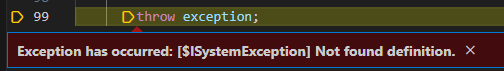
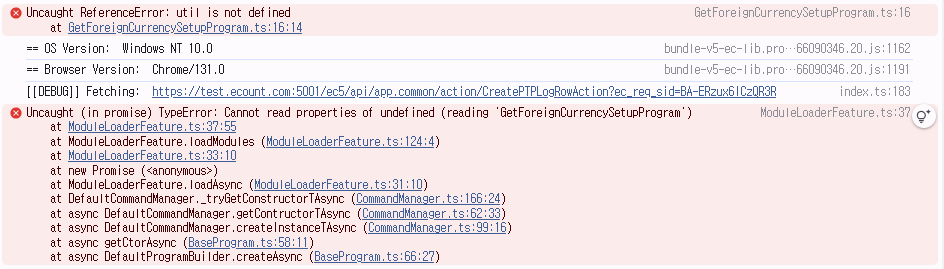

# Daily Retrospective  
**작성자**: [황주원]  
**작성일시**: [2025-01-20]  

## 1. 오늘 배운 내용 (필수)  
### Setup API
설정과 관련된 API

**[browser layer]** 
- GetForeignCurrencySetupProgram
	- menu type에 따라 action mode 값을 설정하여 GetForeignCurrencySetupAction 호출

**[server layer]** 
- GetForeignCurrencySetupAction
	- 아래 프로그램 호출
- GetForeignCurrencyInputSetupProgram
	- setup 정보 호출

### Data API
데이터를 처리하는 API

**[browser layer]**
- GetForeignCurrencyDataModelProgram
	- 조회하고자는 데이터 설정하여 GetForeignCurrencyDataAction 호출

**[server layer]**
- GetForeignCurrencyDataAction
- GetForeignCurrencyInputDataProgram
	- 직접 Master 프로그램 호출 실습 진행
- GetForeignCurrencyMasterProgram
	- dac 호출
- GetForeignCurrencyDac
	- esql을 통해서 데이터 조회


## 2. 동기에게 도움 받은 내용 (필수)
- 승준님께서 디버깅하는데 도움을 주셨습니다. 감사합니다.
- 수경님께서 오류나는 부분 해결 방법을 알려주셨습니다. 감사합니다.
- 도형님께서 따수운 조언을 해주셨습니다. 감사합니다.

---

## 3. 개발 기술적으로 성장한 점 (선택)
### 2. 오늘 직면했던 문제 (개발 환경, 구현)와 해결 방법
#### 3-2-1. 데이터 모델 
조회를 해야하는데 키-값을 Setup으로 맞춰줘야 한다. <br />
``master`` 이 data model id가 필요한데, 아래의 코드를 추가해 주는 것까지는 이해했지만 어떻게 활용을 해야할 지 막막했다.

```typescript
this.master_data_model_id = this.execution_context.bizz_mgr.getBizzDataModelId(
	this.execution_context,
	this.execution_context.action.bizz_sid,
	EN_INPUT_MENU_TYPE.Master
);
```
성준 팀장님의 코드를 보면서 필요한 데이터와 생성하는 방법을 이해할 수 있었습니다.

#### 3-2-2. Not Found Definition


- 원인: bizz_sid 를 인식하지 못해서 발생한 에러
- 해결 방법
	- ``bizz_sid: request.bizz_sid ?? 'TB_000000E040114'`` 
	- bizz_sid 값을 현재 request로 받아오지 못해 data에 값을 설정해 주니 해결할 수 있었다.

#### 3-2-3. Util 인식 못 하는 에러
```typescript
let menu_type = request.menu_type;
if (!menu_type) {
	menu_type = getMenuTypeByViewName(this.execution_context.routeConfig.pageRouteOptions.viewName as string);
}
```
- 원인
	- Inventory를 보면 ``getMenuTypeByViewName`` 메서드를 호출해 메뉴 타입을 반환하고 있다.
	- 그대로 사용하려고 하면 아래와 같은 에러가 난다.
	
- 해결 방법
	- 해당 Util을 삭제해 주고 값을 넣어주면 해결된다.
	- util을 타고 들어가면 view_name을 가져와 split 한다. 결국 프론트단(browser)의 값을 가져오는 것 같고, 아직 정의한 view_name이 없으니 없애고 진행하는 것이 맞는 것 같다.


### 3. 위 두 주제 중 미처 해결 못한 과제. 앞으로 공부해볼 내용.
- Inventory 에서는 feature 가 너무 많아 이해가 어렵습니다. 한 번은 정리나 쭉 훑어보는 것이 필요할 것이라 생각합니다.
- 짜여진 코드에서 이미 구현된 코드 중 어떤 코드를 활용할지 판단하는 시간이 꽤 깁니다. 실습을 충분히 해서 적재적소에 빠르게 쓸 수 있도록 공부해볼 것입니다.
- TempExecuteProgram 을 안다고 착각하고 있었습니다. 내일 오전에 더 이해해볼 것입니다.

## 4. 소프트 스킬면에서 성장한 점 
깊게 파고드는 개발자와 일머리가 좋은 개발자에 대해 팀장님께 얘길 들은 이후로 많이 고민해 봤습니다. 이카운트가 원하는 개발자(깊게 파고드는)가 아니여서 반성과 속상했지만, 후자의 개발자도 필요로 한다는 말을 듣고 현재로서는 조금 더 빠르게 행동하는 개발자가 되자 ! 라는 마음을 가졌습니다. 내일도 화이팅.