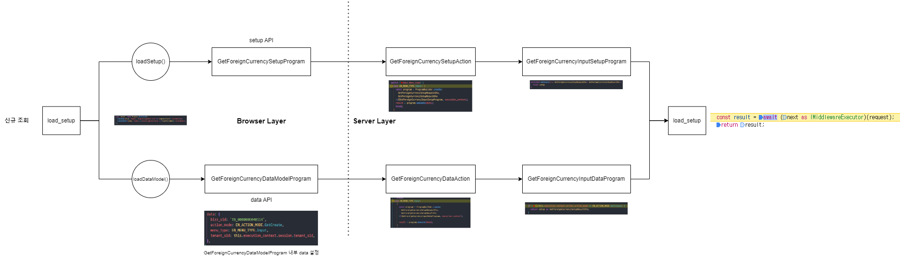
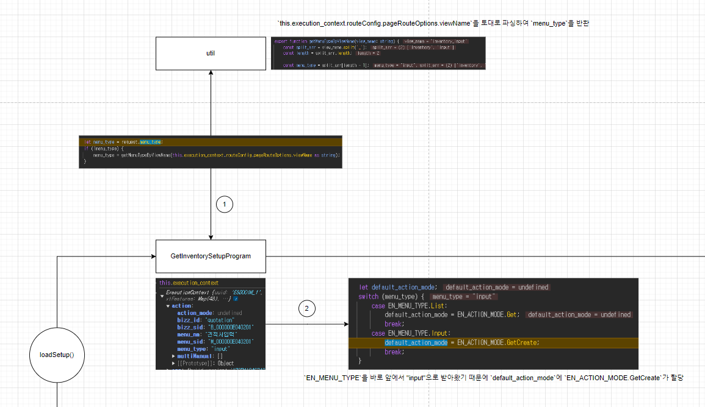
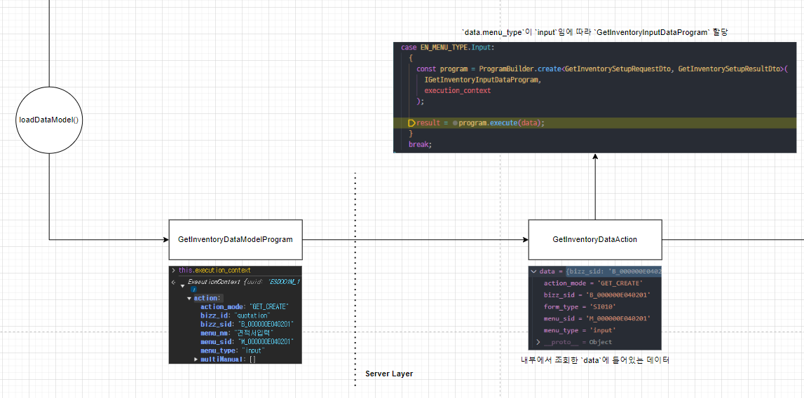
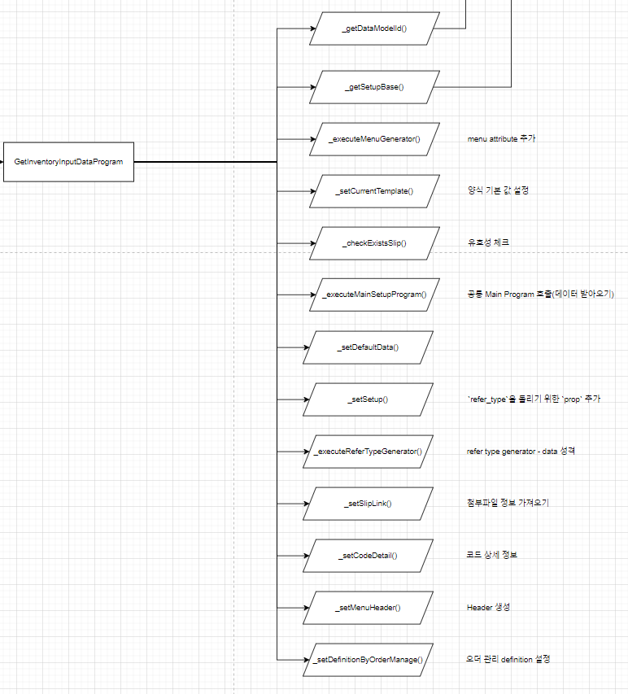
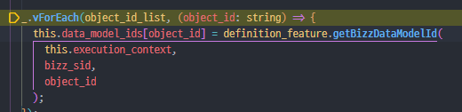
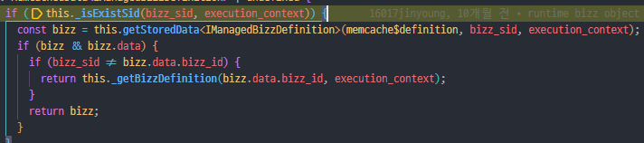
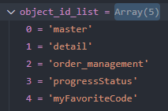

# Daily Retrospective

**작성자**: 고건호
**작성일시**: 2025-01-21

## 1. 오늘 배운 내용

- `신규 조회` & `수정 조회` 흐름 파악
- `견적서 입력` 전체 흐름 파악

### `신규 조회` & `수정 조회` 흐름 파악

오늘 오전에 어제 구현했던 내용을 토대로 제가 파악한 흐름을 토대로 그린 흐름도입니다.

> 현재 `ExecuteSetupMainProgram`을 통하지 않고 직접 `xxxMasterProgram`을 호출해주고 있으나, 실제 로직에서는 이 부분이 조금 다를 것으로 생각합니다.



흐름을 차례대로 살펴보면 아래와 같습니다.

#### `load_setup`

`load_setup`은 Browser Layer에서 실행되는 부분입니다.


```typescript
// load_setup.ts
...

const result = await Promise.allSettled([
			loadSetup(setup, request, (request.pageDescriptor as IPageDescriptor).routeOptions),
			loadDataModel(setup, request, (request.pageDescriptor as IPageDescriptor).routeOptions),
		]);

...
```

`load_setup`의 위 부분에서 비동기적으로 `loadSetup()` 함수와 `loadDataModel()` 함수가 실행됩니다.

이 두 함수는 각각 `GetForeignCurrencySetupProgram`과 `GetForeignCurrencyDataModelProgram`을 호출합니다.

#### `GetForeignCurrencySetupProgram`

`GetForeignCurrencySetupProgram`도 Browser Layer에서 실행됩니다.


최초에 내부에 작성된 `_init()` 함수를 통해 `request.menu_type`을 기준으로 `다건 조회`인지 `신규 조회`인지 등을 구분하여 `default_action_mode`에 값을 할당해줍니다.

> 현재 이번 `외화 코드`의 `신규 조회`와 `수정 조회`를 구현한 기준으로 흐름을 정리 중이기 때문에 실제 비즈니스 로직과 다른 부분이 있을 수도 있을 것 같다고 생각합니다. 해당 부분들은 나중에 다시 정리해 보도록 하겠습니다.

이후 나머지 초기화 작업들이 `_init()` 함수 내부에서 끝나면, `onExecuteAsync()` 함수에서 `httpFeature.sendAsync()` 함수가 실행되면서 Server Layer의 `GetForeignCurrencySetupAction`으로 흐름이 이어집니다.

#### `GetForeignCurrencyDataModelProgram`

`GetForeignCurrencyDataModelProgram`도 마찬가지로 Browser Layer에서 실행됩니다.


현재 제가 작성한 코드를 기준으로는 `GetForeignCurrencyDataModelProgram`에서 `신규 조회` 시에는 `data`에 아래와 같이 하드 코딩을 해주고 있습니다.

```typescript
// GetForeignCurrencyDataModelProgram
...

data: {
  bizz_sid: 'TB_000000E040114',
	action_mode: EN_ACTION_MODE.GetCreate,
	menu_type: EN_MENU_TYPE.Input,
	tenant_sid: this.execution_context.session.tenant_sid,
}

...
```

> 현재로서는 `신규 조회` 시에는 이렇게 `action_mode`를 `EN_ACTION_MODE.GetCreate`로 넣어줘야 테스트가 정상적으로 진행되는 것으로 알고 있습니다. 만약 다른 방법이 있다면 확인 후 구현해보도록 하겠습니다.

`GetForeignCurrencyDataModelProgram`는 앞서 살펴본 `GetForeignCurrencySetupProgram`과 유사한 동작을 한다는 생각이 들었습니다.

`GetForeignCurrencySetupProgram`에서처럼 `_init()` 함수를 통해 이후 로직에서의 분기 처리를 위한 작업을 `menu_type`에 따라 해주고 있기 때문입니다.

#### `GetForeignCurrencySetupAction`

`GetForeignCurrencySetupAction`은 Server Layer에서 동작합니다.


`GetForeignCurrencySetupRequestDto`를 `data` 변수에 할당하여 내부의 값을 꺼내 사용합니다.

예를 들어 내부에 작성된 코드 부분 중 `data.menu_type`의 값을 기준으로 실행시킬 `Program`을 동적으로 선택하는 코드가 작성되어 있습니다.

```typescript
// GetForeignCurrencySetupAction
...

switch (data.menu_type) {
	case EN_MENU_TYPE.Input: {
		const program = ProgramBuilder.create<
			GetForeignCurrencySetupRequestDto,
			GetForeignCurrencySetupResultDto
		>(IGetForeignCurrencyInputSetupProgram, execution_context);
		result = program.execute(data);
		break;
	}

  ...
}

...
```

현재 제가 작성한 코드 흐름대로라면 여기에서 `program` 변수에는 `GetForeignCurrencyInputSetupProgram` 타입이 담기게 되고, 이후 실행됩니다.

#### `GetForeignCurrencyDataAction`

`GetForeignCurrencyDataAction`도 Server Layer에서 동작합니다.


`GetForeignCurrencyDataAction`은 `GetForeignCurrencySetupAction`과 동일한 작업을 수행합니다.

다른 점이라면 이번에 구현한 로직의 흐름 상, `GetForeignCurrencyDataAction`은 `program` 변수에 `GetForeignCurrencyInputDataProgram` 타입의 값이 담긴다는 점입니다.

#### `GetForeignCurrencyInputSetupProgram`

`GetForeignCurrencyInputSetupProgram`은 Server Layer에서 동작합니다.


현재 작성한 코드를 기반으로 `GetForeignCurrencyInputSetupProgram`은 단순히 `setup`을 `./foreign_currency_setup`으로부터 import 해와서 반환해주고 있습니다.

> 실제 비즈니스 로직에서는 상이하게 동작할 것으로 판단하고 있습니다. 실제 로직을 바탕으로 추후 학습 이어나가겠습니다.

#### `GetForeignCurrencyInputDataProgram`

`GetForeignCurrencyInputDataProgram`은 Server Layer에서 동작합니다.


제가 작성한 코드 기반의 `신규 조회` 흐름에서는 빈 객체(`{}`)로 응답을 내려주고 있습니다.

따라서 `EN_ACTION_MODE`가 `GetModify`(`수정 조회`)인지 `GetCreate`(`신규 조회`)인지에 따른 분기 처리 후, `수정 조회`에서는 추가적으로 `GetForeignCurrencyDac`을 사용하여 DB에 데이터를 조회해오고, `신규 조회`에서는 빈 객체를 응답으로 내려주고 있습니다.

> `수정 조회` 흐름에서 `GetForeignCurrencyDac`이 어떤 ESQL로 DB에서 데이터를 조회해오는지는 간단하게 살펴보도록 하겠습니다.

#### `GetForeignCurrencyDac`

```typescript
// GetForeignCurrencyDac

import { IExecutionContext } from "ecount.infra.bridge/base";
import { pg } from "ecount.infra.bridge/table_model";
import { ESqlDacCommand } from "ecount.infra.common/dac";

/**
 * GetForeignCurrencyDac
 * foreign_currency_20250110_kkh_ecback
 */
export class GetForeignCurrencyDac extends ESqlDacCommand<
  pg.foreign_currency_20250110_kkh_ecback,
  pg.foreign_currency_20250110_kkh_ecback
> {
  constructor(execution_context: IExecutionContext) {
    super(execution_context, DbConnectionId.PG.BASE);
  }
  protected generateESql(
    data: pg.foreign_currency_20250110_kkh_ecback
  ): $Statement {
    const esql = $ESql
      .from<pg.foreign_currency_20250110_kkh_ecback>(
        pg.foreign_currency_20250110_kkh_ecback,
        (opt) => {
          opt.alterCheckColumnRule(ENUM_CONDITION_LEVEL.HIGH, (t) => [
            t.tenant_sid,
          ]);
        }
      )
      .select((ef, t) => ef._all())
      .where((ef, t) =>
        ef._equal(t.tenant_sid, this.execution_context.session.tenant_sid)
      )
      .where((ef, t) =>
        ef._equal(t.foreign_currency_cd, data.foreign_currency_cd)
      );
    return esql;
  }
  protected onExecute(
    db: $Database,
    esql: $Statement
  ): pg.foreign_currency_20250110_kkh_ecback {
    let result = {} as pg.foreign_currency_20250110_kkh_ecback;

    result = db
      .expressionSql(GetForeignCurrencyDac, esql)
      .fetch<pg.foreign_currency_20250110_kkh_ecback>(
        pg.foreign_currency_20250110_kkh_ecback
      ).data;
    return result;
  }
}
```

`수정 조회` 흐름에서는 애초에 `request` 내부에 조회하고자 하는 외화 코드의 `foreign_currency_cd`를 입력 받고 있습니다.

따라서 해당 `foreign_currency_code`로 DB에서 특정 외화 코드를 찾기 위해 아래와 같은 부분의 코드를 작성해야합니다.

```typescript
// GetForeignCurrencyDac
...

.where((ef, t) => ef._equal(t.foreign_currency_cd, data.foreign_currency_cd));

...
```

`수정 조회`와 같은 API에서는 이렇게 `GetForeignCurrencyDac`을 통한 DB 접근이 필수적이지만, `신규 조회`와 같은 API에서는 DB 접근이 필요하지 않기 때문에 빈 객체(`{}`)를 응답으로 내려줍니다.

그래야 이후의 흐름인 `load_setup`에서 병합(merge)할 수 있기 때문입니다.

### `견적서 입력` 전체 흐름 파악

오후에는 앞서 파악한 흐름으로 `견적서 입력`의 전체 흐름도 파악하기 위한 시간을 가졌습니다.

> 아직 완벽히 정리하진 못한 상황입니다. 중간에 `BizzManager`와 `BizzUtil` 쪽 흐름이 궁금해서 해당 부분을 집중적으로 보다보니 완성하진 못했습니다.


#### `Setup API` 흐름



`load_setup`에 의해 호출된 Browser Layer의 `GetInventorySetupProgram`의 `this.execution_context`에는 `bizz_id`부터 `bizz_sid`, `menu_nm`, `menu_sid`, `menu_type`까지 정상적으로 저장되어 있는 것을 확인할 수 있습니다.

이후 `request.menu_type`을 `menu_type` 변수에 할당하고 이를 if 조건문에 태워주는데, `request`의 `menu_type`은 최초에 `undefined` 값을 지니고 있습니다.

그래서 if 조건문 내부로 진입하여 코드가 실행되는데, 이 코드는 `util` 파일 내부에 정의되어있는 `getMenuTypeByViewName()` 함수를 실행시켜 `view_name`을 파싱한 뒤 `"input"`을 반환합니다.

이후 가져온 `"input"`으로 switch-case 조건문에서 `default_action_mode`를 `신규 조회`를 나타내는 `GetCreate`를 할당받게 됩니다.

이 뒤의 흐름으로는 Server Layer의 `GetInventorySetupProgram`이 호출되어야하지만, 현재 캐싱이 되어있는 상태라 캐싱 로직을 없앤 뒤에 흐름을 그려보려 합니다.

#### `Data API` 흐름

`Data API` 역시 `Setup API`와 마찬가지로 오전에 정리했던 내용과 유사하게 진행되는 것을 확인할 수 있었습니다.



Browser Layer의 `GetInventoryDataModelProgram`이 호출되고 이어서 Server Layer의 `GetInventoryDataAction`이 호출됩니다.

`GetInventoryDataAction`에서 `data.menu_type`이 `"input"`임에 따라 `GetInventoryInputDataProgram`으로 이후의 흐름이 이어지게 설정됩니다.

> 해당 부분에서 의문을 가졌던 부분이 존재하는데, 이는 아래 항목 중 하나에 작성하도록 하겠습니다.

호출된 `GetInventoryInputDataProgram`에서는 상당히 많은 내부 함수가 실행됩니다.



대략적인 역할을 정리해보자면 아래와 같습니다.

- `_getDataModelId()`
  - `this.data_model_ids` 배열에 `data_model_id`를 저장합니다.
- `_getSetupBase()`
  - 초기 데이터 세팅
- `_executeMenuGenerator()`
  - Menu 관련 attribute 추가
- `_setCurrentTemplate()`
  - 양식 기본 값 설정
- `_checkExistsSlip()`
  - 유효성 체크
- `_executeMainSetupProgram()`
  - 공통 Main Program 호출 (데이터 받아오는 작업)
- `_setDefaultData()`
- `_setSetup()`
  - `refer_type`을 돌리기 위한 `prop` 추가
- `_executeReferTypeGenerator()`
  - refer type generator 실행 - data 추가
- `_setSlipLink()`
  - 첨부 파일 정보 가져오기
- `_setCodeDetail()`
  - 코드 상세 정보
- `_setMenuHeader()`
  - Header 생성
- `_setDefinitionByOrderManage()`
  - 오더 관리 definition 설정

> 현재 `_getDataModelId()` 부분을 흐름을 따라가며 디버깅 하다가 `BizzManagerBase`와 `BizzUtil` 부분을 좀 더 살펴보고 싶어서 해당 파일들을 확인하던 중이었습니다. `GetInventoryInputDataProgram` 내부 여러 함수들 중 `_getDataModelId()` 부분만 우선적으로 정리한 뒤, `BizzManagerBase`와 `BizzUtil`의 동작 과정을 아래에서 자세히 살펴보려 합니다.

`_getDataModelId()`에서 `definition_feature` 변수에 `this.execution_context`로부터 `FeatureIdentifier` 자리에 `IBizzManager`를 할당하여 `BizzManager` 객체를 저장하게 됩니다.

`definition_feature`은 `getMenuDefinitionByMenuType()` 함수를 통해 `menu_defs`에 배열을 할당하고, `object_id_list`에 `menu_defs`를 순회하며 데이터를 삽입합니다.

## 2. 동기에게 도움 받은 내용

4시 반 조금 넘어서 현철님, 도형님, 강민님과 3층에서 쉬는 시간을 가졌습니다. 최근 마음가짐은 어떤지, 어떤 생각을 가지고 있는지 등을 나눌 수 있었기 때문에 굉장히 유익한 시간이었습니다.

---

## 3. 개발 기술적으로 성장한 점

### 1. 교육 과정 상 배운 내용이 아닌 개인적 호기심을 해결하기 위해 추가 공부한 내용

- `BizzManager` 디버깅

며칠 전부터 5.0 프레임워크의 핵심처럼 보이는 `BizzManager`를 디버깅해보고 싶었는데, 오늘 `견적서 입력` 디버깅을 하면서 관련 부분들의 로직을 탐구해 볼 수 있는 시간이 있었습니다.

`GetInventoryInputDataProgram`의 `_getDataModelId()` 함수에서 `_.vForEach()` 함수 내부에서 `definition_feature.getBizzDataModelId()` 함수를 호출해주는 부분이 있습니다.



이는 `BizzManagerBase` 내부에 정의되어 있는 `_getBizzDefinition()` 함수 호출까지 이어지는데, 해당 함수에서는 `_isExistSid()` 함수를 통해 실재하는 `bizz_sid`인지를 확인합니다.



이후 `bizz`에 `getStoredData()` 함수를 통해 `bizz_sid`에 해당하는 `bizz` 데이터가 캐싱되어있는지를 확인하는데 만약 캐싱되어있지 않다면 `bizz`에 `undefined`를 할당해주는 것으로 판단했습니다.

그리고 가져온 `bizz`에는 `_menu_datamodel_definitions`라는 `Map`에 `input`과 Menu sid 이름을 가진 2개의 배열이 존재하는데, 이 값들이 하는 역할이 무엇인지는 아직 잘 몰라 추가 학습을 통해 알아볼 예정입니다.

### 3. 위 두 주제 중 미처 해결 못한 과제. 앞으로 공부해볼 내용.

`GetInventoryInputDataProgram` 내부 `_getDataModelId()` 함수에서 생성되는 `object_id_list`에 담기는 값들이 어디에서 정의되는지를 아직 잘 모르겠습니다.



내일 추가 학습 할 예정입니다.
