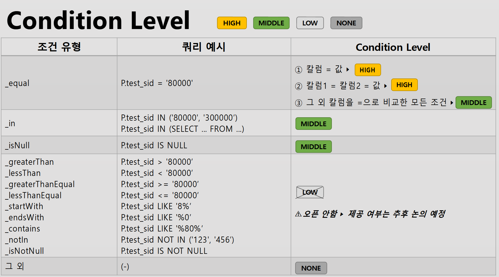
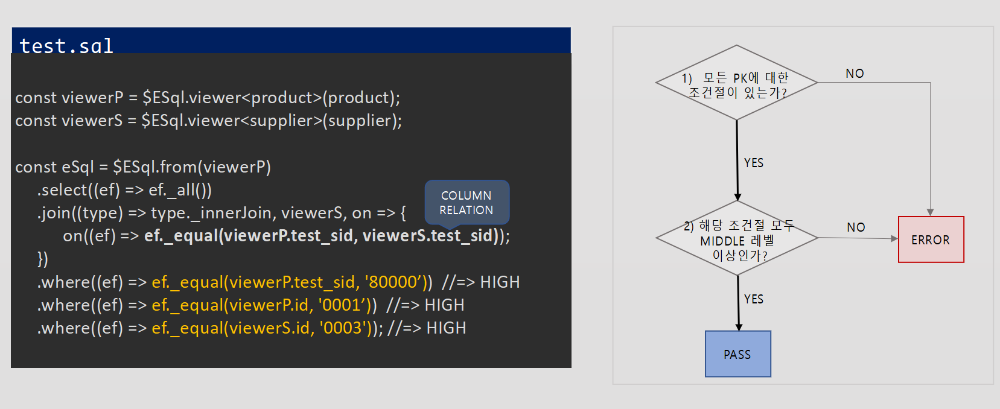
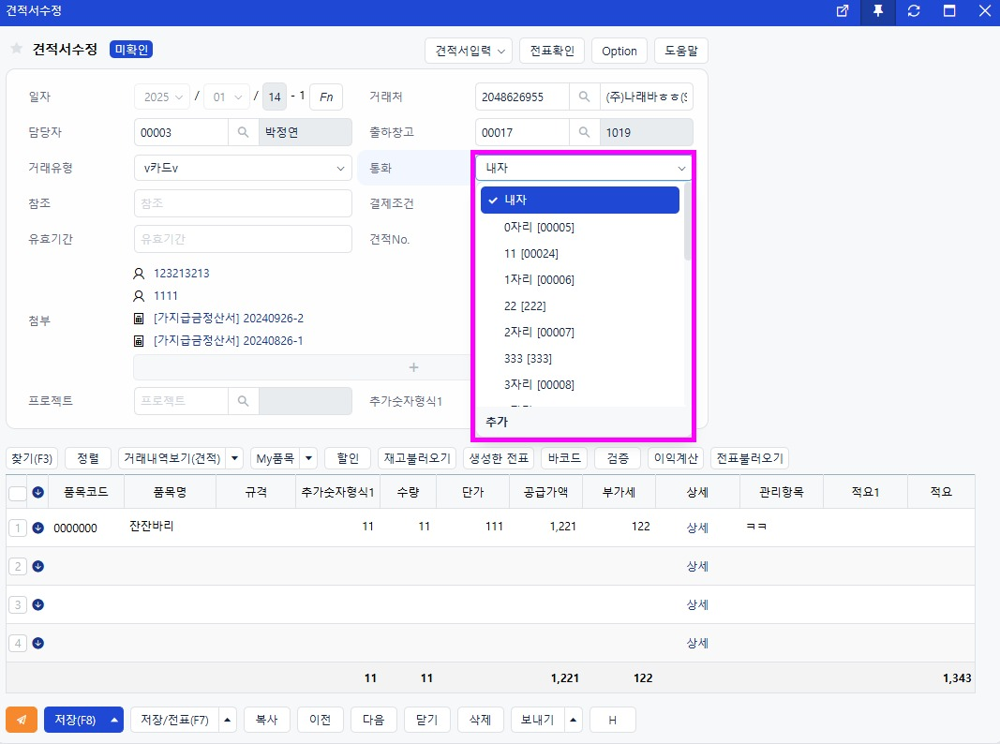

# Daily Retrospective

**작성자**: [김승준]  
**작성일시**: [2025-01-21]

## 1. 오늘 배운 내용 (필수)

### ExecuteSetupMainProgram

-   01-21에 진행한 내용이지만 개인적으로 내용을 이해하고 정리했습니다.

#### 현재 이카운트의 로직 구조

Action-> Program (, svc) -> (Get)ExecuteSetupMainProgram->(resolver)-> master(detail)Program -> dac -> DB

-   Action : server와 browser의 경계, Api를 받는 소스코드상의서 end point, program을 호출한다.
-   program(svc) : 프로그램 진입점
-   ExecuteSetupMainProgram : 공통으로 속성을 실행해 주는 역할, resolver를 호출
-   resolver : 속성들을 사용(프로그램을 호출)
-   master Program : 하나의 독립된 로직의 흐름을 가지는 로직의 단위, 비즈니스 로직이 진행, 실행됨.
-   Dac : ESql을 통해 DB의 데이터를 조작하는 로직을 구현하는 창구

### [5.0에 대한 이해(과제)](#50)

-   5.0에 대한 문제에 답변을 다는 형식으로 진행했습니다.
    -   **성준 팀장님** 께서 팀원들의 답변을 볼 수 있도록 조정해주셨고, 각 질문마다 잘 작성한 팀원들의 이름을 적어주셨습니다.
    -   팀원들의 답변과 다르게 이해한 부분을 정리하였습니다.

## 2. 동기에게 도움 받은 내용 (필수)

-   **강민님, 건호님**과 든든하게 점심을 먹었습니다.

-   **현철님**께서 이론적인 부분과 제가 잘못이해하고 있던 부분에 대해 알려주셨습니다.
-   **주원님**께서 작성하신 답변을 설명해주셨습니다.
-   **강민님, 현철님**과 일정관리 프로젝트를 진행하게 된다면 어떻게 해야될지에 대한 얘기를 나눴습니다. 얘기를 나누며 제가 잘못이해하고 있던 부분을 알게 되었습니다.

---

## 3. 개발 기술적으로 성장한 점 (선택)

아래의 3가지 주제 중 하나를 선택하여 작성합니다.

### 1. 교육 과정 상 배운 내용이 아닌 개인적 호기심을 해결하기 위해 추가 공부한 내용

-   [esql](#esql)의 옵션과 view에 대해 학습했습니다.

-   과제를 진행하고 나서 팀원들의 답변을 읽고, 팀원들의 답변과 다르게 이해한 부분을 정리하였습니다.

### 3. 위 두 주제 중 미처 해결 못한 과제. 앞으로 공부해볼 내용.

Bizz_type과 Bizz에 대한 혼동이 있었습니다. 오늘 5.0 이해 과제에서 팀원들의 답변과 다른 부분을 정리하고, 강민님, 현철님과 일정관리 프로젝트 관련 얘기를 들으며 잘못이해하고 있다는 것을 알게되었습니다.

Bizz 뿐 만이 아니라 메뉴, 속성 등등 이카운트에서 쓰이는 개념들을 다시한번 정리하고, 소스코드에서 어떻게 쓰이는지 정리하는 시간을 가져야겠습니다.

---

## 4. 소프트 스킬면에서 성장한 점 (선택)

---

## 5. 제안하고 싶은 내용

개념 교육을 먼저 진행하고, 실습을 진행하는 교육일정이 실습을 진행할 때 도움이 된 부분도 많습니다.
하지만 소스 코드와 개념적인 내용을 동시에 보며 대입하는 과정이 추가 되었다면, 더 좋을 것 같습니다.

# 학습내용

## esql

### alterCheckColumnRule

PK가 여러개일때 where절에 모든 PK 조건을 쓰지 않아도 검사를 통과시켜주는 옵션.

-   기본적으로 모든 PK에 대해서 where절에 조건을 걸어야함.
-   Middle 조건 이상으로 걸어야 함. (LOW는 아직 개발 안됐고, 안전문제때문에 앞으로도 안될수도 있음.)
    -   middle, high의 의미가 무엇일까?
        
-   예를 들어 PK가 a,b,c 3개가 있다면 where절에서 a,b,c 모두 조건을 걸어야하지만<br> alterCheckColumnRule을 사용하면 한개의 조건(해당 조건)만 있어도 검사를 통과 시켜준다.
    

    -   ex. `opt.alterCheckColumnRule(ENUM_CONDITION_LEVEL.HIGH, t => t.test_sid);`<br>
        test_sid에 대한 조건만 넣으면 통과

    -   단 `opt.alterCheckColumnRule(ENUM_CONDITION_LEVEL.Middel, t => t.test_sid);`로 사용하고,<br> `.where((ef,t)=> ef.equal(t.test_sid, '80000'))` 조건을 건다면 오류가 발생한다.<br>
        => 조건으로 건 옵션보다 높은 레벨이어도 오류 발생

### disAllowNullIf

-   특정 조건을 만족하는 칼럼에는 null 값을 허용하지 않도록 하는 옵션.<br>(update에서 제공)

### useSplit

대량데이터를 수정 혹은 삭제할 때 사용하는 옵션

-   기본값으로 1000개씩 끊어서 처리
-   해당 함수의 인자로 끊어서 처리할 행의 개수를 직접 설정 가능

### setDuplicateCheckColumns

Upsert 사용 시 Duplicate Key Columns : 해당 컬럼들을 기준으로 데이터가 있으면 Update, 없으면 Insert 해준다. <br>=> 기본적으로 PK를 기준으로 제공.

-   위와 같은 상황이 제공 되지만, PK가 아닌 다른 컬럼을 기준으로 하고 싶을 때 사용하는 옵션.

### viewer

테이블, 서브쿼리, 단순한 값의 조합, CTE, Json 등 쿼리할 수 있는 모든 데이터 소스

-   테이블 뷰어 : table_model의 interface와 identifier가 필요.<br>
    $ESql.viewer($TableIdentifier) 사용

-   서브쿼리 : $ESql.viewer(), 또는 select().toViewer() 메소드 사용

-   values : 밸류(values)를 정의하고, $ESql.viewerWithValue(values) 사용

-   CTE(일반테이블식)

    -   기본적인 CTE의 구조

    ```sql
    WITH CTE_name [(col_name,[, col_name]...)]
    AS (
        CTE 정의부
    )
    CTE 사용부
    ;
    ```

    CTE 정의부에서 CTE 자기 자신을 참조하는 쿼리를 재귀멤버라 하고 그 외 조회 쿼리를 앵커멤버라 합니다

    ESql 에서는 정의부 안에서 재귀멤버를 1개만 사용 가능하며, OUTERJOIN은 사용 불가. 또한, 집합 연산자는 UNION ALL만 우선 제공.

    -   사용예시

    1. 2개의 앵커멤버로 정의된 CTE 사용 예제<br>
       앵커멤버는 한 CTE 안에서 여러 개 사용 가능<br>
       앵커멤버를 추가할 때는 setter의 add 앵커 함수를 사용

        ESql

        ```ts
        const anchor = $ESql
            .from<site_g>(site_g)
            .select((ef) => ef._all())
            .where((ef, t) => ef._equal(t.com_code, "80000"));

        const anchor2 = $ESql
            .from<site_g>(site_g)
            .select((ef) => ef._all())
            .where((ef, t) => ef._equal(t.com_code, "XXX"));

        const cte = $ESql.toCteViewer(anchor, (cte, setter) => {
            setter.addAnchor(anchor2);
        });
        const eSql = $ESql.from(cte).select((ef) => [cte["com_code"], cte["cd_group"]]);
        ```

        Query

        ```sql
        WITH __view1 AS (
            SELECT *
            FROM base.site_g
            WHERE com_code = @P1
            UNION ALL (SELECT *
                FROM base.site_g
                WHERE com_code = @P2
            )
        )
        SELECT __view1.com_code,
            __view1.cd_group
        FROM __view1
        WHERE __view1.com_code = @P3;
        ```

    2. 1개의 앵커멤버와 1개의 재귀멤버로 정의된 CTE 사용 예제<br>
       재귀멤버를 추가할 때는 setter의 addRecursive 함수를 사용<br>
       뷰어위드CTE의 두번째 인자로 넘어오는 cte는 현재 cte입니다.

        ESql

        ```ts
        const anchor = $ESql.from<site_g_auth>(site_g_auth)
             .select((ef, t) => [t.com_code, t.cd_group])
             .where((ef, t) => ef._equal(t.com_code, '80000'))
             .where((ef, t) => ef._equal(t.id_user, 'test'));

         const cte = $ESql. toCteViewer(anchor, (cte, setter) => {
             const v_site_g = $ESql.viewer<site_g>(site_g);
             const recursive = $ESql.from(v_site_g)
             .join(ef => ef.innerJoin, cte), on => {
                 on(ef => ef._equal(viewer['com_code'], cte['com_code’]));
                 on(ef => ef._equal(viewer['cd_parent'], cte['cd_group’]));
             }
             .select(ef => [viewer['com_code'], viewer['cd_group']])
             .where(ef => ef._equal(viewer['com_code'], '80000'));

             setter.addRecursive(recursive);
         });

         const eSql = $ESql.from(cte)
             .select(ef => [cte['com_code'], cte['cd_group']])
             .where(ef => ef._equal(cte['com_code'], '80000'));
        ```

        Query

        ```sql
        WITH RECURSIVE __view1 AS (
            SELECT com_code, cd_group
            FROM base.site_g_auth
            WHERE com_code = @P1
                AND id_user = @P2

            UNION ALL (SELECT __view2.com_code
                , __view2.cd_group
                FROM base.site_g AS __view2
                INNER JOIN __view1
                        ON __view2.test_sid = __view1.test_sid
                        AND __view2.cd_parent = __view1.cd_group
                WHERE com_code = @P3)
        )
        SELECT __view1.com_code,
            __view1.cd_group
        FROM __view1
        WHERE __view1.com_code = @P4;
        ```

-   Json : MySQL에서는 사용불가, 칼럼명세 반드시 지정해야함.

ESql

```ts
const json = `{"id": "0003", "name": "ipad", "quantity": 100}`;

const viewer_j = $ESql.viewerWithJson(json, opt => {
       opt.defineColumn("id“, schema => schema.createString(20), "id");
       opt.defineColumn("name“, schema => schema.createString(100), "name");
       opt.defineColumn("quantity“, schema => schema.createInteger());
}, "J");
const eSql = $ESql.from(viewer_j)
       .select(ef => [viewer_j['id'], viewer_j['name'], viewer_j['quantity']])
       .where(ef => ef._equal(viewer_j['id'], '0003'));
```

(MS) Sql

```SQL
SELECT J.id
     , J.name
     , J.quantity
FROM OPENJSON(@P1) WITH (
     id	  varchar(20)	       '$.id’,
     name	  varchar(100)     '$.name’,
     quantity	  int	       '$.quantity'
) AS J
WHERE J.id = @P2;
```

(PG) Sql

```sql
SELECT J.id
     , J.name
     , J.quantity
FROM json_to_record(CAST(@P1 AS json)) AS J(
     id                character varying (20),
     name         character varying (100),
     quantity    integer
)
WHERE J.id = @P2 ;

```

## 5.0

1. bizz_type: 재고, bizz_id: 견적, menu_type: 입력 재고-견적업무를 통한 입력 메뉴를 구현하였습니다.<br>
   재고-판매업무를 통한 입력 메뉴를 구현하려고 하니 재고-견적업무의 품목 유효성 체크가 견적과 다르게 동작해야 된다는걸 확인했습니다.<br>
   5.0 소스에서 동일 refer_type의 서로 다른 유효성 체크 요구사항을 어떤 방식으로 처리해야되는지 설명하시오.

-   내 답안 :

    ```ts

    IReferTypeAttrGenerator<any> | undefined {
    const bizz_sid = options?.bizz_sid ?? execution_context.action.bizz_sid;
    const menu_type = options?.menu_type ?? execution_context.action.menu_type;

        const { bizz_id, bizz_type } = getBizzInfo(execution_context, bizz_sid);

        return (refer_type_gens[`${bizz_id}_${refer_type}_${attr_id}_${menu_type}` as keyof typeof refer_type_gens] ||
            refer_type_gens[`${bizz_id}_${refer_type}_${attr_id}` as keyof typeof refer_type_gens] ||
            refer_type_gens[
                `${bizz_type}_${refer_type}_${attr_id}_${execution_context.session.site}` as keyof typeof refer_type_gens
            ] ||
            refer_type_gens[`${bizz_type}_${refer_type}_${attr_id}_${menu_type}` as keyof typeof refer_type_gens] ||
            refer_type_gens[`${bizz_type}_${refer_type}_${attr_id}` as keyof typeof refer_type_gens] ||
            refer_type_gens[`${refer_type}_${attr_id}_${menu_type}` as keyof typeof refer_type_gens] ||
            refer_type_gens[`${refer_type}_${attr_id}` as keyof typeof refer_type_gens] ||
            refer_type_gens[`${attr_id}_${menu_type}` as keyof typeof refer_type_gens] ||
            refer_type_gens[attr_id as keyof typeof refer_type_gens]) as IReferTypeAttrGenerator<any>;

    }

    ```

    `${bizz_type}_${refer_type}_${attr_id}_${menu_type}` 보다 상단에 존재하는 `${bizz_id}_${refer_type}_${attr_id}_${menu_type}` 또는 `${bizz_id}_${refer_type}_${attr_id}` 방식의 validator를 이용해야 합니다.

2. FN 버튼의 표시여부가 특정 데이터에 따라 판단되어야 된다.<br>
   삭제된 전표를 조회한 경우는 FN버튼이 표시 되지 않습니다.<br>
   동일전표를 삭제한경우와 삭제취소한 경우, 수정 조회 화면입니다.<br>
   이카운트의 기능은 삭제된 전표도 조회할 수 있는 기능이 존재합니다.<br>
   관련 구분을 위한 로직을 현재 로직 구조로 어디에 위치시켜야 되는지와 이유를 설명하시오. <br>
   (데이터를 판단해서 속성정보를 변경해야 되는 경우)

-   내 답안 : data api를 통해 가져온 정보와 setup api에서 가져온 속성정보를 병합할 때 FN 버튼의 표시여부를 구분하는 로직이 들어가야 할 것 같습니다. <br>
    이유 : 이카운트에서는 UI에 대한 정보를 load_setup.ts를 통해 가져와 화면을 구성합니다.<br>
    load_setup은 setup api를 통해 속성정보를 가져오고 data api를 통해 화면에 들어가는 데이터를 가져옵니다.

-   **아연님**
    `D:\ecxsolution\ecount.nextv5\ecount.solution\src\04.ecount.application\VeloxApps\app.tutorials\src\browser\presentation\foreign_currency_input.tsx\`
    또는
    setup을

    ```ts
    prop_id: 'xxx$xxx',
    attr_id: renderer_attrs.fn,
    ```

    처럼 작성한다.

-   setup에서 한다는 것은 동일하지만 **아연님** 께서는 presentation단계에서 처리한다고 하셨습니다.

3. 견적입력에서 사용되는 외화코드의 경우, 외화코드 목록을 조회해 오는 로직을 refer_type_generator를 통해 구현되어 있습니다. <br>
   신규 입력 화면, 수정조회 화면 진입시 외화코드 목록 정보를 화면에 내리기 위해서, <br>
   해당 refer_type_geneartor의 호출위치는 어디여야 되는지와 이유를 설명하시오.

    

-   내 답안 : Get...InputSetupProgram에서 호출해야 할 것 같습니다.
    화면 구성에 대한 정보를 가져오는 것이기 때문에 해당 위치에서 가져와야할 것 같습니다.

-   **민준님** : `GetInventoryInputDataProgram`에서 `refer_type_attr_generator`를 호출해 Attribute를 동적으로 구성할 수 있는 부분이 있습니다.<br>
    InputDataProgram에서 이를 구성해야할 것 같습니다. 왜냐하면 Setup은 동적인 처리를 하지 않는 로직입니다. <br>
    그러므로 Generator로 해당 타입의 Attribute를 넣어서 ui에 렌더링할 정보를 내려주면 될 것 같습니다.

-   다르게 이해한 부분 : 화면 구성에 필요한 속성 정보라고 생각해 setup에서 가져온다고 생각했지만, <br>
    **민준님**의 답변을 보면 동적인 정보를 처리하는 부분은 InputDataProgram에서 처리해야 한다고 하셨습니다.

4. 게시판은 저장소 설정 (업무설정)이 적용되어 있습니다.<br>
   현재 저장소 설정 (업무설정)이 적용되지 않은 샘플 외화코드 소스에서 저장소 설정 (업무설정) 정보가 어떻게 처리되고 있는지 작성하시오.

-   내 답안 : 샘플 코드에서는 파일로 관리를 하고 있고, generator를 통해 validator를 가져옵니다.

-   주원 : 업무(bizz) 설정을 할 때, 폴더에서 관리하고 있습니다.<br>
    해당 파일들 내부에서 target_props 를 통해 사용할 항목들을 object에서 직접 정의하고 있습니다.

-   다르게 이해한 부분 : 업무설정이 validation과 같은 속성값을 설정한다고 이해했는데, **주원님**께서는 업무에 사용할 항목들을 설정하는 것이라고 하셨습니다.

5. 재고-견적 입력을 개발한 인원이 다음 job으로 견적-판매 입력을 개발하려고 한다.<br>
   재고-판매입력을 담당하는 인원이 개발해야되는 번호들을 선택하고, 선택된 이유와 선택안한 이유를 간단하게 설명하시오.

    > 1. bizz_type 명세
    > 2. 업무명세
    > 3. input 명세
    > 4. object 명세
    > 5. 판매저장 유효성 체크 속성 resolver 구현
    > 6. 판매저장 program 구현
    > 7. 판매저장 dac 구현 (상단, 하단)

-   내 답안 :

    -   선택 : <br>4) object 명세 5) 판매저장 유효성 체크 속성 resolver 구현, 5) 판매저장 program 구현, 6) 판매저장 dac 구현 (상단, 하단)
    -   이유 : <br>재고-견적입력에서는 개발되지 않은 내용들을 추가로 개발해야 하기 때문입니다.
    -   선택되지 않은 것들에 대한 이유 :<br> 재고 - 견적 입력을 개발을 하면서 이미 bizz_type 명세, 2) 업무명세, 3) input 명세를 개발했을 것이고, 해당 명세들을 재사용 할 것이기 때문입니다.

-   성재 : 2번, 3번, 4번, 5-2번 <br>

    -   선택 이유

        -   업무 : 재고라는 bizz_type은 같지만 bizz 자체는 서로 다릅니다. 따라서 명세해주어야 합니다.
        -   input : 둘다 입력이라는 의미는 동일하지만, 사용할 속성이 달라질 수 있습니다. 파생 정보가 달라질 수도있고 등등의 이유입니다.
        -   object : 저장소에 어떻게 넣을 것인지 등등이 서로 달라질 수 있기 때문입니다.
        -   program : 판매를 저장할 때 세부 로직이 달라질 수 있기 때문에 선택했습니다.

    -   선택 안한 이유
        -   bizz_type 명세는 재고-견적 입력을 개발하면서 이미 명세가 완료된 상태일 것입니다.따라서 다시 명세하지 않아도됩니다.
        -   resolver : 유효성 체크 속성 resolver의 경우 resolver는 동일한 하나만 존재해도 속성값에 따라 다른 프로그램을 매칭시켜줄 수 있습니다.
        -   테이블 통합이 됐기에 판매저장 dac의 구현과정은 필요하지 않습니다 **\*\*성준팀장님 추가내용**

-   다르게 이해한 부분 :
    -   업무 명세 : bizz_type이 같기 때문에 새로 명세하지 않는다고 생각했지만,**성재님**께서는 bizz(id)는 다르기 때문에 새로 명세해야 한다고 하셨습니다. 업무라는 것의 이해를 잘 못하고 있었습니다.
    -   resolver를 새로 구현한다는 것이 validation을 새로 구현한다고 생각했는데 **성재님**께서는 resolver 프로그램은 고정되어있고, 속성값만 변경해주면 된다고 하셨습니다.
    -   input이라는 동일한 의미를 가지기 때문에 재사용 할 수 있다고 생각했지만 **성재님**께서는 둘다 입력이라는 의미는 동일하지만, 사용할 속성이 달라질 수 있고, 파생 정보가 달라질 수도있다고 하셨습니다.
    -   dac : 다른 테이블을 사용한다고 생각했지만, **성준팀장님**께서 테이블 통합이 됐기에 판매저장 dac의 구현과정은 필요하지 않다고 하셨습니다.

6. 견적조회의 경우 quotation_list.tsx 페이지로 구현되어 있고, 판매조회의 경우 sale_list.tsx 페이지로 구현되어 있습니다.<br>
   견적입력, 발주요청입력 페이지의 경우 inventory_input.tsx로 구현되어 있습니다.<br>
   견적조회와 판매조회를 inventory_list.tsx로 구현할수 있을지 설명하시오.<br>
   \*\*추가로, 재고-견적입력 / 회계-매출입력을 common_input.tsx 페이지로 구현할 수 있을지 설명하시오.

-   내 답안 :

    -   6-1. inventory_list.tsx로 구현할 수 있다.<br>
        들어갈 속성 정보와 데이터 부분을 DB를 통해 관리하면 bizz_id를 통해 다른 정보들을 표현할 수 있다.
    -   6-2. common_input.tsx 페이지로 구현할 수 있다.<br>
        bizz_type 으로 분기 처리를 통해 정보를 가져와 표현하면 가능 할 것 같습니다

-   아연

    -   견적조회와 판매조회를 inventory_list.tsx로 구현가능하다.

        ```ts
        @page_impl({
            identifier: IInventoryInputPage,
            setup: IGetInventorySetupProgram,
            data_model: IGetInventoryDataModelProgram,
            render_page_progress_on_initial_header: true,
        })
        ```

        bizz_sid와 menu_type을 견적조회, 판매조회에 맞춰 요청보내면 각 요청에 맞는 setup과 data_model을 전달할 것이기 때문에 가능하다.

    -   재고-견적입력/회계-매출입력의 경우 bizz가 달라 현재 있는 Program들을 고치지 않는 이상 어려울 것 같다.

-   다르게 이해한 부분 : 현재가 아닌 결국에는 하나의 페이지로 구현할 수 있을 것이라 생각했지만, **아연님**께서는 현재상황에서 bizz가 다를때는 어려울 것이라 하셨습니다.

7. Server Layer의 ExecuteSetupMainProgram의 역할을 하는 프로그램이 여러종료가 있는 이유에 대해서 설명하시오.

-   내 답안 : 7. 업무별로 속성을 분리해 관리하고 속성들을 ExecuteSetupMainProgram에서 resolver 프로그램을 통해 실행합니다.<br>
    각 CRUD 과정마다 Attr_Type의 실행 순서(저장을 할떄의 attr_type의 resolver를 실행하는 순서와 조회, 삭제를 할때 attr_type의 resolver를 실행하는 순서)가 다른경우에는 SetupMainProgram이 나뉩니다. <br>
    순서에 대한 속성도 추가하게 된다면 ExecuteSetupMainProgram하나로 통합할 수 있을 것 같습니다.

8. prop_id와 refer_Type에 대해서 간단하게 설명하시오.

-   내 답안 :

    -   prop_id : DataModel 내의 특정 데이터를 가리키는 key, prop_id 가 할당 된 값의 의미를 규정하지는 않음(title이라는 prop_id가 가지는 값이 반드시 제목을 의미하지는 않음.)<br>
    -   refer_type : 항목(prop_id)의 의미를 나타냄

-   현철 :

    -   prop_id : 업무 하위에 있는 각각의 개별 항목들<br>
    -   refer_type : 은 업무에 구속되지않는 해당 항목이 가지고 있는 의미로써, 업무에 종속되지 않음.<br>
        판매, 견적 상관없이 거래처면~ 에 사용

-   다르게 이해한 점 : prop_id와 refer_type의 범위의 대한 이해가 부족했습니다. **현철님**께서는 prop_id는 업무내부에서만 쓰이는 값이고, refer_type은 업무에 종속적이지 않은 해당 항목이 가지는 의미라고 하셨습니다.

9. inventory_single.ts 데이터 모델 템플릿에 Attribute를 추가하는 경우와
   lately_date_display_state.ts generator를 통해서 Attribute를 추가하는 경우의 차이점에 대해서 설명하시오.<br>
   (lately_date refer_type이 어떤 의미를 나타내는지는 중요하지 않습니다. 구현관점으로 접근해 주세요.)

-   내 답안 :

    -   data_model_template은 유사한 형태의 데이터모델을 여러 개 생성할 때 도와주는 도구 입니다.<br>
        그 중 attributes에 해당하는 값은 데이터 모델 내 항목들의 속성 목록입니다.
        따라서 template을 통해 나오는 속성들은 해당 데이터 모델을 사용하는 모든 곳에서 적용되는 것이라고 생각합니다.
    -   하지만 generator를 통해 Attribute를 추가하는 경우에는 1번문제에서의 상황과 같이 좀 더 구체적인 상황에서 분기 처리를 할 때 유용하다고 생각합니다.

-   현철 :

    -   데이터 모델 템플릿에 적용하는 경우 해당 업무에만 적용되는 속성
    -   제너레이터를 통해서 생성하는 경우 업무상관없이 해당 레퍼타입이면 속성이 생성되므로, 업무상관없이 적용가능

-   다르게 이해한 부분 : 데이터 모델 템플릿에 적용하는 경우 해당 업무 전체적으로 적용된다고 생각했고, 제너레이터를 통해 생성하는 경우 좀더 디테일하게 관리한다고 생각했지만,<br> **현철님**께서는 오히려 제너레이터를 사용하는 경우 업무와 상관없이 적용가능하다고 하셨습니다.

10. 위 9번의 경우를 보면, 속성을 추가할 수있는 창구 2가지가 설명되었습니다.
    <br>두가지 방식중 어디에 소스를 추가하는게 맞다고 생각하는지 설명하시오.

-   내 답안 : 해당 데이터 모델의 항목을 사용하는 모든 곳에서 공통적인 속성을 적용하기 위해서는 template에 소스를 추가하고<br>
    특정 업무, 특정 메뉴, 특정 상황에서만 속성을 추가하고 싶을때는 generator를 통해 추가하는것이 맞다고 생각합니다.

-   성재 : 얼마나 유동적으로 속성을 관리할지에 따라 선택할 수 있을 것 같습니다.<br>
    추가할 속성이 조건과 상황에 따라 변할 가능성이 적으면서, 동적으로 처리될 필요가 없을 경우라면 데이터 모델 템플릿에 추가하는 방식이 적합할 것입니다.<br>
    반면에 조건과 상황에 따라 속성이 있어야될 때도 있고, 없어야될 때도 있으며, 그 상황이 언제 변할지 모호하거나 동적으로 처리가 될 필요가 있다면 Generator를 사용한 방식이 적합하다고 생각합니다.<br>
    \+ data model template의 경우 data_model 명세에 대해 관리하는 역할이므로,
    속성정보는 generator를 통해 관리한다.

-   다르게 이해한 부분 : **성재님**께서는 동적으로 관리하는 부분에 따라 제너레이터와 데이터 모델 템플릿으로 사용하냐가 갈린다고 하셨습니다.<br>
    \+ 추가적으로 **성준팀장님**께서는 data model template의 경우 data_model 명세에 대해 관리하는 역할이므로, 속성정보는 generator를 통해 관리한다고 하셨습니다.
