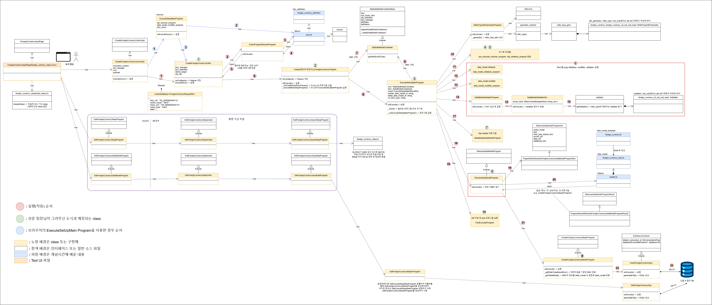

# Daily Retrospective

**작성자**: [박주현]  
**작성일시**: [2025-01-21]

# 1. 오늘 배운 내용

## 1️⃣ 여태까지 실습에서 배운 소스파일을 구조화시키며 리마인드 했습니다.


리스트 조회를 제외한 외화코드 실습의 전체 소스파일을 구조화시키며, 배운 내용을 리마인드 했습니다.
어느 부분은 인덱스를 통해 JS 파일을 찾아오고, 어느 소스파일은 Identifier 을 통해 찾아오게 됩니다.(e.g.action 파일들) 이런 세세한 부분을 다시 떠올리며 구현했습니다.



클래스 다이어그램으로 호출 순서를 구조화 했습니다. 기존 내용에 어제 배운 내용까지 추가했습니다.

---

# 2. 동기에게 도움 받은 내용

성철님이 맛있는 커피를 사주셨습니다. 카페인 수혈로 과제를 잘 해결할 수 있었습니다.

---

# 3. 개발 기술적으로 성장한 점

## 3-2. 오늘 직면했던 문제 (개발 환경, 구현)와 해결 방법

- ERP기능을 모르면 해결하지 못하는 문제는 존재하지 않습니다.

  ERP 기능을 최대한 문제에 포함하려고 하였고,

  답변을 작성하실때 ERP 기능에 기반한 답변보다는 5.0 구조 이해를 통한 답변으로 작성해주세요.

## (1번)

### 질문

bizz_type: 재고

bizz_id: 견적

menu_type: 입력

재고-견적업무를 통한 입력 메뉴를 구현하였습니다.

재고-판매업무를 통한 입력 메뉴를 구현하려고 하니 재고-견적업무의 품목 유효성 체크가

견적과 다르게 동작해야 된다는걸 확인했습니다.

5.0 소스에서 동일 refer_type의 서로 다른 유효성 체크 요구사항을 어떤 방식으로 처리해야되는지 설명하시오.

### 답변

ReferTypeAttrGeneratorProgram 을 통해 원하는 레퍼타입에 서로다른 속성 값을 generate 해주고, DataModelValidatorProgram 통해 ecount.infra.attribute 모듈의 /src/@shared_infra_attribute/validator 경로에 자기 원하는(e.g. not_null)원하는 attr id 디렉토리 하위에 밸리데이션 할 파일을 만들어 data_model 당 밸리데이션을 할 때 유효성 체크를 하게 하면됩니다.

## (2번)

### 질문

FN 버튼의 표시여부가 특정 데이터에 따라 판단되어야 된다.

삭제된 전표를 조회한 경우는 FN버튼이 표시 되지 않습니다.

동일전표를 삭제한경우와 삭제취소한 경우, 수정 조회 화면입니다.

이카운트의 기능은 삭제된 전표도 조회할 수 있는 기능이 존재합니다.

관련 구분을 위한 로직을 현재 로직 구조로 어디에 위치시켜야 되는지와 이유를 설명하시오.

(데이터를 판단해서 속성정보를 변경해야 되는 경우)

### 답변

set_up 파일에 일자의 fn 항목이 있게 하고, 삭제가 된 데이터라면 버튼 보이기를 false로 하면됩니다. set_up 에 관련된 정보는 어제 진행한 set up api 관련한 로직이 포함되어야하고,(궁극적으 전환이 됐으면 DB, 버전 업이 안된 경우 파일내용) FN 버튼이 보일지 말지는 FE 에서 데이터 삭제 여부를 확인해 display: none 을 할지 block을 할지 결정하면 됩니다.

## (3번)

### 질문

견적입력에서 사용되는 외화코드의 경우, 외화코드 목록을 조회해 오는 로직을

refer_type_generator를 통해 구현되어 있습니다.

신규 입력 화면, 수정조회 화면 진입시 외화코드 목록 정보를 화면에 내리기 위헤서,

해당 refer_type_geneartor의 호출위치는 어디여야 되는지와 이유를 설명하시오.

### 답변

서버의 GetForeignCurrencyInputDataProgram 이 GetExecuteSetupMainProgram 하게 되는데, GetExecuteSetupMainProgram 이곳에서 외화코드 목록에 대한 값을 넣어줄 수 있습니다. 현재 실습에선 GetExecuteSetupMainProgram을 구현하지 않고, GetForeignCurrencyInputDataProgram 에서 바로 GetForeignCurrencyMasterProgram 을 호출하고 있습니다. 실습 방식대로 한다면 견적 입력 의 데이터 조회 프로그램(GetInventoryInputDataProgram)에서 외화 코드 목록을 조회하는 마스터 프로그램과 dac 을 사용해 외화 항목의 값들을 채워 넣어 응답으로 보내줄 수 있습니다.

## (4번)

### 질문

게시판은 저장소 설정 (업무설정)이 적용되어 있습니다.

현재 저장소 설정 (업무설정)이 적용되지 않은 샘플 외화코드 소스에서

저장소 설정 (업무설정) 정보의 역할을 어떻게 처리하고 있는지 작성하시오.

### 답변

저장소 설정이 모두 되어 있다면 속성 테이블로 db화 되어 있습니다. 하지만 현재 외화코드에서는 파일(data_model_template)로서 처리되어 있습니다. 아래 모습과 같습니다.

```ts
props: [
		{
			prop_id: 'tenant_sid',
			data_type: '$$sid',
			refer_type: 'tenant_sid',
			refer_group: 'sid',
			is_key: true,
			attributes: {
				Renderer: {
					display_state: false,
				},
			},
		},

		{
			prop_id: 'foreign_currency',
			data_type: '$$code',
			refer_type: 'foreign_currency',
			refer_group: 'foreign_currency',
			prop_name: '외화코드',
			targets: [EN_MENU_TYPE.List, EN_MENU_TYPE.Input],
			attributes: {
				Renderer: {
					display_state: false,
				},
			},
		},
		{
			prop_id: 'foreign_currency_cd',
			data_type: '$$txt',
			refer_type: 'foreign_currency_cd',
			refer_group: 'foreign_currency',
			prop_name: '외화코드',
			targets: [EN_MENU_TYPE.List, EN_MENU_TYPE.Input],
		},
		{
			prop_id: 'foreign_currency_nm',
			data_type: '$$txt',
			refer_type: 'foreign_currency_nm',
			refer_group: 'foreign_currency',
			prop_name: '외화명',
			targets: [EN_MENU_TYPE.List, EN_MENU_TYPE.Input],
		},
		{
			prop_id: 'exchange_rate',
			data_type: '$$decimal',
			refer_type: 'exchange_rate',
			refer_group: 'exchange_rate',
			prop_name: '환율',
			targets: [EN_MENU_TYPE.List, EN_MENU_TYPE.Input],
		},
		{
			prop_id: 'category',
			data_type: '$$enum',
			refer_type: 'category',
			refer_group: 'category',
			prop_name: '카테고리',
			targets: [EN_MENU_TYPE.Input],
		},
		{
			prop_id: 'category',
			data_type: '$$txt',
			refer_type: 'category',
			refer_group: 'category',
			prop_name: '카테고리',
			targets: [EN_MENU_TYPE.List],
		},
		{
			prop_id: 'status_type',
			prop_name_code: '사용구분',
			prop_name: '사용구분',
			data_type: '$$enum',
			refer_type: 'status_type',
			refer_group: 'status_type',
			is_mandatory: true,
			targets: [EN_MENU_TYPE.List, EN_MENU_TYPE.Input],
		},
	],
```

## (5번)

### 질문

재고-견적 입력을 개발한 인원이 다음 job으로 재고-판매 입력을 개발하려고 한다.

재고-판매입력을 담당하는 인원이 개발해야되는 번호들을 선택하고, 선택된 이유와 선택안한 이유를 간단하게 설명하시오.

1. bizz_type 명세

2. 업무명세

3. input 명세

4. object 명세

5. 판매저장 유효성 체크 속성 resolver 구현

6. 판매저장 program 구현

7. 판매저장 dac 구현 (상단, 하단)

### 답변

3번, 4번이라고 생각합니다.
1번과 2번은 재고 업무로 상위 개념인 업무에서 이미 명세가 끝났습니다. 3번과 4번은 메뉴에 따른 input 과 object 명세를 해야합니다. 현재 5.0에서도 purchase 와 quotation 메뉴에 input 과 object의 명세가 각각 되어 있습니다. 5번은 판매 저장에서 고유하게 해야할 유효성 검사가 있다면 파일화 시켜서 밸리데이터 폴더에 넣어야합니다. 속성 리졸버가 해당 파일을 읽어서 알아서 밸리데이터를 가져오게 됩니다. 저장 program 과 dac 또한 inventory(마스터 or 디테일)프로그램과 재고의 상단,하단 dac 을 재활용하면 됩니다.

--> 수정) 2번도 추가되어야합니다. "업무 성격"과 "업무" 워딩을 착각을 했습니다. 업무 성격은 같고, 업무는 다르기 때문에 각각의 업무 명세도 새로 해줘야합니다.

## (6번)

### 질문

견적조회의 경우 quotation_list.tsx 페이지로 구현되어 있고,

판매조회의 경우 sale_list.tsx 페이지로 구현되어 있습니다.

견적입력, 발주요청입력 페이지의 경우 inventory_input.tsx로 구현되어 있습니다.

견적조회와 판매조회를 inventory_list.tsx로 구현할수 있을지 설명하시오.

추가로, 재고-견적입력 / 회계-매출입력을 common_input.tsx 페이지로 구현할 수 있을지 설명하시오.

(소스관점으로 설명하지마시고, 5.0 개념 관점으로 설명해주세요. 참고된 소스를 보면서 시간을 잡아먹지 말라는 의미입니다.)

### 답변

견적조회와 판매조회를 inventory_list.tsx로 구현할수 있을 것 같습니다. 견적 조회 양식과 판매 조회 양식 모두를 포함하는 inventory_list.tsx 작성합니다. bizz_type, menu_type 을 필드로 갖고, 각각의 버튼들도 메뉴 타입에 따라 사용자에게 보여줄지 보여주지 않을지에 대한 값을 넣습니다. FE 에서는 SET UP 정보에 따라 화면에 렌더링해주면 됩니다.
재고-견적입력 / 회계-매출입력을 common_input.tsx 페이지로 한번에 나타나는 것은 위에 설명 보다 한단계 더 밟으면 가능하다고 생각됩니다. 업무타입과 메뉴타입을 따져가면 렌더링 해야합니다.
하지만 너무 많이 공통화를 시키면 한 파일내에 모든 업무 모든 메뉴에 따른 렌더링 해야할 값들이 다 들어가게 되고, 이는 개발자가 파악하기 어려울 수도 있다고 사료됩니다. 하지만 굳이 하나의 소스 파일로 작성해야한다면 가능은 할 것 같습니다.

## (7번)

### 질문

Server Layer의 ExecuteSetupMainProgram의 역할을 하는 프로그램이 여러종료가 있는 이유에 대해서 설명하시오.

- ExecuteSetupMainProgram.ts

- GetExecuteSetupMainProgram.ts

- DeleteExecuteSetupMainProgram.ts

### 답변

ExecuteSetupMainProgram 이 여러 종류가 있는 것은 ExecuteSetupMainProgram의 구성 때문입니다. 일반 기본적인 ExecuteSetupMainProgram을 보겠습니다. pre_executer_resolver_program, slip_initializer_program 부터 ~~~ResolveDataModelProgram, PostExecuterProgram 까지 초기화를 담당하는 프로그램부터 저장 후 사후처리하는 프로그램까지 모든 프로그램들이 동기적으로 호출되고 사용됩니다. 이는 쓰기 작업시에는 공통화해 사용할 수 있습니다. 하지만 조회 작업에선 몇몇 프로그램들은 필요가 없습니다. 따라서 GetExecuteSetupMainProgram 같은 경우 몇몇 사용하지 않는 프로그램들을 덜어 낸 공통화 ExecuteSetupMainProgram 입니다. DeleteExecuteSetupMainProgram 같은 경우에도 필수의 프로그램만 초기화 시키고, 작업을 거쳐 서비스를 실행하기 위함입니다.

## (8번)

### 질문

prop_id와 refer_Type에 대해서 간단하게 설명하시오.

### 답변

prop_id와 refer_Type는 비슷해 보일 수 있지만, 살짝 다릅니다. 누군가는 어떤 메뉴에서 prop_id: "title", refer_Type:"title" 이렇게 쓸 수 있지만, 같은 업무 다른 메뉴에선 prop_id: "subject", refer_Type:"title" 로 명시할 수 있습니다. 둘 모두 제목을 뜻하는 말이지만, 각각의 항목을 다르게 지칭할 수 있습니다. prop_id은 prop 을 구별할 수 있는 id 로서 작용하고, refer_Type은 같은 refer 에따라 공통화 작업을 하기 위해 묶을 수 있는 단위입니다.

--> 수정) 같은 업무라는 말이 잘못됐습니다. 다른 업무여야합니다.

## (9번)

### 질문

inventory_single.ts 데이터 모델 템플릿에 Attribute를 추가하는 경우와

lately_date_display_state.ts generator를 통해서 Attribute를 추가하는 경우의 차이점에 대해서 설명하시오.

(lately_date refer_type이 어떤 의미를 나타내는지는 중요하지 않습니다. 구현관점으로 접근해 주세요.)

### 답변

inventory_single.ts 데이터 모델 템플릿에 Attribute를 추가하는 경우는 파일에 명세되어 있는 곳에서 하드 코딩으로 추가하는 경우이고, lately_date_display_state.ts generator를 통해서 Attribute를 추가하는 경우는 refer_type 을 통해 자신이 파일화 해놓은 명세(foreign_currency_foreign_currency_cd_not_null_input: IReferTypeAttrGenerator)에 따라서 속성을 generator가 추가해주는 경우입니다.

## (10번)

### 질문

위 9번의 경우를 보면, 속성을 추가할 수있는 창구 2가지가 설명되었습니다.

두가지 방식중 어디에 소스를 추가하는게 맞다고 생각하는지 설명하시오.

### 답변

결국에 두가지 방법 모두 파일에 기입하게 됩니다. 한가지 파일에서 그 파일에 해당하는 prop 정보와 속성정보를 모두 보고 싶으면 1번 방식을, refer_type 의 attr_id 당 속성을 관리하고 싶으면 2번 방식을 사용할 수 있습니다. 또한 db 에 모든 속성 값이 들어가서 궁극적으로 db 조회를 해서 속성 값을 찾아오게 된다면 2번 방식이 맞다고 생각됩니다. 물론 속성 id 당 하나하나의 db i/o 를 통해서 조회하진 않고, ESQL의 resultSet 을 활용해 한번에 찾아 올 수 있지 않을까 생각해 봅니다.

---

# 4. 소프트 스킬면에서 성장한 점

어제 경험 했던 에러들을 바탕으로 아연님의 잔업 문제 해결에 도움을 줄 수 있었습니다. 디렉토리 구조를 구조화 한 이미지를 동기들에게 공유하면서 도움을 줄 수 있었습니다.
